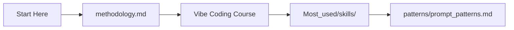
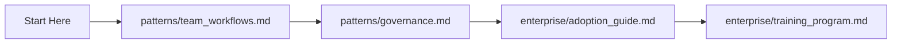
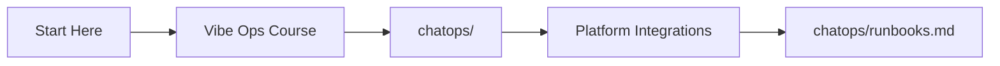
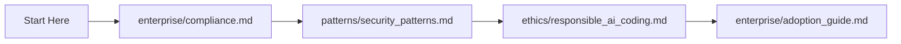

# How to Use This Repository

> **Start here.** This guide gets you from zero to productive with the Claude Framework in 5 minutes.

---

## What Is This Repo?

The Claude Framework is a comprehensive knowledge base for **vibe coding, vibe ops, and Claude Code**. It contains 130+ files with methodology guides, interactive courses, reusable skills and agents, platform integrations (AWS, GitHub, Datadog, Atlassian, Slack, Cloudflare), prompt patterns, enterprise adoption guides, and AI SRE patterns. Whether you are a solo developer experimenting with AI-assisted coding or an enterprise team rolling out Claude Code at scale, this repo provides structured, copy-paste-ready resources to accelerate your workflow.

---

## Prerequisites

Before you begin, make sure you have:

| Requirement | Why | Install |
|-------------|-----|---------|
| **Claude Code** | The AI coding tool this framework is built for | `npm install -g @anthropic-ai/claude-code` or see [setup_guide.md](setup_guide.md) |
| **Git** | Clone the repo and manage versions | [git-scm.com](https://git-scm.com/) |
| **A terminal** | All workflows are CLI-first | macOS Terminal, iTerm2, Windows Terminal, or any Linux terminal |
| **A code editor** | For viewing and editing files | VS Code, Cursor, or any editor you prefer |
| **An Anthropic API key** (optional) | Required for Claude Code API usage | [console.anthropic.com](https://console.anthropic.com/) |

---

## Quick Start (5 Minutes to Value)

### Step 1: Clone the Repo

```bash
git clone https://github.com/mr-hexperimental/claude_framework.git
cd claude_framework
```

### Step 2: Open the Master Index

```bash
open index.md    # macOS
# or: cat index.md | less
```

The [Master Index](index.md) is the table of contents for everything in the repo. Scan the section headers to see what is available.

### Step 3: Read the Methodology

```bash
open methodology.md
```

[methodology.md](methodology.md) covers what vibe coding is, the spectrum from pure vibe coding to agentic engineering, how Claude Code works, the CLAUDE.md system, MCP servers, skills, and workflows. This is the conceptual foundation.

### Step 4: Copy a Skill into Your Project

```bash
# Create the skills directory in your project
mkdir -p ~/my-project/.claude/skills/commit

# Copy the commit skill
cp Most_used/skills/commit_skill.md ~/my-project/.claude/skills/commit/SKILL.md
```

Now Claude Code will use Conventional Commits formatting whenever you commit in that project. Browse [Most_used/skills/](Most_used/skills/README.md) for more skills.

### Step 5: Start a Course (Optional)

Pick the course that matches your interest:

| Course | Best For | Start Here |
|--------|----------|------------|
| [Vibe Coding](courses/vibe_coding/README.md) | Learning AI-assisted development from scratch | Module 01 |
| [Claude Code](courses/claude_code/README.md) | Mastering Claude Code specifically | Module 01 |
| [Vibe Ops](courses/vibe_ops/README.md) | AI-driven infrastructure and incident response | Module 01 |

---

## Navigation Guide: Find What You Need by Role

### Beginner / Individual Developer

You are new to AI-assisted coding and want to get productive quickly.



1. Read [methodology.md](methodology.md) for the big picture
2. Take the [Vibe Coding Course](courses/vibe_coding/README.md) (5 modules)
3. Copy skills from [Most_used/skills/](Most_used/skills/README.md) into your project
4. Learn prompt patterns from [patterns/prompt_patterns.md](patterns/prompt_patterns.md)
5. Reference [craft/](craft/README.md) for conversation patterns, debugging, and context management

### Team Lead / Engineering Manager

You want to roll out AI coding tools across a team.



1. Review [team workflows](patterns/team_workflows.md) and [governance patterns](patterns/governance.md)
2. Follow the [enterprise adoption guide](enterprise/adoption_guide.md) for phased rollout
3. Use the [training program](enterprise/training_program.md) for structured team onboarding
4. Set up shared CLAUDE.md files using [templates/](templates/README.md)
5. Evaluate ROI with [enterprise/roi_analysis.md](enterprise/roi_analysis.md)

### SRE / DevOps Engineer

You want AI-driven operations, incident response, and ChatOps.



1. Take the [Vibe Ops Course](courses/vibe_ops/README.md) (5 modules)
2. Set up [ChatOps](chatops/README.md) with AI SRE agents
3. Configure platform integrations: [AWS](aws/README.md), [Datadog](datadog/README.md), [Slack](slack/README.md), [Cloudflare](cloudflare/README.md)
4. Deploy [runbooks](chatops/runbooks.md) and [advanced runbooks](chatops/advanced_runbooks.md)
5. Use the [maturity model](chatops/maturity_model.md) to assess your AI SRE readiness

### Enterprise / Compliance

You need governance, security, and compliance for AI-generated code.



1. Start with [compliance](enterprise/compliance.md) for IP, data privacy, and regulatory concerns
2. Review [security patterns](patterns/security_patterns.md) for OWASP-based checklists
3. Read [responsible AI coding](ethics/responsible_ai_coding.md) for review obligations
4. Follow the [adoption guide](enterprise/adoption_guide.md) with governance built in
5. Use [testing guides](testing/README.md) for quality gates on AI-generated code

---

## How to Copy Skills and Templates into Your Project

### Skills

Skills live in `.claude/skills/<name>/SKILL.md` in your project. To install one:

```bash
# 1. Create the skill directory
mkdir -p ~/my-project/.claude/skills/pr-review

# 2. Copy the skill file (rename to SKILL.md)
cp Most_used/skills/review_pr_skill.md ~/my-project/.claude/skills/pr-review/SKILL.md

# 3. Claude Code will now use this skill automatically
```

Browse available skills:
- **Core skills**: [Most_used/skills/](Most_used/skills/README.md) (commit, PR review, test runner, refactor, deploy)
- **Platform skills**: [aws/skills.md](aws/skills.md), [github/skills.md](github/skills.md), [datadog/skills.md](datadog/skills.md), [atlassian/skills.md](atlassian/skills.md), [slack/skills.md](slack/skills.md), [cloudflare/skills.md](cloudflare/skills.md)
- **ChatOps skills**: [chatops/skills.md](chatops/skills.md) (14 SRE skills)
- **Multi-tool skills**: [working_nicely/example_skills.md](working_nicely/example_skills.md)
- **Testing skills**: Embedded in [testing/](testing/README.md) files
- **Documentation skills**: Embedded in [documentation/](documentation/README.md) files

### CLAUDE.md Templates

Templates provide ready-made CLAUDE.md configurations for different project types:

```bash
# Copy a template to your project root
cp templates/nextjs_claude_md.md ~/my-project/CLAUDE.md
```

Available templates: Next.js, Python FastAPI, Go, Rust, Infrastructure (Terraform/K8s), Monorepo, Mobile, MCP configs, Hooks configs. See [templates/README.md](templates/README.md).

### Agents

Agent patterns are defined in CLAUDE.md or as skills with `agent: true`. Copy the agent definition into your project's `.claude/skills/` directory:

```bash
mkdir -p ~/my-project/.claude/skills/code-reviewer
# Copy the agent definition from Most_used/agents/code_reviewer.md
# and adapt it as a SKILL.md file
```

Browse agents: [Most_used/agents/](Most_used/agents/README.md), platform-specific agents in each platform folder, and [chatops/agents.md](chatops/agents.md).

---

## How to Take the Courses

Each course has 5-6 modules that build on each other. Work through them in order.

### Structure

```
courses/
  vibe_coding/
    README.md          # Course overview and prerequisites
    01_introduction.md # Start here
    02_setup.md
    03_first_project.md
    04_advanced_patterns.md
    05_exercises.md    # Hands-on projects
  claude_code/
    README.md
    01_getting_started.md
    ...
    06_exercises.md    # 7 projects including capstone
  vibe_ops/
    README.md
    01_introduction.md
    ...
    05_exercises.md    # 6 scenarios including game day
```

### Tips

1. **Read the README first** for prerequisites and course structure
2. **Follow modules in order** -- each builds on the previous
3. **Do the exercises** -- the exercise modules contain real projects to practice on
4. **Use Claude Code while learning** -- the courses are designed to be practiced alongside the tool
5. **Supplement with external resources** -- see the [Free Courses Directory](courses/free_courses_list.md) for 40+ additional resources

---

## How to Contribute

Contributions are welcome. See the [Contributing section in README.md](README.md#contributing) for full details.

### Quick Contribution Guide

1. **Fork** the repository
2. **Create a branch**: `git checkout -b feature/my-addition`
3. **Follow existing patterns** -- match the style of existing files (headers, tables, mermaid diagrams)
4. **One topic per file** -- keep files focused and self-contained
5. **Update the index** -- add your file to [index.md](index.md)
6. **Submit a pull request** with a clear description

### Especially Useful Contributions

- New platform integrations (Vercel, GCP, Azure, PagerDuty)
- New skills and agent patterns
- Course corrections and clarity improvements
- Real-world usage examples and case studies
- Translations

---

## FAQ

### General

**Q: Do I need a paid Anthropic account to use this?**
A: The documentation and methodology are free to read. To actually use Claude Code, you need an Anthropic API key or a Claude Pro/Max subscription. See [setup_guide.md](setup_guide.md) for options.

**Q: Is this only for Claude Code, or does it work with other AI tools?**
A: The methodology and patterns are broadly applicable. The skills and agents are Claude Code-specific, but the [working_nicely/](working_nicely/README.md) section covers integrating with Gemini CLI, OpenAI Codex CLI, and other tools.

**Q: How do I keep up with updates?**
A: Star/watch the repository on GitHub. The [changelog](claudefiles/changelog.md) tracks all changes.

### Skills and Agents

**Q: What is the difference between a skill and an agent?**
A: A **skill** is a reusable instruction set for a single task (e.g., "format commits"). An **agent** is an autonomous process that combines multiple skills and tools to accomplish complex objectives (e.g., "manage the full incident lifecycle"). Agents typically have `agent: true` in their frontmatter.

**Q: Can I use skills from this repo without cloning the whole thing?**
A: Yes. Copy individual `.md` files into your project's `.claude/skills/` directory. Each skill is self-contained.

**Q: Where is the canonical list of all skills and agents?**
A: See [claudefiles/skills/skills_master.md](claudefiles/skills/skills_master.md) and [claudefiles/agents/agents_master.md](claudefiles/agents/agents_master.md).

### Courses

**Q: Which course should I start with?**
A: If you are new to AI coding, start with **Vibe Coding**. If you already use Claude Code and want to go deeper, start with **Claude Code**. If you are an SRE or ops engineer, start with **Vibe Ops**.

**Q: How long do the courses take?**
A: Each course has 5-6 modules. A focused learner can complete one course in 4-8 hours. The exercises add additional time depending on depth.

### Enterprise

**Q: Is there guidance on compliance and governance?**
A: Yes. See [enterprise/compliance.md](enterprise/compliance.md) for IP, data privacy, and regulatory compliance. See [patterns/governance.md](patterns/governance.md) for audit trails and policies. See [ethics/](ethics/README.md) for responsible AI coding practices.

**Q: How do I make the business case for AI coding tools?**
A: See [enterprise/roi_analysis.md](enterprise/roi_analysis.md) for cost-benefit templates, case studies, and data points.

---

## File Structure Overview

```
claude_framework/
  README.md                    # Project overview
  How_to_use.md                # This file -- start here
  index.md                     # Master index of all files
  methodology.md               # Core methodology guide
  setup_guide.md               # Installation and setup
  claude_md_guide.md           # CLAUDE.md authoring guide
  courses/                     # Interactive courses (3 tracks)
  Most_used/                   # Top skills, agents, slash commands
  patterns/                    # Prompt, anti, team, security patterns
  advanced/                    # Multi-agent, MCP, CI/CD, migrations
  enterprise/                  # Adoption, ROI, compliance, training
  templates/                   # Copy-paste CLAUDE.md templates
  testing/                     # AI testing strategies and quality gates
  documentation/               # AI documentation generation
  agent_frameworks/            # Multi-agent patterns and memory
  ethics/                      # Responsible AI coding
  craft/                       # Conversation, debugging, refactoring
  real_world/                  # Production setups and case studies
  working_nicely/              # Multi-tool integration (Gemini, Codex)
  aws/ github/ datadog/        # Platform integrations
  atlassian/ slack/ cloudflare/
  chatops/                     # AI SRE and incident management
```

---

*Part of the [Claude Framework](README.md). See [index.md](index.md) for the complete file listing.*
