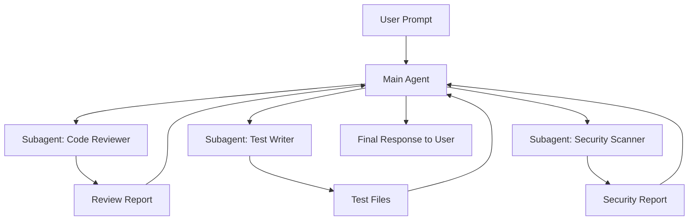

# Most Popular Agent Patterns in Claude Code

> A guide to the most commonly used agent and subagent patterns for Claude Code, based on community adoption and documented best practices.

---

## What Are Agents and Subagents?

In Claude Code, **subagents** are specialized AI assistants that Claude spawns to handle specific tasks. They have:

- **Their own context window** -- work does not clutter the main conversation
- **Custom system prompts** -- you define their expertise, personality, and instructions
- **Scoped tool access** -- you grant only the tools needed for their job
- **Independent execution** -- they run tasks and return results to the main agent

This separation enables parallel analysis, focused expertise, and cleaner context management.

## How Subagents Work



## Creating Subagents

Subagents are defined in `.claude/skills/` with SKILL.md files, or invoked via the Claude Agent SDK. In Claude Code, the simplest approach is CLAUDE.md instructions that tell Claude when and how to spawn subagents.

### CLAUDE.md Pattern

```markdown
## Subagent: Code Reviewer

When reviewing code, spawn a subagent with these constraints:
- **Role**: Senior code reviewer
- **Tools**: Read, Grep, Glob (read-only -- no edits)
- **Focus**: Correctness, security, performance, maintainability
- **Output**: Structured review with scores and actionable items
```

### SDK Pattern (for programmatic use)

```python
from claude_agent_sdk import Agent, SubAgent

reviewer = SubAgent(
    name="code-reviewer",
    system_prompt="You are a senior code reviewer...",
    tools=["Read", "Grep", "Glob"],
    model="claude-sonnet-4-20250514"
)

result = await reviewer.run("Review the changes in src/auth/")
```

---

## Top Agent Patterns (Ranked by Adoption)

| Rank | Agent | Category | Description |
|------|-------|----------|-------------|
| 1 | **Code Reviewer** | Quality | Multi-dimensional code review with scoring |
| 2 | **Test Writer** | Testing | Generates tests with edge case coverage |
| 3 | **Bug Fixer / Debugger** | Debugging | Systematic root cause analysis and fix |
| 4 | **Documentation Agent** | Docs | Generates and updates documentation |
| 5 | **Security Auditor** | Security | OWASP-based vulnerability scanning |
| 6 | **Refactoring Agent** | Quality | Safe structural improvements |
| 7 | **Migration Agent** | DevOps | Database and framework migrations |
| 8 | **Performance Profiler** | Performance | Identifies bottlenecks and optimizations |
| 9 | **API Designer** | Architecture | Designs REST/GraphQL endpoints |
| 10 | **Onboarding Agent** | Education | Explains codebase to new developers |

---

## Multi-Agent Orchestration Patterns

### Pattern 1: Parallel Review

Three subagents analyze code simultaneously, then results are merged:

```
Main Agent
  |-- Security Reviewer (parallel)
  |-- Performance Reviewer (parallel)
  |-- Style Reviewer (parallel)
  |
  Merge Results -> Unified Report
```

### Pattern 2: Pipeline (Sequential)

Each agent's output feeds into the next:

```
Spec Writer -> Test Writer -> Implementer -> Reviewer -> Deployer
```

### Pattern 3: Supervisor

One agent coordinates and delegates to specialists:

```
Supervisor Agent
  |-- Analyzes task
  |-- Selects appropriate specialist(s)
  |-- Delegates subtasks
  |-- Reviews results
  |-- Synthesizes final output
```

---

## Detailed Agent Guides in This Directory

| File | Agent |
|------|-------|
| [code_reviewer.md](code_reviewer.md) | Code review agent with multi-dimensional scoring |
| [test_writer.md](test_writer.md) | Test generation agent with TDD support |
| [bug_fixer.md](bug_fixer.md) | Systematic bug investigation and fix agent |
| [documentation.md](documentation.md) | Documentation generation and maintenance agent |

---

## Key Resources

- [Create Custom Subagents](https://code.claude.com/docs/en/sub-agents) -- Official documentation
- [VoltAgent/awesome-claude-code-subagents](https://github.com/VoltAgent/awesome-claude-code-subagents) -- 100+ specialized subagents
- [wshobson/agents](https://github.com/wshobson/agents) -- Multi-agent orchestration for Claude Code
- [Building Agents with the Claude Agent SDK](https://www.anthropic.com/engineering/building-agents-with-the-claude-agent-sdk)
- [7 Powerful Claude Code Subagents](https://www.eesel.ai/blog/claude-code-subagents)
- [subagents.app](https://subagents.app/) -- Browsable subagent catalog

---

## Best Practices

1. **Scope tools narrowly**: Give each subagent only the tools it needs. A reviewer should not have Write access.
2. **Keep context focused**: Subagents work best with clear, specific instructions and bounded scope.
3. **Use parallel execution**: Independent analyses (security, performance, style) should run in parallel.
4. **Define output format**: Specify exactly how the subagent should structure its response.
5. **Set boundaries**: Explicitly state what the agent should NOT do.
6. **Model selection**: Use cheaper/faster models (Haiku) for simple subagent tasks, stronger models (Opus) for complex reasoning.
