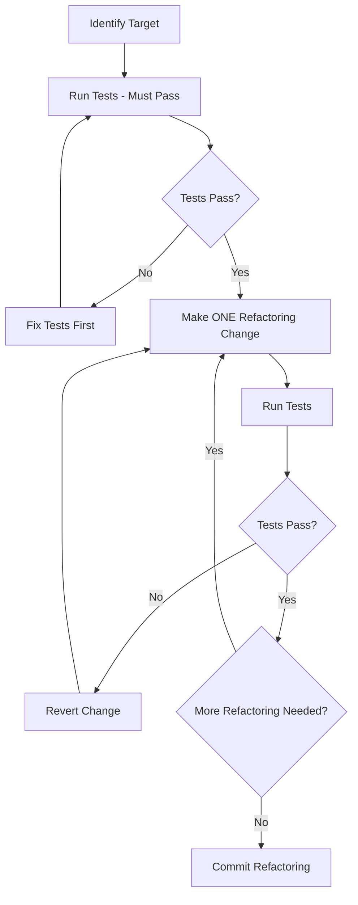

# Refactor Skill -- Code Refactoring

> Systematic code refactoring with safety guarantees. Ensures tests pass before and after every transformation, and documents the reasoning behind each change.

---

## Why This Skill Exists

Refactoring without a structured process leads to regressions and scope creep. This skill enforces a disciplined approach: verify safety (tests pass), make one focused change, verify again, repeat. It also ensures Claude does not combine refactoring with feature changes.

---

## SKILL.md Configuration

```yaml
---
name: refactor
description: >
  Performs systematic code refactoring with safety checks.
  Use when the user asks to refactor, clean up, restructure,
  simplify, or improve code quality without changing behavior.
---

# Refactor Skill

## Core Principle

**Refactoring changes structure, never behavior.** If a test fails after a refactoring step, the refactoring introduced a bug -- revert and try again.

## Pre-Refactoring Checklist

Before starting any refactoring:

1. [ ] Run the full test suite -- all tests MUST pass
2. [ ] Identify the specific code smell or improvement target
3. [ ] Confirm the refactoring scope with the user
4. [ ] Ensure adequate test coverage exists for the code being changed
5. [ ] If coverage is insufficient, write tests FIRST (separate commit)

## Refactoring Catalog

### Extract Method/Function
**When**: A block of code does a distinct subtask, or the same logic appears in multiple places.
```
# Before
def process_order(order):
    # validate
    if not order.items:
        raise ValueError("Empty order")
    if order.total < 0:
        raise ValueError("Negative total")
    # ... rest of processing

# After
def validate_order(order):
    if not order.items:
        raise ValueError("Empty order")
    if order.total < 0:
        raise ValueError("Negative total")

def process_order(order):
    validate_order(order)
    # ... rest of processing
```

### Rename for Clarity
**When**: Names are abbreviated, misleading, or do not convey intent.
```
# Before: what does 'p' mean?
def calc(p, q):
    return p * q * 0.08

# After: intent is clear
def calculate_tax(price, quantity):
    TAX_RATE = 0.08
    return price * quantity * TAX_RATE
```

### Replace Conditionals with Polymorphism
**When**: A switch/if-chain selects behavior based on type.

### Simplify Complex Conditionals
**When**: Nested or compound conditions are hard to read.

### Remove Dead Code
**When**: Unreachable code, unused variables, commented-out blocks.

### Introduce Parameter Object
**When**: Multiple functions share the same group of parameters.

### Replace Magic Numbers with Named Constants
**When**: Literal values appear without explanation.

## Workflow



## Step-by-Step Process

1. **Assess**: Read the target code and identify specific smells
2. **Plan**: List each refactoring step to be applied (in order)
3. **Baseline**: Run tests, confirm all pass
4. **Execute**: Apply ONE refactoring transformation
5. **Verify**: Run tests again
6. **Repeat**: If tests pass, move to next step. If not, revert.
7. **Commit**: Group related refactoring steps into one commit

## Scope Rules

- **Never** mix refactoring with feature additions in the same commit
- **Never** refactor code that lacks test coverage without adding tests first
- **Always** keep refactoring changes as small as possible per step
- **Always** preserve the public API unless explicitly asked to change it
- **Flag** if refactoring reveals a bug -- fix in a separate commit

## Output Format

```markdown
### Refactoring Summary

**Target**: [file(s) and function(s)]
**Smell**: [what prompted the refactoring]
**Technique**: [which refactoring pattern applied]

#### Changes Made
1. [Change 1]: [why]
2. [Change 2]: [why]

#### Test Results
- Before: X tests passing
- After: X tests passing
- No behavioral changes
```
```

---

## CLAUDE.md Integration

```markdown
## Refactoring Rules

- Never mix refactoring with feature changes in the same commit
- Run tests before AND after every refactoring step
- If tests fail after refactoring, revert -- do not fix forward
- Add test coverage before refactoring untested code
- Keep each refactoring step small and focused
- Use commit type `refactor(scope):` for all refactoring commits
```

---

## Sources

- [citypaul/.dotfiles refactoring skill](https://github.com/citypaul/.dotfiles/blob/main/claude/.claude/skills/refactoring/SKILL.md)
- [Martin Fowler's Refactoring Catalog](https://refactoring.com/catalog/)
- [TDD Skill for Claude Code](https://www.aihero.dev/skill-test-driven-development-claude-code) -- Refactor phase
