# Claude Framework

[](#stats)
[](#interactive-courses)
[](#platform-integrations)
[](#license)

A comprehensive **vibe coding, vibe ops, and Claude Code** knowledge base. 83+ files, 23,000+ lines of methodology, interactive courses, reusable skills and agents, platform integrations, and AI SRE patterns — everything you need to go from zero to productive with AI-assisted development and operations.

---

## Table of Contents

- [Quick Start](#quick-start)
- [Architecture Overview](#architecture-overview)
- [Core Guides](#core-guides)
- [Interactive Courses](#interactive-courses)
- [Skills, Agents & Commands](#skills-agents--commands)
- [Multi-Tool Integration](#multi-tool-integration)
- [Platform Integrations](#platform-integrations)
- [ChatOps & AI SRE](#chatops--ai-sre)
- [How to Use This Repo](#how-to-use-this-repo)
- [Stats](#stats)
- [Contributing](#contributing)
- [Credits & Sources](#credits--sources)
- [License](#license)

---

## Quick Start

```bash
# 1. Clone the repo
git clone https://github.com/mr-hexperimental/claude_framework.git
cd claude_framework

# 2. Open the master index to see everything available
open index.md            # or: cat index.md

# 3. Start with the methodology overview
open methodology.md

# 4. Take an interactive course (pick one)
open courses/vibe_coding/README.md
open courses/claude_code/README.md
open courses/vibe_ops/README.md

# 5. Copy a skill into your own project
cp Most_used/skills/commit_skill.md ~/my-project/.claude/skills/
```

---

## Architecture Overview

```mermaid
graph TD
    README["README.md"]
    IDX["index.md — Master Index"]

    README --> IDX

    IDX --> CORE["Core Guides"]
    IDX --> COURSES["Interactive Courses"]
    IDX --> TOOLS["Multi-Tool Integration"]
    IDX --> SKILLS["Skills, Agents & Commands"]
    IDX --> PLAT["Platform Integrations"]
    IDX --> OPS["ChatOps & AI SRE"]
    IDX --> META["Meta & Project Management"]

    CORE --> M["methodology.md"]
    CORE --> S["setup_guide.md"]
    CORE --> C["claude_md_guide.md"]
    CORE --> R["remote_usage.md"]

    COURSES --> VC["Vibe Coding (5 modules)"]
    COURSES --> VO["Vibe Ops (5 modules)"]
    COURSES --> CC["Claude Code (6 modules)"]
    COURSES --> FC["40+ Free External Courses"]

    TOOLS --> WN["working_nicely/"]
    WN --> CODEX["Codex Integration"]
    WN --> GEMINI["Gemini Integration"]
    WN --> MULTI["Multi-Tool Workflows"]

    SKILLS --> SK["Most_used/skills/"]
    SKILLS --> AG["Most_used/agents/"]
    SKILLS --> SL["Most_used/slash/"]

    PLAT --> AWS["aws/"]
    PLAT --> GH["github/"]
    PLAT --> DD["datadog/"]
    PLAT --> ATL["atlassian/"]
    PLAT --> SLACK["slack/"]
    PLAT --> CF["cloudflare/"]

    OPS --> CHAT["chatops/"]

    style README fill:#2d6a4f,stroke:#1b4332,color:#fff
    style IDX fill:#264653,stroke:#2a9d8f,color:#fff
    style COURSES fill:#e76f51,stroke:#f4a261,color:#fff
    style PLAT fill:#457b9d,stroke:#1d3557,color:#fff
```



---

## Core Guides

| Guide | What You Get |
|-------|--------------|
| [Methodology](methodology.md) | Complete vibe coding/ops methodology with 7 mermaid diagrams |
| [Setup Guide](setup_guide.md) | Step-by-step setup with real commands, MCP servers, skills, agents |
| [CLAUDE.md Guide](claude_md_guide.md) | What goes in CLAUDE.md — sections, examples, advanced patterns |
| [Remote Usage](remote_usage.md) | SSH, tmux, mobile access, session continuity across devices |
| [Writeups & Repos](Writeups.md) | 50+ ranked GitHub repos, blogs, courses, and frameworks |

---

## Interactive Courses

Three self-paced courses with hands-on exercises, progressive modules, and real-world projects.

### Vibe Coding Course
Learn AI-assisted development from first principles through advanced patterns.

| Module | Topic |
|--------|-------|
| [01 - Introduction](courses/vibe_coding/01_introduction.md) | History (Karpathy), philosophy, what is vibe coding |
| [02 - Setup](courses/vibe_coding/02_setup.md) | Environment setup for vibe coding |
| [03 - First Project](courses/vibe_coding/03_first_project.md) | Build your first project with vibe coding |
| [04 - Advanced Patterns](courses/vibe_coding/04_advanced_patterns.md) | SPARC, scaffold-then-refine, reference-driven dev |
| [05 - Exercises](courses/vibe_coding/05_exercises.md) | 6 interactive projects from starter to advanced |

### Vibe Ops Course
Evolve from manual ops to AI-driven infrastructure operations.

| Module | Topic |
|--------|-------|
| [01 - Introduction](courses/vibe_ops/01_introduction.md) | Manual Ops to Vibe Ops evolution |
| [02 - Setup](courses/vibe_ops/02_setup.md) | Slack bots, MCP servers, guardrails |
| [03 - ChatOps](courses/vibe_ops/03_chatops.md) | Deploy, status, scale, log workflows, alert routing |
| [04 - Incident Management](courses/vibe_ops/04_incident_management.md) | AI-driven detection, triage, diagnosis, self-healing |
| [05 - Exercises](courses/vibe_ops/05_exercises.md) | 6 scenarios including game day simulation |

### Claude Code Course
Master Claude Code from installation through multi-agent orchestration.

| Module | Topic |
|--------|-------|
| [01 - Getting Started](courses/claude_code/01_getting_started.md) | Installation, Plan Mode, project scanning |
| [02 - CLAUDE.md](courses/claude_code/02_claude_md.md) | Mastering CLAUDE.md — hierarchy, sections, patterns |
| [03 - Skills & Agents](courses/claude_code/03_skills_agents.md) | Custom skills, agents, slash commands, sharing |
| [04 - MCP Servers](courses/claude_code/04_mcp_servers.md) | GitHub, Slack, PostgreSQL, custom MCP deep dive |
| [05 - Advanced](courses/claude_code/05_advanced.md) | Hooks, CI/CD, remote access, multi-agent, cost optimization |
| [06 - Exercises](courses/claude_code/06_exercises.md) | 7 projects including final capstone |

Looking for more? See the [Free Courses Directory](courses/free_courses_list.md) with 40+ additional resources.

---

## Skills, Agents & Commands

Ready-to-use components you can drop into your own projects.

### Skills
| Skill | What It Does |
|-------|-------------|
| [Commit](Most_used/skills/commit_skill.md) | Conventional Commits with hooks and validation |
| [PR Review](Most_used/skills/review_pr_skill.md) | 5-dimension scoring (correctness, security, perf, etc.) |
| [Test Runner](Most_used/skills/test_runner_skill.md) | TDD with RED-GREEN-REFACTOR cycle |
| [Refactor](Most_used/skills/refactor_skill.md) | Pattern catalog with safety verification |
| [Deploy](Most_used/skills/deploy_skill.md) | Multi-platform deploy with rollback procedures |

### Agents
| Agent | What It Does |
|-------|-------------|
| [Code Reviewer](Most_used/agents/code_reviewer.md) | Multi-dimensional weighted review |
| [Test Writer](Most_used/agents/test_writer.md) | Test generation across frameworks |
| [Bug Fixer](Most_used/agents/bug_fixer.md) | 7-phase systematic debugging |
| [Documentation](Most_used/agents/documentation.md) | Inline docs, API docs, README generation |

### Slash Commands
See the full list of [12 built-in + custom commands](Most_used/slash/README.md) with [detailed configs](Most_used/slash/common_commands.md).

---

## Multi-Tool Integration

Use Claude Code alongside other AI tools for broader coverage and free-tier stacking.

| Guide | Description |
|-------|-------------|
| [Overview](working_nicely/README.md) | Multi-tool comparison, free tiers, integration bridges |
| [Codex Integration](working_nicely/codex_integration.md) | Claude Code + OpenAI Codex CLI workflows |
| [Gemini Integration](working_nicely/gemini_integration.md) | Claude Code + Gemini CLI (free, no API key) |
| [Multi-Tool Workflows](working_nicely/multi_tool_workflow.md) | 8 workflows combining multiple AI tools |
| [Example Skills](working_nicely/example_skills.md) | 7 skills bridging Claude Code with external tools |
| [Example Agents](working_nicely/example_agents.md) | 6 agent patterns coordinating across tools |
| [Example Commands](working_nicely/example_commands.md) | Shell aliases, tmux scripts, git hooks |

---

## Platform Integrations

Deep integration guides for six major platforms — each with skills, agents, slash commands, and MCP setup.

| Platform | Highlights | Link |
|----------|-----------|------|
| **AWS** | Deploy, monitor, scale, debug; infrastructure/cost/security agents | [aws/](aws/README.md) |
| **GitHub** | PR review, issue triage, CI/CD; Actions integration | [github/](github/README.md) |
| **Datadog** | Monitoring, alerting; alert analyst and dashboard builder agents | [datadog/](datadog/README.md) |
| **Atlassian** | Jira and Confluence integration | [atlassian/](atlassian/README.md) |
| **Slack** | ChatOps workflows, notifications, bot integration | [slack/](slack/README.md) |
| **Cloudflare** | Workers, DNS, security | [cloudflare/](cloudflare/README.md) |

---

## ChatOps & AI SRE

End-to-end AI-driven incident management and operations automation.

| Guide | Description |
|-------|-------------|
| [ChatOps Overview](chatops/README.md) | AI SRE ChatOps architecture |
| [Incident Management](chatops/incident_management.md) | End-to-end AI incident workflow |

---

## How to Use This Repo

There are several ways to get value from this framework:

**Navigate by topic.** Start at the [Master Index](index.md) and follow links to what interests you. Every file is self-contained with its own context.

**Take the courses.** Work through the [Vibe Coding](courses/vibe_coding/README.md), [Vibe Ops](courses/vibe_ops/README.md), or [Claude Code](courses/claude_code/README.md) courses from Module 01 to the exercises. Each builds on the previous module.

**Copy skills and agents.** Browse [Most_used/skills/](Most_used/skills/README.md) and [Most_used/agents/](Most_used/agents/README.md), then copy the markdown files directly into your project's `.claude/` directory.

**Set up platform integrations.** If you use AWS, GitHub, Datadog, Atlassian, Slack, or Cloudflare, go to that platform's folder for ready-made skills, agents, and MCP configurations.

**Use it as a reference.** The [Methodology](methodology.md) and [CLAUDE.md Guide](claude_md_guide.md) are designed to be re-read as your practice evolves.

---

## Stats

| Metric | Count |
|--------|-------|
| Total files | 83+ |
| Total content | 23,000+ lines |
| Interactive course modules | 19 |
| Platform integrations | 6 |
| Documented skills | 20+ |
| Agent patterns | 15+ |
| Slash commands | 24+ |
| External sources referenced | 50+ |

---

## Contributing

Contributions are welcome. To get started:

1. **Fork** this repository.
2. **Create a branch** for your changes: `git checkout -b feature/my-addition`
3. **Follow existing patterns.** Look at how current files are structured (headers, tables, mermaid diagrams) and match that style.
4. **One topic per file.** Keep files focused and self-contained.
5. **Update the index.** If you add a new file, add an entry to [index.md](index.md).
6. **Submit a pull request** with a clear description of what you added and why.

Areas where contributions are especially useful:
- Additional platform integrations (Vercel, GCP, Azure, PagerDuty, etc.)
- New skills and agent patterns
- Course corrections, typo fixes, and clarity improvements
- Real-world usage examples and case studies

---

## Credits & Sources

This framework draws from a wide range of community research, open-source projects, and published writing. Key sources include:

- **Andrej Karpathy** — coined "vibe coding" and articulated the philosophy behind it
- **Anthropic** — Claude Code documentation, best practices, and prompt engineering guides
- **Community repos and blogs** — 50+ sources cataloged in [Writeups.md](Writeups.md), including ranked GitHub repositories, tutorials, and frameworks
- **Research agents** — 6 specialized research agents were used to survey, synthesize, and structure the content in this repository

See [Writeups.md](Writeups.md) for the full list of referenced sources with descriptions and rankings.

---

## License

This project is licensed under the [MIT License](LICENSE).

---

<p align="center">
  <em>Built with Claude Code. Maintained by <a href="https://github.com/mr-hexperimental">mr-hexperimental</a>.</em>
</p>
