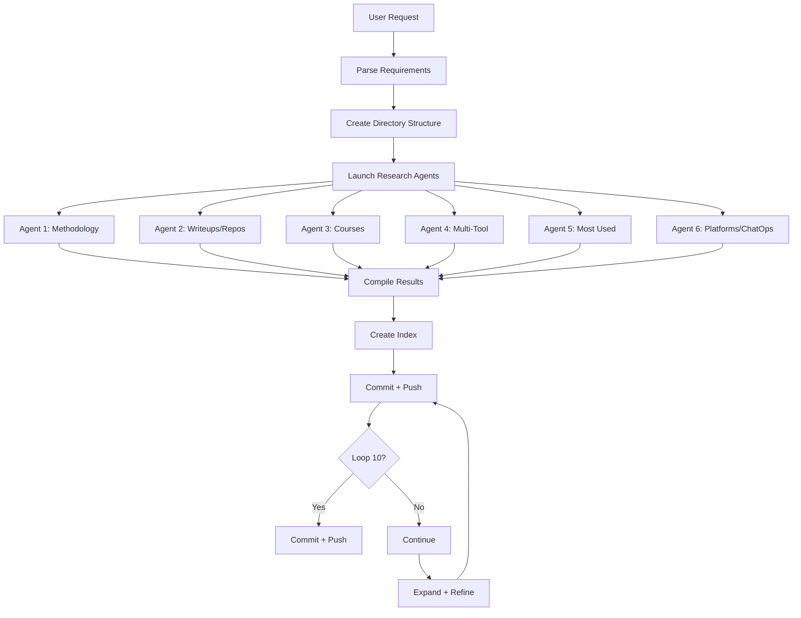

# Workflows — 2026-03-22

## Workflow Overview

## Agent Assignments

| Agent | Scope | Output Files |
|-------|-------|-------------|
| 1 - Methodology | Vibe coding/ops methodology, setup, CLAUDE.md, remote usage | methodology.md, setup_guide.md, remote_usage.md, claude_md_guide.md |
| 2 - Writeups | GitHub repos, blogs, frameworks ranked | Writeups.md |
| 3 - Courses | Free course list + 3 interactive courses | courses/**/*.md |
| 4 - Multi-Tool | Codex, Gemini, other tools integration | working_nicely/**/*.md |
| 5 - Most Used | Common skills, agents, slash commands | Most_used/**/*.md |
| 6 - Platforms | AWS, GitHub, Datadog, Atlassian, Slack, Cloudflare, ChatOps | {platform}/**/*.md, chatops/**/*.md |

## Step-by-Step

1. Read Prime Directive ✅
2. Create directory structure ✅
3. Create session log ✅
4. Update changelog ✅
5. Launch 6 parallel research agents ✅
6. Create foundation docs (ask_the_human, recommendations, next_steps) ✅
7. Wait for agents to complete
8. Review and compile results
9. Create index.md
10. Commit and push
11. Iterate and expand
