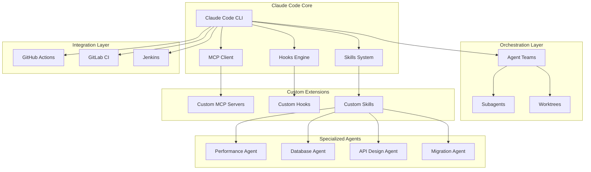

# Advanced Claude Code Patterns

> Push the boundaries of what's possible with Claude Code: multi-agent orchestration, custom MCP servers, CI/CD integration, and specialized AI agents.

---

## Contents

| Guide | Description |
|-------|-------------|
| [Multi-Agent Orchestration](multi_agent_orchestration.md) | Supervisor, pipeline, swarm, and debate patterns for coordinating multiple AI agents |
| [Custom MCP Servers](custom_mcp_servers.md) | Build your own Model Context Protocol servers with starter templates |
| [CI/CD Integration](ci_cd_integration.md) | Deep integration with GitHub Actions, GitLab CI, and Jenkins pipelines |
| [Code Migration](code_migration.md) | AI-assisted framework upgrades, language ports, and API migrations |
| [Performance Agent](performance_agent.md) | Profiling, bottleneck detection, and optimization suggestions |
| [Database Agent](database_agent.md) | Schema design, migration generation, and query optimization |
| [API Design Agent](api_design_agent.md) | OpenAPI spec generation and backward compatibility checks |
| [Hooks Deep Dive](hooks_deep_dive.md) | Advanced hooks patterns for pre/post tool use, validation, and auto-formatting |

## Architecture Overview

## Prerequisites

- Claude Code CLI installed and authenticated
- Node.js 18+ (for MCP server development)
- Python 3.10+ (for Python-based MCP servers)
- Git (for worktree-based parallel agents)
- GitHub CLI (`gh`) for CI/CD integration

## How to Use These Guides

Each guide is self-contained with:
1. **Conceptual overview** -- understand the pattern
2. **Working configurations** -- copy-paste into your project
3. **Real examples** -- tested patterns you can adapt
4. **Troubleshooting** -- common pitfalls and solutions

Start with the guide most relevant to your current project. The [Hooks Deep Dive](hooks_deep_dive.md) is recommended as a foundation since hooks power many of the other patterns.

## Sources

- [Claude Code Official Docs](https://code.claude.com/docs/en/)
- [Model Context Protocol Specification](https://modelcontextprotocol.io/)
- [Anthropic Claude Code GitHub Action](https://github.com/anthropics/claude-code-action)
