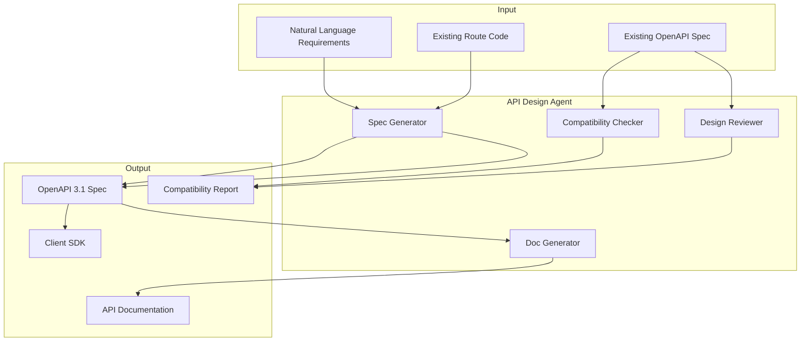

# API Design Agent

> AI agent for OpenAPI spec generation, backward compatibility checks, and API design best practices.

---

## Table of Contents

- [Overview](#overview)
- [Agent Architecture](#agent-architecture)
- [OpenAPI Spec Generation](#openapi-spec-generation)
- [Backward Compatibility Checks](#backward-compatibility-checks)
- [API Design Review](#api-design-review)
- [SDK Generation](#sdk-generation)
- [API Documentation](#api-documentation)
- [MCP Server for API Operations](#mcp-server-for-api-operations)

---

## Overview

The API Design Agent helps you design, document, validate, and evolve REST APIs. It generates OpenAPI specs from code or natural language, checks backward compatibility between versions, and enforces design consistency.



---

## Agent Architecture

| Component | Responsibility |
|-----------|----------------|
| **Spec Generator** | Create OpenAPI specs from code, requirements, or examples |
| **Compatibility Checker** | Detect breaking changes between API versions |
| **Design Reviewer** | Enforce naming conventions, consistency, and best practices |
| **Doc Generator** | Generate human-readable API documentation |

---

## OpenAPI Spec Generation

### From Natural Language

Create `.claude/skills/api-design.md`:

```markdown
---
name: api-design
description: Generate OpenAPI 3.1 specifications from natural language requirements or existing code
allowed-tools:
  - Read
  - Write
  - Edit
  - Bash
  - Glob
  - Grep
---

# API Design Agent

## From Natural Language

When given requirements in natural language:

1. **Extract entities** and their relationships
2. **Identify operations** (CRUD + custom actions)
3. **Design URL structure** following REST conventions
4. **Define request/response schemas** with proper types
5. **Add error responses** (400, 401, 403, 404, 409, 422, 500)
6. **Generate OpenAPI 3.1 YAML**

## REST URL Conventions

| Operation | Method | URL | Description |
|-----------|--------|-----|-------------|
| List | GET | `/resources` | Paginated list with filters |
| Create | POST | `/resources` | Create a new resource |
| Get | GET | `/resources/{id}` | Get a single resource |
| Update | PUT | `/resources/{id}` | Full replacement |
| Patch | PATCH | `/resources/{id}` | Partial update |
| Delete | DELETE | `/resources/{id}` | Delete a resource |
| Action | POST | `/resources/{id}/actions/{action}` | Custom action |
| Nested | GET | `/resources/{id}/sub-resources` | Related resources |

## Naming Rules

- Use **plural nouns** for resources: `/users`, not `/user`
- Use **kebab-case** for multi-word resources: `/order-items`
- Use **camelCase** for JSON fields: `firstName`, not `first_name`
- Use **snake_case** for query parameters: `?page_size=20`
- Versions in URL path: `/v1/users`
- No trailing slashes
- No verbs in URLs (use HTTP methods instead)

## Pagination Standard

```yaml
parameters:
  - name: page
    in: query
    schema:
      type: integer
      default: 1
      minimum: 1
  - name: page_size
    in: query
    schema:
      type: integer
      default: 20
      minimum: 1
      maximum: 100

# Response envelope
components:
  schemas:
    PaginatedResponse:
      type: object
      properties:
        data:
          type: array
          items: {}
        meta:
          type: object
          properties:
            page:
              type: integer
            page_size:
              type: integer
            total_count:
              type: integer
            total_pages:
              type: integer
```

## Error Response Standard

```yaml
components:
  schemas:
    Error:
      type: object
      required: [code, message]
      properties:
        code:
          type: string
          description: Machine-readable error code
          example: "VALIDATION_ERROR"
        message:
          type: string
          description: Human-readable error message
          example: "Email is required"
        details:
          type: array
          items:
            type: object
            properties:
              field:
                type: string
              message:
                type: string
              code:
                type: string
```

## Output

Generate a complete OpenAPI 3.1 specification in YAML format:
- All endpoints with request/response schemas
- Authentication scheme (Bearer token, API key, or OAuth2)
- Pagination on list endpoints
- Standard error responses
- Example values for all fields
- Description for all operations and schemas
```

### From Existing Code

Create `.claude/skills/api-extract.md`:

```markdown
---
name: api-extract
description: Extract an OpenAPI spec from existing route handler code
allowed-tools:
  - Read
  - Bash
  - Glob
  - Grep
---

# API Spec Extraction

## Process

1. **Find all route definitions**:
   ```bash
   # Express.js
   rg "router\.(get|post|put|patch|delete)\(" src/

   # Fastify
   rg "fastify\.(get|post|put|patch|delete)\(" src/

   # Django
   rg "path\(|url\(" urls.py

   # Flask
   rg "@app\.route\(|@blueprint\.route\(" src/

   # Go (chi/gin/echo)
   rg "r\.(Get|Post|Put|Patch|Delete)\(" .
   ```

2. **For each route, extract**:
   - HTTP method and path
   - Path parameters (from URL pattern)
   - Query parameters (from handler code)
   - Request body schema (from validation/parsing code)
   - Response schema (from handler return/send calls)
   - Authentication requirements (from middleware)
   - Error responses (from error handling)

3. **Infer types from**:
   - TypeScript interfaces/types
   - Zod/Joi/Yup validation schemas
   - Prisma/Sequelize/TypeORM model definitions
   - JSDoc/docstring annotations
   - Runtime validation libraries

4. **Generate the OpenAPI spec** with all discovered information

5. **Validate** the generated spec:
   ```bash
   npx @redocly/cli lint openapi.yaml
   ```
```

### Example: Generated Spec

```yaml
openapi: '3.1.0'
info:
  title: E-Commerce API
  version: 1.0.0
  description: API for managing products, orders, and users

servers:
  - url: https://api.example.com/v1
    description: Production
  - url: http://localhost:3000/v1
    description: Local development

security:
  - bearerAuth: []

paths:
  /products:
    get:
      operationId: listProducts
      summary: List products with filtering and pagination
      tags: [Products]
      parameters:
        - name: category
          in: query
          schema:
            type: string
        - name: min_price
          in: query
          schema:
            type: number
            format: decimal
        - name: max_price
          in: query
          schema:
            type: number
            format: decimal
        - $ref: '#/components/parameters/Page'
        - $ref: '#/components/parameters/PageSize'
      responses:
        '200':
          description: Paginated list of products
          content:
            application/json:
              schema:
                allOf:
                  - $ref: '#/components/schemas/PaginatedResponse'
                  - type: object
                    properties:
                      data:
                        type: array
                        items:
                          $ref: '#/components/schemas/Product'
        '401':
          $ref: '#/components/responses/Unauthorized'

    post:
      operationId: createProduct
      summary: Create a new product
      tags: [Products]
      requestBody:
        required: true
        content:
          application/json:
            schema:
              $ref: '#/components/schemas/CreateProductRequest'
            example:
              name: "Wireless Headphones"
              price: 79.99
              category: "electronics"
              description: "Premium wireless headphones with noise cancellation"
      responses:
        '201':
          description: Product created
          content:
            application/json:
              schema:
                $ref: '#/components/schemas/Product'
        '400':
          $ref: '#/components/responses/BadRequest'
        '401':
          $ref: '#/components/responses/Unauthorized'
        '422':
          $ref: '#/components/responses/ValidationError'

  /products/{productId}:
    get:
      operationId: getProduct
      summary: Get a product by ID
      tags: [Products]
      parameters:
        - name: productId
          in: path
          required: true
          schema:
            type: string
            format: uuid
      responses:
        '200':
          description: Product details
          content:
            application/json:
              schema:
                $ref: '#/components/schemas/Product'
        '404':
          $ref: '#/components/responses/NotFound'

components:
  securitySchemes:
    bearerAuth:
      type: http
      scheme: bearer
      bearerFormat: JWT

  parameters:
    Page:
      name: page
      in: query
      schema:
        type: integer
        default: 1
        minimum: 1
    PageSize:
      name: page_size
      in: query
      schema:
        type: integer
        default: 20
        minimum: 1
        maximum: 100

  schemas:
    Product:
      type: object
      required: [id, name, price, category, createdAt]
      properties:
        id:
          type: string
          format: uuid
        name:
          type: string
          maxLength: 255
        price:
          type: number
          format: decimal
          minimum: 0
        category:
          type: string
        description:
          type: string
        createdAt:
          type: string
          format: date-time
        updatedAt:
          type: string
          format: date-time

    CreateProductRequest:
      type: object
      required: [name, price, category]
      properties:
        name:
          type: string
          maxLength: 255
        price:
          type: number
          format: decimal
          minimum: 0
        category:
          type: string
        description:
          type: string

    PaginatedResponse:
      type: object
      properties:
        data:
          type: array
          items: {}
        meta:
          type: object
          properties:
            page:
              type: integer
            page_size:
              type: integer
            total_count:
              type: integer
            total_pages:
              type: integer

    Error:
      type: object
      required: [code, message]
      properties:
        code:
          type: string
        message:
          type: string
        details:
          type: array
          items:
            type: object
            properties:
              field:
                type: string
              message:
                type: string

  responses:
    BadRequest:
      description: Bad request
      content:
        application/json:
          schema:
            $ref: '#/components/schemas/Error'
          example:
            code: BAD_REQUEST
            message: Invalid request format
    Unauthorized:
      description: Authentication required
      content:
        application/json:
          schema:
            $ref: '#/components/schemas/Error'
          example:
            code: UNAUTHORIZED
            message: Authentication token is missing or invalid
    NotFound:
      description: Resource not found
      content:
        application/json:
          schema:
            $ref: '#/components/schemas/Error'
          example:
            code: NOT_FOUND
            message: The requested resource was not found
    ValidationError:
      description: Validation error
      content:
        application/json:
          schema:
            $ref: '#/components/schemas/Error'
          example:
            code: VALIDATION_ERROR
            message: Request validation failed
            details:
              - field: name
                message: Name is required
```

---

## Backward Compatibility Checks

### Compatibility Skill

Create `.claude/skills/api-compat.md`:

```markdown
---
name: api-compat
description: Check API backward compatibility between two versions of an OpenAPI spec
allowed-tools:
  - Read
  - Bash
  - Glob
  - Grep
---

# API Backward Compatibility Checker

## Breaking Changes (MUST NOT happen without version bump)

| Change | Category | Impact |
|--------|----------|--------|
| Remove an endpoint | Removal | Clients calling it will get 404 |
| Remove a response field | Removal | Clients depending on it will break |
| Add a required request field | Addition | Existing requests will fail validation |
| Change a field type | Type change | Parsing will fail |
| Rename an endpoint | Rename | Same as removal + addition |
| Change authentication scheme | Auth | All authenticated requests will fail |
| Remove an enum value | Removal | Existing data becomes invalid |
| Make optional field required | Constraint | Existing valid requests become invalid |
| Change error response format | Format | Error handling code breaks |

## Non-Breaking Changes (safe to deploy)

| Change | Category | Notes |
|--------|----------|-------|
| Add a new endpoint | Addition | No impact on existing clients |
| Add an optional request field | Addition | Ignored by existing clients |
| Add a response field | Addition | Clients should ignore unknown fields |
| Add an enum value | Addition | Only if clients handle unknown values |
| Make a required field optional | Relaxation | Existing valid requests stay valid |
| Add a new response code | Addition | If clients handle unknown codes |

## Process

1. Load the old spec and new spec
2. Compare each endpoint:
   - Removed endpoints -> BREAKING
   - Changed methods -> BREAKING
   - Changed path parameters -> BREAKING
3. Compare each schema:
   - Removed fields -> BREAKING
   - New required fields -> BREAKING
   - Changed types -> BREAKING
   - New optional fields -> OK
4. Compare authentication:
   - Changed scheme -> BREAKING
   - Additional scheme option -> OK
5. Generate compatibility report

## Automated Check

```bash
# Using oasdiff (install: go install github.com/tufin/oasdiff@latest)
oasdiff breaking old-api.yaml new-api.yaml

# Or using openapi-diff
npx openapi-diff old-api.yaml new-api.yaml
```

## Output Format

| Change | Type | Breaking? | Affected Endpoints | Migration Notes |
|--------|------|-----------|-------------------|-----------------|
```

### Hook: Auto-Check on Spec Changes

Add to `.claude/settings.json`:

```json
{
  "hooks": {
    "PostToolUse": [
      {
        "matcher": "Write|Edit",
        "hooks": [
          {
            "type": "command",
            "command": "python3 -c \"import json,sys; d=json.load(sys.stdin); p=d.get('tool_input',{}).get('file_path',''); sys.exit(0) if 'openapi' not in p.lower() and 'swagger' not in p.lower() else None; import subprocess; subprocess.run(['npx','@redocly/cli','lint',p])\""
          }
        ]
      }
    ]
  }
}
```

---

## API Design Review

### Design Review Skill

Create `.claude/skills/api-review.md`:

```markdown
---
name: api-review
description: Review an API design for consistency, best practices, and common mistakes
allowed-tools:
  - Read
  - Bash
  - Glob
  - Grep
---

# API Design Review

## Checklist

### URL Structure
- [ ] Resources are plural nouns (`/users`, not `/user`)
- [ ] No verbs in URLs (`POST /orders`, not `POST /create-order`)
- [ ] Consistent casing (kebab-case for URLs, camelCase for JSON)
- [ ] Logical nesting depth <= 3 (`/users/{id}/orders`, not `/users/{id}/orders/{oid}/items/{iid}/variants`)
- [ ] Version in URL path (`/v1/users`)

### HTTP Methods
- [ ] GET is safe (no side effects) and idempotent
- [ ] PUT is idempotent (same request = same result)
- [ ] DELETE is idempotent
- [ ] POST is for creation or non-idempotent operations
- [ ] PATCH for partial updates (not PUT)

### Request/Response
- [ ] All list endpoints support pagination
- [ ] Consistent pagination format across endpoints
- [ ] All endpoints return appropriate status codes
- [ ] Error responses follow a consistent format
- [ ] No nullable fields that could be omitted instead
- [ ] All date/time fields use ISO 8601 format
- [ ] Money uses integer cents (not floating point)

### Security
- [ ] Authentication scheme documented
- [ ] Authorization scopes defined per endpoint
- [ ] Rate limiting headers documented
- [ ] No sensitive data in query parameters (use headers or body)
- [ ] CORS configuration documented

### Documentation
- [ ] All endpoints have summary and description
- [ ] All parameters have descriptions
- [ ] All schemas have property descriptions
- [ ] Examples provided for request bodies
- [ ] Error codes documented with meaning and resolution

## Output

For each finding:
- Endpoint or schema affected
- Category (URL / Method / Schema / Security / Docs)
- Severity (Error / Warning / Info)
- Description of the issue
- Suggested fix
```

---

## SDK Generation

### Generating Client SDKs from OpenAPI

```markdown
---
name: api-sdk
description: Generate typed client SDKs from OpenAPI specifications
---

# SDK Generation

## Tools

```bash
# TypeScript client
npx @openapitools/openapi-generator-cli generate \
  -i openapi.yaml \
  -g typescript-fetch \
  -o generated/ts-client \
  --additional-properties=supportsES6=true,typescriptThreePlus=true

# Python client
npx @openapitools/openapi-generator-cli generate \
  -i openapi.yaml \
  -g python \
  -o generated/python-client

# Go client
npx @openapitools/openapi-generator-cli generate \
  -i openapi.yaml \
  -g go \
  -o generated/go-client
```

## Post-Generation Cleanup

After generating:
1. Review generated types for correctness
2. Add custom error handling if needed
3. Add retry logic and timeout configuration
4. Write integration tests using the generated client
5. Set up CI to regenerate on spec changes
```

---

## API Documentation

### Generate Interactive Docs

```bash
# Redoc (static HTML)
npx @redocly/cli build-docs openapi.yaml -o docs/api.html

# Swagger UI (interactive)
docker run -p 8080:8080 -e SWAGGER_JSON=/api/openapi.yaml \
  -v ./openapi.yaml:/api/openapi.yaml swaggerapi/swagger-ui

# Stoplight Elements (embedded React component)
npm install @stoplight/elements
```

### Documentation Skill

```markdown
---
name: api-docs
description: Generate human-readable API documentation from an OpenAPI spec
---

# API Documentation Generator

For each endpoint, generate:

## Endpoint Name

**Method URL**

Description of what this endpoint does.

### Authentication

Required/Optional, what scopes needed.

### Parameters

| Name | Location | Type | Required | Description |
|------|----------|------|----------|-------------|

### Request Body

JSON example with all fields.

### Response

JSON example of successful response.

### Errors

| Status | Code | Description |
|--------|------|-------------|

### Example

```bash
curl -X POST https://api.example.com/v1/resource \
  -H "Authorization: Bearer <token>" \
  -H "Content-Type: application/json" \
  -d '{"field": "value"}'
```
```

---

## MCP Server for API Operations

```python
#!/usr/bin/env python3
"""API operations MCP server."""

from mcp.server.fastmcp import FastMCP
import subprocess
import json
import yaml

mcp = FastMCP("api-agent")

@mcp.tool()
def validate_openapi(spec_path: str) -> str:
    """Validate an OpenAPI specification file.

    Args:
        spec_path: Path to the OpenAPI YAML or JSON file
    """
    result = subprocess.run(
        ["npx", "@redocly/cli", "lint", spec_path, "--format", "json"],
        capture_output=True, text=True, timeout=30,
    )
    if result.returncode == 0:
        return "Specification is valid."
    try:
        errors = json.loads(result.stdout)
        return json.dumps(errors, indent=2)
    except json.JSONDecodeError:
        return result.stderr or result.stdout

@mcp.tool()
def check_breaking_changes(old_spec: str, new_spec: str) -> str:
    """Check for breaking changes between two API spec versions.

    Args:
        old_spec: Path to the old OpenAPI spec
        new_spec: Path to the new OpenAPI spec
    """
    result = subprocess.run(
        ["npx", "openapi-diff", old_spec, new_spec, "--json"],
        capture_output=True, text=True, timeout=30,
    )
    try:
        diff = json.loads(result.stdout)
        breaking = diff.get("breakingDifferences", [])
        non_breaking = diff.get("nonBreakingDifferences", [])

        report = "## Breaking Changes\n\n"
        if breaking:
            for b in breaking:
                report += f"- **{b.get('type', 'unknown')}**: {b.get('description', '')}\n"
        else:
            report += "None found.\n"

        report += "\n## Non-Breaking Changes\n\n"
        if non_breaking:
            for nb in non_breaking:
                report += f"- {nb.get('type', 'unknown')}: {nb.get('description', '')}\n"
        else:
            report += "None found.\n"

        return report
    except json.JSONDecodeError:
        return result.stderr or "Failed to parse diff output."

@mcp.tool()
def generate_mock_server(spec_path: str, port: int = 4010) -> str:
    """Generate and start a mock server from an OpenAPI spec using Prism.

    Args:
        spec_path: Path to the OpenAPI spec
        port: Port to run the mock server on
    """
    result = subprocess.Popen(
        ["npx", "@stoplight/prism-cli", "mock", spec_path, "--port", str(port)],
        stdout=subprocess.PIPE, stderr=subprocess.PIPE,
    )
    return f"Mock server started on http://localhost:{port} (PID: {result.pid})"

if __name__ == "__main__":
    mcp.run()
```

---

## Sources

- [AI Agents Are the New Users of Your API](https://blog.apilayer.com/ai-agents-are-the-new-users-of-your-api-how-to-make-your-api-agent-ready/)
- [Agent Skills for OpenAPI Generation - Speakeasy](https://www.speakeasy.com/blog/release-agent-skills)
- [AI-First API Design: Generating OpenAPI Specs from Natural Language](https://www.kinde.com/learn/ai-for-software-engineering/using-ai-for-apis/ai-first-api-design-generating-openapi-specs-from-natural-language-requirements/)
- [13 Best OpenAPI Documentation Tools 2026](https://treblle.com/blog/best-openapi-documentation-tools)
- [Breaking the API Testing Bottleneck: AI-Powered OpenAPI Spec Generation](https://www.stackhawk.com/blog/openapi-spec-generation/)
