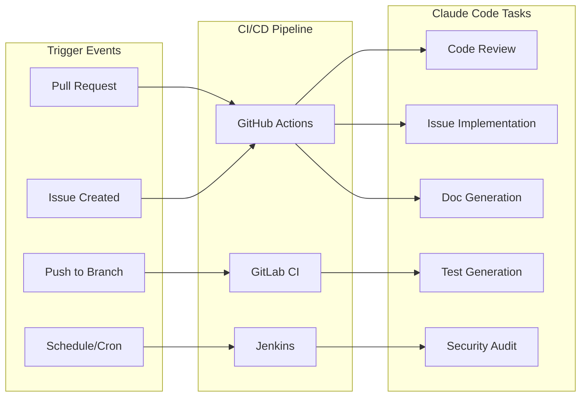

# CI/CD Integration

> Deep integration of Claude Code with GitHub Actions, GitLab CI, and Jenkins pipelines for automated code review, issue implementation, and deployment workflows.

---

## Table of Contents

- [Overview](#overview)
- [GitHub Actions](#github-actions)
- [GitLab CI](#gitlab-ci)
- [Jenkins](#jenkins)
- [Common Patterns](#common-patterns)
- [Security Best Practices](#security-best-practices)
- [Advanced Workflows](#advanced-workflows)

---

## Overview

Claude Code can run headlessly in CI/CD pipelines using the `--print` flag (single-turn) or the official GitHub Action. This enables automated code review, issue triage, test generation, documentation updates, and more.



---

## GitHub Actions

### Quick Setup

The fastest way to get started:

```bash
# In your project directory with Claude Code
claude /install-github-app
```

This walks you through setting up the GitHub App and required secrets.

### Manual Setup

#### 1. Store your API key

Go to **Settings > Secrets and variables > Actions** and add:
- `ANTHROPIC_API_KEY` -- your Anthropic API key

#### 2. Automated PR Review

Create `.github/workflows/claude-review.yml`:

```yaml
name: Claude Code Review

on:
  pull_request:
    types: [opened, synchronize]

permissions:
  contents: read
  pull-requests: write
  issues: write

jobs:
  review:
    runs-on: ubuntu-latest
    steps:
      - uses: anthropics/claude-code-action@v1
        with:
          anthropic_api_key: ${{ secrets.ANTHROPIC_API_KEY }}

          # Customize the review prompt
          custom_instructions: |
            Review this PR with focus on:
            1. Correctness and edge cases
            2. Security vulnerabilities
            3. Performance implications
            4. Test coverage gaps

            Be specific: reference file names and line numbers.
            Suggest concrete fixes, not vague advice.

          # Optional: limit which files Claude reviews
          # include_paths: "src/**,lib/**"
          # exclude_paths: "**/*.test.ts,docs/**"
```

#### 3. Automated Issue Implementation

Create `.github/workflows/claude-issue.yml`:

```yaml
name: Claude Implement Issue

on:
  issues:
    types: [labeled]

permissions:
  contents: write
  pull-requests: write
  issues: write

jobs:
  implement:
    if: github.event.label.name == 'claude-implement'
    runs-on: ubuntu-latest
    steps:
      - uses: actions/checkout@v4
        with:
          fetch-depth: 0

      - uses: anthropics/claude-code-action@v1
        with:
          anthropic_api_key: ${{ secrets.ANTHROPIC_API_KEY }}
          use_claude_code: true
          direct_prompt: |
            Implement the feature described in issue #${{ github.event.issue.number }}.

            Issue title: ${{ github.event.issue.title }}
            Issue body: ${{ github.event.issue.body }}

            Instructions:
            1. Read the issue carefully
            2. Implement the solution
            3. Write tests
            4. Create a PR with the changes

          # Allow Claude to create branches and PRs
          allowed_tools: |
            Bash
            Read
            Write
            Edit
            Glob
            Grep
```

#### 4. Automated Test Generation on Push

```yaml
name: Claude Test Generation

on:
  push:
    branches: [main]
    paths:
      - 'src/**/*.ts'
      - 'src/**/*.js'

permissions:
  contents: write
  pull-requests: write

jobs:
  generate-tests:
    runs-on: ubuntu-latest
    steps:
      - uses: actions/checkout@v4

      - uses: actions/setup-node@v4
        with:
          node-version: '20'

      - run: npm ci

      - name: Find files without tests
        id: find-untested
        run: |
          # Find source files that don't have corresponding test files
          untested=$(find src -name '*.ts' ! -name '*.test.ts' ! -name '*.spec.ts' | while read f; do
            test_file="${f%.ts}.test.ts"
            spec_file="${f%.ts}.spec.ts"
            if [ ! -f "$test_file" ] && [ ! -f "$spec_file" ]; then
              echo "$f"
            fi
          done | head -5)
          echo "files=$untested" >> "$GITHUB_OUTPUT"

      - uses: anthropics/claude-code-action@v1
        if: steps.find-untested.outputs.files != ''
        with:
          anthropic_api_key: ${{ secrets.ANTHROPIC_API_KEY }}
          use_claude_code: true
          direct_prompt: |
            Generate comprehensive unit tests for these files:
            ${{ steps.find-untested.outputs.files }}

            Requirements:
            - Use the existing test framework (check package.json)
            - Cover happy path, edge cases, and error cases
            - Mock external dependencies
            - Aim for >80% branch coverage
            - Create a PR with the new tests
```

#### 5. Security Audit on Schedule

```yaml
name: Claude Security Audit

on:
  schedule:
    - cron: '0 9 * * 1'  # Every Monday at 9am UTC
  workflow_dispatch:

permissions:
  contents: read
  issues: write

jobs:
  security-audit:
    runs-on: ubuntu-latest
    steps:
      - uses: actions/checkout@v4

      - uses: anthropics/claude-code-action@v1
        with:
          anthropic_api_key: ${{ secrets.ANTHROPIC_API_KEY }}
          use_claude_code: true
          direct_prompt: |
            Perform a security audit of this codebase:

            1. Check for hardcoded secrets, API keys, or credentials
            2. Review authentication and authorization logic
            3. Check for SQL injection, XSS, CSRF vulnerabilities
            4. Review dependency versions for known CVEs
            5. Check file permissions and access controls
            6. Review error handling (no sensitive data in error messages)

            Create a GitHub issue titled "Weekly Security Audit - $(date +%Y-%m-%d)"
            with your findings, severity ratings, and remediation steps.
```

---

## GitLab CI

### Basic Setup

Add `ANTHROPIC_API_KEY` to **Settings > CI/CD > Variables** (masked and protected).

### PR Review Pipeline

Create `.gitlab-ci.yml`:

```yaml
stages:
  - review
  - test
  - deploy

claude-review:
  stage: review
  image: node:20
  rules:
    - if: $CI_PIPELINE_SOURCE == "merge_request_event"
  before_script:
    - npm install -g @anthropic-ai/claude-code
  script:
    - |
      # Get the diff for this MR
      git fetch origin $CI_MERGE_REQUEST_TARGET_BRANCH_NAME
      DIFF=$(git diff origin/$CI_MERGE_REQUEST_TARGET_BRANCH_NAME...HEAD)

      # Run Claude Code in print mode
      claude --print "Review this code diff for bugs, security issues, and style problems.
      Be specific with file names and line numbers.

      Diff:
      $DIFF" > review_output.md

      # Post as MR comment using GitLab API
      BODY=$(cat review_output.md | jq -Rs .)
      curl --request POST \
        --header "PRIVATE-TOKEN: $GITLAB_TOKEN" \
        --header "Content-Type: application/json" \
        --data "{\"body\": $BODY}" \
        "$CI_API_V4_URL/projects/$CI_PROJECT_ID/merge_requests/$CI_MERGE_REQUEST_IID/notes"
  variables:
    ANTHROPIC_API_KEY: $ANTHROPIC_API_KEY

claude-test-gen:
  stage: test
  image: node:20
  rules:
    - if: $CI_PIPELINE_SOURCE == "merge_request_event"
      changes:
        - "src/**/*.ts"
  before_script:
    - npm install -g @anthropic-ai/claude-code
    - npm ci
  script:
    - |
      # Find changed files without tests
      CHANGED=$(git diff --name-only origin/$CI_MERGE_REQUEST_TARGET_BRANCH_NAME...HEAD | grep 'src/.*\.ts$' | grep -v '\.test\.' | grep -v '\.spec\.')

      if [ -n "$CHANGED" ]; then
        claude --print "Generate tests for these changed files that lack test coverage:
        $CHANGED

        Use Jest. Write tests in the same directory as the source file with .test.ts suffix.
        Run the tests to verify they pass." | tee test_gen_output.md
      fi
  variables:
    ANTHROPIC_API_KEY: $ANTHROPIC_API_KEY
  artifacts:
    paths:
      - test_gen_output.md
    expire_in: 1 week
```

---

## Jenkins

### Jenkinsfile Integration

```groovy
pipeline {
    agent any

    environment {
        ANTHROPIC_API_KEY = credentials('anthropic-api-key')
    }

    stages {
        stage('Install Claude Code') {
            steps {
                sh 'npm install -g @anthropic-ai/claude-code'
            }
        }

        stage('Code Review') {
            when {
                changeRequest()
            }
            steps {
                script {
                    def diff = sh(
                        script: "git diff origin/${env.CHANGE_TARGET}...HEAD",
                        returnStdout: true
                    ).trim()

                    def review = sh(
                        script: """claude --print "Review this diff for bugs and security issues:

${diff}

Format as markdown with severity levels: critical, high, medium, low." """,
                        returnStdout: true
                    ).trim()

                    // Post to PR (GitHub example)
                    if (env.CHANGE_URL) {
                        writeFile file: 'review.md', text: review
                        sh """
                            gh pr comment ${env.CHANGE_ID} --body-file review.md
                        """
                    }
                }
            }
        }

        stage('Generate Release Notes') {
            when {
                branch 'main'
            }
            steps {
                script {
                    def lastTag = sh(
                        script: "git describe --tags --abbrev=0 2>/dev/null || echo 'HEAD~20'",
                        returnStdout: true
                    ).trim()

                    def commits = sh(
                        script: "git log ${lastTag}..HEAD --oneline",
                        returnStdout: true
                    ).trim()

                    def notes = sh(
                        script: """claude --print "Generate release notes from these commits:

${commits}

Format as markdown with sections: Features, Bug Fixes, Breaking Changes, Other.
Include a one-paragraph executive summary at the top." """,
                        returnStdout: true
                    ).trim()

                    writeFile file: 'RELEASE_NOTES.md', text: notes
                    archiveArtifacts artifacts: 'RELEASE_NOTES.md'
                }
            }
        }
    }
}
```

---

## Common Patterns

### Pattern 1: Gate on Claude Review

Block merges until Claude's review passes:

```yaml
# GitHub Actions
name: Claude Review Gate
on:
  pull_request:
    types: [opened, synchronize]

jobs:
  review-gate:
    runs-on: ubuntu-latest
    steps:
      - uses: actions/checkout@v4

      - name: Run Claude review
        id: review
        run: |
          RESULT=$(claude --print --output-format json "
            Review the changes in this PR. Output a JSON object:
            {
              \"approved\": true/false,
              \"blocking_issues\": [\"issue1\", \"issue2\"],
              \"suggestions\": [\"suggestion1\"]
            }

            Blocking issues are: security vulnerabilities, data loss risks,
            broken API contracts, missing error handling for critical paths.
          ")
          echo "result=$RESULT" >> "$GITHUB_OUTPUT"
        env:
          ANTHROPIC_API_KEY: ${{ secrets.ANTHROPIC_API_KEY }}

      - name: Check approval
        run: |
          APPROVED=$(echo '${{ steps.review.outputs.result }}' | jq -r '.approved')
          if [ "$APPROVED" != "true" ]; then
            echo "::error::Claude found blocking issues"
            echo '${{ steps.review.outputs.result }}' | jq -r '.blocking_issues[]' | while read issue; do
              echo "::error::$issue"
            done
            exit 1
          fi
```

### Pattern 2: Changelog Generation

```yaml
name: Auto Changelog
on:
  push:
    branches: [main]

jobs:
  changelog:
    runs-on: ubuntu-latest
    steps:
      - uses: actions/checkout@v4
        with:
          fetch-depth: 0

      - name: Generate changelog entry
        run: |
          COMMITS=$(git log --oneline $(git describe --tags --abbrev=0 2>/dev/null || echo HEAD~10)..HEAD)
          claude --print "Generate a changelog entry for these commits:

          $COMMITS

          Format:
          ## [version] - $(date +%Y-%m-%d)
          ### Added
          ### Changed
          ### Fixed
          ### Removed

          Only include sections that have entries." >> CHANGELOG.md
        env:
          ANTHROPIC_API_KEY: ${{ secrets.ANTHROPIC_API_KEY }}
```

### Pattern 3: Smart Labeling

```yaml
name: Claude Issue Labeler
on:
  issues:
    types: [opened]

jobs:
  label:
    runs-on: ubuntu-latest
    permissions:
      issues: write
    steps:
      - uses: anthropics/claude-code-action@v1
        with:
          anthropic_api_key: ${{ secrets.ANTHROPIC_API_KEY }}
          direct_prompt: |
            Read this issue and apply appropriate labels.

            Title: ${{ github.event.issue.title }}
            Body: ${{ github.event.issue.body }}

            Available labels: bug, feature, documentation, security, performance, question, good-first-issue
            Apply 1-3 labels that best match.

            Use the GitHub CLI: gh issue edit ${{ github.event.issue.number }} --add-label "label1,label2"
```

---

## Security Best Practices

### API Key Management

```yaml
# NEVER do this:
# anthropic_api_key: sk-ant-xxxx

# ALWAYS use secrets:
anthropic_api_key: ${{ secrets.ANTHROPIC_API_KEY }}
```

### Fork Protection

By default, PRs from forks do NOT have access to repository secrets, preventing untrusted contributors from consuming your API credits.

```yaml
jobs:
  review:
    # Only run on PRs from the same repo, not forks
    if: github.event.pull_request.head.repo.full_name == github.repository
    runs-on: ubuntu-latest
```

### Tool Restrictions

Limit what Claude can do in CI:

```yaml
- uses: anthropics/claude-code-action@v1
  with:
    anthropic_api_key: ${{ secrets.ANTHROPIC_API_KEY }}
    # Only allow read operations in review mode
    allowed_tools: |
      Read
      Glob
      Grep
    # Block all write operations
    disallowed_tools: |
      Write
      Edit
      Bash
```

### Context Control with CLAUDE.md

Your `CLAUDE.md` file is automatically loaded in CI, so use it to set CI-specific rules:

```markdown
<!-- In CLAUDE.md -->
## CI/CD Rules

When running in CI (detected by CI=true environment variable):
- Never modify files outside the repository
- Never install packages without explicit approval
- Never access external APIs except for testing
- Always output results as structured markdown
- Keep responses concise -- CI logs have size limits
```

---

## Advanced Workflows

### Multi-Stage Review Pipeline

```yaml
name: Multi-Stage Review

on:
  pull_request:
    types: [opened, synchronize]

jobs:
  # Stage 1: Quick automated checks
  quick-check:
    runs-on: ubuntu-latest
    outputs:
      needs-deep-review: ${{ steps.check.outputs.needs-deep-review }}
    steps:
      - uses: actions/checkout@v4
      - id: check
        run: |
          # Check size of diff
          LINES=$(git diff --stat origin/main...HEAD | tail -1 | grep -oP '\d+ insertions' | grep -oP '\d+')
          if [ "${LINES:-0}" -gt 200 ]; then
            echo "needs-deep-review=true" >> "$GITHUB_OUTPUT"
          else
            echo "needs-deep-review=false" >> "$GITHUB_OUTPUT"
          fi

  # Stage 2: Claude review (only for large PRs or critical paths)
  claude-review:
    needs: quick-check
    if: needs.quick-check.outputs.needs-deep-review == 'true'
    runs-on: ubuntu-latest
    steps:
      - uses: anthropics/claude-code-action@v1
        with:
          anthropic_api_key: ${{ secrets.ANTHROPIC_API_KEY }}
          custom_instructions: |
            This is a large PR that needs thorough review.
            Focus on architectural decisions and cross-cutting concerns.

  # Stage 3: Security scan (always runs)
  security-scan:
    runs-on: ubuntu-latest
    steps:
      - uses: actions/checkout@v4
      - run: |
          claude --print "Scan this diff for security issues only. Be concise.
          $(git diff origin/main...HEAD)" > security_report.md
        env:
          ANTHROPIC_API_KEY: ${{ secrets.ANTHROPIC_API_KEY }}
```

### Deployment Validation

```yaml
name: Post-Deploy Validation

on:
  deployment_status:
    states: [success]

jobs:
  validate:
    if: github.event.deployment_status.state == 'success'
    runs-on: ubuntu-latest
    steps:
      - uses: actions/checkout@v4

      - name: Validate deployment
        run: |
          DEPLOY_URL="${{ github.event.deployment_status.target_url }}"

          claude --print "
            Validate the deployment at $DEPLOY_URL:
            1. Check the /health endpoint responds 200
            2. Check the /api/version endpoint returns the expected version
            3. Run a smoke test: create a resource, read it, delete it
            4. Check response times are under 500ms

            Report results as a markdown table.
          " > validation_report.md

          cat validation_report.md
        env:
          ANTHROPIC_API_KEY: ${{ secrets.ANTHROPIC_API_KEY }}
```

---

## Sources

- [Claude Code GitHub Actions - Official Docs](https://code.claude.com/docs/en/github-actions)
- [anthropics/claude-code-action - GitHub](https://github.com/anthropics/claude-code-action)
- [CI/CD Integration: Claude Code in Your Pipeline](https://claude-world.com/articles/cicd-integration/)
- [Claude Code GitHub Actions: 5 Ready-to-Use Workflow Recipes](https://systemprompt.io/guides/claude-code-github-actions)
- [Claude Code CLI Cheatsheet](https://shipyard.build/blog/claude-code-cheat-sheet/)
