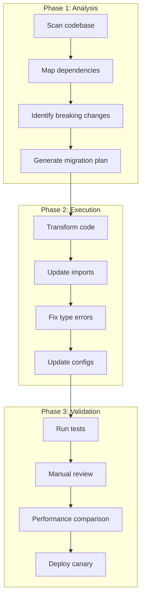
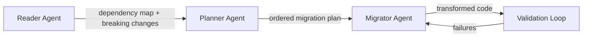
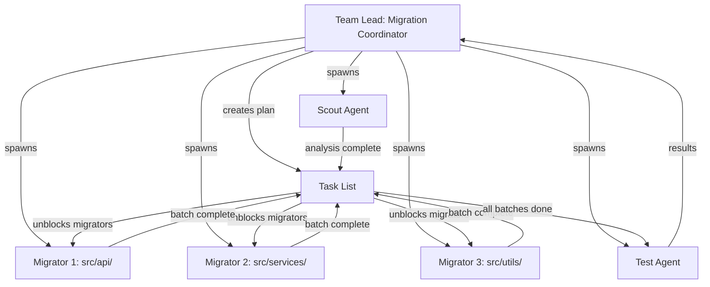

# AI-Assisted Code Migration

> Patterns and skills for framework upgrades, language ports, API version migrations, and dependency updates using Claude Code.

---

## Table of Contents

- [Overview](#overview)
- [Migration Architecture](#migration-architecture)
- [Framework Upgrades](#framework-upgrades)
- [Language Ports](#language-ports)
- [API Version Migrations](#api-version-migrations)
- [Dependency Upgrades](#dependency-upgrades)
- [Multi-Agent Migration](#multi-agent-migration)
- [Validation and Rollback](#validation-and-rollback)

---

## Overview

Code migrations are one of the highest-value tasks for AI agents: they involve repetitive, pattern-based transformations across many files, with well-defined before/after states. Claude Code excels at this when given a structured approach.



---

## Migration Architecture

### The Three-Agent Pattern

The most effective migration pattern uses three specialized agents:



### Skill Definition: Migration Coordinator

Create `.claude/skills/migrate.md`:

```markdown
---
name: migrate
description: Coordinate a multi-phase code migration with analysis, planning, execution, and validation
context: fork
allowed-tools:
  - Read
  - Write
  - Edit
  - Bash
  - Glob
  - Grep
  - Agent
---

# Migration Coordinator

You coordinate code migrations through four phases.

## Phase 1: Analysis

1. Scan the codebase for all usages of the source framework/library/API
2. Build a dependency map: which files depend on which features
3. Identify all breaking changes between source and target versions
4. Categorize changes:
   - **Mechanical**: Simple find-and-replace (import paths, renamed methods)
   - **Structural**: Requires code reorganization (new patterns, different abstractions)
   - **Behavioral**: Semantic changes that alter runtime behavior (need careful testing)

## Phase 2: Planning

1. Order files by dependency (leaves first, then inward)
2. Group related files into batches (max 10 files per batch)
3. For each batch, specify exact transformations needed
4. Identify files that need manual review (behavioral changes)

## Phase 3: Execution

For each batch:
1. Apply mechanical transformations first
2. Apply structural transformations
3. Run the linter and fix issues
4. Run tests for the affected modules
5. If tests fail, diagnose and fix before proceeding

## Phase 4: Validation

1. Run the full test suite
2. Compare test coverage before and after
3. Run any integration/e2e tests
4. Generate a migration report with:
   - Files changed
   - Tests added/modified
   - Known issues or TODOs
   - Manual review needed (list specific files)
```

---

## Framework Upgrades

### Example: React Class Components to Hooks

Create `.claude/skills/migrate-react-hooks.md`:

```markdown
---
name: migrate-react-hooks
description: Migrate React class components to function components with hooks
allowed-tools:
  - Read
  - Write
  - Edit
  - Bash
  - Glob
  - Grep
---

# React Class-to-Hooks Migration

## Transformation Rules

For each class component:

1. **Convert class declaration** to function declaration
2. **Convert state**: `this.state = {...}` becomes `useState()` calls
3. **Convert lifecycle methods**:
   - `componentDidMount` -> `useEffect(() => {...}, [])`
   - `componentDidUpdate` -> `useEffect(() => {...}, [deps])`
   - `componentWillUnmount` -> `useEffect(() => { return () => {...} }, [])`
   - `shouldComponentUpdate` -> `React.memo()` wrapper
4. **Convert refs**: `React.createRef()` -> `useRef()`
5. **Convert context**: `static contextType` -> `useContext()`
6. **Remove `this.`** from all property accesses
7. **Convert event handlers**: Class methods -> const functions or `useCallback`
8. **Convert `this.props`** -> destructured function parameters

## Validation

After each file:
1. Run `npx tsc --noEmit` to check types
2. Run tests for the component: `npx jest --testPathPattern=<component_name>`
3. If snapshot tests exist, update snapshots: `npx jest -u --testPathPattern=<component_name>`

## Edge Cases to Flag

- Components using `getDerivedStateFromProps` (needs manual migration)
- Components with complex `shouldComponentUpdate` logic
- Components using `forwardRef` with class instances
- Components that use `this` in setTimeout/setInterval callbacks
- HOC-wrapped components that access the wrapped instance
```

### Example: Express.js to Fastify

```markdown
---
name: migrate-express-fastify
description: Migrate Express.js routes to Fastify
---

# Express to Fastify Migration

## Route Transformation

| Express | Fastify |
|---------|---------|
| `app.get('/path', handler)` | `fastify.get('/path', handler)` |
| `req.query.param` | `req.query.param` (same) |
| `req.params.id` | `req.params.id` (same) |
| `req.body` | `req.body` (same) |
| `res.json(data)` | `reply.send(data)` |
| `res.status(404).json(err)` | `reply.code(404).send(err)` |
| `res.redirect('/path')` | `reply.redirect('/path')` |
| `next(err)` | `throw err` or `reply.code(500).send(err)` |

## Middleware Transformation

| Express | Fastify |
|---------|---------|
| `app.use(middleware)` | `fastify.addHook('onRequest', hook)` |
| `app.use('/path', middleware)` | Route-level `preHandler` |
| `express.json()` | Built-in (no action needed) |
| `express.static()` | `@fastify/static` plugin |
| `cors()` | `@fastify/cors` plugin |
| `helmet()` | `@fastify/helmet` plugin |

## Schema Validation

Fastify uses JSON Schema for request/response validation. For each route:
1. Define input schema (querystring, params, body)
2. Define response schema (200, 4xx, 5xx)
3. Add schemas to route options

```json
{
  "schema": {
    "body": {
      "type": "object",
      "required": ["name", "email"],
      "properties": {
        "name": { "type": "string" },
        "email": { "type": "string", "format": "email" }
      }
    },
    "response": {
      "200": {
        "type": "object",
        "properties": {
          "id": { "type": "integer" },
          "name": { "type": "string" }
        }
      }
    }
  }
}
```

## Process

1. Install Fastify and required plugins
2. Create a new app entry point (`app.ts`) with Fastify setup
3. Migrate routes in dependency order (no-dependency routes first)
4. Migrate middleware to hooks/plugins
5. Update error handling
6. Update tests
7. Remove Express dependencies
```

---

## Language Ports

### Skill: Python to TypeScript Port

Create `.claude/skills/port-python-ts.md`:

```markdown
---
name: port-python-ts
description: Port Python code to TypeScript with idiomatic patterns
allowed-tools:
  - Read
  - Write
  - Edit
  - Bash
  - Glob
  - Grep
---

# Python to TypeScript Port

## Type Mapping

| Python | TypeScript |
|--------|-----------|
| `str` | `string` |
| `int`, `float` | `number` |
| `bool` | `boolean` |
| `list[T]` | `T[]` or `Array<T>` |
| `dict[K, V]` | `Record<K, V>` or `Map<K, V>` |
| `tuple[A, B]` | `[A, B]` |
| `Optional[T]` | `T \| null` or `T \| undefined` |
| `Union[A, B]` | `A \| B` |
| `Any` | `unknown` (prefer over `any`) |
| `None` | `null` or `void` (for return types) |
| `TypedDict` | `interface` |
| `dataclass` | `interface` + factory function, or `class` |
| `Enum` | `enum` or `const` object |

## Pattern Mapping

| Python | TypeScript |
|--------|-----------|
| `for item in list:` | `for (const item of list)` |
| `[x for x in items if cond]` | `items.filter(cond).map(fn)` |
| `dict comprehension` | `Object.fromEntries(entries.map(...))` |
| `with open(f) as fp:` | `const content = await fs.readFile(f, 'utf-8')` |
| `try/except` | `try/catch` |
| `raise ValueError(msg)` | `throw new Error(msg)` |
| `@decorator` | No direct equivalent; use HOFs or class decorators |
| `async def / await` | `async function / await` |
| `yield` | `function*` / `yield` |

## Process

1. Analyze the Python module structure and create corresponding TS files
2. Port types first (interfaces, enums, type aliases)
3. Port utility functions (pure functions with no dependencies)
4. Port classes and their methods
5. Port async code (ensure proper Promise types)
6. Add proper error types (not just generic Error)
7. Run `tsc --noEmit` to verify type correctness
8. Write equivalent tests using the project's test framework
```

---

## API Version Migrations

### Skill: REST API v1 to v2 Migration

```markdown
---
name: migrate-api-version
description: Migrate client code from API v1 to v2
---

# API Version Migration

## Process

1. **Diff the API specs**: Compare v1 and v2 OpenAPI specs to identify:
   - Removed endpoints
   - Renamed endpoints
   - Changed request/response schemas
   - New required fields
   - Changed authentication

2. **Generate a transformation map**: For each breaking change, define:
   - Source pattern (v1 usage)
   - Target pattern (v2 equivalent)
   - Whether it's mechanical or requires logic changes

3. **Find all API callsites**: Search for HTTP client calls, SDK method calls,
   or generated client usage across the codebase

4. **Apply transformations** in order:
   - URL/endpoint changes
   - Request body restructuring
   - Response parsing updates
   - Error handling updates
   - Authentication changes

5. **Update types/interfaces** to match v2 schemas

6. **Run integration tests** against v2 API (or mock server)

## Example Transformation

```typescript
// v1
const user = await api.get('/v1/users/{id}', { fields: 'name,email' });
console.log(user.data.name);

// v2 (fields moved to query param, response wrapper removed)
const user = await api.get('/v2/users/{id}', {
  params: { select: ['name', 'email'] }
});
console.log(user.name);
```
```

---

## Dependency Upgrades

### Skill: Major Version Dependency Upgrade

Create `.claude/skills/upgrade-dep.md`:

```markdown
---
name: upgrade-dep
description: Upgrade a dependency to a new major version, handling breaking changes
allowed-tools:
  - Read
  - Write
  - Edit
  - Bash
  - Glob
  - Grep
---

# Dependency Upgrade

## Input

The user provides: package name, current version, target version.

## Process

1. **Read the changelog/migration guide** for the target version:
   - Check the package's CHANGELOG.md, MIGRATION.md, or release notes
   - Use `npm info <package> repository` to find the repo
   - Identify ALL breaking changes between current and target

2. **Scan for all usages** in the codebase:
   - `grep -r "from '<package>'" src/`
   - `grep -r "require('<package>')" src/`
   - Check for sub-path imports: `from '<package>/submodule'`

3. **Categorize each usage**:
   - Unaffected (no breaking changes apply)
   - Simple rename (method/import path changed)
   - Behavioral change (same API, different behavior)
   - Removed (need alternative approach)

4. **Upgrade the package**:
   ```bash
   npm install <package>@<target-version>
   ```

5. **Fix breaking changes** file by file:
   - Apply mechanical fixes first
   - Then structural changes
   - Run `npx tsc --noEmit` after each file
   - Run tests after each batch

6. **Update peer dependencies** if needed

7. **Run full test suite** and fix failures

8. **Generate upgrade report**:
   - Files changed
   - Breaking changes addressed
   - Behavior changes that need manual verification
   - Performance impact (if measurable)
```

---

## Multi-Agent Migration

For large migrations (50+ files), use a multi-agent approach:



### Prompt for Multi-Agent Migration

```
Create a team to migrate our codebase from Webpack 4 to Vite:

Scout agent:
- Analyze webpack.config.js and all its dependencies
- Map all loader/plugin usage to Vite equivalents
- Identify files using webpack-specific features (require.context, etc.)
- Create a prioritized migration plan

Migrator agents (3, split by directory):
- Apply the migration plan to assigned files
- Replace webpack imports with Vite equivalents
- Update dynamic imports
- Fix any HMR-related code

Test agent:
- After migration, run the build: `npm run build`
- Run the dev server: `npm run dev`
- Run the test suite: `npm test`
- Report any failures with file:line details
```

---

## Validation and Rollback

### Pre-Migration Checklist

```markdown
Before starting migration:
- [ ] All tests pass on current version
- [ ] Test coverage report saved as baseline
- [ ] Git branch created for migration
- [ ] Rollback plan documented
- [ ] Performance benchmarks recorded
```

### Validation Skill

Create `.claude/skills/validate-migration.md`:

```markdown
---
name: validate-migration
description: Validate a completed migration by comparing before/after states
allowed-tools:
  - Read
  - Bash
  - Glob
  - Grep
---

# Migration Validation

## Checks

1. **Compilation**: Run the type checker / compiler with zero errors
   ```bash
   npx tsc --noEmit  # TypeScript
   # or
   python -m mypy .   # Python
   ```

2. **Tests**: Full test suite must pass
   ```bash
   npm test -- --coverage
   ```

3. **Coverage comparison**: Coverage should not drop more than 2%
   - Compare current coverage with pre-migration baseline

4. **Lint**: No new lint errors
   ```bash
   npx eslint src/ --format json | jq '.[] | select(.errorCount > 0)'
   ```

5. **Build**: Production build succeeds
   ```bash
   npm run build
   ```

6. **Bundle size**: Check for unexpected size changes
   ```bash
   du -sh dist/
   ```

7. **Runtime smoke test**: Start the app and hit key endpoints

## Report Format

Generate a validation report:

| Check | Status | Details |
|-------|--------|---------|
| Compilation | PASS/FAIL | N errors |
| Tests | PASS/FAIL | N passed, N failed |
| Coverage | PASS/FAIL | Before: X%, After: Y% |
| Lint | PASS/FAIL | N new errors |
| Build | PASS/FAIL | Build time, bundle size |
| Smoke test | PASS/FAIL | Endpoints checked |
```

### Rollback Strategy

```bash
# Migration happens on a branch
git checkout -b migration/webpack-to-vite

# If validation fails, rollback is simple
git checkout main

# If partially merged, revert the merge commit
git revert -m 1 <merge-commit-sha>
```

---

## Sources

- [Accelerating Code Migrations with AI - Google Research](https://research.google/blog/accelerating-code-migrations-with-ai/)
- [AI-Powered Software Upgrades: Automating Complex Code Migrations](https://medium.com/@mixed_code/ai-agent-powered-software-upgrades-and-migration-f9e32b7b39d5)
- [AI Tools Simplifying Legacy Code Modernization](https://www.index.dev/blog/ai-tools-legacy-code-modernization-migration)
- [Simplify Your Complex Code Migration Projects With AI](https://dev.to/hackmamba/simplify-your-complex-code-migration-projects-with-ai-3fn8)
