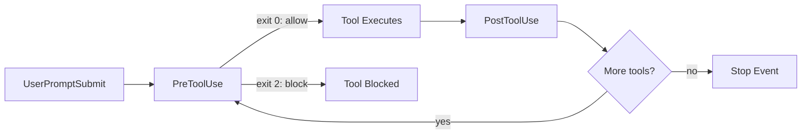

# Hooks Deep Dive

> Advanced hook patterns for pre/post tool use, validation, auto-formatting, security enforcement, and workflow automation.

---

## Table of Contents

- [Overview](#overview)
- [Hook Architecture](#hook-architecture)
- [All Lifecycle Events](#all-lifecycle-events)
- [Handler Types](#handler-types)
- [PreToolUse Patterns](#pretooluse-patterns)
- [PostToolUse Patterns](#posttooluse-patterns)
- [Other Event Patterns](#other-event-patterns)
- [Advanced Compositions](#advanced-compositions)
- [Debugging Hooks](#debugging-hooks)
- [Production Configurations](#production-configurations)

---

## Overview

Hooks are user-defined commands that execute automatically at specific points in Claude Code's lifecycle. They transform Claude Code from a conversational tool into a programmable automation platform.



---

## Hook Architecture

### Configuration Locations

| Location | Scope | Shared? |
|----------|-------|---------|
| `.claude/settings.json` | Project | Yes (version controlled) |
| `~/.claude/settings.json` | User (global) | No |

### Configuration Structure

```json
{
  "hooks": {
    "<EventName>": [
      {
        "matcher": "regex pattern for tool name",
        "hooks": [
          {
            "type": "command",
            "command": "shell command to execute"
          }
        ]
      }
    ]
  }
}
```

### Data Flow

Every hook receives a JSON payload on **stdin** with context about what triggered it:

```json
{
  "session_id": "abc123",
  "tool_name": "Write",
  "tool_input": {
    "file_path": "/path/to/file.ts",
    "content": "..."
  }
}
```

### Exit Codes

| Exit Code | Meaning | Effect |
|-----------|---------|--------|
| 0 | Success / Allow | Tool proceeds normally |
| 1 | Error | Hook error logged, tool still proceeds |
| 2 | Block (PreToolUse only) | Tool is blocked; stderr message sent to Claude |

---

## All Lifecycle Events

| Event | When It Fires | Common Uses |
|-------|--------------|-------------|
| **UserPromptSubmit** | Before a user prompt is processed | Input validation, logging, context injection |
| **PreToolUse** | Before any tool executes | Block dangerous ops, validate inputs, enforce policies |
| **PostToolUse** | After a tool succeeds | Auto-format, lint, test, log, notify |
| **Stop** | When the main agent completes | Summary generation, cleanup, notifications |
| **SubagentStop** | When a subagent completes | Aggregate subagent results |
| **PreCompact** | Before context compaction | Save important context |
| **PostCompact** | After context compaction | Restore critical context |
| **Notification** | When Claude sends a notification | Custom notification routing |

---

## Handler Types

### Command Handler

Runs a shell command. Most common and flexible.

```json
{
  "type": "command",
  "command": "npx prettier --write \"$CLAUDE_TOOL_INPUT_FILE_PATH\""
}
```

**Environment variables available:**
- `$CLAUDE_SESSION_ID` -- Current session ID
- `$CLAUDE_TOOL_NAME` -- Name of the tool being used
- `$CLAUDE_TOOL_INPUT_FILE_PATH` -- File path from tool input (if applicable)

### HTTP Handler

Sends the hook payload to an HTTP endpoint.

```json
{
  "type": "http",
  "url": "http://localhost:8080/hooks/post-tool",
  "method": "POST",
  "headers": {
    "Authorization": "Bearer ${HOOK_SECRET}"
  }
}
```

### Prompt Handler

Injects a prompt into Claude's context.

```json
{
  "type": "prompt",
  "prompt": "Before proceeding, verify that all new files have proper error handling."
}
```

### Agent Handler

Spawns a subagent to handle the hook.

```json
{
  "type": "agent",
  "prompt": "Review the changes just made and suggest improvements.",
  "model": "claude-sonnet-4-20250514"
}
```

---

## PreToolUse Patterns

### Pattern 1: Protect Sensitive Files

Block writes to files that should never be modified by Claude:

```json
{
  "hooks": {
    "PreToolUse": [
      {
        "matcher": "Write|Edit|MultiEdit",
        "hooks": [
          {
            "type": "command",
            "command": "python3 -c \"import json,sys; d=json.load(sys.stdin); p=d.get('tool_input',{}).get('file_path',''); blocked=['.env','.env.local','credentials.json','secrets.yaml','id_rsa','package-lock.json','yarn.lock','pnpm-lock.yaml']; matches=[b for b in blocked if p.endswith(b) or b in p]; sys.exit(2) if matches else sys.exit(0)\" 2>&1 || echo 'Blocked: This file is protected and cannot be modified by Claude.' >&2"
          }
        ]
      }
    ]
  }
}
```

### Pattern 2: Enforce Directory Boundaries

Prevent Claude from writing outside the project:

```json
{
  "hooks": {
    "PreToolUse": [
      {
        "matcher": "Write|Edit|MultiEdit",
        "hooks": [
          {
            "type": "command",
            "command": "python3 << 'PYEOF'\nimport json, sys, os\nd = json.load(sys.stdin)\np = d.get('tool_input', {}).get('file_path', '')\nproject_root = os.getcwd()\nresolved = os.path.realpath(p)\nif not resolved.startswith(project_root):\n    print(f'Blocked: {p} is outside the project directory', file=sys.stderr)\n    sys.exit(2)\nsys.exit(0)\nPYEOF"
          }
        ]
      }
    ]
  }
}
```

### Pattern 3: Block Dangerous Shell Commands

```json
{
  "hooks": {
    "PreToolUse": [
      {
        "matcher": "Bash",
        "hooks": [
          {
            "type": "command",
            "command": "python3 << 'PYEOF'\nimport json, sys, re\nd = json.load(sys.stdin)\ncmd = d.get('tool_input', {}).get('command', '')\ndangerous = [\n    r'rm\\s+-rf\\s+/',\n    r'rm\\s+-rf\\s+\\*',\n    r'chmod\\s+777',\n    r'curl.*\\|.*sh',\n    r'wget.*\\|.*sh',\n    r'dd\\s+if=',\n    r'mkfs\\.',\n    r':(){ :\\|:& };:',\n    r'> /dev/sda',\n    r'git\\s+push.*--force\\s+.*main',\n    r'git\\s+push.*--force\\s+.*master',\n    r'DROP\\s+DATABASE',\n    r'DROP\\s+TABLE',\n]\nfor pattern in dangerous:\n    if re.search(pattern, cmd, re.IGNORECASE):\n        print(f'Blocked: Dangerous command detected matching pattern: {pattern}', file=sys.stderr)\n        sys.exit(2)\nsys.exit(0)\nPYEOF"
          }
        ]
      }
    ]
  }
}
```

### Pattern 4: Require Test File for New Source Files

```json
{
  "hooks": {
    "PreToolUse": [
      {
        "matcher": "Write",
        "hooks": [
          {
            "type": "command",
            "command": "python3 << 'PYEOF'\nimport json, sys, os\nd = json.load(sys.stdin)\np = d.get('tool_input', {}).get('file_path', '')\n# Only check new source files, not test files\nif '/src/' in p and not '.test.' in p and not '.spec.' in p and p.endswith(('.ts', '.tsx', '.js', '.jsx')):\n    if not os.path.exists(p):  # Only new files\n        # Don't block, just warn Claude\n        print(f'Note: Creating new source file {p} - remember to create a corresponding test file.', file=sys.stderr)\nsys.exit(0)\nPYEOF"
          }
        ]
      }
    ]
  }
}
```

### Pattern 5: Git Branch Protection

```json
{
  "hooks": {
    "PreToolUse": [
      {
        "matcher": "Bash",
        "hooks": [
          {
            "type": "command",
            "command": "python3 << 'PYEOF'\nimport json, sys, subprocess, re\nd = json.load(sys.stdin)\ncmd = d.get('tool_input', {}).get('command', '')\n# Check if command is a git commit/push on protected branch\nif re.search(r'git\\s+(commit|push|merge|rebase)', cmd):\n    branch = subprocess.run(['git', 'branch', '--show-current'], capture_output=True, text=True).stdout.strip()\n    protected = ['main', 'master', 'production', 'release']\n    if branch in protected and 'push' in cmd:\n        print(f'Blocked: Cannot push directly to protected branch: {branch}', file=sys.stderr)\n        sys.exit(2)\nsys.exit(0)\nPYEOF"
          }
        ]
      }
    ]
  }
}
```

---

## PostToolUse Patterns

### Pattern 1: Auto-Format on File Write

```json
{
  "hooks": {
    "PostToolUse": [
      {
        "matcher": "Write|Edit|MultiEdit",
        "hooks": [
          {
            "type": "command",
            "command": "python3 << 'PYEOF'\nimport json, sys, subprocess, os\nd = json.load(sys.stdin)\np = d.get('tool_input', {}).get('file_path', '')\nif not p or not os.path.exists(p):\n    sys.exit(0)\next = os.path.splitext(p)[1]\nformatters = {\n    '.ts': 'npx prettier --write',\n    '.tsx': 'npx prettier --write',\n    '.js': 'npx prettier --write',\n    '.jsx': 'npx prettier --write',\n    '.json': 'npx prettier --write',\n    '.css': 'npx prettier --write',\n    '.scss': 'npx prettier --write',\n    '.md': 'npx prettier --write',\n    '.yaml': 'npx prettier --write',\n    '.yml': 'npx prettier --write',\n    '.py': 'python3 -m black',\n    '.go': 'gofmt -w',\n    '.rs': 'rustfmt',\n}\nformatter = formatters.get(ext)\nif formatter:\n    subprocess.run(f'{formatter} \"{p}\"', shell=True, capture_output=True)\nsys.exit(0)\nPYEOF"
          }
        ]
      }
    ]
  }
}
```

### Pattern 2: Auto-Lint After Write

```json
{
  "hooks": {
    "PostToolUse": [
      {
        "matcher": "Write|Edit|MultiEdit",
        "hooks": [
          {
            "type": "command",
            "command": "python3 << 'PYEOF'\nimport json, sys, subprocess, os\nd = json.load(sys.stdin)\np = d.get('tool_input', {}).get('file_path', '')\nif not p:\n    sys.exit(0)\next = os.path.splitext(p)[1]\nif ext in ('.ts', '.tsx', '.js', '.jsx'):\n    result = subprocess.run(\n        ['npx', 'eslint', '--no-error-on-unmatched-pattern', '--format', 'compact', p],\n        capture_output=True, text=True\n    )\n    if result.stdout.strip():\n        # Output lint issues so Claude sees them\n        print(result.stdout, file=sys.stderr)\nelif ext == '.py':\n    result = subprocess.run(\n        ['python3', '-m', 'ruff', 'check', p, '--output-format', 'concise'],\n        capture_output=True, text=True\n    )\n    if result.stdout.strip():\n        print(result.stdout, file=sys.stderr)\nsys.exit(0)\nPYEOF"
          }
        ]
      }
    ]
  }
}
```

### Pattern 3: Run Related Tests After Changes

```json
{
  "hooks": {
    "PostToolUse": [
      {
        "matcher": "Write|Edit|MultiEdit",
        "hooks": [
          {
            "type": "command",
            "command": "python3 << 'PYEOF'\nimport json, sys, subprocess, os\nd = json.load(sys.stdin)\np = d.get('tool_input', {}).get('file_path', '')\nif not p:\n    sys.exit(0)\n\n# Find corresponding test file\nbase = os.path.splitext(p)[0]\next = os.path.splitext(p)[1]\ntest_patterns = [\n    f'{base}.test{ext}',\n    f'{base}.spec{ext}',\n    f'{base}_test{ext}',\n    p.replace('/src/', '/tests/').replace(ext, f'.test{ext}'),\n]\n\nfor test_file in test_patterns:\n    if os.path.exists(test_file):\n        result = subprocess.run(\n            ['npx', 'jest', '--bail', '--no-coverage', test_file],\n            capture_output=True, text=True, timeout=60\n        )\n        if result.returncode != 0:\n            print(f'Tests failed for {test_file}:\\n{result.stdout[-500:]}', file=sys.stderr)\n        else:\n            print(f'Tests passed for {test_file}', file=sys.stderr)\n        break\nsys.exit(0)\nPYEOF"
          }
        ]
      }
    ]
  }
}
```

### Pattern 4: Changelog Auto-Append

```json
{
  "hooks": {
    "PostToolUse": [
      {
        "matcher": "Write|Edit|MultiEdit",
        "hooks": [
          {
            "type": "command",
            "command": "python3 << 'PYEOF'\nimport json, sys, os\nfrom datetime import datetime, timezone\nd = json.load(sys.stdin)\np = d.get('tool_input', {}).get('file_path', '')\nchangelog = 'claudefiles/changelog.md'\n# Don't log changes to the changelog itself\nif not p or changelog in p:\n    sys.exit(0)\ntimestamp = datetime.now(timezone.utc).strftime('%Y-%m-%dT%H:%M:%SZ')\nentry = f'| {timestamp} | Claude | Modified `{os.path.basename(p)}` | - |\\n'\nif os.path.exists(changelog):\n    with open(changelog, 'a') as f:\n        f.write(entry)\nsys.exit(0)\nPYEOF"
          }
        ]
      }
    ]
  }
}
```

### Pattern 5: Type Check After TypeScript Changes

```json
{
  "hooks": {
    "PostToolUse": [
      {
        "matcher": "Write|Edit|MultiEdit",
        "hooks": [
          {
            "type": "command",
            "command": "python3 << 'PYEOF'\nimport json, sys, subprocess, os\nd = json.load(sys.stdin)\np = d.get('tool_input', {}).get('file_path', '')\nif p and p.endswith(('.ts', '.tsx')):\n    result = subprocess.run(\n        ['npx', 'tsc', '--noEmit', '--pretty'],\n        capture_output=True, text=True, timeout=60\n    )\n    if result.returncode != 0:\n        # Only show errors related to the changed file\n        errors = [l for l in result.stdout.split('\\n') if os.path.basename(p) in l]\n        if errors:\n            print('\\n'.join(errors[:10]), file=sys.stderr)\nsys.exit(0)\nPYEOF"
          }
        ]
      }
    ]
  }
}
```

---

## Other Event Patterns

### UserPromptSubmit: Input Logging

```json
{
  "hooks": {
    "UserPromptSubmit": [
      {
        "matcher": "",
        "hooks": [
          {
            "type": "command",
            "command": "python3 << 'PYEOF'\nimport json, sys, os\nfrom datetime import datetime, timezone\nd = json.load(sys.stdin)\nprompt = d.get('prompt', '')\nts = datetime.now(timezone.utc).strftime('%Y-%m-%dT%H:%M:%SZ')\nlog_dir = 'learning/sessions'\nos.makedirs(log_dir, exist_ok=True)\nlog_file = os.path.join(log_dir, f'{datetime.now().strftime(\"%Y-%m-%d\")}_session.md')\nwith open(log_file, 'a') as f:\n    f.write(f'\\n### {ts}\\n\\n**Prompt:** {prompt[:500]}\\n\\n')\nsys.exit(0)\nPYEOF"
          }
        ]
      }
    ]
  }
}
```

### Stop: Session Summary

```json
{
  "hooks": {
    "Stop": [
      {
        "matcher": "",
        "hooks": [
          {
            "type": "command",
            "command": "python3 << 'PYEOF'\nimport subprocess, json, sys\n# Get files changed in this session\nresult = subprocess.run(['git', 'diff', '--name-only', 'HEAD'], capture_output=True, text=True)\nchanged = result.stdout.strip()\nif changed:\n    print(f'Session complete. Files changed:\\n{changed}', file=sys.stderr)\nsys.exit(0)\nPYEOF"
          }
        ]
      }
    ]
  }
}
```

### Notification: Custom Routing

```json
{
  "hooks": {
    "Notification": [
      {
        "matcher": "",
        "hooks": [
          {
            "type": "command",
            "command": "python3 << 'PYEOF'\nimport json, sys, subprocess\nd = json.load(sys.stdin)\nmsg = d.get('message', '')\n# Send to macOS notification center\nsubprocess.run(['osascript', '-e', f'display notification \"{msg}\" with title \"Claude Code\"'])\nsys.exit(0)\nPYEOF"
          }
        ]
      }
    ]
  }
}
```

---

## Advanced Compositions

### Composition 1: Full Development Workflow

Combine multiple hooks for a complete development workflow:

```json
{
  "hooks": {
    "PreToolUse": [
      {
        "matcher": "Write|Edit|MultiEdit",
        "hooks": [
          {
            "type": "command",
            "command": "python3 -c \"import json,sys; d=json.load(sys.stdin); p=d.get('tool_input',{}).get('file_path',''); blocked=['.env','.env.local','package-lock.json']; sys.exit(2) if any(p.endswith(b) for b in blocked) else sys.exit(0)\""
          }
        ]
      },
      {
        "matcher": "Bash",
        "hooks": [
          {
            "type": "command",
            "command": "python3 -c \"import json,sys,re; d=json.load(sys.stdin); cmd=d.get('tool_input',{}).get('command',''); sys.exit(2) if re.search(r'rm\\s+-rf\\s+/', cmd) else sys.exit(0)\""
          }
        ]
      }
    ],
    "PostToolUse": [
      {
        "matcher": "Write|Edit|MultiEdit",
        "hooks": [
          {
            "type": "command",
            "command": "npx prettier --write \"$CLAUDE_TOOL_INPUT_FILE_PATH\" 2>/dev/null; exit 0"
          }
        ]
      }
    ],
    "Stop": [
      {
        "matcher": "",
        "hooks": [
          {
            "type": "command",
            "command": "echo 'Session complete' && git diff --stat"
          }
        ]
      }
    ]
  }
}
```

### Composition 2: Security-First Configuration

For projects with strict security requirements:

```json
{
  "hooks": {
    "PreToolUse": [
      {
        "matcher": "Write|Edit|MultiEdit",
        "hooks": [
          {
            "type": "command",
            "command": "python3 << 'PYEOF'\nimport json, sys, re, os\nd = json.load(sys.stdin)\np = d.get('tool_input', {}).get('file_path', '')\ncontent = d.get('tool_input', {}).get('content', '') or d.get('tool_input', {}).get('new_string', '')\n\n# Block sensitive files\nblocked_patterns = [r'\\.env', r'secrets', r'credentials', r'\\.(pem|key|cert)$', r'id_rsa']\nfor pattern in blocked_patterns:\n    if re.search(pattern, p, re.IGNORECASE):\n        print(f'Blocked: Cannot modify sensitive file matching {pattern}', file=sys.stderr)\n        sys.exit(2)\n\n# Scan content for secrets\nsecret_patterns = [\n    r'(?:api[_-]?key|apikey)\\s*[=:]\\s*[\"\\'][A-Za-z0-9]{20,}',\n    r'(?:password|passwd|pwd)\\s*[=:]\\s*[\"\\'][^\"\\']+ ',\n    r'(?:secret|token)\\s*[=:]\\s*[\"\\'][A-Za-z0-9]{20,}',\n    r'-----BEGIN (?:RSA |EC )?PRIVATE KEY-----',\n    r'sk-[A-Za-z0-9]{20,}',\n    r'ghp_[A-Za-z0-9]{36}',\n    r'AKIA[0-9A-Z]{16}',\n]\nfor pattern in secret_patterns:\n    if re.search(pattern, content, re.IGNORECASE):\n        print(f'Blocked: Content appears to contain a secret or credential', file=sys.stderr)\n        sys.exit(2)\n\nsys.exit(0)\nPYEOF"
          }
        ]
      },
      {
        "matcher": "Bash",
        "hooks": [
          {
            "type": "command",
            "command": "python3 << 'PYEOF'\nimport json, sys, re\nd = json.load(sys.stdin)\ncmd = d.get('tool_input', {}).get('command', '')\n# Block network access to unknown hosts\nif re.search(r'curl|wget|nc\\s|netcat', cmd) and not re.search(r'localhost|127\\.0\\.0\\.1|::1', cmd):\n    print('Blocked: External network access requires explicit approval', file=sys.stderr)\n    sys.exit(2)\n# Block package installation\nif re.search(r'npm install|pip install|gem install|cargo install', cmd) and '--save' not in cmd and '-S' not in cmd:\n    print('Note: Installing packages without saving to manifest', file=sys.stderr)\nsys.exit(0)\nPYEOF"
          }
        ]
      }
    ]
  }
}
```

### Composition 3: Team Collaboration Hooks

Hooks that help teams work together:

```json
{
  "hooks": {
    "PostToolUse": [
      {
        "matcher": "Write|Edit|MultiEdit",
        "hooks": [
          {
            "type": "command",
            "command": "python3 << 'PYEOF'\nimport json, sys, subprocess, os\nd = json.load(sys.stdin)\np = d.get('tool_input', {}).get('file_path', '')\nif not p:\n    sys.exit(0)\n\n# Check if file has CODEOWNERS\nif os.path.exists('.github/CODEOWNERS'):\n    with open('.github/CODEOWNERS') as f:\n        for line in f:\n            line = line.strip()\n            if line and not line.startswith('#'):\n                parts = line.split()\n                pattern = parts[0]\n                owners = parts[1:]\n                # Simple glob matching\n                if pattern.replace('*', '') in p:\n                    print(f'Note: {p} is owned by {\" \".join(owners)}', file=sys.stderr)\n                    break\nsys.exit(0)\nPYEOF"
          }
        ]
      }
    ]
  }
}
```

---

## Debugging Hooks

### Enable Verbose Logging

```bash
# Set environment variable for verbose hook output
CLAUDE_HOOK_DEBUG=1 claude
```

### Test a Hook Manually

```bash
# Simulate a PreToolUse event
echo '{"tool_name": "Write", "tool_input": {"file_path": "/path/to/.env", "content": "SECRET=abc"}}' | python3 -c "
import json, sys
d = json.load(sys.stdin)
p = d.get('tool_input', {}).get('file_path', '')
blocked = ['.env']
if any(p.endswith(b) for b in blocked):
    print(f'Blocked: {p}', file=sys.stderr)
    sys.exit(2)
sys.exit(0)
"
echo "Exit code: $?"
```

### Common Issues

| Problem | Cause | Fix |
|---------|-------|-----|
| Hook not firing | Wrong matcher regex | Test regex against tool name with `echo "Write" \| grep -E "your_pattern"` |
| Hook errors ignored | Exit code 1 (error) doesn't block | Use exit code 2 to block, 0 to allow |
| Slow hooks | Hook takes too long | Add timeouts, use async hooks for non-blocking |
| Stdin not available | Hook doesn't read stdin | Always `json.load(sys.stdin)` in Python hooks |
| Path issues | Relative paths in commands | Use absolute paths or `$CLAUDE_TOOL_INPUT_FILE_PATH` |

---

## Production Configurations

### Minimal Safe Configuration

For any project, this is a good starting point:

```json
{
  "hooks": {
    "PreToolUse": [
      {
        "matcher": "Write|Edit|MultiEdit",
        "hooks": [
          {
            "type": "command",
            "command": "python3 -c \"import json,sys; d=json.load(sys.stdin); p=d.get('tool_input',{}).get('file_path',''); sys.exit(2) if any(x in p for x in ['.env','lock.json','lock.yaml','.git/']) else sys.exit(0)\""
          }
        ]
      }
    ],
    "PostToolUse": [
      {
        "matcher": "Write|Edit|MultiEdit",
        "hooks": [
          {
            "type": "command",
            "command": "npx prettier --write \"$CLAUDE_TOOL_INPUT_FILE_PATH\" 2>/dev/null || true"
          }
        ]
      }
    ]
  }
}
```

### Full Development Configuration

```json
{
  "hooks": {
    "PreToolUse": [
      {
        "matcher": "Write|Edit|MultiEdit",
        "hooks": [
          {
            "type": "command",
            "command": "python3 -c \"import json,sys; d=json.load(sys.stdin); p=d.get('tool_input',{}).get('file_path',''); blocked=['.env','.env.local','.env.production','package-lock.json','yarn.lock','pnpm-lock.yaml','.git/']; sys.exit(2) if any(b in p for b in blocked) else sys.exit(0)\""
          }
        ]
      },
      {
        "matcher": "Bash",
        "hooks": [
          {
            "type": "command",
            "command": "python3 -c \"import json,sys,re; d=json.load(sys.stdin); c=d.get('tool_input',{}).get('command',''); patterns=[r'rm\\s+-rf\\s+/',r'chmod\\s+777',r'> /dev/',r'DROP\\s+DATABASE']; sys.exit(2) if any(re.search(p,c,re.I) for p in patterns) else sys.exit(0)\""
          }
        ]
      }
    ],
    "PostToolUse": [
      {
        "matcher": "Write|Edit|MultiEdit",
        "hooks": [
          {
            "type": "command",
            "command": "python3 << 'PYEOF'\nimport json, sys, subprocess, os\nd = json.load(sys.stdin)\np = d.get('tool_input', {}).get('file_path', '')\nif not p or not os.path.exists(p):\n    sys.exit(0)\next = os.path.splitext(p)[1]\n# Format\nif ext in ('.ts','.tsx','.js','.jsx','.json','.css','.md','.yaml','.yml'):\n    subprocess.run(['npx','prettier','--write',p], capture_output=True, timeout=10)\nelif ext == '.py':\n    subprocess.run(['python3','-m','black','-q',p], capture_output=True, timeout=10)\n# Lint (non-blocking)\nif ext in ('.ts','.tsx','.js','.jsx'):\n    r = subprocess.run(['npx','eslint','--format','compact',p], capture_output=True, text=True, timeout=15)\n    if r.stdout.strip():\n        print(r.stdout[:500], file=sys.stderr)\nsys.exit(0)\nPYEOF"
          }
        ]
      }
    ],
    "Stop": [
      {
        "matcher": "",
        "hooks": [
          {
            "type": "command",
            "command": "git diff --stat 2>/dev/null"
          }
        ]
      }
    ]
  }
}
```

---

## Sources

- [Hooks Reference - Claude Code Docs](https://code.claude.com/docs/en/hooks)
- [Claude Code Hooks: PreToolUse, PostToolUse & All Events](https://www.pixelmojo.io/blogs/claude-code-hooks-production-quality-ci-cd-patterns)
- [Claude Code Hooks: A Practical Guide (2026)](https://www.eesel.ai/blog/hooks-in-claude-code)
- [Claude Code Hook Examples - Steve Kinney](https://stevekinney.com/courses/ai-development/claude-code-hook-examples)
- [Claude Code Hooks Tutorial: 5 Production Hooks](https://blakecrosley.com/blog/claude-code-hooks-tutorial)
- [Claude Code Hooks Complete Guide (2026)](https://smartscope.blog/en/generative-ai/claude/claude-code-hooks-guide/)
- [Claude Code Hooks - DataCamp](https://www.datacamp.com/tutorial/claude-code-hooks)
