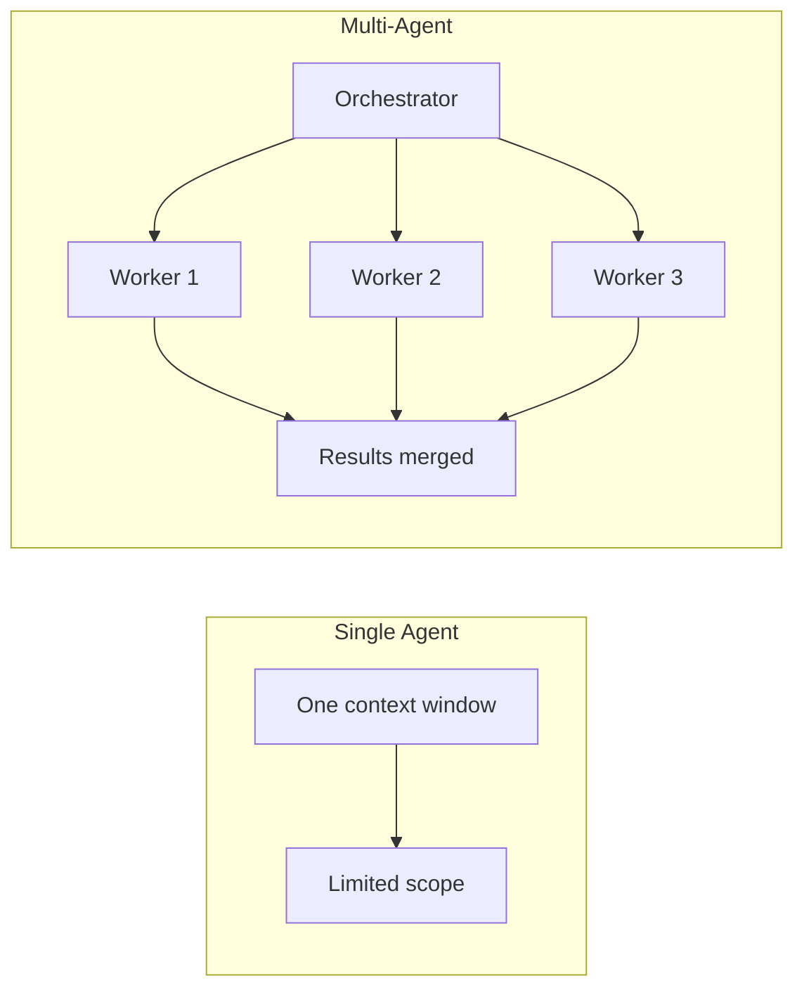
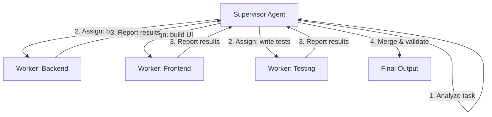
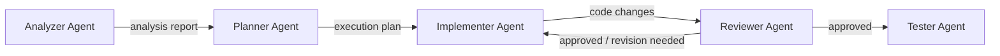
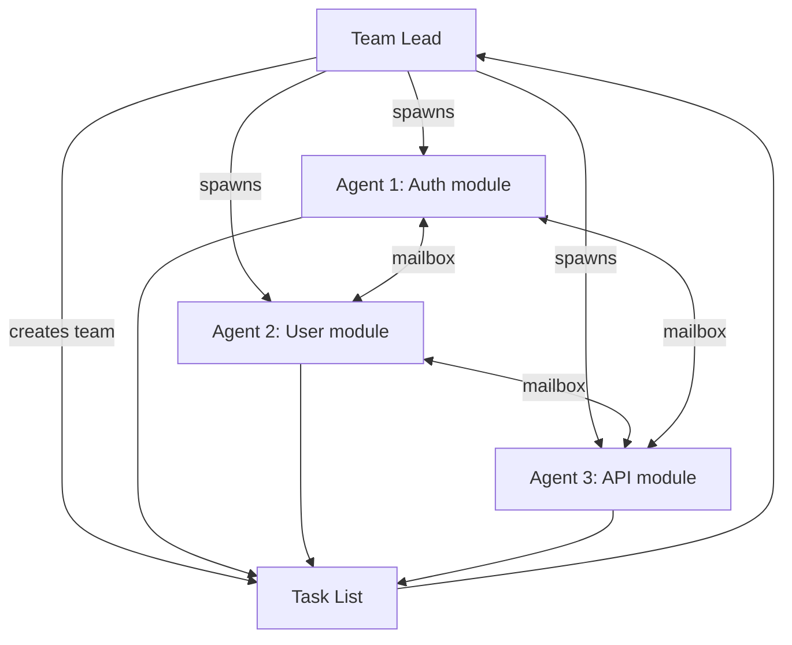
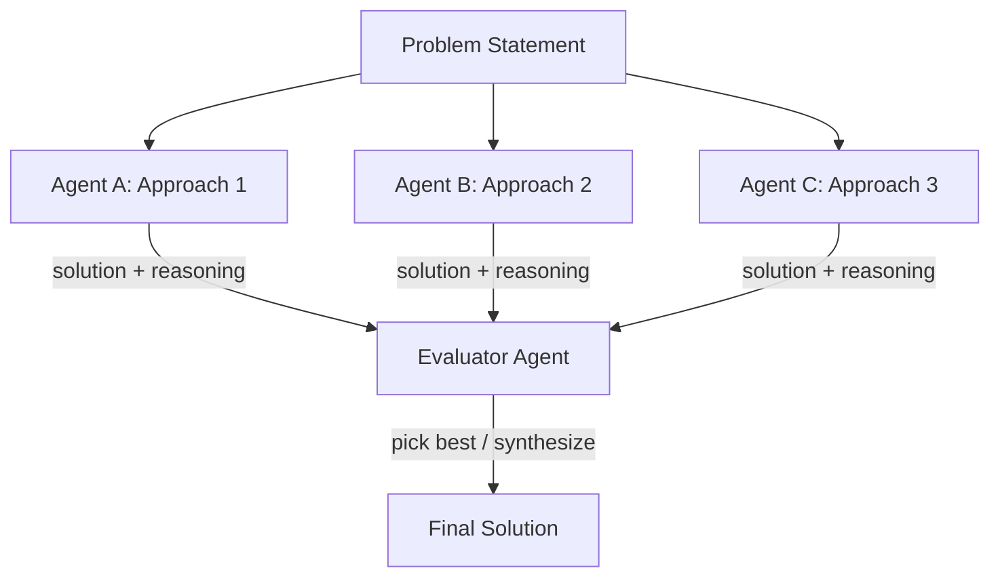
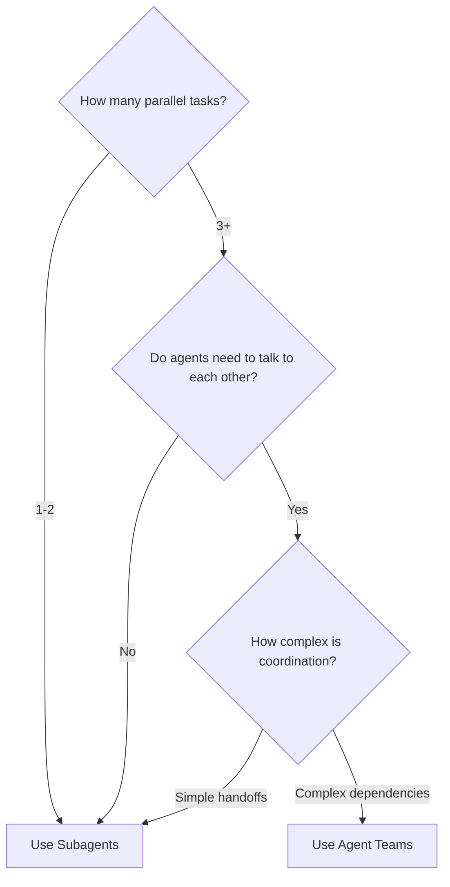

# Multi-Agent Orchestration

> Patterns for coordinating multiple AI agents: supervisor, pipeline, swarm, and debate architectures.

---

## Table of Contents

- [Overview](#overview)
- [Pattern 1: Supervisor (Orchestrator-Worker)](#pattern-1-supervisor-orchestrator-worker)
- [Pattern 2: Pipeline](#pattern-2-pipeline)
- [Pattern 3: Swarm](#pattern-3-swarm)
- [Pattern 4: Debate (Evaluator-Optimizer)](#pattern-4-debate-evaluator-optimizer)
- [Agent Teams (Built-in)](#agent-teams-built-in)
- [Subagents vs Agent Teams](#subagents-vs-agent-teams)
- [Practical Examples](#practical-examples)
- [Anti-Patterns](#anti-patterns)

---

## Overview

When a task exceeds what a single Claude Code session can handle -- large refactors, cross-service changes, research-heavy features -- you need multiple agents working in coordination.



### When to Go Multi-Agent

| Scenario | Single Agent | Multi-Agent |
|----------|-------------|-------------|
| Fix a bug in one file | Yes | Overkill |
| Refactor across 5-10 files | Usually | Sometimes |
| Full-stack feature (API + UI + tests + docs) | Struggling | Yes |
| Competing hypotheses for a bug | No | Yes (debate) |
| Migration across 50+ files | No | Yes (pipeline/swarm) |

---

## Pattern 1: Supervisor (Orchestrator-Worker)

The orchestrator decomposes a task, assigns subtasks to workers, and merges results. This is the most common and battle-tested pattern.



### Skill Definition: Supervisor Agent

Create `.claude/skills/supervisor.md`:

```markdown
---
name: supervisor
description: Orchestrate a multi-agent task by decomposing it into subtasks, assigning to workers, and merging results
context: fork
allowed-tools:
  - Read
  - Write
  - Edit
  - Bash
  - Glob
  - Grep
  - Agent
---

# Supervisor Agent

You are the supervisor for a multi-agent task.

## Process

1. **Analyze** the user's request and break it into independent subtasks
2. **Assign** each subtask to a subagent with clear instructions:
   - What files to work on
   - What the expected output is
   - What constraints apply
3. **Wait** for all subagents to complete
4. **Review** each result for correctness and consistency
5. **Merge** results, resolving any conflicts
6. **Validate** the final output (run tests, lint, etc.)

## Rules

- Each subagent gets a focused, bounded task
- Never assign overlapping file modifications to different agents
- If a subagent fails, diagnose and retry with refined instructions
- Always run validation after merging
```

### Implementation with Subagents

```markdown
<!-- In your prompt to Claude Code -->
Use the supervisor pattern to implement a new user authentication feature:

1. Spawn a subagent for the backend API routes (src/api/auth/)
2. Spawn a subagent for the database schema and migrations (src/db/)
3. Spawn a subagent for the frontend login components (src/ui/auth/)
4. Spawn a subagent for integration tests (tests/auth/)

Each agent should work on its own files. After all complete, verify the integration by running the test suite.
```

---

## Pattern 2: Pipeline

Tasks flow sequentially through specialized agents. Each agent's output is the next agent's input.



### Skill Definition: Pipeline Coordinator

Create `.claude/skills/pipeline.md`:

```markdown
---
name: pipeline
description: Run a sequential pipeline of specialized agents where each stage feeds the next
context: fork
allowed-tools:
  - Read
  - Write
  - Edit
  - Bash
  - Agent
---

# Pipeline Coordinator

You coordinate a sequential pipeline of specialized agents.

## Pipeline Stages

For each stage:
1. Prepare the input context (previous stage output + relevant files)
2. Spawn a subagent with stage-specific instructions
3. Capture and validate the output
4. Pass validated output to the next stage

## Error Handling

- If a stage fails, do NOT proceed to the next stage
- Diagnose the failure and retry the stage with refined instructions
- After 2 retries, escalate to the user with a summary of what went wrong

## Output

After all stages complete, produce a summary:
- What each stage did
- Any issues encountered and how they were resolved
- Final validation results
```

### Example: Code Review Pipeline

```bash
# Stage 1: Static analysis agent reads the diff and flags issues
# Stage 2: Security review agent checks for vulnerabilities
# Stage 3: Performance review agent checks for bottlenecks
# Stage 4: Summary agent consolidates all findings into a report
```

Prompt:

```
Run a pipeline review on the changes in this PR branch:

Stage 1 - Static Analysis: Read all changed files, flag code smells, complexity issues, naming problems
Stage 2 - Security: Check for SQL injection, XSS, auth bypass, secret leaks, insecure deps
Stage 3 - Performance: Flag N+1 queries, missing indexes, unnecessary re-renders, large payloads
Stage 4 - Report: Consolidate all findings into a structured markdown report in review_report.md
```

---

## Pattern 3: Swarm

Multiple agents work independently on the same problem space, communicating through shared artifacts (files, task lists, messages). Best for large-scale changes with minimal interdependence.



### Using Claude Code Agent Teams

Agent Teams is Claude Code's built-in swarm orchestrator. Enable it:

```bash
# Enable the experimental agent teams feature
claude config set agentTeams true
```

Then in Claude Code:

```
Create a team to implement the payment processing module:

Team lead task: Coordinate implementation of Stripe payment integration

Teammates:
1. Backend agent: Implement payment API routes in src/api/payments/
2. Database agent: Create payment tables and migrations in src/db/
3. Frontend agent: Build checkout UI components in src/ui/checkout/
4. Test agent: Write integration tests in tests/payments/

Use the task list to track dependencies. The database agent should complete schema first, then backend and frontend can work in parallel, then tests run last.
```

### Key Agent Teams Concepts

| Concept | Description |
|---------|-------------|
| **Team Lead** | The coordinating session that spawns teammates and manages the task list |
| **Teammates** | Independent Claude Code instances, each with their own 1M-token context |
| **Task List** | Shared work items with dependency tracking and auto-unblocking |
| **Mailbox** | Inbox-based messaging for direct agent-to-agent communication |

### Limitations

- Teammates cannot spawn sub-teams (no nesting -- prevents exponential cost)
- Teammates have ~20 tools vs 25 for standalone subagents (no Agent, TeamCreate, etc.)
- Communication overhead increases with team size -- keep teams to 3-5 agents

---

## Pattern 4: Debate (Evaluator-Optimizer)

Two or more agents propose competing solutions. An evaluator agent picks the best approach or synthesizes a hybrid.



### Skill Definition: Debate Coordinator

Create `.claude/skills/debate.md`:

```markdown
---
name: debate
description: Have multiple agents propose competing solutions, then evaluate and select the best approach
context: fork
allowed-tools:
  - Read
  - Write
  - Bash
  - Agent
---

# Debate Coordinator

You coordinate a debate between multiple agents to find the best solution.

## Process

1. **Frame the problem** clearly, including constraints and success criteria
2. **Spawn 2-3 agents**, each instructed to take a different approach:
   - Agent A: Optimize for simplicity
   - Agent B: Optimize for performance
   - Agent C: Optimize for extensibility
3. **Collect proposals** from each agent (code + written reasoning)
4. **Evaluate** each proposal against the stated criteria
5. **Select or synthesize** the best approach
6. **Document** the decision and reasoning in the decisions log

## Evaluation Criteria Template

- Correctness: Does it solve the problem?
- Simplicity: How easy is it to understand and maintain?
- Performance: What are the runtime characteristics?
- Extensibility: How easy is it to extend for future requirements?
- Test coverage: Is it testable and tested?
```

### Example: Architecture Decision

```
Use the debate pattern to decide the best approach for our caching layer:

Agent A: Redis-based caching with TTL expiration
Agent B: In-memory LRU cache with write-through
Agent C: CDN edge caching with stale-while-revalidate

Constraints:
- Must handle 10k requests/second
- Data staleness tolerance: 30 seconds
- Budget: minimize infrastructure cost
- Must work with our existing Express.js API

Evaluate all three and pick the best fit, or propose a hybrid.
```

---

## Subagents vs Agent Teams

| Feature | Subagents | Agent Teams |
|---------|-----------|-------------|
| Communication | Report back to parent only | Direct agent-to-agent messaging |
| Context | Share parent's context window | Each gets own 1M-token context |
| Coordination | Parent manages everything | Self-coordinating via task list |
| Best for | Quick, focused subtasks | Complex, interdependent work |
| Nesting | Can spawn sub-subagents | Cannot spawn sub-teams |
| Cost | Lower (shared context) | Higher (separate contexts) |

### Decision Guide



---

## Practical Examples

### Example 1: Full-Stack Feature with Worktrees

```bash
# Create isolated worktrees for parallel work
git worktree add ../feature-backend feature/backend
git worktree add ../feature-frontend feature/frontend
git worktree add ../feature-tests feature/tests

# Run Claude Code in each worktree (separate terminals)
# Terminal 1:
cd ../feature-backend && claude "Implement the REST API for user profiles in src/api/users/"

# Terminal 2:
cd ../feature-frontend && claude "Build the profile page components in src/components/profile/"

# Terminal 3:
cd ../feature-tests && claude "Write integration tests for the user profile feature"

# After all complete, merge branches
git checkout main
git merge feature/backend feature/frontend feature/tests
```

### Example 2: Bug Investigation with Debate

```
I'm seeing intermittent 500 errors on the /api/orders endpoint.

Use the debate pattern with 3 competing hypotheses:
- Agent A: Investigate database connection pool exhaustion
- Agent B: Investigate race conditions in order processing
- Agent C: Investigate memory leaks in the caching layer

Each agent should gather evidence, propose a root cause, and suggest a fix.
Then evaluate which hypothesis best explains the symptoms.
```

### Example 3: Large Migration with Swarm

```
We need to migrate from Express.js to Fastify across 47 route files.

Create an agent team:
1. Scout agent: Analyze all route files and create a migration plan
2. Migration agents (3): Each takes ~15 route files and converts them
3. Test agent: Run the test suite after each batch and report failures
4. Integration agent: Verify all routes work end-to-end after migration
```

---

## Anti-Patterns

| Anti-Pattern | Problem | Fix |
|-------------|---------|-----|
| **Overlapping file edits** | Two agents modify the same file, creating conflicts | Partition work by file/directory boundaries |
| **God orchestrator** | Supervisor does most of the work itself | Keep supervisor lightweight -- only decompose, assign, merge |
| **Too many agents** | Communication overhead exceeds benefit | Limit to 3-5 agents; use pipeline for sequential work |
| **No validation** | Agents produce inconsistent outputs that break when merged | Always run tests/lint after merging |
| **Missing context** | Workers lack information to complete their task | Provide each worker with explicit file paths, interfaces, and constraints |
| **Nested teams** | Spawning teams within teams | Flat structure only; use task dependencies instead |

---

## Sources

- [Claude Code Agent Teams Docs](https://code.claude.com/docs/en/agent-teams)
- [Multi-Agent Orchestration: 4 Patterns That Actually Work](https://www.heyuan110.com/posts/ai/2026-02-26-multi-agent-orchestration/)
- [From Tasks to Swarms: Agent Teams in Claude Code](https://alexop.dev/posts/from-tasks-to-swarms-agent-teams-in-claude-code/)
- [Claude Code Swarm Orchestration Skill](https://gist.github.com/kieranklaassen/4f2aba89594a4aea4ad64d753984b2ea)
- [Claude Code Agent Teams: Complete Guide 2026](https://claudefa.st/blog/guide/agents/agent-teams)
