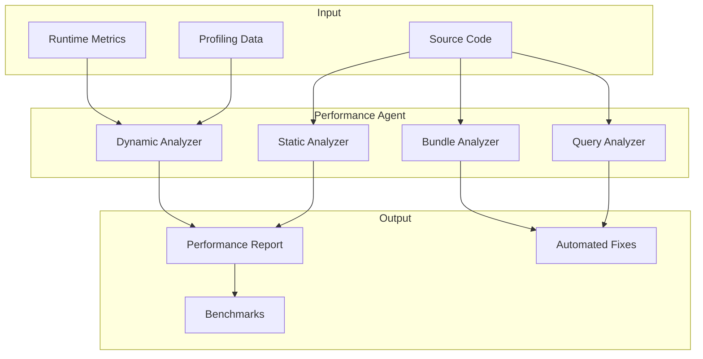

# Performance Optimization Agent

> An AI agent for profiling, bottleneck detection, and automated optimization suggestions.

---

## Table of Contents

- [Overview](#overview)
- [Agent Architecture](#agent-architecture)
- [Skill Definitions](#skill-definitions)
- [Profiling Workflows](#profiling-workflows)
- [Bottleneck Detection Patterns](#bottleneck-detection-patterns)
- [Optimization Strategies](#optimization-strategies)
- [Language-Specific Guides](#language-specific-guides)
- [Continuous Performance Monitoring](#continuous-performance-monitoring)

---

## Overview

The Performance Agent analyzes your codebase for performance issues at multiple levels: algorithmic complexity, I/O patterns, memory usage, database queries, and frontend rendering.



---

## Agent Architecture

The Performance Agent consists of specialized sub-skills that can be composed:

| Sub-Skill | Focus | Input |
|-----------|-------|-------|
| **Static Analyzer** | Code patterns, complexity, anti-patterns | Source code |
| **Query Analyzer** | N+1 queries, missing indexes, slow queries | ORM code + SQL logs |
| **Bundle Analyzer** | JS bundle size, tree-shaking, code splitting | Build output |
| **Memory Analyzer** | Leaks, excessive allocation, GC pressure | Heap snapshots |
| **API Analyzer** | Response times, payload sizes, caching | API routes + logs |

---

## Skill Definitions

### Master Performance Skill

Create `.claude/skills/perf-audit.md`:

```markdown
---
name: perf-audit
description: Run a comprehensive performance audit of the codebase, identifying bottlenecks and suggesting optimizations
allowed-tools:
  - Read
  - Bash
  - Glob
  - Grep
  - Agent
---

# Performance Audit

You are a performance optimization specialist. Analyze the codebase systematically.

## Audit Steps

### 1. Algorithmic Complexity

Scan for common O(n^2) or worse patterns:
- Nested loops over the same or related collections
- Repeated array searches inside loops (`array.find()` / `array.includes()` in loop)
- String concatenation in loops (instead of array join)
- Repeated DOM queries in loops
- Recursive functions without memoization

### 2. Database & Query Performance

Scan ORM/query code for:
- **N+1 queries**: Loop that triggers a query per iteration
- **Missing eager loading**: Related data loaded lazily in loops
- **Missing indexes**: Columns used in WHERE/JOIN but not indexed
- **SELECT ***: Fetching all columns when only a few are needed
- **Unbounded queries**: No LIMIT on potentially large result sets

### 3. Memory & Resource Usage

Look for:
- Event listeners not cleaned up (memory leaks)
- Large objects held in closures
- Unbounded caches or maps
- Large file reads into memory (vs streaming)
- Missing connection pool limits

### 4. I/O Patterns

Check for:
- Sequential async calls that could be parallel (`await a; await b` -> `Promise.all`)
- Missing request deduplication
- Redundant file system reads
- Missing HTTP caching headers

### 5. Frontend-Specific (if applicable)

- Unnecessary re-renders (missing React.memo, useMemo, useCallback)
- Large bundle imports (importing entire library for one function)
- Missing code splitting on routes
- Unoptimized images
- Layout thrashing (reading then writing DOM in loops)

## Output Format

For each finding:

| Field | Content |
|-------|---------|
| **Location** | File path and line number(s) |
| **Severity** | Critical / High / Medium / Low |
| **Category** | Algorithm / Database / Memory / I/O / Frontend |
| **Issue** | What the problem is |
| **Impact** | Estimated performance impact |
| **Fix** | Concrete code change to resolve it |
| **Effort** | Easy / Medium / Hard |

Sort findings by severity (Critical first), then by effort (Easy first -- quick wins on top).
```

### Query Performance Skill

Create `.claude/skills/perf-queries.md`:

```markdown
---
name: perf-queries
description: Analyze database queries for N+1 problems, missing indexes, and slow query patterns
allowed-tools:
  - Read
  - Bash
  - Glob
  - Grep
---

# Query Performance Analyzer

## Analysis Process

1. **Find all query locations**:
   ```
   Search for: .findMany, .findAll, .query(, .execute(, .raw(,
   Model.find, Model.where, SELECT, db.
   ```

2. **Detect N+1 patterns**:
   Look for any query executed inside a loop, map, or forEach:
   ```typescript
   // BAD: N+1
   const users = await User.findAll();
   for (const user of users) {
     const posts = await Post.findAll({ where: { userId: user.id } });
   }

   // GOOD: Eager loading
   const users = await User.findAll({ include: [Post] });

   // GOOD: Batch query
   const users = await User.findAll();
   const posts = await Post.findAll({
     where: { userId: users.map(u => u.id) }
   });
   ```

3. **Check index coverage**:
   - Extract all WHERE, JOIN ON, ORDER BY columns
   - Compare against existing indexes (read migration files or schema)
   - Flag unindexed columns used in queries on large tables

4. **Identify slow patterns**:
   - LIKE '%prefix%' (can't use index)
   - OR conditions on different columns
   - Subqueries that could be JOINs
   - COUNT(*) on large tables without WHERE
   - Missing pagination (no LIMIT/OFFSET)

## Output

Generate a markdown table:

| File:Line | Query Pattern | Issue | Suggested Fix | Priority |
|-----------|--------------|-------|---------------|----------|
```

### Bundle Size Skill

Create `.claude/skills/perf-bundle.md`:

```markdown
---
name: perf-bundle
description: Analyze JavaScript bundle size and suggest optimizations
allowed-tools:
  - Read
  - Bash
  - Glob
  - Grep
---

# Bundle Size Analyzer

## Analysis

1. **Run build with analysis**:
   ```bash
   # Webpack
   npx webpack --profile --json > stats.json
   npx webpack-bundle-analyzer stats.json --mode static --report report.html

   # Vite
   npx vite build --report

   # Next.js
   ANALYZE=true npx next build
   ```

2. **Check imports for tree-shaking issues**:
   ```
   # BAD: imports entire library
   import _ from 'lodash';
   import moment from 'moment';

   # GOOD: imports only what's needed
   import debounce from 'lodash/debounce';
   import { format } from 'date-fns';
   ```

3. **Check for duplicate dependencies**:
   ```bash
   npx npm-dedupe
   # or
   npx yarn-deduplicate
   ```

4. **Check for heavy dependencies**:
   ```bash
   npx cost-of-modules --no-install
   ```

5. **Verify code splitting**:
   - Routes should use dynamic imports: `React.lazy(() => import('./Page'))`
   - Heavy components should be lazy-loaded
   - Third-party libraries only used on specific pages should be in separate chunks

## Quick Wins

| Pattern | Action | Typical Savings |
|---------|--------|----------------|
| `import _ from 'lodash'` | Use `lodash-es` or specific imports | 50-70KB |
| `import moment from 'moment'` | Switch to `date-fns` or `dayjs` | 60-230KB |
| No code splitting on routes | Add `React.lazy` / dynamic `import()` | 30-60% initial load |
| Uncompressed images in bundle | Move to CDN with responsive sizing | 100KB-5MB |
| Source maps in production | Disable or upload to error tracker only | 50-200% |
```

---

## Profiling Workflows

### Node.js Profiling

```bash
# CPU profiling
node --prof app.js
# Generate readable output
node --prof-process isolate-*.log > profile.txt

# Or use clinic.js for visual profiling
npx clinic doctor -- node app.js
npx clinic flame -- node app.js
npx clinic bubbleprof -- node app.js
```

Prompt for Claude Code:

```
Analyze the CPU profile in profile.txt:
1. Identify the top 10 hottest functions
2. For each, determine if the time is justified or indicates a problem
3. Suggest optimizations for unjustified hot spots
4. Estimate the potential speedup for each optimization
```

### Python Profiling

```bash
# cProfile
python -m cProfile -o profile.prof app.py
python -m pstats profile.prof

# py-spy for production profiling
py-spy record -o profile.svg -- python app.py

# memory profiling
python -m memory_profiler app.py
```

### Frontend Profiling

```
Analyze the Lighthouse report at lighthouse-report.json:
1. Identify the top 3 performance issues
2. For each, show the specific code that needs to change
3. Estimate the impact on Core Web Vitals (LCP, FID, CLS)
4. Provide the exact code changes needed
```

---

## Bottleneck Detection Patterns

### Pattern 1: Response Time Analysis

```markdown
Analyze API response times from the log file at logs/access.log:

1. Parse each request: method, path, status, duration_ms
2. Group by endpoint
3. Calculate p50, p95, p99 for each endpoint
4. Flag endpoints where p95 > 500ms or p99 > 2000ms
5. For flagged endpoints:
   - Read the route handler code
   - Identify likely causes (DB queries, external calls, computation)
   - Suggest specific optimizations
```

### Pattern 2: Memory Leak Detection

```markdown
Analyze the heap snapshot comparison:

1. Read the heap diff between snapshot1.heapsnapshot and snapshot2.heapsnapshot
2. Identify objects that grew significantly between snapshots
3. Trace retained references to find the root cause
4. Check for common leak patterns:
   - Event listeners not removed
   - Closures holding references to large objects
   - Growing Maps/Sets/Arrays that are never pruned
   - Timers (setInterval) that are never cleared
5. Provide specific fix for each leak
```

### Pattern 3: Database Slow Query Analysis

```markdown
Analyze the slow query log at logs/slow-queries.log:

1. Parse each slow query: SQL, duration, rows examined, rows returned
2. Group by query pattern (normalize parameters)
3. For queries > 100ms:
   - Run EXPLAIN ANALYZE (or equivalent)
   - Check if proper indexes exist
   - Suggest index additions or query rewrites
4. For queries with rows_examined >> rows_returned:
   - This indicates missing or inefficient indexes
   - Suggest covering indexes
```

---

## Optimization Strategies

### Automatic Fix Categories

The agent can automatically apply these optimizations:

#### 1. Parallelize Sequential Async

```typescript
// BEFORE
const users = await getUsers();
const posts = await getPosts();
const comments = await getComments();

// AFTER
const [users, posts, comments] = await Promise.all([
  getUsers(),
  getPosts(),
  getComments(),
]);
```

#### 2. Add Memoization

```typescript
// BEFORE
function fibonacci(n: number): number {
  if (n <= 1) return n;
  return fibonacci(n - 1) + fibonacci(n - 2);
}

// AFTER
const memo = new Map<number, number>();
function fibonacci(n: number): number {
  if (n <= 1) return n;
  if (memo.has(n)) return memo.get(n)!;
  const result = fibonacci(n - 1) + fibonacci(n - 2);
  memo.set(n, result);
  return result;
}
```

#### 3. Replace O(n) Lookup with O(1)

```typescript
// BEFORE: O(n) per lookup, O(n*m) total
for (const order of orders) {
  const user = users.find(u => u.id === order.userId);
}

// AFTER: O(1) per lookup, O(n+m) total
const userMap = new Map(users.map(u => [u.id, u]));
for (const order of orders) {
  const user = userMap.get(order.userId);
}
```

#### 4. Add Database Indexes

```sql
-- Agent identifies: WHERE user_id = ? AND status = 'active' ORDER BY created_at DESC
-- Suggests composite index:
CREATE INDEX idx_orders_user_status_created
ON orders (user_id, status, created_at DESC);
```

#### 5. Optimize React Rendering

```typescript
// BEFORE: Re-renders on every parent render
function ExpensiveList({ items, onSelect }) {
  return items.map(item => (
    <ExpensiveItem key={item.id} item={item} onSelect={() => onSelect(item.id)} />
  ));
}

// AFTER: Memoized with stable callbacks
const ExpensiveList = React.memo(function ExpensiveList({ items, onSelect }) {
  const handleSelect = useCallback((id) => onSelect(id), [onSelect]);
  return items.map(item => (
    <MemoizedItem key={item.id} item={item} onSelect={handleSelect} />
  ));
});
const MemoizedItem = React.memo(ExpensiveItem);
```

---

## Language-Specific Guides

### Node.js / TypeScript

| Issue | Detection | Fix |
|-------|-----------|-----|
| Blocking event loop | `--trace-sync-io` flag | Move to async or worker thread |
| Memory leaks | `--inspect` + heap snapshot | Fix retained references |
| Slow JSON parsing | Profile shows `JSON.parse` hotspot | Stream with `JSONStream` |
| Connection pool exhaustion | DB timeout errors | Configure pool `min`/`max` |
| Uncompressed responses | Missing `Content-Encoding` header | Add `compression` middleware |

### Python

| Issue | Detection | Fix |
|-------|-----------|-----|
| GIL contention | CPU-bound with low core utilization | `multiprocessing` or C extension |
| Slow loops | `cProfile` hotspot | NumPy vectorization |
| Memory bloat | `memory_profiler` | Generators, `__slots__`, smaller types |
| Slow imports | `python -X importtime` | Lazy imports |
| ORM N+1 | Query count in tests | `select_related` / `prefetch_related` |

### Go

| Issue | Detection | Fix |
|-------|-----------|-----|
| Goroutine leaks | `runtime.NumGoroutine()` growing | Context cancellation, `errgroup` |
| Excessive GC | `GODEBUG=gctrace=1` | Reduce allocations, `sync.Pool` |
| Lock contention | `go tool pprof -mutex` | `sync.RWMutex`, sharding, channels |
| Slow serialization | Profile shows `encoding/json` | `github.com/goccy/go-json` |

---

## Continuous Performance Monitoring

### Performance CI Hook

Create a GitHub Action that runs performance checks on every PR:

```yaml
name: Performance Check

on:
  pull_request:
    paths: ['src/**']

jobs:
  perf-check:
    runs-on: ubuntu-latest
    steps:
      - uses: actions/checkout@v4

      - uses: actions/setup-node@v4
        with:
          node-version: '20'

      - run: npm ci

      - name: Run benchmarks
        run: npm run bench -- --json > bench-results.json

      - name: Analyze with Claude
        run: |
          claude --print "
            Compare benchmark results in bench-results.json with the baseline.
            Flag any regression > 10%.
            For each regression, identify the likely cause from the PR diff.
            Output a markdown summary suitable for a PR comment.
          " > perf-report.md
        env:
          ANTHROPIC_API_KEY: ${{ secrets.ANTHROPIC_API_KEY }}

      - name: Post results
        uses: marocchino/sticky-pull-request-comment@v2
        with:
          path: perf-report.md
```

### Performance Budget in Hooks

Add to `.claude/settings.json`:

```json
{
  "hooks": {
    "PostToolUse": [
      {
        "matcher": "Write|Edit",
        "hooks": [
          {
            "type": "command",
            "command": "python3 -c \"import json,sys; d=json.load(sys.stdin); p=d.get('tool_input',{}).get('file_path',''); ext=p.rsplit('.',1)[-1] if '.' in p else ''; sys.exit(0)\" && echo 'File written, remember to check performance impact'"
          }
        ]
      }
    ]
  }
}
```

---

## Sources

- [Profiling in Visual Studio 2026: Copilot Profiler Agent](https://dotnetwisdom.co.uk/2026/03/15/profiling-in-visual-studio-2026-how-copilot-helps-you-find-performance-bottlenecks-faster/)
- [AI in Performance Testing - TestGrid](https://testgrid.io/blog/ai-in-performance-testing/)
- [Performance Analysis and Bottleneck Identification](https://multicorewareinc.com/performance-analysis-and-bottleneck-identification-in-ai-workflows/)
- [AI SQL Performance Optimization 2026](https://www.syncfusion.com/blogs/post/ai-sql-query-optimization-2026)
