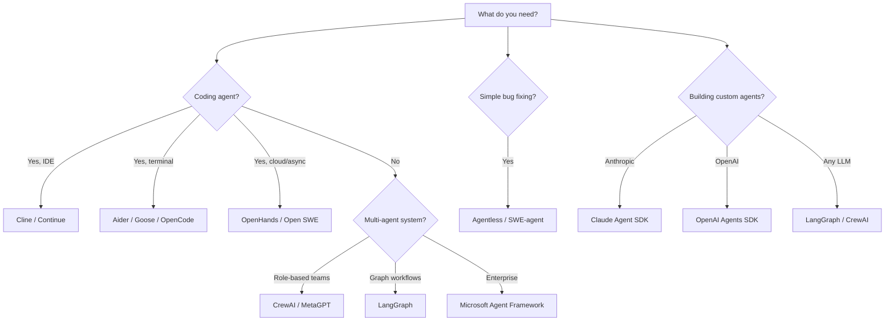

# Open-Source AI Agent Frameworks — Overview & Comparison

> Last updated: 2026-03-22 | Research covers frameworks active through Q1 2026

## The Landscape

The AI agent ecosystem has matured rapidly. If 2025 was the year of AI agents, 2026 is the year of **multi-agent systems**, with infrastructure for coordinated agents finally reaching production readiness. The global agent market reached $7.84B in 2025 and is projected to hit $52.62B by 2030 (CAGR 46.3%).

The Linux Foundation formalized the ecosystem in December 2025 by launching the **Agentic AI Foundation (AAIF)**, anchoring projects including Anthropic's MCP, Block's Goose, and OpenAI's AGENTS.md.

## Framework Categories

### 1. General-Purpose Agent Orchestration Frameworks

| Framework | Focus | Architecture | Language |
|-----------|-------|-------------|----------|
| **LangGraph** | Stateful multi-agent workflows | Graph-based (DAG) | Python, JS |
| **CrewAI** | Role-based agent collaboration | Crew/task metaphor | Python |
| **Microsoft Agent Framework** | Enterprise multi-agent systems | Unified (AutoGen + Semantic Kernel) | Python, .NET |
| **MetaGPT** | Simulated software company | SOP-driven roles | Python |

### 2. Autonomous Coding Agents

| Agent | Focus | Approach |
|-------|-------|----------|
| **OpenHands** | Cloud coding agent platform | Sandbox + SDK (V1 modular) |
| **SWE-agent** | GitHub issue resolution | Agent-Computer Interface |
| **Open SWE** | Async cloud coding | LangGraph-based |
| **Goose** | Extensible dev agent | MCP-native, any LLM |
| **Cline** | VS Code coding agent | Plan/Act modes, MCP |
| **Aider** | Terminal pair programmer | Git-native, repo-map |
| **OpenCode** | Open-source CLI agent | Terminal-first |
| **Devika** | Agentic software engineer | End-to-end autonomous |

### 3. Research / Benchmark Approaches

| Project | Focus | Key Insight |
|---------|-------|-------------|
| **Agentless** | Non-agentic bug fixing | 3-phase: localize, repair, validate |
| **SWE-smith** | Training data generation | Synthesizes 1000s of task instances |
| **Live-SWE-agent** | Self-evolving agent | Runtime capability expansion |

### 4. Agent Infrastructure & Memory

| Framework | Focus | Architecture |
|-----------|-------|-------------|
| **Mem0** | Scalable long-term memory | Vector + graph, user/session hierarchy |
| **Letta** (MemGPT) | Editable agent state | Self-managed memory blocks |
| **Zep** | Temporal knowledge graph | Fact versioning over time |
| **Cognee** | Knowledge graph layer | Structured data connections |

### 5. SDK / Low-Level Building Blocks

| SDK | Provider | Key Feature |
|-----|----------|------------|
| **Claude Agent SDK** | Anthropic | Direct tool execution, MCP native |
| **OpenAI Agents SDK** | OpenAI | Tool use, handoffs, guardrails |
| **OpenHands Software Agent SDK** | OpenHands | Composable agent packages |

## Quick Decision Guide

## Key Trends (Q1 2026)

1. **MCP as the standard** — Model Context Protocol has become the de facto tool integration standard, adopted by 60,000+ projects
2. **AutoGen sunset** — Microsoft merged AutoGen + Semantic Kernel into the unified Microsoft Agent Framework (GA Q1 2026)
3. **Memory as first-class** — Dedicated memory layer market has attracted $55M+ in VC funding
4. **Agentless approaches gaining ground** — Simpler pipelines often match or beat complex agent systems at lower cost
5. **Open-source dominance** — BYOM (Bring Your Own Model) agents eliminate vendor lock-in

## File Index

| File | Contents |
|------|----------|
| [comparison.md](./comparison.md) | Detailed feature comparison table |
| [building_agents.md](./building_agents.md) | Guide to building your own coding agents |
| [multi_agent_patterns.md](./multi_agent_patterns.md) | Multi-agent orchestration patterns |
| [agent_memory.md](./agent_memory.md) | Agent memory architectures |

## Sources

- [Shakudo - Top 9 AI Agent Frameworks (March 2026)](https://www.shakudo.io/blog/top-9-ai-agent-frameworks)
- [AIMultiple - Top 5 Open-Source Agentic AI Frameworks in 2026](https://aimultiple.com/agentic-frameworks)
- [Firecrawl - Best Open Source Frameworks for Building AI Agents in 2026](https://www.firecrawl.dev/blog/best-open-source-agent-frameworks)
- [LangChain - State of Agent Engineering](https://www.langchain.com/state-of-agent-engineering)
- [Linux Foundation - Agentic AI Foundation](https://www.linuxfoundation.org/press/linux-foundation-announces-the-formation-of-the-agentic-ai-foundation)
- [Anthropic - Building Agents with Claude Agent SDK](https://www.anthropic.com/engineering/building-agents-with-the-claude-agent-sdk)
- [Microsoft Agent Framework Overview](https://learn.microsoft.com/en-us/agent-framework/overview/)
- [OpenHands](https://openhands.dev/)
- [CrewAI](https://crewai.com/)
- [MetaGPT GitHub](https://github.com/FoundationAgents/MetaGPT)
- [Agentless Paper](https://arxiv.org/abs/2407.01489)
