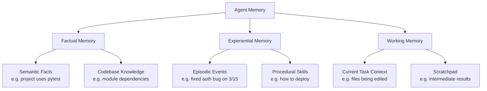
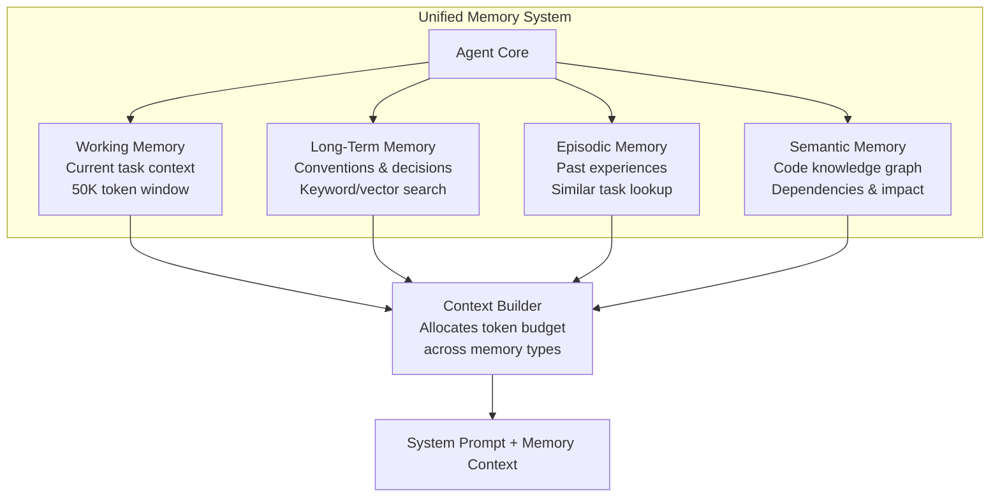

# Agent Memory Architectures for Coding Agents

> How to implement short-term, long-term, episodic, and semantic memory for AI coding agents. Covers theory, framework comparison, and working implementations.

## Table of Contents

1. [Memory Taxonomy](#memory-taxonomy)
2. [Short-Term Memory (Working Memory)](#short-term-memory-working-memory)
3. [Long-Term Memory](#long-term-memory)
4. [Episodic Memory](#episodic-memory)
5. [Semantic Memory](#semantic-memory)
6. [Framework Comparison: Mem0 vs Letta vs Zep](#framework-comparison)
7. [Building a Complete Memory System](#building-a-complete-memory-system)
8. [Advanced Patterns](#advanced-patterns)

---

## Memory Taxonomy

A December 2025 Tsinghua University survey ("Memory in the Age of AI Agents") taxonomizes agent memory by function into three categories:



For coding agents specifically, memory serves these purposes:

| Memory Type | Purpose | Lifetime | Example |
|-------------|---------|----------|---------|
| **Working** | Current task context | Single task | Files being edited, error messages |
| **Short-term** | Session context | Single session | Conversation history, decisions made |
| **Long-term** | Cross-session knowledge | Persistent | Project conventions, architecture decisions |
| **Episodic** | Past experience recall | Persistent | "Last time I fixed this type of bug..." |
| **Semantic** | Structured knowledge | Persistent | Codebase graph, API relationships |

---

## Short-Term Memory (Working Memory)

Working memory holds the immediate context for the current task. For coding agents, this includes the files being read/written, recent tool outputs, and the current plan.

### Implementation: Sliding Window with Priority

```python
from dataclasses import dataclass, field
from typing import Optional
from datetime import datetime
from collections import deque

@dataclass
class MemoryItem:
    content: str
    priority: float  # 0.0 to 1.0
    category: str    # "file", "tool_output", "plan", "error", "user_message"
    timestamp: str = field(default_factory=lambda: datetime.now().isoformat())
    token_estimate: int = 0

    def __post_init__(self):
        if not self.token_estimate:
            self.token_estimate = len(self.content) // 4  # rough estimate

class WorkingMemory:
    """Sliding window working memory with priority-based eviction.

    Mimics the OS memory hierarchy: high-priority items stay in "RAM" (context window),
    lower-priority items get paged out to "disk" (summary storage).
    """

    def __init__(self, max_tokens: int = 50_000):
        self.max_tokens = max_tokens
        self.items: list[MemoryItem] = []
        self.evicted_summaries: list[str] = []  # Compressed evicted items

    @property
    def current_tokens(self) -> int:
        return sum(item.token_estimate for item in self.items)

    def add(self, content: str, priority: float, category: str):
        """Add an item, evicting low-priority items if needed."""
        item = MemoryItem(content=content, priority=priority, category=category)

        # Evict low-priority items if we'd exceed the limit
        while self.current_tokens + item.token_estimate > self.max_tokens and self.items:
            # Sort by priority (ascending) and remove lowest
            self.items.sort(key=lambda x: x.priority)
            evicted = self.items.pop(0)
            # Compress evicted item into a summary
            summary = f"[{evicted.category}] {evicted.content[:100]}..."
            self.evicted_summaries.append(summary)

        self.items.append(item)

    def get_context(self) -> str:
        """Build the context string for the LLM prompt."""
        # Sort by category then priority
        category_order = {"plan": 0, "user_message": 1, "error": 2, "file": 3, "tool_output": 4}
        sorted_items = sorted(
            self.items,
            key=lambda x: (category_order.get(x.category, 5), -x.priority)
        )

        sections = {}
        for item in sorted_items:
            sections.setdefault(item.category, []).append(item.content)

        context = ""
        if self.evicted_summaries:
            context += "## Earlier Context (summarized)\n"
            for s in self.evicted_summaries[-5:]:  # Last 5 evicted
                context += f"- {s}\n"
            context += "\n"

        for category, items in sections.items():
            context += f"## {category.replace('_', ' ').title()}\n"
            for item in items:
                context += f"{item}\n\n"

        return context

    def decay_priorities(self, factor: float = 0.95):
        """Decay priorities over time — older items become less important."""
        for item in self.items:
            if item.category not in ("plan", "user_message"):
                item.priority *= factor


# Usage for a coding agent
wm = WorkingMemory(max_tokens=50_000)

# User's request gets highest priority
wm.add("Fix the authentication bypass in auth.py", priority=1.0, category="user_message")

# Plan gets high priority
wm.add(
    "1. Read auth.py\n2. Identify vulnerability\n3. Fix\n4. Add tests\n5. Verify",
    priority=0.95, category="plan"
)

# File contents at medium priority
wm.add("def login(username, password):\n    ...", priority=0.7, category="file")

# Tool outputs at lower priority (oldest get evicted first)
wm.add("$ pytest tests/test_auth.py\n2 passed, 1 failed", priority=0.5, category="tool_output")

# Errors get boosted priority
wm.add("AssertionError: Expected 401, got 200", priority=0.85, category="error")

# Get the full context for the LLM
context = wm.get_context()
```

---

## Long-Term Memory

Long-term memory persists across sessions. For coding agents, this means remembering project conventions, past decisions, and codebase structure.

### Implementation: File-Based with Vector Search

```python
import json
import hashlib
from pathlib import Path
from datetime import datetime
from dataclasses import dataclass, field, asdict
from typing import Optional

@dataclass
class LongTermEntry:
    content: str
    category: str        # "convention", "decision", "architecture", "pattern", "pitfall"
    project: str
    tags: list = field(default_factory=list)
    created: str = field(default_factory=lambda: datetime.now().isoformat())
    last_accessed: str = ""
    access_count: int = 0
    confidence: float = 1.0  # Decays if proven wrong
    source: str = ""         # File or session that created this

class LongTermMemory:
    """Persistent memory stored as JSON files with keyword-based retrieval.

    For production, replace keyword search with vector embeddings.
    """

    def __init__(self, storage_dir: str = ".agent_memory/long_term"):
        self.storage_dir = Path(storage_dir)
        self.storage_dir.mkdir(parents=True, exist_ok=True)
        self.index_path = self.storage_dir / "_index.json"
        self._load_index()

    def _load_index(self):
        if self.index_path.exists():
            self.index = json.loads(self.index_path.read_text())
        else:
            self.index = []

    def _save_index(self):
        self.index_path.write_text(json.dumps(self.index, indent=2))

    def store(self, entry: LongTermEntry) -> str:
        """Store a long-term memory entry."""
        entry_id = hashlib.md5(
            (entry.content + entry.created).encode()
        ).hexdigest()[:16]

        # Check for duplicates (same content)
        for existing in self.index:
            if existing.get("content_hash") == hashlib.md5(entry.content.encode()).hexdigest()[:16]:
                # Update existing instead of duplicating
                existing["access_count"] = existing.get("access_count", 0) + 1
                existing["last_accessed"] = datetime.now().isoformat()
                self._save_index()
                return existing["id"]

        # Save entry file
        entry_path = self.storage_dir / f"{entry_id}.json"
        entry_path.write_text(json.dumps(asdict(entry), indent=2))

        # Update index
        self.index.append({
            "id": entry_id,
            "category": entry.category,
            "tags": entry.tags,
            "summary": entry.content[:150],
            "content_hash": hashlib.md5(entry.content.encode()).hexdigest()[:16],
            "created": entry.created,
            "access_count": 0
        })
        self._save_index()
        return entry_id

    def recall(
        self,
        query: str = "",
        category: str = "",
        tags: list = None,
        project: str = "",
        limit: int = 10
    ) -> list[LongTermEntry]:
        """Retrieve relevant memories using keyword matching.

        For production, use vector similarity search:
        - Embed the query using text-embedding-3-small or similar
        - Search against stored embeddings
        - Combine with keyword/tag filters
        """
        candidates = []
        query_words = set(query.lower().split()) if query else set()

        for meta in self.index:
            score = 0.0

            # Category match
            if category and meta["category"] == category:
                score += 2.0

            # Tag match
            if tags:
                overlap = set(tags).intersection(set(meta.get("tags", [])))
                score += len(overlap) * 1.5

            # Keyword match in summary
            if query_words:
                summary_words = set(meta["summary"].lower().split())
                overlap = query_words.intersection(summary_words)
                score += len(overlap) * 1.0

            # Recency boost
            # (simplified — real implementation would parse the date)
            score += meta.get("access_count", 0) * 0.1

            if score > 0:
                candidates.append((meta, score))

        # Sort by score descending
        candidates.sort(key=lambda x: x[1], reverse=True)

        results = []
        for meta, _ in candidates[:limit]:
            entry_path = self.storage_dir / f"{meta['id']}.json"
            if entry_path.exists():
                data = json.loads(entry_path.read_text())
                results.append(LongTermEntry(**data))

                # Update access stats
                meta["access_count"] = meta.get("access_count", 0) + 1
                meta["last_accessed"] = datetime.now().isoformat()

        self._save_index()
        return results

    def forget(self, entry_id: str):
        """Remove a memory (e.g., if it's proven incorrect)."""
        entry_path = self.storage_dir / f"{entry_id}.json"
        if entry_path.exists():
            entry_path.unlink()
        self.index = [m for m in self.index if m["id"] != entry_id]
        self._save_index()

    def get_project_context(self, project: str, max_entries: int = 15) -> str:
        """Generate a context summary for the system prompt."""
        entries = self.recall(project=project, limit=max_entries)

        sections = {}
        for entry in entries:
            sections.setdefault(entry.category, []).append(entry.content)

        context = "## Long-Term Project Memory\n\n"
        for cat in ["convention", "architecture", "decision", "pattern", "pitfall"]:
            items = sections.get(cat, [])
            if items:
                context += f"### {cat.title()}s\n"
                for item in items:
                    context += f"- {item}\n"
                context += "\n"
        return context


# Usage
ltm = LongTermMemory()

ltm.store(LongTermEntry(
    content="Project uses Black formatter with line-length=100 and isort for imports",
    category="convention",
    project="my-api",
    tags=["formatting", "python", "style"]
))

ltm.store(LongTermEntry(
    content="Database migrations use Alembic with auto-generate from SQLAlchemy models",
    category="architecture",
    project="my-api",
    tags=["database", "migrations", "alembic"]
))

ltm.store(LongTermEntry(
    content="Chose Redis over Memcached for caching because we need pub/sub for real-time features",
    category="decision",
    project="my-api",
    tags=["caching", "redis", "architecture"],
    source="2026-01-15_session.md"
))

ltm.store(LongTermEntry(
    content="Never import from internal modules directly — always use the public API in __init__.py",
    category="pitfall",
    project="my-api",
    tags=["imports", "python", "conventions"]
))
```

---

## Episodic Memory

Episodic memory stores specific past experiences — what happened, when, and what the outcome was. For coding agents, this enables learning from past debugging sessions, failed approaches, and successful patterns.

### Implementation

```python
from dataclasses import dataclass, field
from datetime import datetime
from typing import Optional
import json
from pathlib import Path

@dataclass
class Episode:
    """A recorded experience the agent can learn from."""
    task: str                    # What was the agent trying to do?
    context: str                 # What was the state of the project?
    actions: list                # What steps did the agent take?
    outcome: str                 # What happened? (success/failure/partial)
    lessons: list                # What was learned?
    duration_seconds: int = 0
    tokens_used: int = 0
    files_modified: list = field(default_factory=list)
    errors_encountered: list = field(default_factory=list)
    timestamp: str = field(default_factory=lambda: datetime.now().isoformat())
    tags: list = field(default_factory=list)

class EpisodicMemory:
    """Store and retrieve past agent experiences."""

    def __init__(self, storage_dir: str = ".agent_memory/episodes"):
        self.storage_dir = Path(storage_dir)
        self.storage_dir.mkdir(parents=True, exist_ok=True)

    def record(self, episode: Episode) -> str:
        """Record a completed episode."""
        episode_id = datetime.now().strftime("%Y%m%d_%H%M%S")
        path = self.storage_dir / f"{episode_id}.json"

        data = {
            "id": episode_id,
            "task": episode.task,
            "context": episode.context,
            "actions": episode.actions,
            "outcome": episode.outcome,
            "lessons": episode.lessons,
            "duration_seconds": episode.duration_seconds,
            "tokens_used": episode.tokens_used,
            "files_modified": episode.files_modified,
            "errors_encountered": episode.errors_encountered,
            "timestamp": episode.timestamp,
            "tags": episode.tags
        }
        path.write_text(json.dumps(data, indent=2))
        return episode_id

    def recall_similar(self, current_task: str, limit: int = 5) -> list[Episode]:
        """Find episodes similar to the current task.

        Production implementation should use embeddings for similarity.
        """
        episodes = []
        task_words = set(current_task.lower().split())

        for path in sorted(self.storage_dir.glob("*.json"), reverse=True):
            data = json.loads(path.read_text())
            episode_words = set(data["task"].lower().split())

            # Simple keyword overlap scoring
            overlap = task_words.intersection(episode_words)
            if overlap:
                score = len(overlap) / max(len(task_words), 1)
                episodes.append((score, Episode(**{
                    k: v for k, v in data.items() if k != "id"
                })))

        episodes.sort(key=lambda x: x[0], reverse=True)
        return [ep for _, ep in episodes[:limit]]

    def recall_by_error(self, error_message: str, limit: int = 3) -> list[Episode]:
        """Find episodes where similar errors were encountered and resolved."""
        results = []
        error_words = set(error_message.lower().split())

        for path in self.storage_dir.glob("*.json"):
            data = json.loads(path.read_text())
            for err in data.get("errors_encountered", []):
                err_words = set(err.lower().split())
                if error_words.intersection(err_words):
                    results.append(Episode(**{k: v for k, v in data.items() if k != "id"}))
                    break

        return results[:limit]

    def get_lessons_learned(self, tags: list = None, limit: int = 10) -> list[str]:
        """Extract lessons from past episodes."""
        all_lessons = []

        for path in sorted(self.storage_dir.glob("*.json"), reverse=True):
            data = json.loads(path.read_text())

            if tags:
                episode_tags = set(data.get("tags", []))
                if not set(tags).intersection(episode_tags):
                    continue

            for lesson in data.get("lessons", []):
                all_lessons.append(lesson)

        return all_lessons[:limit]

    def build_experience_prompt(self, current_task: str) -> str:
        """Build a prompt section with relevant past experience."""
        similar = self.recall_similar(current_task, limit=3)

        if not similar:
            return ""

        prompt = "## Relevant Past Experience\n\n"
        for ep in similar:
            prompt += f"### Task: {ep.task}\n"
            prompt += f"- **Outcome**: {ep.outcome}\n"
            if ep.lessons:
                prompt += f"- **Lessons**: {'; '.join(ep.lessons)}\n"
            if ep.errors_encountered:
                prompt += f"- **Errors hit**: {'; '.join(ep.errors_encountered[:2])}\n"
            prompt += "\n"

        return prompt


# Usage
em = EpisodicMemory()

# Record a debugging session
em.record(Episode(
    task="Fix authentication bypass in auth.py",
    context="User reported they could access /admin without login",
    actions=[
        "Read auth.py",
        "Found missing token validation in middleware",
        "Added JWT verification check",
        "Wrote test_auth_bypass.py",
        "All tests passed"
    ],
    outcome="success",
    lessons=[
        "Always check middleware ordering — auth middleware must run before route handlers",
        "JWT validation should check both expiry AND signature",
        "Add negative test cases for auth (unauthorized access should return 401)"
    ],
    files_modified=["src/auth.py", "src/middleware.py", "tests/test_auth_bypass.py"],
    errors_encountered=["ImportError: jwt module not installed (fixed with pip install PyJWT)"],
    tags=["auth", "security", "middleware", "jwt"],
    duration_seconds=180,
    tokens_used=15000
))

# Later, when facing a similar task:
experience_context = em.build_experience_prompt("Fix JWT token validation issue")
# This returns relevant lessons from the past episode
```

---

## Semantic Memory

Semantic memory stores structured knowledge about the codebase — relationships between modules, function signatures, dependency graphs. This is the agent's "understanding" of the code.

### Implementation: Codebase Knowledge Graph

```python
from dataclasses import dataclass, field
from typing import Optional
import json
from pathlib import Path
from collections import defaultdict

@dataclass
class CodeEntity:
    """A node in the codebase knowledge graph."""
    name: str
    entity_type: str  # "module", "class", "function", "variable", "endpoint"
    file_path: str
    line_number: int = 0
    docstring: str = ""
    signature: str = ""
    tags: list = field(default_factory=list)

@dataclass
class CodeRelation:
    """An edge in the codebase knowledge graph."""
    source: str       # Entity name
    target: str       # Entity name
    relation_type: str  # "imports", "calls", "inherits", "depends_on", "tests"

class SemanticMemory:
    """Knowledge graph of the codebase for semantic understanding."""

    def __init__(self, storage_path: str = ".agent_memory/semantic"):
        self.storage_dir = Path(storage_path)
        self.storage_dir.mkdir(parents=True, exist_ok=True)

        self.entities: dict[str, CodeEntity] = {}
        self.relations: list[CodeRelation] = []
        self.adjacency: dict[str, list[tuple[str, str]]] = defaultdict(list)

        self._load()

    def _load(self):
        entities_path = self.storage_dir / "entities.json"
        relations_path = self.storage_dir / "relations.json"

        if entities_path.exists():
            data = json.loads(entities_path.read_text())
            self.entities = {k: CodeEntity(**v) for k, v in data.items()}

        if relations_path.exists():
            data = json.loads(relations_path.read_text())
            self.relations = [CodeRelation(**r) for r in data]
            self._rebuild_adjacency()

    def _save(self):
        from dataclasses import asdict
        entities_path = self.storage_dir / "entities.json"
        relations_path = self.storage_dir / "relations.json"

        entities_path.write_text(json.dumps(
            {k: asdict(v) for k, v in self.entities.items()}, indent=2
        ))
        relations_path.write_text(json.dumps(
            [{"source": r.source, "target": r.target, "relation_type": r.relation_type}
             for r in self.relations], indent=2
        ))

    def _rebuild_adjacency(self):
        self.adjacency.clear()
        for rel in self.relations:
            self.adjacency[rel.source].append((rel.target, rel.relation_type))
            # Reverse edges for "used by" queries
            self.adjacency[rel.target].append((rel.source, f"reverse_{rel.relation_type}"))

    def add_entity(self, entity: CodeEntity):
        self.entities[entity.name] = entity
        self._save()

    def add_relation(self, relation: CodeRelation):
        self.relations.append(relation)
        self.adjacency[relation.source].append((relation.target, relation.relation_type))
        self.adjacency[relation.target].append((relation.source, f"reverse_{relation.relation_type}"))
        self._save()

    def get_dependencies(self, entity_name: str, depth: int = 2) -> dict:
        """Get all dependencies of an entity up to a given depth (BFS)."""
        visited = set()
        queue = [(entity_name, 0)]
        result = {"direct": [], "transitive": []}

        while queue:
            current, d = queue.pop(0)
            if current in visited or d > depth:
                continue
            visited.add(current)

            for target, rel_type in self.adjacency.get(current, []):
                if rel_type.startswith("reverse_"):
                    continue
                entry = {"entity": target, "relation": rel_type, "depth": d + 1}
                if d == 0:
                    result["direct"].append(entry)
                else:
                    result["transitive"].append(entry)
                queue.append((target, d + 1))

        return result

    def get_dependents(self, entity_name: str) -> list[dict]:
        """Get all entities that depend on this one."""
        dependents = []
        for target, rel_type in self.adjacency.get(entity_name, []):
            if rel_type.startswith("reverse_"):
                dependents.append({
                    "entity": target,
                    "relation": rel_type.replace("reverse_", "")
                })
        return dependents

    def find_related(self, entity_name: str, relation_type: str = "") -> list[str]:
        """Find entities related to the given one."""
        related = []
        for target, rel_type in self.adjacency.get(entity_name, []):
            if not relation_type or rel_type == relation_type:
                related.append(target)
        return related

    def get_impact_analysis(self, file_path: str) -> dict:
        """Analyze the impact of changing a file."""
        # Find all entities in this file
        file_entities = [
            name for name, entity in self.entities.items()
            if entity.file_path == file_path
        ]

        impacted = set()
        for entity_name in file_entities:
            dependents = self.get_dependents(entity_name)
            for dep in dependents:
                impacted.add(dep["entity"])

        # Find test files that cover this code
        test_files = set()
        for entity_name in file_entities:
            for target, rel_type in self.adjacency.get(entity_name, []):
                if rel_type == "reverse_tests":
                    entity = self.entities.get(target)
                    if entity:
                        test_files.add(entity.file_path)

        return {
            "entities_in_file": file_entities,
            "impacted_entities": list(impacted),
            "test_files_to_run": list(test_files)
        }

    def build_context_for_task(self, task_description: str, entity_names: list[str]) -> str:
        """Build a semantic context string for the agent."""
        context = "## Codebase Knowledge\n\n"

        for name in entity_names:
            entity = self.entities.get(name)
            if not entity:
                continue

            context += f"### {entity.entity_type}: {name}\n"
            context += f"- File: {entity.file_path}:{entity.line_number}\n"
            if entity.signature:
                context += f"- Signature: `{entity.signature}`\n"
            if entity.docstring:
                context += f"- Description: {entity.docstring}\n"

            deps = self.get_dependencies(name, depth=1)
            if deps["direct"]:
                context += f"- Depends on: {', '.join(d['entity'] for d in deps['direct'])}\n"

            dependents = self.get_dependents(name)
            if dependents:
                context += f"- Used by: {', '.join(d['entity'] for d in dependents)}\n"

            context += "\n"

        return context


# Usage — Build knowledge graph from a codebase
sm = SemanticMemory()

# Index entities
sm.add_entity(CodeEntity(
    name="UserService",
    entity_type="class",
    file_path="src/services/user_service.py",
    line_number=15,
    docstring="Handles user CRUD operations",
    signature="class UserService(BaseService)"
))

sm.add_entity(CodeEntity(
    name="authenticate",
    entity_type="function",
    file_path="src/auth/auth.py",
    line_number=42,
    signature="def authenticate(token: str) -> Optional[User]",
    docstring="Validate JWT token and return user"
))

sm.add_entity(CodeEntity(
    name="User",
    entity_type="class",
    file_path="src/models/user.py",
    line_number=8,
    signature="class User(Base)",
    docstring="SQLAlchemy User model"
))

sm.add_entity(CodeEntity(
    name="test_authenticate",
    entity_type="function",
    file_path="tests/test_auth.py",
    line_number=25,
    signature="def test_authenticate()"
))

# Index relationships
sm.add_relation(CodeRelation("UserService", "User", "depends_on"))
sm.add_relation(CodeRelation("UserService", "authenticate", "calls"))
sm.add_relation(CodeRelation("authenticate", "User", "depends_on"))
sm.add_relation(CodeRelation("test_authenticate", "authenticate", "tests"))

# Query the graph
impact = sm.get_impact_analysis("src/auth/auth.py")
# Returns: entities in file, impacted dependents, test files to run

context = sm.build_context_for_task(
    "Fix authentication bug",
    ["authenticate", "UserService"]
)
```

---

## Framework Comparison

### Mem0 vs Letta vs Zep — Dedicated Memory Frameworks

| Feature | Mem0 | Letta (MemGPT) | Zep |
|---------|------|----------------|-----|
| **Architecture** | Vector + optional graph | Editable memory blocks | Temporal knowledge graph |
| **Core Idea** | Transparent memory layer | Agent manages own memory | Facts tracked over time |
| **Memory Model** | User/session/agent hierarchy | Stateful agent runtime | Knowledge graph with timestamps |
| **Self-Managing** | No (external add/search) | Yes (agent edits own memory) | No (automatic extraction) |
| **Graph Support** | Yes (since Jan 2026) | No | Yes (core feature) |
| **Search Latency** | p95 = 200ms | Runtime-dependent | p95 = ~150ms |
| **Best For** | Easy integration, any agent | Agents that learn autonomously | Temporal fact tracking |
| **License** | Apache 2.0 | Apache 2.0 | Apache 2.0 |
| **Stars** | 25K+ | 15K+ | 5K+ |

### Mem0 Quick Example

```python
from mem0 import Memory

m = Memory()

# Store memories (automatic extraction from conversations)
m.add(
    "The project uses FastAPI with SQLAlchemy and PostgreSQL. "
    "We deploy to AWS ECS with GitHub Actions CI/CD.",
    user_id="project_context",
    metadata={"project": "my-api"}
)

# Retrieve relevant memories
results = m.search("What database does the project use?", user_id="project_context")
# Returns: [{"memory": "Project uses PostgreSQL with SQLAlchemy ORM", ...}]
```

### Letta (MemGPT) Quick Example

```python
from letta import create_client

client = create_client()

# Create an agent with self-managed memory
agent = client.create_agent(
    name="coding-assistant",
    memory_blocks=[
        {"label": "project_info", "value": ""},      # Agent fills this in
        {"label": "conventions", "value": ""},        # Agent fills this in
        {"label": "current_task", "value": ""},       # Agent fills this in
    ],
    system_prompt=(
        "You are a coding assistant. Use core_memory_append and core_memory_replace "
        "to maintain your memory blocks as you learn about the project."
    )
)

# The agent can update its own memory via tool calls
response = client.send_message(
    agent_id=agent.id,
    message="This project uses pytest for testing and Black for formatting."
)
# Agent internally calls: core_memory_append("conventions", "Uses pytest, Black formatter")
```

---

## Building a Complete Memory System

Combine all four memory types into a unified system for a coding agent:

```python
class UnifiedAgentMemory:
    """Complete memory system combining all memory types."""

    def __init__(self, project_name: str, base_dir: str = ".agent_memory"):
        self.project = project_name
        self.working = WorkingMemory(max_tokens=50_000)
        self.long_term = LongTermMemory(f"{base_dir}/long_term")
        self.episodic = EpisodicMemory(f"{base_dir}/episodes")
        self.semantic = SemanticMemory(f"{base_dir}/semantic")

    def build_full_context(self, current_task: str, relevant_entities: list[str] = None) -> str:
        """Build the complete memory context for an LLM prompt.

        Memory budget allocation:
        - Working memory (current task): 50% of context
        - Semantic (code structure):     20%
        - Episodic (past experience):    15%
        - Long-term (conventions):       15%
        """
        context = ""

        # 1. Long-term: project conventions and decisions
        lt_context = self.long_term.get_project_context(self.project, max_entries=10)
        if lt_context:
            context += lt_context + "\n"

        # 2. Episodic: relevant past experiences
        ep_context = self.episodic.build_experience_prompt(current_task)
        if ep_context:
            context += ep_context + "\n"

        # 3. Semantic: relevant code structure
        if relevant_entities:
            sem_context = self.semantic.build_context_for_task(current_task, relevant_entities)
            if sem_context:
                context += sem_context + "\n"

        # 4. Working memory: current task context
        wm_context = self.working.get_context()
        if wm_context:
            context += wm_context

        return context

    def end_session(self, task: str, outcome: str, lessons: list, actions: list):
        """Called at the end of a task to consolidate memories."""

        # Record the episode
        self.episodic.record(Episode(
            task=task,
            context=self.working.get_context()[:500],
            actions=actions,
            outcome=outcome,
            lessons=lessons,
            tags=[self.project]
        ))

        # Extract conventions from lessons and store long-term
        for lesson in lessons:
            self.long_term.store(LongTermEntry(
                content=lesson,
                category="pattern" if "always" in lesson.lower() else "pitfall",
                project=self.project,
                tags=[self.project]
            ))

        # Decay working memory priorities
        self.working.decay_priorities(factor=0.5)


# Usage — Complete agent session
memory = UnifiedAgentMemory(project_name="my-api")

# At task start
memory.working.add("Fix the N+1 query in user list endpoint", 1.0, "user_message")
context = memory.build_full_context(
    "Fix N+1 query in user list",
    relevant_entities=["UserService", "User"]
)

# During task execution
memory.working.add("Found: UserService.list_all() calls user.profile for each user", 0.8, "file")
memory.working.add("SELECT * FROM users executed 50 times for 50 users", 0.85, "error")

# At task end
memory.end_session(
    task="Fix N+1 query in user list endpoint",
    outcome="success",
    lessons=[
        "Always use joinedload() for relationships accessed in list views",
        "Check SQLAlchemy query count in tests using assert_num_queries"
    ],
    actions=["Read user_service.py", "Added joinedload to query", "Added test"]
)
```



---

## Advanced Patterns

### Observational Memory (Mastra, 2026)

Instead of RAG-style retrieval, two background agents continuously compress conversation history into dated observations that stay in context:

```python
class ObservationalMemory:
    """Compress conversation history into dated observations.
    Based on the Mastra 'observational memory' pattern (2026).
    """

    def __init__(self):
        self.observations: list[dict] = []
        self.raw_history: list[str] = []

    def add_interaction(self, interaction: str):
        self.raw_history.append(interaction)

        # Every N interactions, compress into observations
        if len(self.raw_history) % 5 == 0:
            self._compress()

    def _compress(self):
        """Use an LLM to compress recent history into observations."""
        recent = self.raw_history[-10:]
        response = client.messages.create(
            model="claude-haiku-4-20250514",  # Use fast model for compression
            max_tokens=512,
            system=(
                "Compress these agent interactions into 2-3 dated factual observations. "
                "Format: [YYYY-MM-DD] Observation text. "
                "Focus on decisions made, patterns discovered, and state changes."
            ),
            messages=[{"role": "user", "content": "\n".join(recent)}]
        )
        text = "".join(b.text for b in response.content if hasattr(b, "text"))
        for line in text.strip().split("\n"):
            if line.strip():
                self.observations.append({
                    "observation": line.strip(),
                    "compressed_from": len(recent)
                })

    def get_observations(self, limit: int = 20) -> str:
        """Get observations for context injection — no retrieval needed."""
        recent = self.observations[-limit:]
        return "\n".join(o["observation"] for o in recent)
```

### MAGMA: Multi-Graph Agent Memory (January 2026)

MAGMA uses multiple specialized graphs for different memory aspects:

```
- Episodic Graph: Events linked by temporal sequence
- Semantic Graph: Concepts linked by meaning
- Procedural Graph: Actions linked by workflow steps
- Social Graph: Agents linked by interactions
```

This multi-graph approach allows agents to traverse different memory dimensions depending on the query type.

---

## Sources

- [Memory in the Age of AI Agents (Tsinghua, Dec 2025)](https://arxiv.org/abs/2512.13564)
- [Mem0: Building Production-Ready AI Agents with Scalable Long-Term Memory](https://arxiv.org/abs/2504.19413)
- [Mem0 Graph Memory](https://mem0.ai/blog/graph-memory-solutions-ai-agents)
- [Letta (MemGPT) - Benchmarking AI Agent Memory](https://www.letta.com/blog/benchmarking-ai-agent-memory)
- [5 AI Agent Memory Systems Compared (2026)](https://dev.to/varun_pratapbhardwaj_b13/5-ai-agent-memory-systems-compared-mem0-zep-letta-supermemory-superlocalmemory-2026-benchmark-59p3)
- [6 Best AI Agent Memory Frameworks (2026)](https://machinelearningmastery.com/the-6-best-ai-agent-memory-frameworks-you-should-try-in-2026/)
- [Observational Memory (VentureBeat)](https://venturebeat.com/data/observational-memory-cuts-ai-agent-costs-10x-and-outscores-rag-on-long)
- [Memory for AI Agents: A New Paradigm](https://thenewstack.io/memory-for-ai-agents-a-new-paradigm-of-context-engineering/)
- [Mem0 Alternatives for AI Agent Memory](https://vectorize.io/articles/mem0-alternatives)
