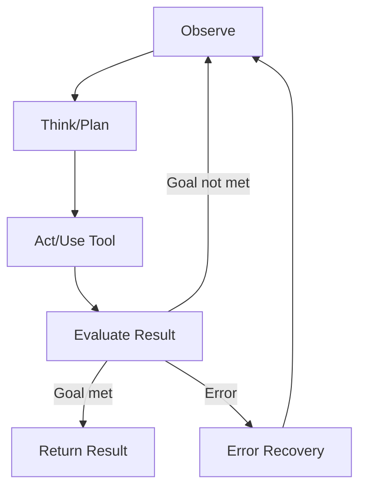

# Building Your Own AI Coding Agents

> A practical guide from simple single-agent tools to complex multi-agent systems, covering tool use patterns, memory management, and error recovery.

## Table of Contents

1. [Agent Architecture Fundamentals](#agent-architecture-fundamentals)
2. [Level 1: Simple Tool-Using Agent](#level-1-simple-tool-using-agent)
3. [Level 2: ReAct Agent with Error Recovery](#level-2-react-agent-with-error-recovery)
4. [Level 3: Stateful Agent with Memory](#level-3-stateful-agent-with-memory)
5. [Level 4: Multi-Agent System](#level-4-multi-agent-system)
6. [Tool Use Patterns](#tool-use-patterns)
7. [Error Recovery Strategies](#error-recovery-strategies)
8. [Production Considerations](#production-considerations)

---

## Agent Architecture Fundamentals

Every coding agent, regardless of complexity, follows a core loop:



The key components are:

| Component | Purpose | Examples |
|-----------|---------|---------|
| **LLM Core** | Reasoning and planning | Claude, GPT-4, Llama |
| **Tools** | Actions in the environment | File I/O, shell, search, APIs |
| **Memory** | Context across steps/sessions | Conversation history, vector store |
| **Orchestrator** | Controls the agent loop | ReAct, Plan-and-Execute, Graph |
| **Guardrails** | Safety and validation | Output parsers, sandboxing, limits |

---

## Level 1: Simple Tool-Using Agent

The simplest coding agent: an LLM that can read files, run commands, and edit code.

### Using the Anthropic API Directly

```python
import anthropic
import subprocess
import json
from pathlib import Path

client = anthropic.Anthropic()

# Define tools the agent can use
tools = [
    {
        "name": "read_file",
        "description": "Read the contents of a file",
        "input_schema": {
            "type": "object",
            "properties": {
                "path": {"type": "string", "description": "File path to read"}
            },
            "required": ["path"]
        }
    },
    {
        "name": "write_file",
        "description": "Write content to a file",
        "input_schema": {
            "type": "object",
            "properties": {
                "path": {"type": "string", "description": "File path to write"},
                "content": {"type": "string", "description": "Content to write"}
            },
            "required": ["path", "content"]
        }
    },
    {
        "name": "run_command",
        "description": "Run a shell command and return output",
        "input_schema": {
            "type": "object",
            "properties": {
                "command": {"type": "string", "description": "Shell command to execute"}
            },
            "required": ["command"]
        }
    }
]

def execute_tool(name: str, input_data: dict) -> str:
    """Execute a tool and return the result."""
    if name == "read_file":
        try:
            return Path(input_data["path"]).read_text()
        except Exception as e:
            return f"Error: {e}"

    elif name == "write_file":
        try:
            Path(input_data["path"]).write_text(input_data["content"])
            return f"Successfully wrote to {input_data['path']}"
        except Exception as e:
            return f"Error: {e}"

    elif name == "run_command":
        try:
            result = subprocess.run(
                input_data["command"],
                shell=True, capture_output=True, text=True, timeout=30
            )
            output = result.stdout + result.stderr
            return output if output else "(no output)"
        except subprocess.TimeoutExpired:
            return "Error: Command timed out after 30 seconds"

def run_agent(task: str, max_iterations: int = 10):
    """Run a simple tool-using agent loop."""
    messages = [{"role": "user", "content": task}]

    for i in range(max_iterations):
        response = client.messages.create(
            model="claude-sonnet-4-20250514",
            max_tokens=4096,
            system="You are a coding agent. Use tools to read, write, and test code.",
            tools=tools,
            messages=messages
        )

        # Check if the model wants to use tools
        if response.stop_reason == "tool_use":
            # Process all tool calls
            tool_results = []
            for block in response.content:
                if block.type == "tool_use":
                    result = execute_tool(block.name, block.input)
                    tool_results.append({
                        "type": "tool_result",
                        "tool_use_id": block.id,
                        "content": result
                    })

            messages.append({"role": "assistant", "content": response.content})
            messages.append({"role": "user", "content": tool_results})
        else:
            # Model is done — extract final text
            final_text = "".join(
                block.text for block in response.content if hasattr(block, "text")
            )
            return final_text

    return "Max iterations reached without completion."

# Usage
result = run_agent("Read auth.py and fix any security vulnerabilities")
print(result)
```

### Using the Claude Agent SDK

```python
from claude_agent_sdk import Agent

agent = Agent(
    model="claude-sonnet-4-20250514",
    tools=["Read", "Edit", "Bash"],
    system_prompt="You are a senior developer. Fix bugs and write tests.",
    max_turns=20
)

# The SDK handles the tool execution loop internally
result = agent.run("Find and fix the SQL injection in database.py, then add tests")
print(result.output)
```

---

## Level 2: ReAct Agent with Error Recovery

The ReAct (Reason + Act) pattern interleaves thinking and action, allowing the agent to reason about failures and retry.

```python
import anthropic
import subprocess
import json
from dataclasses import dataclass, field
from typing import Optional

client = anthropic.Anthropic()

@dataclass
class AgentState:
    task: str
    messages: list = field(default_factory=list)
    iteration: int = 0
    max_iterations: int = 15
    errors: list = field(default_factory=list)
    plan: Optional[str] = None

SYSTEM_PROMPT = """You are a coding agent that follows the ReAct pattern.

For each step:
1. THINK: Analyze the current situation and plan your next action
2. ACT: Use a tool to make progress
3. OBSERVE: Examine the tool result
4. REFLECT: Decide if you need to adjust your approach

When you encounter errors:
- Analyze the error message carefully
- Consider alternative approaches
- If a command fails, try a different strategy rather than repeating it
- After 3 failures on the same step, step back and reconsider the overall plan

Always run tests after making changes to verify correctness."""

tools = [
    {
        "name": "read_file",
        "description": "Read file contents. Use to understand existing code before modifying.",
        "input_schema": {
            "type": "object",
            "properties": {
                "path": {"type": "string"}
            },
            "required": ["path"]
        }
    },
    {
        "name": "write_file",
        "description": "Write or overwrite a file. Always read first to understand context.",
        "input_schema": {
            "type": "object",
            "properties": {
                "path": {"type": "string"},
                "content": {"type": "string"}
            },
            "required": ["path", "content"]
        }
    },
    {
        "name": "run_command",
        "description": "Run a shell command. Use for: running tests, installing deps, git ops.",
        "input_schema": {
            "type": "object",
            "properties": {
                "command": {"type": "string"},
                "timeout": {"type": "integer", "description": "Timeout in seconds (default 30)"}
            },
            "required": ["command"]
        }
    },
    {
        "name": "search_codebase",
        "description": "Search for patterns in the codebase using grep.",
        "input_schema": {
            "type": "object",
            "properties": {
                "pattern": {"type": "string"},
                "file_glob": {"type": "string", "description": "e.g. '*.py'"}
            },
            "required": ["pattern"]
        }
    }
]

def execute_tool(name: str, input_data: dict) -> str:
    """Execute tool with error handling."""
    try:
        if name == "read_file":
            from pathlib import Path
            return Path(input_data["path"]).read_text()

        elif name == "write_file":
            from pathlib import Path
            p = Path(input_data["path"])
            p.parent.mkdir(parents=True, exist_ok=True)
            p.write_text(input_data["content"])
            return f"Written to {input_data['path']}"

        elif name == "run_command":
            timeout = input_data.get("timeout", 30)
            result = subprocess.run(
                input_data["command"],
                shell=True, capture_output=True, text=True,
                timeout=timeout
            )
            output = f"Exit code: {result.returncode}\n"
            if result.stdout:
                output += f"STDOUT:\n{result.stdout}\n"
            if result.stderr:
                output += f"STDERR:\n{result.stderr}\n"
            return output

        elif name == "search_codebase":
            glob = input_data.get("file_glob", "")
            include = f"--include='{glob}'" if glob else ""
            result = subprocess.run(
                f"grep -rn {include} '{input_data['pattern']}' .",
                shell=True, capture_output=True, text=True, timeout=10
            )
            return result.stdout if result.stdout else "No matches found."

    except subprocess.TimeoutExpired:
        return f"ERROR: Command timed out"
    except Exception as e:
        return f"ERROR: {type(e).__name__}: {e}"


def run_react_agent(task: str) -> str:
    """Run a ReAct agent with error recovery."""
    state = AgentState(task=task)
    state.messages = [{"role": "user", "content": task}]

    while state.iteration < state.max_iterations:
        state.iteration += 1

        response = client.messages.create(
            model="claude-sonnet-4-20250514",
            max_tokens=4096,
            system=SYSTEM_PROMPT,
            tools=tools,
            messages=state.messages
        )

        if response.stop_reason == "tool_use":
            tool_results = []
            for block in response.content:
                if block.type == "tool_use":
                    result = execute_tool(block.name, block.input)

                    # Track errors for recovery logic
                    if result.startswith("ERROR"):
                        state.errors.append({
                            "tool": block.name,
                            "input": block.input,
                            "error": result,
                            "iteration": state.iteration
                        })

                    tool_results.append({
                        "type": "tool_result",
                        "tool_use_id": block.id,
                        "content": result
                    })

            state.messages.append({"role": "assistant", "content": response.content})
            state.messages.append({"role": "user", "content": tool_results})
        else:
            return "".join(
                b.text for b in response.content if hasattr(b, "text")
            )

    return f"Agent reached max iterations ({state.max_iterations}). Errors: {len(state.errors)}"


# Usage
result = run_react_agent(
    "Find the failing test in tests/test_auth.py, diagnose the root cause, "
    "fix the code, and verify all tests pass."
)
```

---

## Level 3: Stateful Agent with Memory

Add persistent memory so the agent remembers across sessions.

```python
import json
import hashlib
from datetime import datetime
from pathlib import Path
from dataclasses import dataclass, field, asdict

@dataclass
class MemoryEntry:
    content: str
    category: str  # "fact", "decision", "error", "pattern"
    timestamp: str = field(default_factory=lambda: datetime.now().isoformat())
    relevance_score: float = 1.0
    source_file: str = ""
    tags: list = field(default_factory=list)

class AgentMemory:
    """File-based memory system for a coding agent."""

    def __init__(self, memory_dir: str = ".agent_memory"):
        self.memory_dir = Path(memory_dir)
        self.memory_dir.mkdir(parents=True, exist_ok=True)
        self.short_term: list[MemoryEntry] = []  # Current session
        self.index_path = self.memory_dir / "index.json"
        self._load_index()

    def _load_index(self):
        if self.index_path.exists():
            self.index = json.loads(self.index_path.read_text())
        else:
            self.index = {"entries": [], "stats": {"total": 0, "sessions": 0}}

    def _save_index(self):
        self.index_path.write_text(json.dumps(self.index, indent=2))

    def remember(self, content: str, category: str, **kwargs):
        """Store a memory entry."""
        entry = MemoryEntry(content=content, category=category, **kwargs)
        self.short_term.append(entry)

        # Persist to file
        entry_id = hashlib.md5(content.encode()).hexdigest()[:12]
        entry_path = self.memory_dir / f"{entry_id}.json"
        entry_path.write_text(json.dumps(asdict(entry), indent=2))

        self.index["entries"].append({
            "id": entry_id,
            "category": category,
            "summary": content[:100],
            "timestamp": entry.timestamp,
            "tags": entry.tags
        })
        self.index["stats"]["total"] += 1
        self._save_index()
        return entry_id

    def recall(self, query: str = "", category: str = "",
               tags: list = None, limit: int = 10) -> list[MemoryEntry]:
        """Retrieve relevant memories."""
        results = []
        for meta in self.index["entries"]:
            if category and meta["category"] != category:
                continue
            if tags and not set(tags).intersection(set(meta.get("tags", []))):
                continue
            if query and query.lower() not in meta["summary"].lower():
                continue

            entry_path = self.memory_dir / f"{meta['id']}.json"
            if entry_path.exists():
                data = json.loads(entry_path.read_text())
                results.append(MemoryEntry(**data))

        # Sort by timestamp (most recent first) and limit
        results.sort(key=lambda e: e.timestamp, reverse=True)
        return results[:limit]

    def get_context_summary(self, max_entries: int = 20) -> str:
        """Generate a context summary for the agent's system prompt."""
        recent = self.recall(limit=max_entries)
        if not recent:
            return "No prior context available."

        sections = {"fact": [], "decision": [], "error": [], "pattern": []}
        for entry in recent:
            sections.get(entry.category, []).append(entry.content)

        summary = "## Agent Memory Context\n\n"
        for cat, items in sections.items():
            if items:
                summary += f"### {cat.title()}s\n"
                for item in items[:5]:
                    summary += f"- {item}\n"
                summary += "\n"
        return summary


# Integration with the agent loop
memory = AgentMemory()

# Store learnings during agent execution
memory.remember(
    "Project uses pytest with conftest.py in each test directory",
    category="fact",
    tags=["testing", "pytest"],
    source_file="conftest.py"
)

memory.remember(
    "Chose SQLAlchemy over raw SQL for database layer — team preference for ORM",
    category="decision",
    tags=["database", "architecture"]
)

memory.remember(
    "ImportError for 'utils.helpers' — module was renamed to 'core.helpers' in v2.0",
    category="error",
    tags=["import", "migration"]
)

# Recall relevant context
test_context = memory.recall(category="fact", tags=["testing"])
context_prompt = memory.get_context_summary()
```

---

## Level 4: Multi-Agent System

A coding system with specialized agents communicating through a shared workspace.

```python
from dataclasses import dataclass, field
from enum import Enum
from typing import Callable
import anthropic
import json

client = anthropic.Anthropic()

class AgentRole(Enum):
    PLANNER = "planner"
    CODER = "coder"
    REVIEWER = "reviewer"
    TESTER = "tester"

@dataclass
class Message:
    sender: AgentRole
    recipient: AgentRole
    content: str
    artifacts: dict = field(default_factory=dict)  # Files, test results, etc.

@dataclass
class Workspace:
    """Shared workspace for multi-agent communication."""
    files: dict = field(default_factory=dict)
    messages: list = field(default_factory=list)
    test_results: dict = field(default_factory=dict)
    plan: str = ""
    status: str = "planning"

class CodingAgent:
    """A specialized coding agent with a defined role."""

    def __init__(self, role: AgentRole, system_prompt: str, tools: list):
        self.role = role
        self.system_prompt = system_prompt
        self.tools = tools

    def process(self, workspace: Workspace, input_message: str) -> Message:
        """Process a message and return a response with artifacts."""
        # Build context from workspace
        context = f"## Current Plan\n{workspace.plan}\n\n"
        context += f"## Recent Messages\n"
        for msg in workspace.messages[-5:]:
            context += f"[{msg.sender.value}]: {msg.content[:200]}\n"

        messages = [{"role": "user", "content": f"{context}\n\n{input_message}"}]

        response = client.messages.create(
            model="claude-sonnet-4-20250514",
            max_tokens=4096,
            system=self.system_prompt,
            messages=messages
        )

        response_text = "".join(
            b.text for b in response.content if hasattr(b, "text")
        )
        return Message(sender=self.role, recipient=AgentRole.PLANNER, content=response_text)


class MultiAgentOrchestrator:
    """Orchestrates a team of coding agents."""

    def __init__(self):
        self.workspace = Workspace()
        self.agents = {
            AgentRole.PLANNER: CodingAgent(
                role=AgentRole.PLANNER,
                system_prompt=(
                    "You are a technical planner. Break down coding tasks into "
                    "clear, ordered steps. Output a numbered plan with acceptance "
                    "criteria for each step."
                ),
                tools=[]
            ),
            AgentRole.CODER: CodingAgent(
                role=AgentRole.CODER,
                system_prompt=(
                    "You are a senior developer. Given a plan step, write clean, "
                    "well-documented code. Output the full file contents for each "
                    "file you create or modify."
                ),
                tools=["read_file", "write_file", "run_command"]
            ),
            AgentRole.REVIEWER: CodingAgent(
                role=AgentRole.REVIEWER,
                system_prompt=(
                    "You are a code reviewer. Check for: bugs, security issues, "
                    "style violations, missing error handling, and test coverage. "
                    "Output APPROVED or CHANGES_NEEDED with specific line-level feedback."
                ),
                tools=["read_file", "search_codebase"]
            ),
            AgentRole.TESTER: CodingAgent(
                role=AgentRole.TESTER,
                system_prompt=(
                    "You are a QA engineer. Write and run tests for the implemented "
                    "code. Output test files and execution results."
                ),
                tools=["read_file", "write_file", "run_command"]
            ),
        }

    def run(self, task: str, max_rounds: int = 5) -> Workspace:
        """Run the multi-agent workflow."""

        # Phase 1: Planning
        plan_msg = self.agents[AgentRole.PLANNER].process(
            self.workspace, f"Create a plan for: {task}"
        )
        self.workspace.plan = plan_msg.content
        self.workspace.messages.append(plan_msg)
        self.workspace.status = "implementing"

        for round_num in range(max_rounds):
            # Phase 2: Implementation
            code_msg = self.agents[AgentRole.CODER].process(
                self.workspace,
                f"Implement the next incomplete step from the plan.\n"
                f"Plan:\n{self.workspace.plan}"
            )
            self.workspace.messages.append(code_msg)

            # Phase 3: Review
            review_msg = self.agents[AgentRole.REVIEWER].process(
                self.workspace,
                f"Review this implementation:\n{code_msg.content}"
            )
            self.workspace.messages.append(review_msg)

            # Phase 4: Testing
            test_msg = self.agents[AgentRole.TESTER].process(
                self.workspace,
                f"Write and run tests for:\n{code_msg.content}"
            )
            self.workspace.messages.append(test_msg)

            # Check if review passed
            if "APPROVED" in review_msg.content and "PASS" in test_msg.content:
                self.workspace.status = "complete"
                break

        return self.workspace

# Usage
orchestrator = MultiAgentOrchestrator()
result = orchestrator.run("Build a rate limiter middleware for our Flask API")
print(f"Status: {result.status}")
print(f"Messages exchanged: {len(result.messages)}")
```

---

## Tool Use Patterns

### Pattern 1: MCP (Model Context Protocol) Integration

MCP is the emerging standard for tool integration. Here is how to set up an MCP server:

```python
# mcp_server.py - A simple MCP tool server
from mcp.server import Server
from mcp.types import Tool, TextContent
import subprocess

server = Server("coding-tools")

@server.tool()
async def run_tests(directory: str = ".") -> str:
    """Run pytest in the specified directory."""
    result = subprocess.run(
        ["python", "-m", "pytest", directory, "-v", "--tb=short"],
        capture_output=True, text=True, timeout=60
    )
    return f"Exit: {result.returncode}\n{result.stdout}\n{result.stderr}"

@server.tool()
async def lint_file(path: str) -> str:
    """Run ruff linter on a file."""
    result = subprocess.run(
        ["ruff", "check", path],
        capture_output=True, text=True
    )
    return result.stdout if result.stdout else "No issues found."

@server.tool()
async def git_diff() -> str:
    """Show current uncommitted changes."""
    result = subprocess.run(
        ["git", "diff", "--stat"],
        capture_output=True, text=True
    )
    return result.stdout if result.stdout else "No changes."
```

### Pattern 2: Tool Composition

Chain tools together for complex operations:

```python
def review_and_fix_pipeline(file_path: str) -> dict:
    """Composed tool: lint -> fix -> test -> report."""
    results = {}

    # Step 1: Lint
    lint_output = execute_tool("run_command", {"command": f"ruff check {file_path}"})
    results["lint"] = lint_output

    if "error" in lint_output.lower():
        # Step 2: Auto-fix
        fix_output = execute_tool("run_command", {"command": f"ruff check --fix {file_path}"})
        results["fix"] = fix_output

    # Step 3: Run tests
    test_dir = file_path.replace(".py", "").replace("src/", "tests/test_")
    test_output = execute_tool("run_command", {"command": f"pytest {test_dir}.py -v"})
    results["test"] = test_output

    return results
```

### Pattern 3: Sandboxed Execution

Run untrusted code safely:

```python
import docker

def run_in_sandbox(code: str, language: str = "python") -> str:
    """Execute code in an isolated Docker container."""
    client = docker.from_env()

    container = client.containers.run(
        image=f"{language}:3.12-slim",
        command=["python", "-c", code],
        mem_limit="256m",
        cpu_period=100000,
        cpu_quota=50000,     # 50% CPU
        network_disabled=True,  # No network access
        remove=True,
        timeout=30,
        stdout=True,
        stderr=True
    )
    return container.decode("utf-8")
```

---

## Error Recovery Strategies

### Strategy 1: Retry with Backoff

```python
import time

def retry_with_backoff(func, max_retries=3, base_delay=1.0):
    """Retry a tool call with exponential backoff."""
    for attempt in range(max_retries):
        result = func()
        if not result.startswith("ERROR"):
            return result
        delay = base_delay * (2 ** attempt)
        time.sleep(delay)
    return f"Failed after {max_retries} attempts: {result}"
```

### Strategy 2: Alternative Approach Selection

```python
def fix_with_fallback(file_path: str, error: str) -> str:
    """Try multiple approaches to fix an error."""
    strategies = [
        # Strategy 1: Direct fix based on error message
        lambda: agent_fix_from_error(file_path, error),
        # Strategy 2: Search for similar patterns in codebase
        lambda: agent_fix_from_patterns(file_path, error),
        # Strategy 3: Revert and rewrite from scratch
        lambda: agent_rewrite_section(file_path, error),
    ]

    for i, strategy in enumerate(strategies):
        result = strategy()
        if validate_fix(file_path):
            return f"Fixed using strategy {i+1}: {result}"

    return "All strategies exhausted. Manual intervention needed."
```

### Strategy 3: Checkpoint and Rollback

```python
import shutil

class CheckpointManager:
    """Save and restore file state for safe experimentation."""

    def __init__(self, workspace_dir: str):
        self.workspace = Path(workspace_dir)
        self.checkpoints_dir = self.workspace / ".checkpoints"
        self.checkpoints_dir.mkdir(exist_ok=True)

    def save(self, label: str):
        """Save current workspace state."""
        checkpoint_path = self.checkpoints_dir / label
        if checkpoint_path.exists():
            shutil.rmtree(checkpoint_path)
        shutil.copytree(
            self.workspace, checkpoint_path,
            ignore=shutil.ignore_patterns(".checkpoints", "__pycache__", ".git")
        )

    def restore(self, label: str):
        """Restore workspace to a checkpoint."""
        checkpoint_path = self.checkpoints_dir / label
        if not checkpoint_path.exists():
            raise ValueError(f"Checkpoint '{label}' not found")

        # Remove current files (except .checkpoints and .git)
        for item in self.workspace.iterdir():
            if item.name not in (".checkpoints", ".git", "__pycache__"):
                if item.is_dir():
                    shutil.rmtree(item)
                else:
                    item.unlink()

        # Copy checkpoint files back
        for item in checkpoint_path.iterdir():
            dest = self.workspace / item.name
            if item.is_dir():
                shutil.copytree(item, dest)
            else:
                shutil.copy2(item, dest)
```

---

## Production Considerations

### Cost Control

```python
class TokenBudget:
    """Track and limit token usage."""

    def __init__(self, max_input_tokens: int = 100_000, max_output_tokens: int = 50_000):
        self.max_input = max_input_tokens
        self.max_output = max_output_tokens
        self.used_input = 0
        self.used_output = 0

    def track(self, response):
        self.used_input += response.usage.input_tokens
        self.used_output += response.usage.output_tokens

    @property
    def remaining_input(self):
        return self.max_input - self.used_input

    @property
    def budget_exhausted(self):
        return self.used_input >= self.max_input or self.used_output >= self.max_output

    def summary(self):
        return (
            f"Tokens used: {self.used_input:,} input, {self.used_output:,} output | "
            f"Remaining: {self.remaining_input:,} input, "
            f"{self.max_output - self.used_output:,} output"
        )
```

### Observability

```python
import logging
from datetime import datetime

class AgentLogger:
    """Structured logging for agent actions."""

    def __init__(self, log_dir: str = ".agent_logs"):
        self.log_dir = Path(log_dir)
        self.log_dir.mkdir(exist_ok=True)
        self.session_id = datetime.now().strftime("%Y%m%d_%H%M%S")
        self.log_file = self.log_dir / f"session_{self.session_id}.jsonl"

    def log(self, event_type: str, data: dict):
        entry = {
            "timestamp": datetime.now().isoformat(),
            "session": self.session_id,
            "event": event_type,
            **data
        }
        with open(self.log_file, "a") as f:
            f.write(json.dumps(entry) + "\n")

    def log_tool_call(self, tool_name: str, input_data: dict, result: str, duration_ms: int):
        self.log("tool_call", {
            "tool": tool_name,
            "input": input_data,
            "result_preview": result[:500],
            "duration_ms": duration_ms,
            "success": not result.startswith("ERROR")
        })

    def log_llm_call(self, model: str, input_tokens: int, output_tokens: int, duration_ms: int):
        self.log("llm_call", {
            "model": model,
            "input_tokens": input_tokens,
            "output_tokens": output_tokens,
            "duration_ms": duration_ms
        })
```

### Security Checklist

| Concern | Mitigation |
|---------|-----------|
| Arbitrary code execution | Sandbox with Docker or gVisor |
| File system access | Restrict to workspace directory |
| Network access | Disable or allowlist domains |
| Secret exposure | Scan outputs for credential patterns |
| Token exhaustion | Hard budget limits per session |
| Infinite loops | Maximum iterations + timeout per tool |
| Prompt injection | Input validation + output guardrails |

---

## Sources

- [Anthropic - Building Agents with Claude Agent SDK](https://www.anthropic.com/engineering/building-agents-with-the-claude-agent-sdk)
- [Claude Agent SDK Docs](https://platform.claude.com/docs/en/agent-sdk/overview)
- [Claude Agent SDK Python](https://github.com/anthropics/claude-agent-sdk-python)
- [Claude Agent SDK Demos](https://github.com/anthropics/claude-agent-sdk-demos)
- [Complete Guide to Building Agents with Claude Agent SDK](https://nader.substack.com/p/the-complete-guide-to-building-agents)
- [LangGraph GitHub](https://github.com/langchain-ai/langgraph)
- [CrewAI Quickstart](https://docs.crewai.com/en/quickstart)
- [How to Build Multi-Agent Systems (2026 Guide)](https://dev.to/eira-wexford/how-to-build-multi-agent-systems-complete-2026-guide-1io6)
