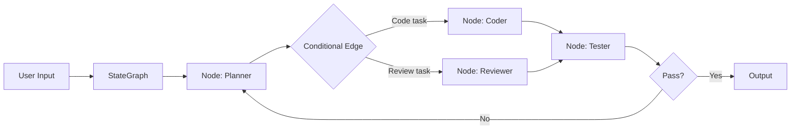
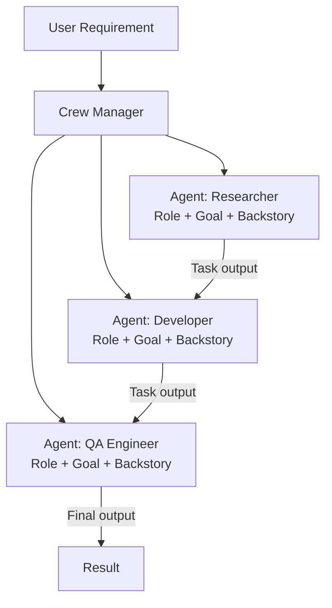
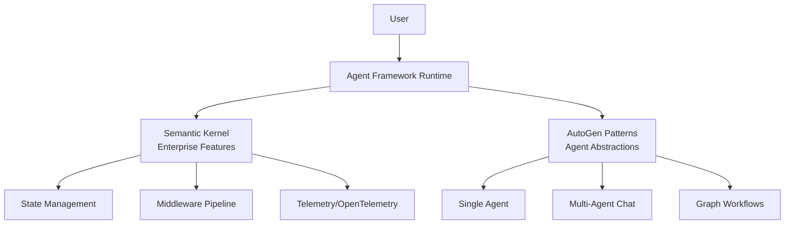
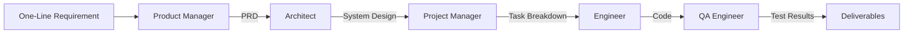
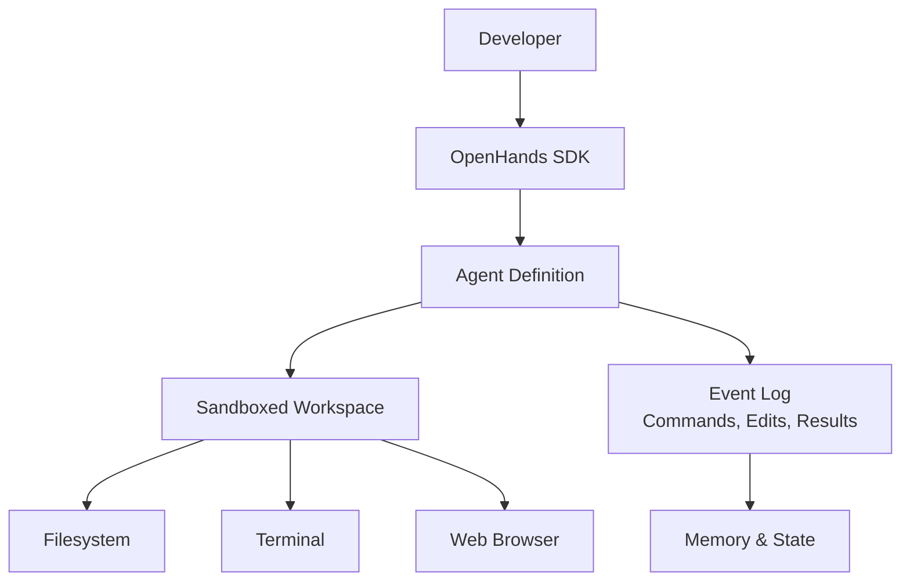

# AI Agent Framework Comparison

> Detailed feature-by-feature comparison of major open-source AI agent frameworks as of Q1 2026.

## Master Comparison Table

| Feature | LangGraph | CrewAI | Microsoft Agent Framework | MetaGPT | OpenHands | SWE-agent | Claude Agent SDK | Goose |
|---------|-----------|--------|--------------------------|---------|-----------|-----------|-----------------|-------|
| **License** | MIT | MIT | MIT | MIT | MIT | MIT | Proprietary SDK | Apache 2.0 |
| **Language** | Python, JS | Python | Python, .NET | Python | Python | Python | Python, TS | Rust |
| **GitHub Stars** | 18K+ | 25K+ | 40K+ | 45K+ | 45K+ | 15K+ | N/A | 27K+ |
| **Architecture** | Graph/DAG | Crew/Task | Unified runtime | SOP roles | Modular SDK | ACI | Direct execution | MCP-native |
| **Multi-agent** | Yes (native) | Yes (native) | Yes (native) | Yes (native) | Yes (V1) | No | Via orchestration | Via MCP |
| **LLM Agnostic** | Yes | Yes | Yes | Yes | Yes | Yes | Claude only | Yes |
| **MCP Support** | Yes | Yes | Yes | Partial | Yes | No | Yes (native) | Yes (native) |
| **Memory** | Checkpoint-based | Short-term | Session-based state | SOP context | Event log | Conversation | Context window | Session |
| **Persistence** | Built-in | Via config | Session store | File-based | Event store | None | None | Session |
| **Streaming** | Yes | Yes | Yes | No | Yes | No | Yes | Yes |
| **Human-in-loop** | Yes | Yes | Yes | Limited | Yes | Limited | Yes | Yes |
| **Debugging** | LangSmith | CrewAI Studio | OpenTelemetry | Logs | Event replay | Logs | Built-in trace | Logs |
| **Enterprise Ready** | Yes | Yes (Enterprise plan) | Yes | Research | Growing | Research | Yes | Growing |
| **Deployment** | LangGraph Cloud | CrewAI Enterprise | Azure | Self-host | Cloud + self-host | Self-host | Anthropic API | Self-host |
| **Learning Curve** | High | Medium | Medium-High | Medium | Medium | Low | Low | Low |
| **Best For** | Complex workflows | Team collaboration | Enterprise apps | SW company sim | Cloud coding | Issue fixing | Anthropic users | Dev automation |

## Architecture Comparison

### LangGraph — Graph-Based Orchestration



**Strengths:**
- Fine-grained control over execution flow
- Built-in state persistence and checkpointing
- Conditional branching and parallel execution
- Production-grade with LangGraph Cloud

**Weaknesses:**
- Steep learning curve; requires graph-thinking
- Verbose for simple use cases
- Debugging distributed state can be complex

**Example — Minimal LangGraph Agent:**

```python
from langgraph.graph import StateGraph, MessagesState, START, END
from langchain_anthropic import ChatAnthropic

model = ChatAnthropic(model="claude-sonnet-4-20250514")

def call_model(state: MessagesState):
    response = model.invoke(state["messages"])
    return {"messages": [response]}

graph = StateGraph(MessagesState)
graph.add_node("agent", call_model)
graph.add_edge(START, "agent")
graph.add_edge("agent", END)

app = graph.compile()
result = app.invoke({"messages": [("user", "Fix the bug in auth.py")]})
```

---

### CrewAI — Role-Based Collaboration



**Strengths:**
- Intuitive role-based metaphor
- Low boilerplate for multi-agent setups
- CrewAI Studio for visual building
- 1.4B+ agentic automations in production

**Weaknesses:**
- Less fine-grained control than LangGraph
- Role definitions can be vague without careful prompting
- Sequential task flow can be limiting

**Example — CrewAI Software Team:**

```python
from crewai import Agent, Task, Crew

architect = Agent(
    role="Software Architect",
    goal="Design clean, scalable system architecture",
    backstory="Senior architect with 15 years of distributed systems experience",
    tools=[file_reader, code_analyzer],
    llm="claude-sonnet-4-20250514"
)

developer = Agent(
    role="Senior Developer",
    goal="Write clean, tested, production-ready code",
    backstory="Full-stack developer specializing in Python and TypeScript",
    tools=[code_writer, terminal, test_runner],
    llm="claude-sonnet-4-20250514"
)

reviewer = Agent(
    role="Code Reviewer",
    goal="Ensure code quality, security, and best practices",
    backstory="Security-focused engineer who catches edge cases",
    tools=[code_analyzer, security_scanner],
    llm="claude-sonnet-4-20250514"
)

design_task = Task(
    description="Design the architecture for: {requirement}",
    agent=architect,
    expected_output="Architecture document with component diagram"
)

implement_task = Task(
    description="Implement the architecture design",
    agent=developer,
    expected_output="Working code with tests",
    context=[design_task]
)

review_task = Task(
    description="Review the implementation for quality and security",
    agent=reviewer,
    expected_output="Review report with approved/rejected status",
    context=[implement_task]
)

crew = Crew(
    agents=[architect, developer, reviewer],
    tasks=[design_task, implement_task, review_task],
    verbose=True
)

result = crew.kickoff(inputs={"requirement": "Build a REST API for user management"})
```

---

### Microsoft Agent Framework — Enterprise Unified Runtime



**Strengths:**
- Enterprise-grade with Azure integration
- Session-based state management for long-running workflows
- Built-in OpenTelemetry observability
- Cross-language (Python + .NET, more coming)
- Graph-based workflows for explicit orchestration

**Weaknesses:**
- AutoGen and Semantic Kernel now in maintenance mode (bug fixes only)
- Migration required from existing AutoGen codebases
- GA targeted end of Q1 2026 — still stabilizing
- Microsoft ecosystem dependency for full features

---

### MetaGPT — Simulated Software Company



**Strengths:**
- Encodes real software development SOPs
- 100% task completion rate in evaluations
- Generates full documentation alongside code
- AFlow paper accepted at ICLR 2025 (top 1.8%)

**Weaknesses:**
- Research-oriented; less production hardening
- Fixed role structure may not fit all workflows
- Token-intensive for the full pipeline

---

### OpenHands — Cloud Coding Agent Platform



**Strengths:**
- V1 modular SDK with composable packages
- Sandboxed execution environments
- Solves 87% of bug tickets same-day
- MIT licensed, 188+ contributors
- Local or cloud (Docker/Kubernetes)

**Weaknesses:**
- Still evolving (V0 to V1 migration)
- Requires sandbox infrastructure
- Higher setup complexity than CLI tools

---

### Claude Agent SDK — Direct Tool Execution

**Strengths:**
- Claude executes tools directly (file ops, shell, web search)
- Native MCP integration
- Minimal boilerplate
- Python (v0.1.48) and TypeScript (v0.2.71) packages

**Weaknesses:**
- Claude-only (no LLM agnosticism)
- Proprietary SDK tied to Anthropic API
- Newer ecosystem, fewer community examples

**Example — Claude Agent SDK:**

```python
from claude_agent_sdk import Agent

agent = Agent(
    model="claude-sonnet-4-20250514",
    tools=["Read", "Edit", "Bash", "WebSearch"],
    system_prompt="You are a senior developer. Fix bugs in the codebase."
)

result = agent.run("Find and fix the authentication bypass in auth.py")
```

---

### Goose — MCP-Native Extensible Agent

**Strengths:**
- Works with any LLM (truly model-agnostic)
- 1,700+ MCP servers for tool integration
- Desktop app + CLI
- Apache 2.0 license, Linux Foundation backed
- 27K+ stars, 350+ contributors

**Weaknesses:**
- Written in Rust (harder to extend for Python shops)
- Less structured multi-agent support
- Younger ecosystem

---

## Agentless vs. Agentic Comparison

| Dimension | Agentless | SWE-agent | OpenHands |
|-----------|-----------|-----------|-----------|
| **Approach** | Pipeline (no agent loop) | Agent with ACI | Full agent platform |
| **Autonomy** | None (fixed pipeline) | High | Very High |
| **Cost per issue** | ~$0.70 | ~$2-5 | Variable |
| **SWE-bench score** | 32% (Lite) | ~25-30% | ~50%+ |
| **Error recovery** | Patch selection | Self-correction | Full retry loops |
| **Complexity** | Very low | Medium | High |

## When to Use What

| Scenario | Recommended Framework |
|----------|----------------------|
| Quick bug fixes from GitHub issues | Agentless or SWE-agent |
| Daily coding companion in IDE | Cline or Continue |
| Terminal-first pair programming | Aider or Goose |
| Complex multi-step workflows | LangGraph |
| Simulated dev team | CrewAI or MetaGPT |
| Enterprise with Azure/Microsoft | Microsoft Agent Framework |
| Cloud-scale async coding | OpenHands or Open SWE |
| Building custom Anthropic agents | Claude Agent SDK |
| Model-agnostic dev automation | Goose |

## Sources

- [LangGraph GitHub](https://github.com/langchain-ai/langgraph)
- [CrewAI Framework Review](https://latenode.com/blog/ai-frameworks-technical-infrastructure/crewai-framework/crewai-framework-2025-complete-review-of-the-open-source-multi-agent-ai-platform)
- [Microsoft Agent Framework](https://learn.microsoft.com/en-us/agent-framework/overview/)
- [MetaGPT Paper](https://arxiv.org/abs/2308.00352)
- [OpenHands SDK Paper](https://arxiv.org/html/2511.03690v1)
- [Claude Agent SDK Docs](https://platform.claude.com/docs/en/agent-sdk/overview)
- [Goose GitHub](https://github.com/block/goose)
- [Agentless Paper](https://arxiv.org/abs/2407.01489)
- [SWE-agent GitHub](https://github.com/SWE-agent/SWE-agent)
- [Agentic CLI Comparison](https://aimultiple.com/agentic-cli)
