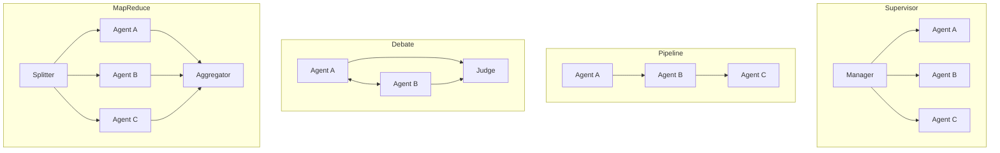
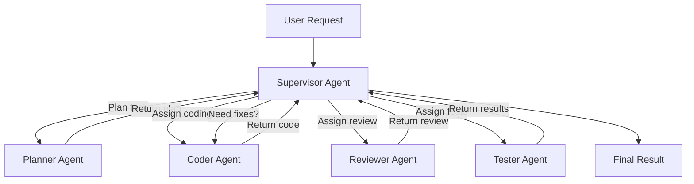
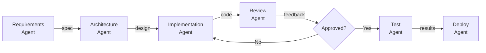
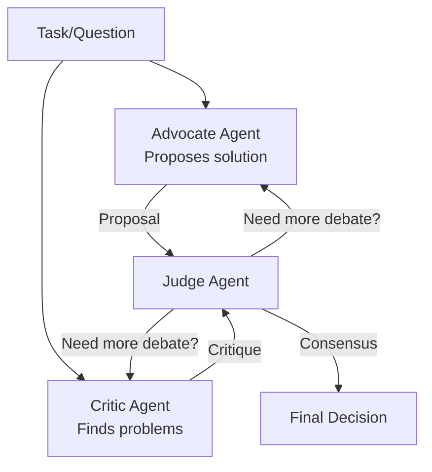
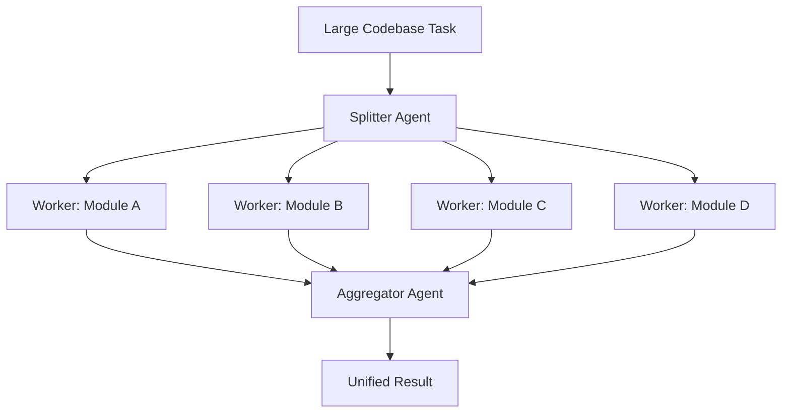
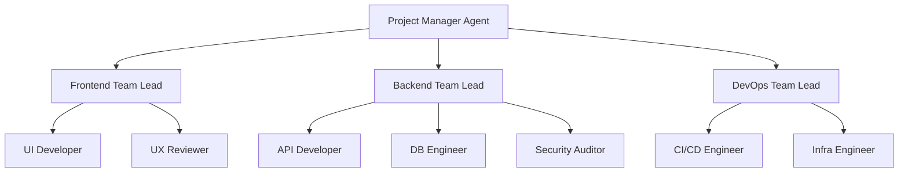
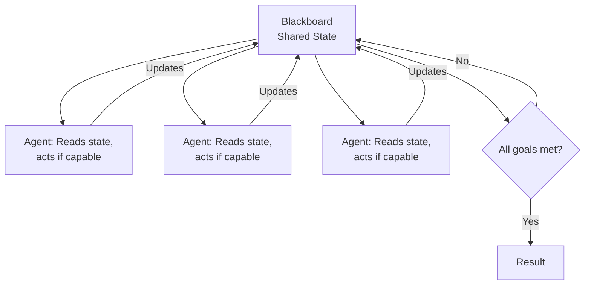
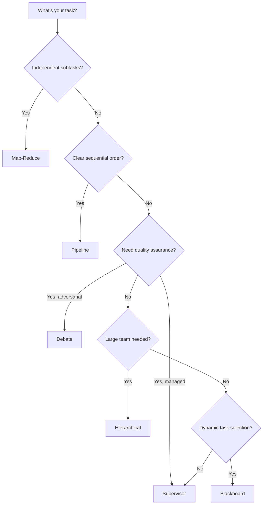

# Multi-Agent Patterns for Software Development

> Patterns, architectures, and working implementations for multi-agent coding systems. Covers task decomposition, debate, review chains, supervisor patterns, and more.

## Table of Contents

1. [Core Multi-Agent Patterns](#core-multi-agent-patterns)
2. [Pattern 1: Supervisor / Manager](#pattern-1-supervisor--manager)
3. [Pattern 2: Pipeline / Sequential Chain](#pattern-2-pipeline--sequential-chain)
4. [Pattern 3: Debate / Adversarial Review](#pattern-3-debate--adversarial-review)
5. [Pattern 4: Map-Reduce / Fan-Out](#pattern-4-map-reduce--fan-out)
6. [Pattern 5: Hierarchical Teams](#pattern-5-hierarchical-teams)
7. [Pattern 6: Blackboard / Shared Workspace](#pattern-6-blackboard--shared-workspace)
8. [Choosing the Right Pattern](#choosing-the-right-pattern)
9. [Production Implementation with LangGraph](#production-implementation-with-langgraph)

---

## Core Multi-Agent Patterns



| Pattern | When to Use | Strengths | Weaknesses |
|---------|------------|-----------|------------|
| **Supervisor** | Complex tasks needing coordination | Centralized control, flexible routing | Bottleneck at supervisor, single point of failure |
| **Pipeline** | Sequential workflows (plan-code-test) | Simple, predictable, easy to debug | No parallelism, inflexible ordering |
| **Debate** | Code review, design decisions | Higher quality outputs, catches errors | Slower, more tokens, may not converge |
| **Map-Reduce** | Large codebases, parallel tasks | Fast for independent subtasks | No inter-task communication during execution |
| **Hierarchical** | Large teams, complex projects | Scales well, clear responsibility | Complex setup, communication overhead |
| **Blackboard** | Iterative refinement, research | Flexible, agents self-select tasks | Hard to predict execution order |

---

## Pattern 1: Supervisor / Manager

A central supervisor agent receives the task, decomposes it, delegates to specialist agents, monitors progress, and synthesizes the final output.



### Implementation

```python
import anthropic
from dataclasses import dataclass, field
from enum import Enum
from typing import Optional

client = anthropic.Anthropic()

class TaskStatus(Enum):
    PENDING = "pending"
    IN_PROGRESS = "in_progress"
    REVIEW = "review"
    COMPLETE = "complete"
    FAILED = "failed"

@dataclass
class SubTask:
    id: str
    description: str
    assigned_to: str
    status: TaskStatus = TaskStatus.PENDING
    result: str = ""
    dependencies: list = field(default_factory=list)

@dataclass
class SupervisorState:
    original_task: str
    subtasks: list = field(default_factory=list)
    completed: list = field(default_factory=list)
    iteration: int = 0

SPECIALIST_PROMPTS = {
    "planner": (
        "You are a technical planner. Given a task, break it into 3-7 ordered subtasks. "
        "For each subtask specify: id, description, assigned_to (coder/reviewer/tester), "
        "and dependencies (list of subtask ids). Output valid JSON."
    ),
    "coder": (
        "You are a senior developer. Implement the described task. "
        "Output complete, runnable code with clear comments. "
        "Include error handling and type hints."
    ),
    "reviewer": (
        "You are a code reviewer. Check for:\n"
        "- Bugs and logic errors\n"
        "- Security vulnerabilities\n"
        "- Performance issues\n"
        "- Missing error handling\n"
        "Output: APPROVED or CHANGES_NEEDED with specific feedback."
    ),
    "tester": (
        "You are a QA engineer. Write comprehensive tests:\n"
        "- Unit tests for each function\n"
        "- Edge cases\n"
        "- Integration tests where needed\n"
        "Output: Complete test file using pytest."
    ),
}

def call_specialist(role: str, task_description: str, context: str = "") -> str:
    """Call a specialist agent and return its response."""
    prompt = f"Context:\n{context}\n\nTask:\n{task_description}" if context else task_description

    response = client.messages.create(
        model="claude-sonnet-4-20250514",
        max_tokens=4096,
        system=SPECIALIST_PROMPTS[role],
        messages=[{"role": "user", "content": prompt}]
    )
    return "".join(b.text for b in response.content if hasattr(b, "text"))

def run_supervisor(task: str, max_rounds: int = 5) -> dict:
    """Run the supervisor pattern."""
    state = SupervisorState(original_task=task)

    # Step 1: Plan
    plan_output = call_specialist("planner", task)
    print(f"[Supervisor] Plan created:\n{plan_output[:300]}...")

    # Step 2: Execute subtasks in dependency order
    # (simplified — real implementation would parse the JSON plan)
    context_accumulator = f"Original task: {task}\nPlan: {plan_output}\n"

    for round_num in range(max_rounds):
        state.iteration = round_num + 1

        # Code
        code_result = call_specialist("coder", task, context_accumulator)
        context_accumulator += f"\nImplementation:\n{code_result}\n"

        # Review
        review_result = call_specialist("reviewer", "Review this code", context_accumulator)
        context_accumulator += f"\nReview:\n{review_result}\n"

        if "APPROVED" in review_result:
            # Test
            test_result = call_specialist("tester", "Write tests for this code", context_accumulator)
            return {
                "status": "complete",
                "rounds": state.iteration,
                "plan": plan_output,
                "code": code_result,
                "review": review_result,
                "tests": test_result
            }
        else:
            # Feed review back to coder
            context_accumulator += "\nPlease address the review feedback.\n"

    return {"status": "max_rounds_reached", "rounds": state.iteration}

# Usage
result = run_supervisor("Build a thread-safe LRU cache with TTL support in Python")
```

---

## Pattern 2: Pipeline / Sequential Chain

Each agent's output feeds directly into the next. Used for well-defined workflows like plan-code-review-test.



### Implementation

```python
from dataclasses import dataclass
from typing import Callable

@dataclass
class PipelineStage:
    name: str
    role: str
    prompt_template: str
    validator: Callable = None  # Optional validation function

class AgentPipeline:
    """Sequential agent pipeline with validation gates."""

    def __init__(self, stages: list[PipelineStage]):
        self.stages = stages
        self.results = {}

    def run(self, initial_input: str) -> dict:
        current_input = initial_input
        context = f"Original requirement: {initial_input}\n\n"

        for stage in self.stages:
            print(f"[Pipeline] Running stage: {stage.name}")

            prompt = stage.prompt_template.format(
                input=current_input,
                context=context
            )

            result = call_specialist(stage.role, prompt)
            self.results[stage.name] = result

            # Run validator if present
            if stage.validator and not stage.validator(result):
                print(f"[Pipeline] Validation failed at stage: {stage.name}")
                return {
                    "status": "failed",
                    "failed_stage": stage.name,
                    "results": self.results
                }

            context += f"## {stage.name} Output\n{result}\n\n"
            current_input = result

        return {"status": "complete", "results": self.results}

# Define the pipeline
pipeline = AgentPipeline([
    PipelineStage(
        name="requirements",
        role="planner",
        prompt_template="Analyze and formalize these requirements:\n{input}"
    ),
    PipelineStage(
        name="architecture",
        role="planner",
        prompt_template=(
            "Design the architecture based on these requirements:\n{input}\n\n"
            "Full context:\n{context}"
        )
    ),
    PipelineStage(
        name="implementation",
        role="coder",
        prompt_template=(
            "Implement based on this architecture:\n{input}\n\n"
            "Full context:\n{context}"
        )
    ),
    PipelineStage(
        name="review",
        role="reviewer",
        prompt_template="Review this implementation:\n{input}\n\nContext:\n{context}",
        validator=lambda result: "APPROVED" in result
    ),
    PipelineStage(
        name="testing",
        role="tester",
        prompt_template="Write tests for:\n{input}\n\nContext:\n{context}"
    ),
])

result = pipeline.run("Build a webhook handler that validates signatures and retries failed deliveries")
```

---

## Pattern 3: Debate / Adversarial Review

Two or more agents argue opposing positions, and a judge agent selects the best approach. Excellent for design decisions and code review.



### Implementation

```python
@dataclass
class DebateRound:
    round_num: int
    proposal: str
    critique: str
    judge_verdict: str

def run_debate(question: str, max_rounds: int = 3) -> dict:
    """Run a debate between advocate and critic agents."""
    rounds = []
    context = f"Question: {question}\n\n"

    for round_num in range(1, max_rounds + 1):
        # Advocate proposes or defends
        if round_num == 1:
            advocate_prompt = f"Propose the best solution for:\n{question}"
        else:
            advocate_prompt = (
                f"The critic raised these concerns:\n{rounds[-1].critique}\n\n"
                f"Defend or improve your proposal. Address each concern specifically."
            )

        proposal = client.messages.create(
            model="claude-sonnet-4-20250514",
            max_tokens=2048,
            system=(
                "You are a solution advocate. Propose and defend the best technical "
                "approach. Be specific with code examples. When addressing critiques, "
                "either refute them with evidence or incorporate them into an improved solution."
            ),
            messages=[{"role": "user", "content": f"{context}\n{advocate_prompt}"}]
        )
        proposal_text = "".join(b.text for b in proposal.content if hasattr(b, "text"))

        # Critic challenges
        critique = client.messages.create(
            model="claude-sonnet-4-20250514",
            max_tokens=2048,
            system=(
                "You are a technical critic. Find weaknesses, edge cases, security "
                "issues, and scalability problems in proposals. Be constructive but "
                "thorough. Rate severity of each issue (critical/major/minor)."
            ),
            messages=[{"role": "user", "content": (
                f"{context}\nProposal:\n{proposal_text}\n\n"
                "Critique this proposal. Identify all weaknesses."
            )}]
        )
        critique_text = "".join(b.text for b in critique.content if hasattr(b, "text"))

        # Judge evaluates
        verdict = client.messages.create(
            model="claude-sonnet-4-20250514",
            max_tokens=1024,
            system=(
                "You are a technical judge. Evaluate the debate and decide:\n"
                "- CONSENSUS: The proposal adequately addresses all critical concerns\n"
                "- CONTINUE: There are unresolved critical issues needing another round\n"
                "- DEADLOCK: Fundamental disagreement that needs human input\n"
                "Explain your reasoning."
            ),
            messages=[{"role": "user", "content": (
                f"{context}\n"
                f"Round {round_num} Proposal:\n{proposal_text}\n\n"
                f"Round {round_num} Critique:\n{critique_text}\n\n"
                "What is your verdict?"
            )}]
        )
        verdict_text = "".join(b.text for b in verdict.content if hasattr(b, "text"))

        round_data = DebateRound(
            round_num=round_num,
            proposal=proposal_text,
            critique=critique_text,
            judge_verdict=verdict_text
        )
        rounds.append(round_data)

        context += (
            f"## Round {round_num}\n"
            f"Proposal: {proposal_text[:300]}...\n"
            f"Critique: {critique_text[:300]}...\n"
            f"Verdict: {verdict_text[:200]}...\n\n"
        )

        if "CONSENSUS" in verdict_text:
            return {
                "status": "consensus",
                "rounds": round_num,
                "final_proposal": proposal_text,
                "debate_history": rounds
            }
        elif "DEADLOCK" in verdict_text:
            return {
                "status": "deadlock",
                "rounds": round_num,
                "debate_history": rounds
            }

    return {"status": "max_rounds", "rounds": max_rounds, "debate_history": rounds}

# Usage
result = run_debate(
    "Should we use a microservices or monolith architecture for a "
    "new e-commerce platform expecting 10K daily active users?"
)
```

---

## Pattern 4: Map-Reduce / Fan-Out

Split a large task into independent subtasks, process them in parallel, then aggregate results.



### Implementation

```python
import asyncio
from concurrent.futures import ThreadPoolExecutor

def split_task(task: str, codebase_files: list[str]) -> list[dict]:
    """Use an LLM to split a task across files/modules."""
    response = client.messages.create(
        model="claude-sonnet-4-20250514",
        max_tokens=2048,
        system=(
            "You are a task decomposer. Split the given task into independent subtasks "
            "that can be processed in parallel. Output JSON array of objects with "
            "'subtask_id', 'description', and 'files' (list of relevant file paths)."
        ),
        messages=[{"role": "user", "content": (
            f"Task: {task}\n\nAvailable files:\n" + "\n".join(codebase_files)
        )}]
    )
    text = "".join(b.text for b in response.content if hasattr(b, "text"))
    # Parse JSON from response (simplified)
    import json
    try:
        return json.loads(text)
    except json.JSONDecodeError:
        # Fallback: one subtask per file
        return [
            {"subtask_id": f"task_{i}", "description": task, "files": [f]}
            for i, f in enumerate(codebase_files)
        ]

def process_subtask(subtask: dict) -> dict:
    """Process a single subtask."""
    response = call_specialist(
        "coder",
        f"Task: {subtask['description']}\nFiles: {subtask['files']}"
    )
    return {"subtask_id": subtask["subtask_id"], "result": response}

def aggregate_results(original_task: str, results: list[dict]) -> str:
    """Combine all subtask results into a unified output."""
    results_text = "\n\n".join(
        f"## Subtask {r['subtask_id']}\n{r['result']}" for r in results
    )
    response = client.messages.create(
        model="claude-sonnet-4-20250514",
        max_tokens=4096,
        system=(
            "You are a code integrator. Combine the results from parallel subtasks "
            "into a coherent, unified solution. Resolve any conflicts or inconsistencies."
        ),
        messages=[{"role": "user", "content": (
            f"Original task: {original_task}\n\nSubtask results:\n{results_text}"
        )}]
    )
    return "".join(b.text for b in response.content if hasattr(b, "text"))

def run_map_reduce(task: str, files: list[str], max_workers: int = 4) -> str:
    """Run the map-reduce pattern with parallel execution."""
    # Map phase: split and process
    subtasks = split_task(task, files)
    print(f"[MapReduce] Split into {len(subtasks)} subtasks")

    with ThreadPoolExecutor(max_workers=max_workers) as executor:
        results = list(executor.map(process_subtask, subtasks))

    # Reduce phase: aggregate
    final = aggregate_results(task, results)
    return final

# Usage
files = ["src/auth.py", "src/database.py", "src/api.py", "src/models.py"]
result = run_map_reduce("Add comprehensive type hints to all modules", files)
```

---

## Pattern 5: Hierarchical Teams

Nested teams with team leads that can further delegate. Mimics real engineering organizations.



### Implementation

```python
@dataclass
class TeamConfig:
    name: str
    lead_prompt: str
    members: dict  # role -> system_prompt

class HierarchicalTeam:
    """A team with a lead who delegates to members."""

    def __init__(self, config: TeamConfig):
        self.config = config

    def run(self, task: str, context: str = "") -> dict:
        # Team lead decomposes the task for their team
        lead_response = client.messages.create(
            model="claude-sonnet-4-20250514",
            max_tokens=2048,
            system=self.config.lead_prompt,
            messages=[{"role": "user", "content": (
                f"Context: {context}\n\nTask for your team: {task}\n\n"
                f"Your team members: {list(self.config.members.keys())}\n"
                "Decompose this into assignments for each team member."
            )}]
        )
        lead_plan = "".join(b.text for b in lead_response.content if hasattr(b, "text"))

        # Each member executes their part
        member_results = {}
        for role, prompt in self.config.members.items():
            response = client.messages.create(
                model="claude-sonnet-4-20250514",
                max_tokens=2048,
                system=prompt,
                messages=[{"role": "user", "content": (
                    f"Team lead's plan:\n{lead_plan}\n\n"
                    f"Your assignment (role: {role}): Execute your part of the plan."
                )}]
            )
            member_results[role] = "".join(
                b.text for b in response.content if hasattr(b, "text")
            )

        # Team lead integrates results
        integration = client.messages.create(
            model="claude-sonnet-4-20250514",
            max_tokens=2048,
            system=self.config.lead_prompt,
            messages=[{"role": "user", "content": (
                f"Original task: {task}\n\nTeam results:\n" +
                "\n\n".join(f"## {role}\n{result}" for role, result in member_results.items()) +
                "\n\nIntegrate these results into a cohesive deliverable."
            )}]
        )
        integrated = "".join(b.text for b in integration.content if hasattr(b, "text"))

        return {
            "team": self.config.name,
            "plan": lead_plan,
            "member_results": member_results,
            "integrated_result": integrated
        }

# Define teams
backend_team = HierarchicalTeam(TeamConfig(
    name="Backend",
    lead_prompt=(
        "You are a backend team lead with expertise in API design, databases, "
        "and system architecture. Decompose tasks and integrate your team's work."
    ),
    members={
        "api_developer": "You are an API developer. Build clean REST/GraphQL endpoints.",
        "db_engineer": "You are a database engineer. Design schemas and write migrations.",
        "security_auditor": "You are a security auditor. Review for OWASP top 10 vulnerabilities.",
    }
))

# Usage
result = backend_team.run("Build user authentication with OAuth2 and JWT tokens")
```

---

## Pattern 6: Blackboard / Shared Workspace

Agents observe a shared workspace and self-select tasks based on their expertise. The workspace evolves until all goals are met.



### Implementation

```python
import threading
from datetime import datetime

@dataclass
class BlackboardEntry:
    content: str
    author: str
    entry_type: str  # "goal", "claim", "artifact", "issue", "resolution"
    timestamp: str = field(default_factory=lambda: datetime.now().isoformat())
    status: str = "open"  # "open", "in_progress", "resolved"

class Blackboard:
    """Thread-safe shared workspace for agents."""

    def __init__(self):
        self.entries: list[BlackboardEntry] = []
        self.lock = threading.Lock()

    def post(self, entry: BlackboardEntry):
        with self.lock:
            self.entries.append(entry)

    def read(self, entry_type: str = None, status: str = None) -> list[BlackboardEntry]:
        with self.lock:
            results = self.entries.copy()
        if entry_type:
            results = [e for e in results if e.entry_type == entry_type]
        if status:
            results = [e for e in results if e.status == status]
        return results

    def claim(self, entry_index: int, agent_name: str) -> bool:
        with self.lock:
            if self.entries[entry_index].status == "open":
                self.entries[entry_index].status = "in_progress"
                self.entries[entry_index].author = agent_name
                return True
            return False

    def get_state_summary(self) -> str:
        goals = self.read(entry_type="goal")
        open_goals = [g for g in goals if g.status == "open"]
        in_progress = [g for g in goals if g.status == "in_progress"]
        resolved = [g for g in goals if g.status == "resolved"]
        artifacts = self.read(entry_type="artifact")
        issues = self.read(entry_type="issue", status="open")

        return (
            f"Goals: {len(resolved)}/{len(goals)} resolved, "
            f"{len(in_progress)} in progress, {len(open_goals)} open\n"
            f"Artifacts: {len(artifacts)}\n"
            f"Open issues: {len(issues)}\n"
        )

    @property
    def all_goals_met(self) -> bool:
        goals = self.read(entry_type="goal")
        return goals and all(g.status == "resolved" for g in goals)


class BlackboardAgent:
    """An agent that reads the blackboard and contributes when it can."""

    def __init__(self, name: str, expertise: str, system_prompt: str):
        self.name = name
        self.expertise = expertise
        self.system_prompt = system_prompt

    def evaluate_and_act(self, blackboard: Blackboard) -> bool:
        """Check the blackboard and act if there's relevant work."""
        state = blackboard.get_state_summary()
        open_goals = blackboard.read(entry_type="goal", status="open")
        open_issues = blackboard.read(entry_type="issue", status="open")

        if not open_goals and not open_issues:
            return False

        # Ask the agent if it can contribute
        items = [f"- [Goal] {g.content}" for g in open_goals]
        items += [f"- [Issue] {i.content}" for i in open_issues]

        response = client.messages.create(
            model="claude-sonnet-4-20250514",
            max_tokens=2048,
            system=self.system_prompt,
            messages=[{"role": "user", "content": (
                f"Blackboard state:\n{state}\n\n"
                f"Open items:\n" + "\n".join(items) + "\n\n"
                f"Your expertise: {self.expertise}\n"
                "If you can contribute to any open item, do so now. "
                "Output your contribution and which item you're addressing."
            )}]
        )
        contribution = "".join(b.text for b in response.content if hasattr(b, "text"))

        if contribution and "cannot contribute" not in contribution.lower():
            blackboard.post(BlackboardEntry(
                content=contribution,
                author=self.name,
                entry_type="artifact"
            ))
            return True
        return False


def run_blackboard(task: str, agents: list[BlackboardAgent], max_rounds: int = 10) -> Blackboard:
    """Run the blackboard pattern."""
    bb = Blackboard()

    # Decompose task into goals
    goals_response = client.messages.create(
        model="claude-sonnet-4-20250514",
        max_tokens=1024,
        system="Decompose this task into 3-5 specific, independent goals. Output one goal per line.",
        messages=[{"role": "user", "content": task}]
    )
    goals_text = "".join(b.text for b in goals_response.content if hasattr(b, "text"))
    for line in goals_text.strip().split("\n"):
        if line.strip():
            bb.post(BlackboardEntry(content=line.strip(), author="system", entry_type="goal"))

    # Run rounds
    for round_num in range(max_rounds):
        if bb.all_goals_met:
            break

        for agent in agents:
            agent.evaluate_and_act(bb)

        # Mark goals as resolved if artifacts address them
        # (simplified — real implementation would use LLM to evaluate)
        print(f"[Blackboard] Round {round_num + 1}: {bb.get_state_summary()}")

    return bb
```

---

## Choosing the Right Pattern



| Project Type | Recommended Pattern | Example |
|-------------|-------------------|---------|
| Bug fix from issue | Supervisor | SWE-agent style: localize, fix, test |
| New feature development | Pipeline or Hierarchical | Plan, code, review, test |
| Architecture decision | Debate | Microservices vs monolith |
| Large-scale refactoring | Map-Reduce | Type hints across 50 files |
| Complex system build | Hierarchical | Full-stack app with multiple teams |
| Research / exploration | Blackboard | Investigate performance regression |

---

## Production Implementation with LangGraph

Here is a production-grade supervisor pattern using LangGraph:

```python
from langgraph.graph import StateGraph, MessagesState, START, END
from langgraph.prebuilt import create_react_agent
from langchain_anthropic import ChatAnthropic
from langchain_core.messages import HumanMessage
from typing import Literal, Annotated
from typing_extensions import TypedDict
import operator

# State shared across all agents
class TeamState(TypedDict):
    messages: Annotated[list, operator.add]
    next_agent: str
    task_status: str

# Create specialized agents
model = ChatAnthropic(model="claude-sonnet-4-20250514")

def create_coder_node(state: TeamState) -> dict:
    """Coder agent processes the current task."""
    response = model.invoke(
        [{"role": "system", "content": "You are a senior developer. Write clean code."}]
        + state["messages"]
    )
    return {
        "messages": [response],
        "task_status": "coded"
    }

def create_reviewer_node(state: TeamState) -> dict:
    """Reviewer agent checks the code."""
    response = model.invoke(
        [{"role": "system", "content": "Review code. Output APPROVED or CHANGES_NEEDED."}]
        + state["messages"]
    )
    return {
        "messages": [response],
        "task_status": "reviewed"
    }

def create_tester_node(state: TeamState) -> dict:
    """Tester agent writes and runs tests."""
    response = model.invoke(
        [{"role": "system", "content": "Write comprehensive pytest tests."}]
        + state["messages"]
    )
    return {
        "messages": [response],
        "task_status": "tested"
    }

def supervisor_router(state: TeamState) -> Literal["coder", "reviewer", "tester", "__end__"]:
    """Supervisor decides which agent goes next."""
    last_message = state["messages"][-1].content if state["messages"] else ""
    status = state.get("task_status", "")

    if status == "" or (status == "reviewed" and "CHANGES_NEEDED" in last_message):
        return "coder"
    elif status == "coded":
        return "reviewer"
    elif status == "reviewed" and "APPROVED" in last_message:
        return "tester"
    elif status == "tested":
        return "__end__"
    return "__end__"

# Build the graph
workflow = StateGraph(TeamState)

workflow.add_node("coder", create_coder_node)
workflow.add_node("reviewer", create_reviewer_node)
workflow.add_node("tester", create_tester_node)

workflow.add_conditional_edges(START, supervisor_router)
workflow.add_conditional_edges("coder", supervisor_router)
workflow.add_conditional_edges("reviewer", supervisor_router)
workflow.add_conditional_edges("tester", supervisor_router)

app = workflow.compile()

# Run
result = app.invoke({
    "messages": [HumanMessage(content="Build a rate limiter using token bucket algorithm")],
    "next_agent": "",
    "task_status": ""
})
```

---

## Sources

- [Kore.ai - Choosing the Right Orchestration Pattern](https://www.kore.ai/blog/choosing-the-right-orchestration-pattern-for-multi-agent-systems)
- [AWS - Multi-Agent Orchestration with Reasoning](https://aws.amazon.com/blogs/machine-learning/design-multi-agent-orchestration-with-reasoning-using-amazon-bedrock-and-open-source-frameworks/)
- [LangGraph Supervisor](https://github.com/langchain-ai/langgraph-supervisor-py)
- [Deloitte - AI Agent Orchestration](https://www.deloitte.com/us/en/insights/industry/technology/technology-media-and-telecom-predictions/2026/ai-agent-orchestration.html)
- [Multi-Agent Frameworks Explained (2026)](https://www.adopt.ai/blog/multi-agent-frameworks)
- [How to Build Multi-Agent Systems (2026 Guide)](https://dev.to/eira-wexford/how-to-build-multi-agent-systems-complete-2026-guide-1io6)
- [CrewAI Framework](https://crewai.com/)
- [MetaGPT Paper](https://arxiv.org/abs/2308.00352)
- [Composio Agent Orchestrator](https://github.com/ComposioHQ/agent-orchestrator)
