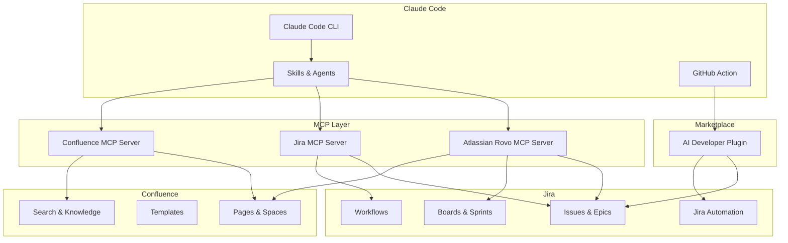

# Atlassian Integration with Claude Code

## Overview

Claude Code integrates with Atlassian products (Jira and Confluence) through the official Atlassian Rovo MCP server, third-party MCP servers, and the Atlassian Marketplace. This enables AI-powered issue management, automated implementation workflows, and knowledge base integration.

## Architecture



## Quick Start

### Option 1: Atlassian Rovo MCP Server (Official, Recommended)

```bash
# Add the Atlassian Rovo MCP server
claude mcp add atlassian \
  --transport stdio \
  -- npx -y @anthropic-ai/atlassian-mcp-server
```

Configure authentication:

```json
// .claude/mcp.json
{
  "mcpServers": {
    "atlassian": {
      "command": "npx",
      "args": ["-y", "@anthropic-ai/atlassian-mcp-server"],
      "env": {
        "ATLASSIAN_SITE": "your-org.atlassian.net",
        "ATLASSIAN_EMAIL": "you@company.com",
        "ATLASSIAN_API_TOKEN": "your-api-token"
      }
    }
  }
}
```

### Option 2: Composio Jira MCP

```bash
pip install composio-claude
composio add jira
```

### Option 3: Community Jira MCP Server

```bash
claude mcp add jira \
  --transport stdio \
  -- npx -y mcp-jira-server
```

## Getting an API Token

1. Go to https://id.atlassian.com/manage-profile/security/api-tokens
2. Click "Create API token"
3. Give it a descriptive label (e.g., "Claude Code MCP")
4. Copy the token and store it securely

## MCP Server Capabilities

### Jira Tools

| Tool | Description |
|------|-------------|
| `jira_search` | Search issues with JQL |
| `jira_get_issue` | Get issue details |
| `jira_create_issue` | Create a new issue |
| `jira_update_issue` | Update issue fields |
| `jira_transition_issue` | Change issue status |
| `jira_add_comment` | Add a comment to an issue |
| `jira_assign_issue` | Assign an issue |
| `jira_get_sprint` | Get current sprint info |
| `jira_get_board` | Get board configuration |

### Confluence Tools

| Tool | Description |
|------|-------------|
| `confluence_search` | Search pages and spaces |
| `confluence_get_page` | Get page content |
| `confluence_create_page` | Create a new page |
| `confluence_update_page` | Update page content |
| `confluence_get_space` | Get space information |

## AI Developer (Marketplace Plugin)

The AI Developer plugin (v2.4.0+) runs Claude Code directly inside Jira:

1. Assign an issue to "AI Developer"
2. It analyzes the task
3. Creates a Git branch
4. Implements the solution
5. Posts results as a Jira comment
6. Optionally opens a PR

## File Index

- [skills.md](skills.md) - Jira/Confluence skills
- [agents.md](agents.md) - Atlassian agents
- [slash_commands.md](slash_commands.md) - Atlassian slash commands
- [mcp_setup.md](mcp_setup.md) - Detailed MCP server setup guide

## Sources

- [Atlassian Claude Plugin](https://claude.com/plugins/atlassian)
- [Jira MCP Community Discussion](https://community.atlassian.com/forums/Jira-questions/Claude-Code-Jira-MCP/qaq-p/3122551)
- [AI Developer Marketplace](https://marketplace.atlassian.com/apps/68132688/ai-developer-integration-of-claude-code)
- [Composio Jira MCP](https://composio.dev/content/jira-mcp-server)
- [Jira MCP Server (Community)](https://github.com/tom28881/mcp-jira-server)
