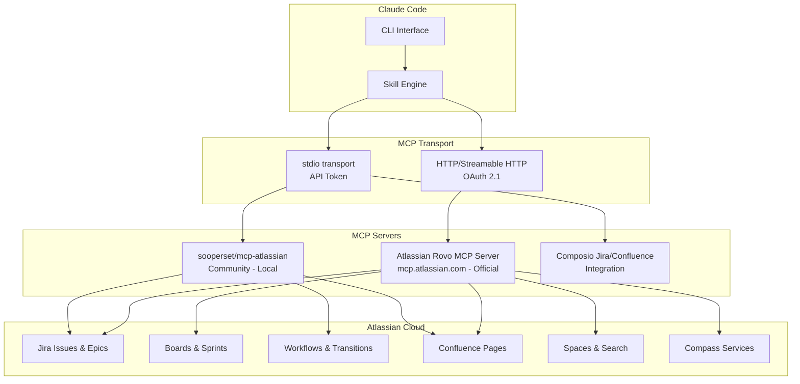

# Setting Up MCP Servers for Atlassian (Jira, Confluence, Compass)

## Overview

The Model Context Protocol (MCP) connects Claude Code to Atlassian Cloud products -- Jira, Confluence, and Compass -- through the official Atlassian Rovo MCP Server. This enables AI-powered issue management, documentation access, and project tracking directly from your terminal.

## Architecture



## Prerequisites

```bash
# Verify requirements
node --version    # 18+ (for community servers)
python3 --version # 3.10+ (for sooperset server)
claude --version  # Latest
```

You also need:
- An Atlassian Cloud site (e.g., `your-org.atlassian.net`)
- A user account with appropriate project/space permissions

## Option 1: Atlassian Rovo MCP Server (Official, Recommended)

The official Atlassian remote MCP server uses OAuth 2.1 for authentication. No local installation required.

### Install via CLI

```bash
claude mcp add atlassian \
  --transport http \
  --url "https://mcp.atlassian.com/v1/mcp"
```

> **Important (June 2026):** The older SSE endpoint `https://mcp.atlassian.com/v1/sse` is being retired after June 30, 2026. Use `https://mcp.atlassian.com/v1/mcp` instead.

### Configuration File

```json
// .claude/mcp.json
{
  "mcpServers": {
    "atlassian": {
      "type": "http",
      "url": "https://mcp.atlassian.com/v1/mcp"
    }
  }
}
```

On first connection, Claude Code opens your browser to complete the OAuth 2.1 authorization flow. The server supports dynamic client registration, so you do not need to create an OAuth app manually.

### API Token Authentication (Alternative)

If you prefer API token authentication over OAuth:

```json
// .claude/mcp.json
{
  "mcpServers": {
    "atlassian": {
      "type": "http",
      "url": "https://mcp.atlassian.com/v1/mcp",
      "headers": {
        "Authorization": "Basic ${ATLASSIAN_AUTH_TOKEN}"
      }
    }
  }
}
```

Generate the auth token:
```bash
# Base64 encode email:api-token
export ATLASSIAN_AUTH_TOKEN=$(echo -n "you@company.com:your-api-token" | base64)
```

## Option 2: Community MCP Server (sooperset/mcp-atlassian)

A well-maintained community server supporting both Jira and Confluence with local execution.

### Install via pip

```bash
pip install mcp-atlassian
```

### Claude Code Configuration

```bash
claude mcp add atlassian \
  --transport stdio \
  -- python -m mcp_atlassian \
    --jira-url https://your-org.atlassian.net \
    --jira-email you@company.com \
    --confluence-url https://your-org.atlassian.net/wiki
```

### Configuration File

```json
// .claude/mcp.json
{
  "mcpServers": {
    "atlassian": {
      "command": "python",
      "args": [
        "-m", "mcp_atlassian",
        "--jira-url", "https://your-org.atlassian.net",
        "--jira-email", "you@company.com",
        "--confluence-url", "https://your-org.atlassian.net/wiki"
      ],
      "env": {
        "JIRA_API_TOKEN": "${ATLASSIAN_API_TOKEN}",
        "CONFLUENCE_API_TOKEN": "${ATLASSIAN_API_TOKEN}"
      }
    }
  }
}
```

## Option 3: Composio Integration

```bash
pip install composio-claude
composio add jira
composio add confluence
```

---

## Authentication Setup

### Get an API Token

1. Go to https://id.atlassian.com/manage-profile/security/api-tokens
2. Click "Create API token"
3. Give it a descriptive label (e.g., "Claude Code MCP")
4. Copy the token and store it securely

### Required Permissions

The MCP server respects your existing Atlassian Cloud permissions:
- **Jira**: You can only access projects and issues you have permission to view
- **Confluence**: You can only access spaces and pages you have permission to view
- **Compass**: Requires Compass access on your site

No additional admin configuration is needed beyond your existing user permissions.

### Store Credentials Securely

```bash
# Shell profile
echo 'export ATLASSIAN_API_TOKEN="your-api-token"' >> ~/.zshrc
echo 'export ATLASSIAN_EMAIL="you@company.com"' >> ~/.zshrc
echo 'export ATLASSIAN_SITE="your-org.atlassian.net"' >> ~/.zshrc

# macOS Keychain
security add-generic-password -s "atlassian-mcp" -a "$USER" -w "your-api-token"
```

## MCP Server Tools

### Jira Tools

| Tool | Description |
|------|-------------|
| `jira_search` | Search issues using JQL or natural language |
| `jira_get_issue` | Get full issue details (description, comments, attachments) |
| `jira_create_issue` | Create a new issue (story, bug, task, epic) |
| `jira_update_issue` | Update issue fields (summary, description, priority, labels) |
| `jira_transition_issue` | Move an issue through workflow states |
| `jira_add_comment` | Add a comment to an issue |
| `jira_assign_issue` | Assign an issue to a user |
| `jira_get_sprint` | Get current sprint info for a board |
| `jira_get_board` | Get board configuration and columns |

### Confluence Tools

| Tool | Description |
|------|-------------|
| `confluence_search` | Search pages and spaces by keyword or CQL |
| `confluence_get_page` | Get page content in markdown format |
| `confluence_create_page` | Create a new page in a space |
| `confluence_update_page` | Update page content |
| `confluence_get_space` | Get space information and structure |

### Compass Tools (Rovo Server)

| Tool | Description |
|------|-------------|
| `compass_get_component` | Get component details |
| `compass_search_components` | Search for components |

---

## Verification

After setup, verify the MCP server is connected:

```bash
# List configured MCP servers
claude mcp list

# Test the Jira connection
claude "Search for open bugs assigned to me in Jira"

# Test the Confluence connection
claude "Search Confluence for our deployment runbook"

# Check server health
/mcp
```

## Troubleshooting

| Issue | Solution |
|-------|----------|
| `OAuth flow does not complete` | Clear browser cookies for atlassian.com; try incognito |
| `401 Unauthorized` | Verify API token is valid; regenerate at id.atlassian.com |
| `403 Forbidden` | Check your Jira/Confluence project permissions |
| `SSE endpoint deprecated` | Switch from `/v1/sse` to `/v1/mcp` (required after June 30, 2026) |
| `No issues found` | Verify JQL syntax; check that your user can see the project |
| `Community server won't start` | Ensure `pip install mcp-atlassian` completed; check Python 3.10+ |
| `Connection timeout` | Check your site URL is correct (include `.atlassian.net`) |

## Sources

- [Atlassian Rovo MCP Server - Getting Started](https://support.atlassian.com/atlassian-rovo-mcp-server/docs/getting-started-with-the-atlassian-remote-mcp-server/)
- [Atlassian Rovo MCP Server - Client Setup](https://support.atlassian.com/atlassian-rovo-mcp-server/docs/setting-up-clients/)
- [Atlassian Remote MCP Server Platform Page](https://www.atlassian.com/platform/remote-mcp-server)
- [Official Atlassian MCP Server Repository](https://github.com/atlassian/atlassian-mcp-server)
- [Community mcp-atlassian Server](https://github.com/sooperset/mcp-atlassian)
- [Connect Atlassian MCP to Claude Code (Medium)](https://medium.com/@milad.jafary/how-to-connect-atlassian-mcp-server-to-claude-code-5c22d47d5cd5)
- [Atlassian MCP Setup Guide (Johnys.io)](https://blog.johnys.io/how-to-install-the-official-atlassian-mcp-server-for-claude-code-bitbucket-jira-and-confluence/)
