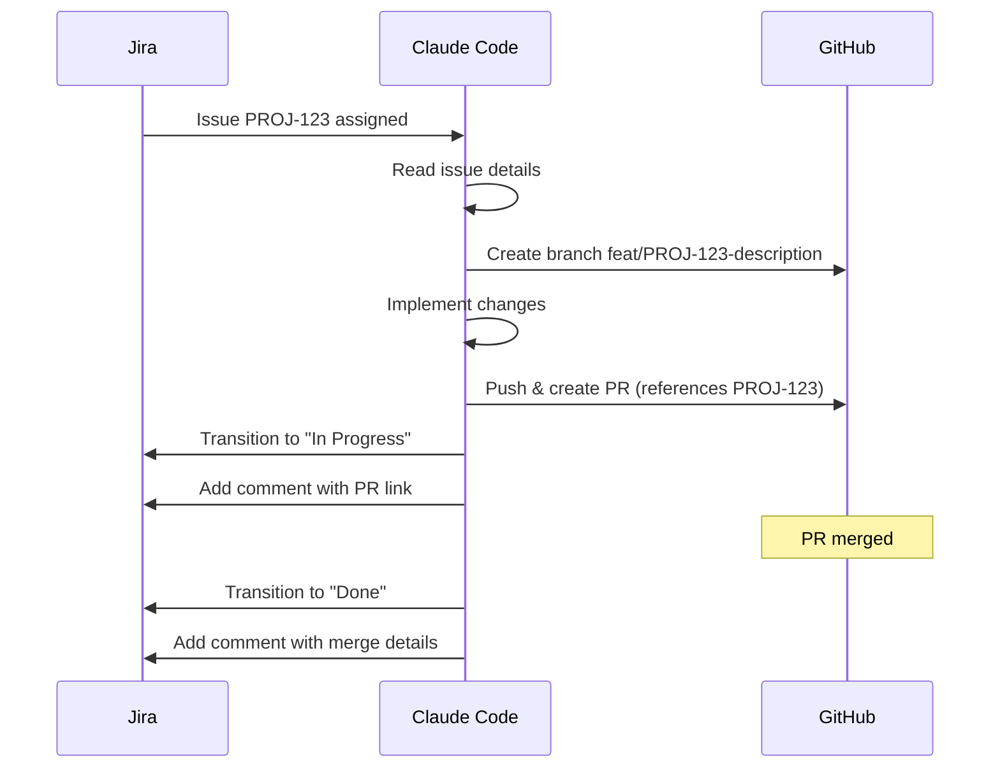

# Atlassian Skills for Claude Code

---

## Skill: Jira Issue Management

### `.claude/skills/jira-issues/SKILL.md`

```yaml
---
name: jira-issues
description: Create, update, search, and manage Jira issues
allowed-tools:
  - Bash
  - Read
  - mcp__atlassian__*
---
```

```markdown
# Jira Issue Management Skill

## JQL Quick Reference

### Common Queries
```
# My open issues
assignee = currentUser() AND status != Done ORDER BY priority

# Sprint backlog
sprint in openSprints() AND project = "PROJ"

# Recent bugs
type = Bug AND created >= -7d ORDER BY created DESC

# Unassigned high priority
priority in (Highest, High) AND assignee is EMPTY

# Blocked issues
status = "Blocked" AND project = "PROJ"

# Stale issues (no update in 30 days)
updated <= -30d AND status not in (Done, Closed)
```

### Advanced Queries
```
# Issues linked to a specific epic
"Epic Link" = PROJ-100

# Issues with specific label combinations
labels in (backend, critical) AND labels not in (wontfix)

# Issues changed this sprint
updated >= startOfSprint() AND project = "PROJ"
```

## Issue Creation Templates

### Bug Report
```json
{
  "project": {"key": "PROJ"},
  "issuetype": {"name": "Bug"},
  "summary": "[Component] Brief description of the bug",
  "description": {
    "type": "doc",
    "version": 1,
    "content": [
      {"type": "heading", "attrs": {"level": 2}, "content": [{"type": "text", "text": "Steps to Reproduce"}]},
      {"type": "orderedList", "content": [
        {"type": "listItem", "content": [{"type": "paragraph", "content": [{"type": "text", "text": "Step 1"}]}]}
      ]},
      {"type": "heading", "attrs": {"level": 2}, "content": [{"type": "text", "text": "Expected Behavior"}]},
      {"type": "paragraph", "content": [{"type": "text", "text": "What should happen"}]},
      {"type": "heading", "attrs": {"level": 2}, "content": [{"type": "text", "text": "Actual Behavior"}]},
      {"type": "paragraph", "content": [{"type": "text", "text": "What actually happens"}]}
    ]
  },
  "priority": {"name": "High"},
  "labels": ["bug", "needs-triage"]
}
```

### Feature Request
```json
{
  "project": {"key": "PROJ"},
  "issuetype": {"name": "Story"},
  "summary": "As a [user], I want [feature] so that [benefit]",
  "description": "...",
  "labels": ["feature-request"],
  "customfield_10001": "PROJ-50"
}
```

## Workflow Operations

### Transition an Issue
```bash
# Move issue to "In Progress"
# First, get available transitions
curl -s -u email:token \
  "https://org.atlassian.net/rest/api/3/issue/PROJ-123/transitions" | jq '.transitions[]'

# Then transition
curl -X POST -u email:token \
  -H "Content-Type: application/json" \
  "https://org.atlassian.net/rest/api/3/issue/PROJ-123/transitions" \
  -d '{"transition":{"id":"21"}}'
```

## Output Format

When presenting Jira data, use:

| Key | Summary | Status | Assignee | Priority |
|-----|---------|--------|----------|----------|
| PROJ-123 | Fix login bug | In Progress | @alice | High |
```

---

## Skill: Sprint Management

### `.claude/skills/jira-sprint/SKILL.md`

```yaml
---
name: jira-sprint
description: Manage sprints - view progress, identify blockers, generate reports
allowed-tools:
  - Bash
  - Read
  - mcp__atlassian__*
---
```

```markdown
# Sprint Management Skill

## Sprint Dashboard

Generate a sprint status overview:

```
## Sprint: Sprint 42 (Mar 18 - Mar 29)

### Progress
[=========>          ] 45% complete (9/20 story points done)

### By Status
| Status | Count | Points |
|--------|-------|--------|
| Done | 4 | 9 |
| In Progress | 3 | 7 |
| In Review | 2 | 4 |
| To Do | 5 | 10 |
| Blocked | 1 | 2 |

### Velocity
- Current sprint: 9 pts done (target: 20)
- Last sprint: 18 pts
- Average (last 5): 19.2 pts

### Risks
- PROJ-456 blocked for 3 days (waiting on API team)
- 11 story points remaining with 5 working days left
- Backend developer out sick (capacity reduced 20%)

### Recommendations
1. Unblock PROJ-456: escalate to API team lead
2. Consider descoping PROJ-789 (lowest priority, 3 pts)
3. Move PROJ-101 to next sprint (not started, 5 pts)
```

## Sprint Metrics

### Burndown Analysis
- Compare actual burndown against ideal line
- Identify scope creep (issues added mid-sprint)
- Flag at-risk sprints early

### Velocity Tracking
- Track points completed per sprint (last 10 sprints)
- Calculate average, standard deviation
- Flag anomalies (>2 std dev from mean)
```

---

## Skill: Confluence Knowledge Base

### `.claude/skills/confluence-kb/SKILL.md`

```yaml
---
name: confluence-kb
description: Search, create, and update Confluence pages and documentation
allowed-tools:
  - Bash
  - Read
  - Write
  - mcp__atlassian__*
---
```

```markdown
# Confluence Knowledge Base Skill

## Capabilities

### Search
- Search across all spaces or within a specific space
- Full-text search with CQL (Confluence Query Language)
- Find pages by label, author, or modification date

### Create Documentation
- Create pages from templates
- Generate ADRs (Architecture Decision Records)
- Create runbooks and post-mortems
- Maintain project documentation

### Update Pages
- Append content to existing pages
- Update sections while preserving the rest
- Add tables, diagrams, and structured content

## CQL Quick Reference

```
# Search by text
text ~ "deployment process"

# Pages in a specific space
space = "ENG" AND type = "page"

# Recently modified
lastModified >= "2026-03-01"

# Pages with specific label
label = "runbook" AND space = "SRE"

# Pages by author
creator = "user123" AND type = "page"
```

## Page Templates

### Post-Mortem Template
```markdown
# Incident Post-Mortem: [Title]

**Date**: YYYY-MM-DD
**Severity**: SEV-1/2/3
**Duration**: X hours Y minutes
**Author**: [Name]

## Summary
[1-2 paragraph summary]

## Timeline
| Time (UTC) | Event |
|-----------|-------|

## Root Cause
[Detailed technical explanation]

## Impact
- Users affected: N
- Revenue impact: $X
- SLA impact: X minutes of downtime

## Action Items
| # | Action | Owner | Due | Status |
|---|--------|-------|-----|--------|

## Lessons Learned
1. What went well
2. What went poorly
3. Where we got lucky
```

### ADR Template
```markdown
# ADR-NNN: [Title]

**Status**: Proposed | Accepted | Deprecated | Superseded
**Date**: YYYY-MM-DD
**Authors**: [Names]

## Context
[Problem description and relevant factors]

## Decision
[What was decided]

## Consequences
### Positive
- ...

### Negative
- ...

### Neutral
- ...

## Alternatives Considered
1. [Alternative 1]: [Why rejected]
2. [Alternative 2]: [Why rejected]
```
```

---

## Skill: Jira-GitHub Sync

### `.claude/skills/jira-gh-sync/SKILL.md`

```yaml
---
name: jira-gh-sync
description: Synchronize Jira issues with GitHub PRs and branches
allowed-tools:
  - Bash
  - Read
  - mcp__atlassian__*
---
```

```markdown
# Jira-GitHub Sync Skill

## Workflow



## Branch Naming

Map Jira issue types to branch prefixes:
- Bug -> `fix/PROJ-123-short-desc`
- Story -> `feat/PROJ-123-short-desc`
- Task -> `chore/PROJ-123-short-desc`
- Sub-task -> `feat/PROJ-123-short-desc`

## PR Description Template

```markdown
## [PROJ-123] Issue Title

**Jira**: https://org.atlassian.net/browse/PROJ-123

### Changes
- Description of changes

### Testing
- [ ] Unit tests
- [ ] Integration tests
- [ ] Manual testing

Fixes PROJ-123
```
```
