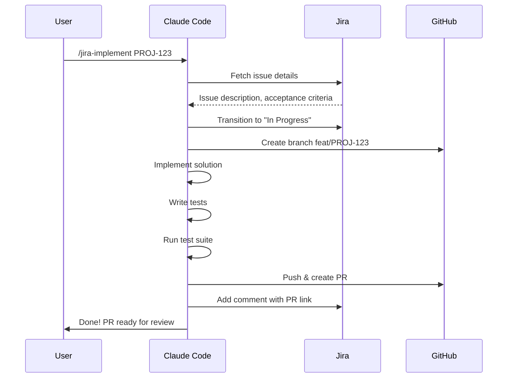

# Atlassian Slash Commands

## Command Reference

| Command | Description | Example |
|---------|-------------|---------|
| `/jira-search` | Search Jira issues with JQL | `/jira-search Find open bugs in PROJ` |
| `/jira-create` | Create a Jira issue | `/jira-create Bug: login timeout on mobile` |
| `/jira-sprint` | Sprint status and metrics | `/jira-sprint Show current sprint progress` |
| `/jira-implement` | Implement a Jira issue | `/jira-implement Implement PROJ-123` |
| `/confluence-search` | Search Confluence | `/confluence-search Find the deployment runbook` |
| `/confluence-create` | Create a Confluence page | `/confluence-create Post-mortem for March 22 incident` |
| `/jira-report` | Generate Jira reports | `/jira-report Weekly team velocity report` |

---

## `/jira-search`

```yaml
---
name: jira-search
description: Search Jira issues using natural language or JQL
user-invocable: true
allowed-tools:
  - Bash
  - mcp__atlassian__*
---
```

### Usage

```
# Natural language
/jira-search Find all critical bugs assigned to me

# Direct JQL
/jira-search JQL: project = PROJ AND type = Bug AND priority = Highest

# Specific queries
/jira-search What's blocking the checkout feature?
/jira-search Issues updated today in the API project
```

### Output

```
## Search Results (5 issues)

| Key | Summary | Status | Assignee | Priority | Updated |
|-----|---------|--------|----------|----------|---------|
| PROJ-456 | Auth timeout in production | Blocked | @alice | Critical | 2h ago |
| PROJ-423 | Payment validation error | In Progress | @bob | High | 1d ago |
| PROJ-401 | Mobile layout broken | To Do | Unassigned | High | 3d ago |
| PROJ-389 | Cache invalidation bug | In Review | @carol | Medium | 5d ago |
| PROJ-367 | Rate limit bypass | To Do | @dave | Medium | 7d ago |
```

---

## `/jira-create`

### Usage

```
# Quick bug
/jira-create Bug: users getting 500 error on checkout page

# Feature with details
/jira-create Story: Add dark mode support to the settings page. Should include toggle, persist preference, and sync across devices.

# From a code finding
/jira-create I found a memory leak in the WebSocket handler - create a P1 bug for it
```

### What Happens

1. Parses the natural language description
2. Determines issue type (Bug, Story, Task)
3. Sets priority based on context
4. Creates the issue with structured description
5. Adds appropriate labels and components
6. Returns the issue URL

---

## `/jira-sprint`

### Usage

```
# Current sprint overview
/jira-sprint

# Specific metrics
/jira-sprint Show burndown for the current sprint

# Blockers
/jira-sprint What's blocked in the current sprint?

# Team workload
/jira-sprint Show workload distribution across team
```

---

## `/jira-implement`

```yaml
---
name: jira-implement
description: Read a Jira issue and implement it - create branch, code, test, PR
user-invocable: true
allowed-tools:
  - Bash
  - Read
  - Write
  - Edit
  - Grep
  - Glob
  - mcp__atlassian__*
---
```

### Usage

```
# Implement an issue
/jira-implement Implement PROJ-123

# Implement with guidance
/jira-implement Implement PROJ-123 using the repository pattern

# Multiple issues
/jira-implement Implement PROJ-123 and PROJ-124 (they're related)
```

### Workflow



---

## `/confluence-search`

### Usage

```
# Find documentation
/confluence-search How do we deploy to production?

# Specific searches
/confluence-search Find the API documentation for the auth service

# By label
/confluence-search Find all runbooks
```

---

## `/confluence-create`

### Usage

```
# Post-mortem
/confluence-create Post-mortem for the March 22 checkout outage

# ADR
/confluence-create ADR: Why we chose PostgreSQL over DynamoDB

# Runbook
/confluence-create Runbook for handling payment processing failures

# Meeting notes
/confluence-create Sprint 42 retrospective notes
```

---

## `/jira-report`

### Usage

```
# Velocity report
/jira-report Show team velocity for the last 6 sprints

# Bug trend
/jira-report Bug creation vs resolution trend this quarter

# Workload
/jira-report Team workload and capacity for next sprint
```
