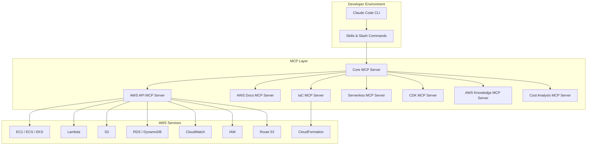

# AWS Integration with Claude Code

## Overview

Claude Code integrates deeply with AWS through the Model Context Protocol (MCP), enabling AI-powered infrastructure management, deployment automation, cost optimization, and security auditing directly from your terminal or CI/CD pipelines.

## Architecture



## Prerequisites

- AWS CLI configured with SSO or IAM credentials (`aws configure` or `aws sso login`)
- Claude Code installed (`npm install -g @anthropic-ai/claude-code`)
- Node.js 18+ and Python 3.10+ (for MCP servers)

## Quick Start

```bash
# Install the AWS Core MCP server (proxies all other AWS MCP servers)
claude mcp add awslabs-core-mcp-server \
  --transport stdio \
  -- npx -y @awslabs/core-mcp-server

# Or install individual servers
claude mcp add aws-api \
  --transport stdio \
  -- npx -y @awslabs/aws-api-mcp-server

claude mcp add aws-docs \
  --transport stdio \
  -- npx -y @awslabs/aws-documentation-mcp-server

claude mcp add aws-iac \
  --transport stdio \
  -- npx -y @awslabs/aws-iac-mcp-server

claude mcp add aws-serverless \
  --transport stdio \
  -- npx -y @awslabs/aws-serverless-mcp-server
```

## Available AWS MCP Servers

| Server | Purpose | Install Command |
|--------|---------|----------------|
| **Core MCP** | Proxy + router for all AWS MCP servers | `npx -y @awslabs/core-mcp-server` |
| **AWS API** | Direct AWS API access + docs | `npx -y @awslabs/aws-api-mcp-server` |
| **AWS Docs** | Search & fetch AWS documentation | `npx -y @awslabs/aws-documentation-mcp-server` |
| **AWS Knowledge** | Managed remote server with SOPs | Remote (no local install) |
| **IaC** | CDK + CloudFormation assistance | `npx -y @awslabs/aws-iac-mcp-server` |
| **Serverless** | Lambda, API Gateway, Step Functions | `npx -y @awslabs/aws-serverless-mcp-server` |
| **CDK** | CDK-specific guidance | `npx -y @awslabs/cdk-mcp-server` |
| **Cost Analysis** | Cost visibility & optimization | `npx -y @awslabs/cost-analysis-mcp-server` |
| **Bedrock KB** | Knowledge base retrieval | `npx -y @awslabs/bedrock-kb-retrieval-mcp-server` |
| **Nova Canvas** | Image generation with Nova | `npx -y @awslabs/nova-canvas-mcp-server` |

## Authentication

Claude Code uses your existing AWS credentials:

```bash
# Option 1: AWS SSO (recommended)
aws sso login --profile my-profile
export AWS_PROFILE=my-profile

# Option 2: IAM credentials
aws configure

# Option 3: Assume role
aws sts assume-role --role-arn arn:aws:iam::123456789012:role/MyCCRole \
  --role-session-name claude-code-session
```

## Key Use Cases

1. **Infrastructure as Code** - Generate, validate, and deploy CDK/CloudFormation templates
2. **Cost Optimization** - Analyze spending, identify waste, right-size resources
3. **Security Auditing** - Review IAM policies, check security groups, audit configurations
4. **Incident Response** - Query CloudWatch logs, trace errors, correlate metrics
5. **Serverless Development** - Build and deploy Lambda functions with best practices
6. **Documentation Lookup** - Instant access to AWS docs without leaving the terminal

## File Index

- [skills.md](skills.md) - AWS-specific skills (deploy, monitor, scale, debug)
- [agents.md](agents.md) - AWS-specific agents (infrastructure, cost, security)
- [slash_commands.md](slash_commands.md) - AWS slash commands
- [mcp_setup.md](mcp_setup.md) - Detailed MCP server setup guide

## Sources

- [AWS MCP Servers - Official](https://awslabs.github.io/mcp/)
- [AWS MCP GitHub Repository](https://github.com/awslabs/mcp)
- [Claude Code MCP Docs](https://code.claude.com/docs/en/mcp)
- [AWS IaC MCP Server Blog](https://aws.amazon.com/blogs/devops/introducing-the-aws-infrastructure-as-code-mcp-server-ai-powered-cdk-and-cloudformation-assistance/)
- [Claude Code + Bedrock Prompt Caching](https://aws.amazon.com/blogs/machine-learning/supercharge-your-development-with-claude-code-and-amazon-bedrock-prompt-caching/)
