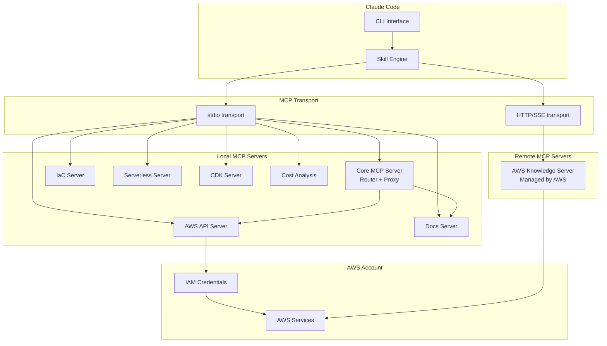

# Setting Up MCP Servers for AWS

## Overview

The Model Context Protocol (MCP) connects Claude Code to AWS services through specialized servers. AWS Labs provides official, open-source MCP servers that give Claude structured access to AWS APIs, documentation, and infrastructure management capabilities.

## Architecture



## Prerequisites

```bash
# Verify requirements
node --version    # 18+
python3 --version # 3.10+
aws --version     # 2.x
claude --version  # Latest
```

## Option 1: Core MCP Server (Recommended)

The Core MCP Server acts as a router/proxy that dynamically imports and proxies other AWS MCP servers based on environment variables. This is the simplest setup.

### Install

```bash
claude mcp add awslabs-core-mcp-server \
  --transport stdio \
  -- npx -y @awslabs/core-mcp-server
```

### Configuration

The Core MCP Server uses environment variables to determine which servers to proxy:

```json
// .claude/mcp.json (project-level)
{
  "mcpServers": {
    "awslabs-core": {
      "command": "npx",
      "args": ["-y", "@awslabs/core-mcp-server"],
      "env": {
        "AWS_PROFILE": "my-profile",
        "AWS_REGION": "us-east-1",
        "MCP_SERVERS": "aws-api,aws-docs,aws-iac,aws-serverless,cost-analysis"
      }
    }
  }
}
```

## Option 2: Individual MCP Servers

For more control, install servers individually.

### AWS API MCP Server

Provides direct AWS API access combined with documentation.

```bash
claude mcp add aws-api \
  --transport stdio \
  -- npx -y @awslabs/aws-api-mcp-server
```

```json
// .claude/mcp.json
{
  "mcpServers": {
    "aws-api": {
      "command": "npx",
      "args": ["-y", "@awslabs/aws-api-mcp-server"],
      "env": {
        "AWS_PROFILE": "my-profile",
        "AWS_REGION": "us-east-1"
      }
    }
  }
}
```

**Tools provided:**
- `aws_api_call` - Make any AWS API call
- `aws_describe_resource` - Describe any resource
- `aws_list_resources` - List resources by type

### AWS Documentation MCP Server

Search and fetch AWS documentation in markdown format.

```bash
claude mcp add aws-docs \
  --transport stdio \
  -- npx -y @awslabs/aws-documentation-mcp-server
```

**Tools provided:**
- `search_docs` - Search AWS documentation
- `fetch_doc_page` - Fetch a specific documentation page
- `get_recommendations` - Get best-practice recommendations

### AWS IaC MCP Server

CDK and CloudFormation assistance.

```bash
claude mcp add aws-iac \
  --transport stdio \
  -- npx -y @awslabs/aws-iac-mcp-server
```

**Tools provided:**
- `validate_template` - Validate CloudFormation/CDK templates
- `search_cfn_docs` - Search CloudFormation documentation
- `get_resource_spec` - Get resource type specifications
- `troubleshoot_deployment` - Diagnose deployment failures

### AWS Serverless MCP Server

Specialized guidance for Lambda, API Gateway, Step Functions, EventBridge.

```bash
claude mcp add aws-serverless \
  --transport stdio \
  -- npx -y @awslabs/aws-serverless-mcp-server
```

**Tools provided:**
- `get_serverless_guidance` - Architecture recommendations
- `generate_sam_template` - Generate SAM templates
- `optimize_lambda` - Lambda optimization suggestions

### AWS Knowledge MCP Server (Remote)

Fully managed remote server providing up-to-date AWS content, SOPs, and regional availability information.

```bash
claude mcp add aws-knowledge \
  --transport http \
  --url https://mcp.aws.amazon.com/knowledge
```

No local installation required. Authenticates via your AWS credentials.

### Cost Analysis MCP Server

```bash
claude mcp add cost-analysis \
  --transport stdio \
  -- npx -y @awslabs/cost-analysis-mcp-server
```

**Tools provided:**
- `get_cost_report` - Cost and usage reports
- `get_savings_recommendations` - Savings plan recommendations
- `analyze_resource_cost` - Per-resource cost breakdown

### Bedrock Knowledge Base MCP Server

```bash
claude mcp add bedrock-kb \
  --transport stdio \
  -- npx -y @awslabs/bedrock-kb-retrieval-mcp-server
```

**Tools provided:**
- `discover_knowledge_bases` - List available KBs
- `query_knowledge_base` - Natural language queries against KBs

## Option 3: Community MCP Server (aws-mcp)

The community [aws-mcp](https://github.com/RafalWilinski/aws-mcp) server provides a simpler, all-in-one alternative:

```bash
claude mcp add aws-mcp \
  --transport stdio \
  -- npx -y aws-mcp
```

This provides broad AWS API access through a single server.

---

## Authentication Setup

### AWS SSO (Recommended for Organizations)

```bash
# Configure SSO
aws configure sso
# SSO session name: my-org
# SSO start URL: https://my-org.awsapps.com/start
# SSO region: us-east-1
# Choose account and role

# Login
aws sso login --profile my-sso-profile

# Set as default for Claude Code
export AWS_PROFILE=my-sso-profile
```

### IAM User (Development)

```bash
aws configure --profile claude-dev
# Access Key ID: AKIA...
# Secret Access Key: ...
# Region: us-east-1
# Output: json

export AWS_PROFILE=claude-dev
```

### IAM Role Assumption

```bash
# In .claude/mcp.json, use role assumption
{
  "mcpServers": {
    "aws-api": {
      "command": "npx",
      "args": ["-y", "@awslabs/aws-api-mcp-server"],
      "env": {
        "AWS_ROLE_ARN": "arn:aws:iam::123456789012:role/ClaudeCodeRole",
        "AWS_REGION": "us-east-1"
      }
    }
  }
}
```

### Recommended IAM Policy for Claude Code

```json
{
  "Version": "2012-10-17",
  "Statement": [
    {
      "Sid": "ReadOnlyAccess",
      "Effect": "Allow",
      "Action": [
        "cloudwatch:GetMetricData",
        "cloudwatch:DescribeAlarms",
        "cloudwatch:ListMetrics",
        "logs:StartQuery",
        "logs:GetQueryResults",
        "logs:DescribeLogGroups",
        "ec2:Describe*",
        "ecs:Describe*",
        "ecs:List*",
        "lambda:GetFunction",
        "lambda:ListFunctions",
        "rds:Describe*",
        "s3:ListBucket",
        "s3:GetBucketPolicy",
        "iam:GetPolicy",
        "iam:ListRoles",
        "iam:ListUsers",
        "ce:GetCostAndUsage",
        "ce:GetSavingsPlansPurchaseRecommendation",
        "cloudtrail:LookupEvents",
        "cloudformation:Describe*",
        "cloudformation:List*"
      ],
      "Resource": "*"
    },
    {
      "Sid": "DeployAccess",
      "Effect": "Allow",
      "Action": [
        "cloudformation:CreateStack",
        "cloudformation:UpdateStack",
        "cloudformation:CreateChangeSet",
        "cloudformation:ExecuteChangeSet",
        "ecs:UpdateService",
        "lambda:UpdateFunctionCode",
        "lambda:UpdateFunctionConfiguration"
      ],
      "Resource": "*",
      "Condition": {
        "StringEquals": {
          "aws:RequestTag/managed-by": "claude-code"
        }
      }
    }
  ]
}
```

---

## Verification

After setup, verify MCP servers are connected:

```bash
# List configured MCP servers
claude mcp list

# Test a specific server
claude "Use the aws-api MCP server to describe my EC2 instances in us-east-1"

# Check server health
claude "List all available MCP tools from AWS servers"
```

## Troubleshooting

| Issue | Solution |
|-------|----------|
| `MCP server failed to start` | Check Node.js version (18+), run `npx -y @awslabs/aws-api-mcp-server` standalone |
| `AWS credentials not found` | Run `aws sts get-caller-identity` to verify credentials |
| `Permission denied` | Check IAM policy, ensure role has required permissions |
| `Server timeout` | Increase timeout in mcp.json: `"timeout": 30000` |
| `SSO token expired` | Run `aws sso login` to refresh |

## Sources

- [AWS MCP Servers Official Docs](https://awslabs.github.io/mcp/)
- [AWS MCP GitHub Repository](https://github.com/awslabs/mcp)
- [Installation Guide](https://awslabs.github.io/mcp/installation)
- [Claude Code MCP Docs](https://code.claude.com/docs/en/mcp)
- [MCP Authentication Guide](https://www.truefoundry.com/blog/mcp-authentication-in-claude-code)
