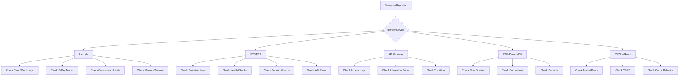

# AWS Skills for Claude Code

## Overview

Skills are reusable instruction sets that Claude Code can invoke via slash commands or autonomously during reasoning. Each skill lives in `.claude/skills/<skill-name>/SKILL.md`.

---

## Skill: AWS Deploy

### `.claude/skills/aws-deploy/SKILL.md`

```yaml
---
name: aws-deploy
description: Deploy infrastructure and applications to AWS using CDK, CloudFormation, or SAM
allowed-tools:
  - Bash
  - Read
  - Write
  - Edit
  - mcp__aws-iac__*
  - mcp__aws-serverless__*
  - mcp__aws-api__*
---
```

```markdown
# AWS Deploy Skill

## Workflow

1. **Analyze** the deployment target (CDK app, CloudFormation template, SAM template, or raw AWS resources)
2. **Validate** the template/configuration before deploying:
   - Run `cdk synth` or `cfn-lint` for validation
   - Check for security anti-patterns (open security groups, wildcard IAM, public S3)
   - Verify region and account context
3. **Plan** the deployment:
   - Run `cdk diff` or create a changeset
   - Present the diff to the user for approval
4. **Execute** after user confirmation:
   - `cdk deploy --require-approval never` (if pre-approved)
   - `aws cloudformation deploy` for CF templates
   - `sam deploy` for SAM applications
5. **Verify** post-deployment:
   - Check stack status
   - Run smoke tests if defined
   - Update changelog

## Safety Rules

- NEVER deploy to production without explicit user confirmation
- ALWAYS show a diff/changeset before deploying
- ALWAYS check for breaking changes (resource replacements)
- Tag all resources with `deployed-by: claude-code` and timestamp

## Example Usage

```
/aws-deploy --stack my-api-stack --env staging
/aws-deploy --template infrastructure/main.yaml --region us-east-1
```
```

---

## Skill: AWS Monitor

### `.claude/skills/aws-monitor/SKILL.md`

```yaml
---
name: aws-monitor
description: Monitor AWS resources, query CloudWatch metrics/logs, analyze alarms and health
allowed-tools:
  - Bash
  - Read
  - mcp__aws-api__*
---
```

```markdown
# AWS Monitor Skill

## Capabilities

### CloudWatch Logs
- Query log groups with CloudWatch Logs Insights
- Filter by time range, pattern, or log level
- Correlate logs across multiple services

### CloudWatch Metrics
- Fetch metric data for any AWS resource
- Compare current vs historical baselines
- Identify anomalies and trends

### Alarms
- List active alarms and their states
- Analyze alarm history
- Suggest threshold adjustments based on patterns

## Common Queries

### Find errors in the last hour
```bash
aws logs start-query \
  --log-group-name /aws/lambda/my-function \
  --start-time $(date -d '1 hour ago' +%s) \
  --end-time $(date +%s) \
  --query-string 'fields @timestamp, @message | filter @message like /ERROR/ | sort @timestamp desc | limit 50'
```

### Get CPU utilization for an EC2 instance
```bash
aws cloudwatch get-metric-statistics \
  --namespace AWS/EC2 \
  --metric-name CPUUtilization \
  --dimensions Name=InstanceId,Value=i-1234567890abcdef0 \
  --start-time $(date -d '6 hours ago' -u +%Y-%m-%dT%H:%M:%S) \
  --end-time $(date -u +%Y-%m-%dT%H:%M:%S) \
  --period 300 \
  --statistics Average Maximum
```

### Check Lambda errors and duration
```bash
aws cloudwatch get-metric-data \
  --metric-data-queries '[
    {"Id":"errors","MetricStat":{"Metric":{"Namespace":"AWS/Lambda","MetricName":"Errors","Dimensions":[{"Name":"FunctionName","Value":"my-function"}]},"Period":300,"Stat":"Sum"}},
    {"Id":"duration","MetricStat":{"Metric":{"Namespace":"AWS/Lambda","MetricName":"Duration","Dimensions":[{"Name":"FunctionName","Value":"my-function"}]},"Period":300,"Stat":"Average"}}
  ]' \
  --start-time $(date -d '1 hour ago' -u +%Y-%m-%dT%H:%M:%S) \
  --end-time $(date -u +%Y-%m-%dT%H:%M:%S)
```

## Output Format

Always present monitoring data as:
1. Summary status (HEALTHY / DEGRADED / CRITICAL)
2. Key metrics table
3. Anomalies or concerning trends
4. Recommended actions
```

---

## Skill: AWS Scale

### `.claude/skills/aws-scale/SKILL.md`

```yaml
---
name: aws-scale
description: Scale AWS resources up/down, manage auto-scaling, and right-size infrastructure
allowed-tools:
  - Bash
  - Read
  - mcp__aws-api__*
  - mcp__cost-analysis__*
---
```

```markdown
# AWS Scale Skill

## Workflow

1. **Assess** current resource utilization
   - Fetch CloudWatch metrics (CPU, memory, connections, queue depth)
   - Check current scaling policies and limits
   - Review recent scaling events
2. **Analyze** scaling needs
   - Compare utilization against thresholds
   - Project future demand from historical patterns
   - Identify over-provisioned or under-provisioned resources
3. **Recommend** scaling actions
   - Present options with cost implications
   - Show projected performance impact
4. **Execute** after approval
   - Update Auto Scaling groups, ECS service counts, RDS instance classes
   - Modify Lambda concurrency limits
   - Adjust DynamoDB capacity

## Supported Resources

| Resource Type | Scale Actions |
|--------------|---------------|
| EC2 Auto Scaling | Change desired/min/max capacity, update launch template |
| ECS Services | Update desired count, adjust task CPU/memory |
| RDS | Modify instance class, adjust read replicas |
| DynamoDB | Switch capacity mode, adjust RCU/WCU |
| Lambda | Set reserved/provisioned concurrency |
| ElastiCache | Change node type, adjust replica count |
| EKS | Scale node groups, adjust HPA |

## Safety Rules

- NEVER scale production to zero without explicit confirmation
- ALWAYS verify there are no in-flight requests before scaling down
- Present cost impact before any scaling change
- Log all scaling actions to the changelog
```

---

## Skill: AWS Debug

### `.claude/skills/aws-debug/SKILL.md`

```yaml
---
name: aws-debug
description: Debug AWS infrastructure issues, trace errors across services, and diagnose failures
allowed-tools:
  - Bash
  - Read
  - mcp__aws-api__*
  - mcp__aws-docs__*
---
```

```markdown
# AWS Debug Skill

## Debugging Workflow



## Investigation Steps

### Step 1: Gather Context
- What service is affected?
- When did the issue start?
- What changed recently? (deployments, config changes, traffic patterns)
- Is it intermittent or persistent?

### Step 2: Check CloudTrail
```bash
aws cloudtrail lookup-events \
  --lookup-attributes AttributeKey=EventName,AttributeValue=UpdateFunctionConfiguration \
  --start-time $(date -d '24 hours ago' -u +%Y-%m-%dT%H:%M:%S) \
  --max-results 10
```

### Step 3: Correlate Metrics
```bash
# Get multiple metrics in one call
aws cloudwatch get-metric-data --metric-data-queries file://debug-queries.json \
  --start-time $(date -d '2 hours ago' -u +%Y-%m-%dT%H:%M:%S) \
  --end-time $(date -u +%Y-%m-%dT%H:%M:%S)
```

### Step 4: Check Recent Deployments
```bash
aws cloudformation describe-stack-events \
  --stack-name my-stack \
  --max-items 20
```

### Step 5: Trace Requests (X-Ray)
```bash
aws xray get-trace-summaries \
  --start-time $(date -d '1 hour ago' +%s) \
  --end-time $(date +%s) \
  --filter-expression 'responsetime > 5 OR error = true'
```

## Common Issues Reference

| Symptom | Likely Causes | First Check |
|---------|--------------|-------------|
| Lambda timeout | Cold start, downstream latency, memory too low | CloudWatch Duration metric |
| 502 from ALB | Target unhealthy, security group, timeout mismatch | Target group health |
| ECS task crash | OOM, bad image, missing env vars | Container logs + exit code |
| RDS connection refused | Max connections, security group, DNS | Connection count metric |
| S3 access denied | Bucket policy, IAM role, ACL | IAM policy simulator |
| API Gateway 429 | Throttling limit hit | Usage plan + burst limits |

## Output Format

Present debug findings as:
1. **Root Cause** (confirmed or suspected)
2. **Evidence** (logs, metrics, traces)
3. **Impact** (scope, duration, affected users)
4. **Fix** (immediate remediation steps)
5. **Prevention** (long-term improvements)
```

---

## Skill: AWS Security Audit

### `.claude/skills/aws-security-audit/SKILL.md`

```yaml
---
name: aws-security-audit
description: Audit AWS security posture - IAM policies, security groups, encryption, compliance
allowed-tools:
  - Bash
  - Read
  - mcp__aws-api__*
---
```

```markdown
# AWS Security Audit Skill

## Checks Performed

### IAM
- Identify overly permissive policies (wildcards on actions/resources)
- Find unused IAM roles and users (no activity in 90+ days)
- Check for MFA enforcement
- Review cross-account access

### Network
- Find open security groups (0.0.0.0/0 on sensitive ports)
- Check NACLs for overly permissive rules
- Verify VPC flow logs are enabled
- Review public subnets and internet gateways

### Data
- Check S3 bucket public access settings
- Verify encryption at rest (EBS, RDS, S3, DynamoDB)
- Check encryption in transit (TLS on load balancers, RDS)
- Review KMS key rotation policies

### Logging
- Verify CloudTrail is enabled in all regions
- Check CloudWatch log retention policies
- Verify VPC flow logs
- Check for GuardDuty findings

## Example Commands

```bash
# Find open security groups
aws ec2 describe-security-groups \
  --filters "Name=ip-permission.cidr,Values=0.0.0.0/0" \
  --query 'SecurityGroups[*].[GroupId,GroupName,IpPermissions[?contains(IpRanges[].CidrIp, `0.0.0.0/0`)].{Port:FromPort,Protocol:IpProtocol}]'

# Find public S3 buckets
aws s3api list-buckets --query 'Buckets[].Name' --output text | tr '\t' '\n' | while read bucket; do
  status=$(aws s3api get-public-access-block --bucket "$bucket" 2>/dev/null)
  if [ $? -ne 0 ]; then
    echo "WARNING: No public access block on $bucket"
  fi
done

# Find unused IAM roles
aws iam generate-credential-report
aws iam get-credential-report --query 'Content' --output text | base64 -d
```

## Report Format

Output a structured security report with:
1. **Critical** findings (immediate action required)
2. **High** findings (address within 24 hours)
3. **Medium** findings (address within 1 week)
4. **Low** findings (address during next sprint)
5. **Recommendations** with specific remediation steps
```

---

## Skill: AWS Cost Analysis

### `.claude/skills/aws-cost-analyze/SKILL.md`

```yaml
---
name: aws-cost-analyze
description: Analyze AWS costs, identify waste, recommend optimizations
allowed-tools:
  - Bash
  - Read
  - mcp__aws-api__*
  - mcp__cost-analysis__*
---
```

```markdown
# AWS Cost Analysis Skill

## Workflow

1. **Gather** cost data from Cost Explorer
2. **Identify** top cost drivers by service, region, and tag
3. **Detect** waste (idle resources, over-provisioning, missing reservations)
4. **Recommend** savings with estimated dollar impact
5. **Present** findings with comparison charts

## Key Queries

```bash
# Monthly cost breakdown by service
aws ce get-cost-and-usage \
  --time-period Start=$(date -d 'first day of last month' +%Y-%m-%d),End=$(date -d 'first day of this month' +%Y-%m-%d) \
  --granularity MONTHLY \
  --metrics BlendedCost \
  --group-by Type=DIMENSION,Key=SERVICE

# Daily cost trend
aws ce get-cost-and-usage \
  --time-period Start=$(date -d '30 days ago' +%Y-%m-%d),End=$(date +%Y-%m-%d) \
  --granularity DAILY \
  --metrics BlendedCost

# Savings recommendations
aws ce get-savings-plans-purchase-recommendation \
  --savings-plans-type COMPUTE_SP \
  --term-in-years ONE_YEAR \
  --payment-option NO_UPFRONT \
  --lookback-period-in-days SIXTY_DAYS

# Rightsizing recommendations
aws ce get-rightsizing-recommendation \
  --service AmazonEC2 \
  --configuration '{"RecommendationTarget":"SAME_INSTANCE_FAMILY","BenefitsConsidered":true}'
```

## Waste Detection Checklist

- [ ] Unattached EBS volumes
- [ ] Idle load balancers (no healthy targets)
- [ ] Stopped EC2 instances still incurring EBS costs
- [ ] Unused Elastic IPs
- [ ] Over-provisioned RDS instances (< 20% CPU avg)
- [ ] Lambda functions with excessive memory allocation
- [ ] S3 buckets without lifecycle policies
- [ ] NAT Gateway data processing costs
- [ ] Unused or underutilized Reserved Instances
```
