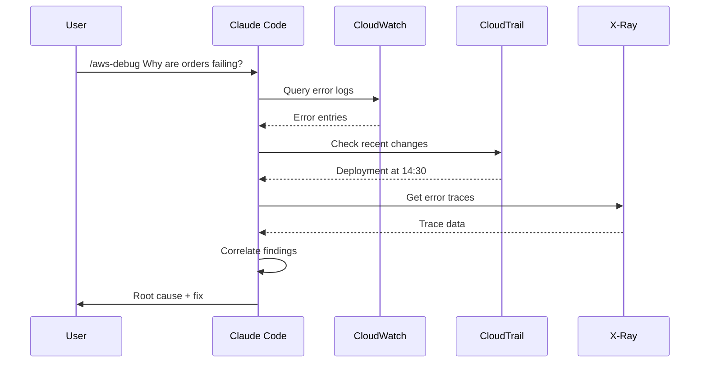

# AWS Slash Commands

## Overview

Slash commands are user-invoked skills triggered by typing `/command-name` in Claude Code. Each command maps to a skill definition in `.claude/skills/`.

---

## Command Reference

| Command | Description | Example |
|---------|-------------|---------|
| `/aws-deploy` | Deploy infrastructure or applications | `/aws-deploy --stack api --env prod` |
| `/aws-monitor` | Check resource health and metrics | `/aws-monitor --service lambda --function my-func` |
| `/aws-scale` | Scale resources up or down | `/aws-scale --ecs my-service --count 4` |
| `/aws-debug` | Debug AWS issues and errors | `/aws-debug --logs /aws/lambda/my-func --since 1h` |
| `/aws-cost` | Analyze costs and find savings | `/aws-cost --period last-month` |
| `/aws-security` | Run security audit | `/aws-security --scope iam,network` |
| `/aws-status` | Quick status overview | `/aws-status --env production` |
| `/aws-logs` | Query CloudWatch logs | `/aws-logs --group /ecs/my-app --filter ERROR` |

---

## `/aws-deploy`

### Skill Definition

```yaml
---
name: aws-deploy
description: Deploy infrastructure and applications to AWS
user-invocable: true
allowed-tools:
  - Bash
  - Read
  - Write
  - Edit
  - mcp__aws-api__*
  - mcp__aws-iac__*
---
```

### Usage

```
# Deploy a CDK stack
/aws-deploy Deploy the API stack to staging

# Deploy with specific parameters
/aws-deploy Deploy infrastructure/main.yaml to us-east-1 with parameter Environment=staging

# Deploy a Lambda function
/aws-deploy Update the order-processor Lambda with the latest code in src/handlers/
```

### What it does

1. Identifies deployment target (CDK stack, CF template, Lambda, ECS)
2. Runs validation (`cdk synth`, `cfn-lint`, template validation)
3. Creates and displays changeset/diff
4. Asks for confirmation
5. Executes deployment
6. Runs post-deployment verification

---

## `/aws-monitor`

### Usage

```
# General health check
/aws-monitor How is production looking?

# Specific service monitoring
/aws-monitor Check Lambda error rates for the last 6 hours

# Dashboard-style overview
/aws-monitor Show me a dashboard of all ECS services in staging
```

### Output Example

```
## Production Health Report

Status: DEGRADED

| Service | Metric | Current | Baseline | Status |
|---------|--------|---------|----------|--------|
| API Gateway | Error Rate | 2.3% | 0.5% | WARN |
| Lambda:auth | Duration p99 | 890ms | 200ms | CRITICAL |
| RDS Primary | CPU | 45% | 40% | OK |
| ECS:web | Task Count | 4/4 | 4 | OK |

### Anomalies Detected
- Lambda:auth duration spiked at 14:32 UTC, correlates with new deployment
- API Gateway 5xx errors elevated since 14:35 UTC

### Recommended Actions
1. Check Lambda:auth CloudWatch logs for cold start or dependency issues
2. Consider rolling back the 14:30 deployment if errors persist
```

---

## `/aws-scale`

### Usage

```
# Scale ECS service
/aws-scale Scale the web service to 8 tasks

# Auto-scaling adjustment
/aws-scale Set the API auto-scaling to min 2, max 10, target 60% CPU

# Right-sizing
/aws-scale Analyze and right-size our RDS instances
```

---

## `/aws-debug`

### Usage

```
# Debug a specific error
/aws-debug Why is the checkout Lambda timing out?

# Trace an issue
/aws-debug Users are getting 502 errors on the /api/orders endpoint

# Investigate a pattern
/aws-debug We're seeing intermittent connection resets to RDS
```

### Debug Flow



---

## `/aws-cost`

### Usage

```
# Monthly cost report
/aws-cost Show me last month's costs by service

# Find waste
/aws-cost Find idle resources we can clean up

# Budget tracking
/aws-cost Are we on track for our $5000/month budget?

# Savings recommendations
/aws-cost What savings plans should we buy?
```

---

## `/aws-security`

### Usage

```
# Full audit
/aws-security Run a full security audit

# Specific scope
/aws-security Check our IAM policies for over-permissive access

# Compliance check
/aws-security Are we CIS Benchmark compliant?

# Incident investigation
/aws-security Check for unauthorized access in the last 24 hours
```

---

## `/aws-status`

### Quick Status Skill Definition

```yaml
---
name: aws-status
description: Quick status overview of AWS environment health
user-invocable: true
allowed-tools:
  - Bash
  - mcp__aws-api__*
---
```

### Usage

```
/aws-status
/aws-status --env production
/aws-status --region us-west-2
```

### Output

```
## AWS Environment Status: production (us-east-1)

### Compute
- ECS Services: 5/5 healthy
- Lambda Functions: 12 active, 0 errors in last 5min
- EC2 Instances: 3 running

### Data
- RDS: 2 clusters healthy, 0 replication lag
- DynamoDB: 3 tables, all within capacity
- ElastiCache: 1 cluster, 4 nodes healthy

### Network
- ALB: 2 active, all targets healthy
- CloudFront: 3 distributions, no elevated errors
- API Gateway: 2 APIs, 0 throttled requests

### Alarms
- OK: 24 | ALARM: 0 | INSUFFICIENT_DATA: 2

Last checked: 2026-03-22T15:30:00Z
```

---

## `/aws-logs`

### Quick Log Query Skill

```yaml
---
name: aws-logs
description: Quick CloudWatch Logs query
user-invocable: true
allowed-tools:
  - Bash
  - mcp__aws-api__*
---
```

### Usage

```
# Simple log search
/aws-logs Show errors from the auth Lambda in the last hour

# Pattern search
/aws-logs Find timeout errors across all ECS services today

# Structured query
/aws-logs Run Insights query: fields @timestamp, @message | filter @message like /OutOfMemory/ | stats count() by bin(5m)
```

---

## Creating Custom AWS Slash Commands

To create your own AWS slash command:

```bash
mkdir -p .claude/skills/aws-custom-command
```

Create `.claude/skills/aws-custom-command/SKILL.md`:

```yaml
---
name: aws-custom-command
description: What this command does
user-invocable: true
allowed-tools:
  - Bash
  - mcp__aws-api__*
---
```

```markdown
# My Custom AWS Command

Instructions for Claude on how to handle this command.

## Steps
1. ...
2. ...
```

The command will be available as `/aws-custom-command` in Claude Code.
