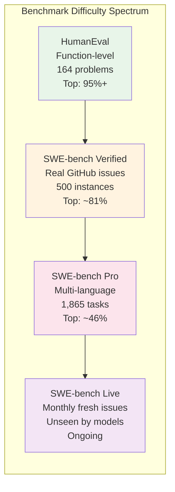

# AI Coding Benchmarks - March 2026

> How AI coding tools and models compare on standardized benchmarks, real-world task completion, and cost efficiency.

---

## Benchmark Overview

AI coding benchmarks have evolved from simple function-completion tests to complex, real-world software engineering evaluations. The landscape in 2026 includes multiple tiers of difficulty.

---

## 1. SWE-bench Verified

The most widely cited benchmark for evaluating AI coding agents on real-world software engineering tasks. Tests the ability to resolve actual GitHub issues from popular open-source repositories.

### Leaderboard (March 2026)

| Rank | Model / Agent | Score | Organization |
|---|---|---|---|
| 1 | Claude Opus 4.5 | 80.9% | Anthropic |
| 2 | Claude Opus 4.6 | 80.8% | Anthropic |
| 3 | Gemini 3.1 Pro | 80.6% | Google |
| 4 | MiniMax M2.5 | 80.2% | MiniMax (open-weight) |
| 5 | GPT-5.2 | 80.0% | OpenAI |
| 6 | Claude Sonnet 4.6 | 79.6% | Anthropic |
| 7 | Claude Sonnet 4 | 77.2% | Anthropic |
| 8 | GPT-5 | 74.9% | OpenAI |
| 9 | Gemini 2.5 | 73.1% | Google |

**Key observations:**
- Top score jumped from ~65% (early 2025) to 80.9% (March 2026)
- Anthropic holds the top 2 spots
- MiniMax M2.5 at 80.2% as an open-weight model demonstrates that open models are competitive
- Gemini 3.1 Pro surged to 80.6%, close behind the leaders
- The scaffold was significantly upgraded in February 2026 (scaffolding, environments, token limits)

**Important caveat:** OpenAI stopped reporting Verified scores after finding training data contamination across all frontier models on this dataset.

---

## 2. SWE-bench Pro

A more challenging benchmark by Scale AI that evaluates AI coding agents on 1,865 long-horizon tasks from 41 real repositories across Python, Go, TypeScript, and JavaScript. Tasks require an average of **107 lines of changes across 4.1 files**.

### Why SWE-bench Pro Matters

SWE-bench Pro is considered more reliable than Verified because:
- Multi-language (not just Python)
- Longer horizon tasks
- Less susceptible to contamination
- More representative of real engineering work

### Key Insight: "46% Beats 81%"

A 46% score on SWE-bench Pro is considered more impressive than an 81% on SWE-bench Verified because Pro tasks are substantially harder and more representative of actual software engineering work. The gap between Verified and Pro scores reveals how much current models struggle with multi-file, multi-language, long-horizon tasks.

---

## 3. SWE-bench Live

A live benchmark updated monthly with fresh GitHub issues that models have never seen. Designed to eliminate the contamination problem that plagues static benchmarks.

**Status:** Active and updating monthly as of March 2026.

---

## 4. HumanEval

The original code generation benchmark: 164 hand-crafted Python programming problems testing function-level code generation.

### Leaderboard (March 2026)

| Model | Pass@1 Score | Organization |
|---|---|---|
| Kimi K2 0905 | 94.5% | Moonshot AI |
| Claude Sonnet 4 | 95.1% | Anthropic |
| Claude Opus 4 | 94.5% | Anthropic |
| Codestral 25.01 | 86.6% | Mistral |

**Status in 2026:** Largely considered a **saturated benchmark**. Top models achieve 90%+ consistently, making it less useful for differentiating frontier models. It remains useful for evaluating smaller or local models.

---

## 5. CodeContests

A competitive programming benchmark with problems from Codeforces and similar platforms, testing algorithmic problem-solving rather than real-world engineering.

**Current state:** Less widely reported than SWE-bench in 2026. The industry has shifted focus toward real-world benchmarks (SWE-bench, LiveCodeBench) that better predict actual developer utility.

---

## 6. Real-World Task Completion Rates

Beyond synthetic benchmarks, several evaluations measure how tools perform on actual developer tasks.

### Devin (Cognition) Real-World Evaluation

| Metric | Result |
|---|---|
| Tasks completed (of 20) | 3 (15%) |
| Performance degradation | After 10 ACUs consumed |
| Strengths | Repetitive, well-defined tasks |
| Weaknesses | Creative problem-solving, novel tasks |

### Claude Code Real-World Performance

| Metric | Result |
|---|---|
| Developer "most loved" rating | 46% |
| Best use cases | Complex refactoring, debugging, architectural changes |
| Context window | 1M tokens (entire repo in one prompt) |
| SWE-bench Verified | 80.8% (Opus 4.6) |

### Cursor Real-World Performance

| Metric | Result |
|---|---|
| Developer "most loved" rating | 19% |
| Best use cases | Daily interactive coding, multi-file edits |
| ARR | $1 billion (2025) |
| Composer mode | Unmatched for multi-file editing workflow |

### GitHub Copilot Real-World Performance

| Metric | Result |
|---|---|
| Developer "most loved" rating | 9% |
| Market share | ~37% |
| Best use cases | Pattern-based coding, boilerplate, enterprise compliance |
| Productivity gain | 20-40% documented for enterprise teams |

### Multi-Agent Systems vs Single Agent

| Metric | Single Agent | Multi-Agent |
|---|---|---|
| Task completion speed | Baseline | 3x faster |
| Accuracy | Baseline | 60% better |
| Scalability | Limited | Team-scale parallel execution |

---

## 7. Cost Per Task Analysis

Understanding the true cost of AI coding is critical for budgeting and ROI analysis.

### Model Cost Efficiency (SWE-bench Verified)

| Model | Score | Cost/Task | Cost Efficiency (Score/$) |
|---|---|---|---|
| Claude 4.5 Sonnet | 70.6% | $0.56 | 126%/$ |
| GPT-5 mini | 59.8% | $0.04 | 1,495%/$ |
| GLM-4.7 | ~65% (est.) | $0.05 | ~1,300%/$ |
| MiniMax M2.1 | ~60% (est.) | $0.03 | ~2,000%/$ |

**Key insight:** Budget models (GPT-5 mini at $0.04/task) offer dramatically better cost-efficiency for simpler tasks. Premium models (Claude 4.5 Sonnet at $0.56/task) justify their cost only for complex, high-stakes work.

### Real-World Usage Cost Profiles

| Profile | Requests/Day | Monthly Cost (est.) | Description |
|---|---|---|---|
| **Light user** | 20-30 | $10-20 | Completions and occasional chat |
| **Power user** | 50-80 | $20-60 | Regular agentic multi-file edits |
| **Heavy agentic** | 100+ | $100-1,000+ | Autonomous multi-step coding tasks |

### Hidden Cost Multipliers

- **Agentic usage** consumes 5x to 20x more tokens than standard completions
- **Sticker prices** understate real costs by 2x to 5x for power users
- Tab completions: ~$0.50-1.00/day
- AI agent sessions (read codebase, multi-file edits, iterate on errors): $2-5 per session
- At 10 agentic sessions/day: $20-50 daily, or **$400-1,000 monthly**

### Tool Monthly Cost Comparison

| Tool | Plan | Monthly Cost | What You Get |
|---|---|---|---|
| GitHub Copilot Pro | Individual | $10 | Unlimited completions, basic chat |
| Windsurf Pro | Individual | $15 | 500 prompts, 1,500 flow actions, Cascade |
| Claude Code Pro | Individual | $17 | Claude Sonnet access, limited usage |
| Amazon Q Developer | Individual | $19 | AWS-integrated AI, security scanning |
| Cursor Pro | Individual | $20 | Composer, multi-file edits |
| Cursor Pro+ | Individual | $60 | 3x Pro usage |
| Claude Code Max | Individual | $100+ | Opus-level access, heavy usage |
| Cursor Ultra | Individual | $200 | 20x Pro usage |
| Devin Team | Team | $500 | Autonomous agent, parallel execution |

---

## 8. Benchmark Limitations and Controversies

### Contamination Concerns

OpenAI stopped reporting SWE-bench Verified scores after discovering that **every frontier model** showed training data contamination on the dataset. This raises questions about the reliability of all Verified scores.

### The SWE-bench Verified vs Pro Gap

Models scoring 80%+ on Verified often score below 50% on Pro, revealing that:
- Verified tasks are shorter and Python-only
- Pro tasks require multi-language, multi-file reasoning
- Real engineering work is significantly harder than benchmarks suggest

### HumanEval Saturation

With top models at 95%+, HumanEval no longer differentiates frontier models. It remains useful only for:
- Evaluating smaller/local models
- Quick sanity checks
- Historical comparison

### What Benchmarks Miss

| Not Measured | Why It Matters |
|---|---|
| Code maintainability | AI code may work but be hard to maintain |
| Architecture quality | Passing tests does not mean good design |
| Security posture | Functional code may have vulnerabilities |
| Team collaboration | Benchmarks test solo performance only |
| Long-term codebase health | Accumulated AI code may create technical debt |
| Real-world context switching | Developers switch tasks; benchmarks do not |

---

## 9. Recommendations

### For Individual Developers

- Use **SWE-bench Pro scores** (not Verified) when evaluating models for real-world work
- Track **cost per task** not just subscription price -- agentic usage multiplies costs 5-20x
- Start with **Copilot Pro ($10/mo)** for completions; add **Cursor or Windsurf** for agentic editing
- Use **Claude Code** selectively for complex tasks where its superior reasoning justifies the cost

### For Engineering Leaders

- Do not rely on a single benchmark -- evaluate tools on **your actual codebase and workflows**
- Budget for **3-5x the sticker price** for teams that use agentic features heavily
- Consider the **total cost of ownership** including: subscription, API costs, productivity gains, quality impact
- Monitor the **SWE-bench Live** leaderboard for contamination-free rankings
- Plan for **multi-tool strategies** -- the best setup in 2026 combines 2-3 tools for different use cases

### For Budget-Conscious Teams

- **GPT-5 mini** ($0.04/task) and **MiniMax M2.1** ($0.03/task) offer excellent cost efficiency for routine tasks
- **Open-source tools** (Cline, Aider, OpenCode) with budget API providers minimize recurring costs
- **Gemini CLI free tier** (60 req/min) provides strong capabilities at zero cost
- Reserve premium models for high-complexity work where quality justifies the cost

---

## Sources

- [SWE-bench Leaderboards](https://www.swebench.com/)
- [SWE-bench Verified - Epoch AI](https://epoch.ai/benchmarks/swe-bench-verified)
- [Scale Labs - SWE-Bench Pro Leaderboard](https://labs.scale.com/leaderboard/swe_bench_pro_public)
- [Morphllm - SWE-Bench Pro: Why 46% Beats 81%](https://www.morphllm.com/swe-bench-pro)
- [LLM Stats - SWE-Bench Verified](https://llm-stats.com/benchmarks/swe-bench-verified)
- [LLM Stats - HumanEval](https://llm-stats.com/benchmarks/humaneval)
- [Local AI Master - Best AI Coding Models](https://localaimaster.com/models/best-ai-coding-models)
- [SitePoint - AI Coding Tools Cost Analysis ROI 2026](https://www.sitepoint.com/ai-coding-tools-cost-analysis-roi-calculator-2026/)
- [Price Per Token - Best LLM for Coding 2026](https://pricepertoken.com/leaderboards/coding)
- [DEV Community - Every AI Model's Real Cost in 2026](https://dev.to/robinbanner/every-ai-models-real-cost-in-2026-the-complete-developer-pricing-guide-2an9)
- [NxCode - Best AI for Coding 2026 Ranked](https://www.nxcode.io/resources/news/best-ai-for-coding-2026-complete-ranking)
- [Morphllm - We Tested 15 AI Coding Agents](https://www.morphllm.com/ai-coding-agent)
- [Marc0.dev - SWE-Bench Verified Leaderboard Feb 2026](https://www.marc0.dev/en/leaderboard)
- [Faros AI - Best AI Coding Agents 2026](https://www.faros.ai/blog/best-ai-coding-agents-2026)
- [Sonar - Claims Top Spot on SWE-bench](https://www.prnewswire.com/news-releases/sonar-claims-top-spot-on-swe-bench-leaderboard-302711273.html)
