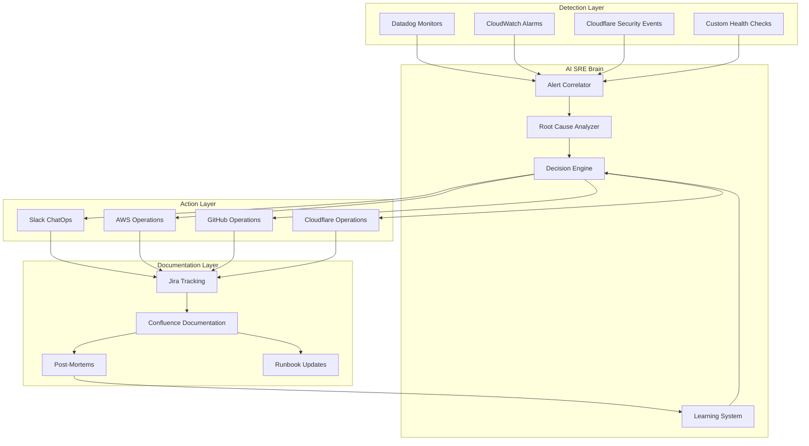

# AI SRE ChatOps with Claude Code

## Overview

AI SRE ChatOps combines Claude Code's capabilities across AWS, GitHub, Datadog, Atlassian, Slack, and Cloudflare into a unified incident management and operations platform. This is "Vibe Ops" -- extending the concept of vibe coding into operations, where AI agents work alongside SRE teams to detect, diagnose, mitigate, and document incidents with human oversight.

## The AI SRE Vision

## Key Principles

### 1. Human-in-the-Loop
AI recommends, humans approve, systems execute. Every automated action is logged and explainable. Critical actions (production deployments, rollbacks, data changes) always require human confirmation.

### 2. Vibe Loop
A tight feedback loop between code, production, observation, learning, and improvement:
- Write code (with AI assistance)
- Deploy to production (with AI review)
- Observe behavior (with AI monitoring)
- Learn from incidents (with AI analysis)
- Improve reliability (with AI recommendations)

### 3. ChatOps as Control Plane
Slack serves as the primary interface where communication channels double as execution environments. Every action is visible, auditable, and collaborative.

### 4. Progressive Automation
Start with AI-assisted (human does everything, AI suggests), graduate to AI-augmented (AI does routine tasks, human handles exceptions), and eventually reach AI-autonomous for well-understood, low-risk operations.

## Measured Outcomes

Teams implementing AI SRE report:
- **60-80%** fewer false positive alerts
- **50-70%** faster incident response
- **40-60%** less manual intervention
- **17.8% average MTTR reduction** (30-70% for advanced implementations)
- **20-30% fewer incidents** through predictive analysis

## File Index

| File | Description |
|------|-------------|
| [incident_management.md](incident_management.md) | Complete incident management workflow |
| [ai_sre_setup.md](ai_sre_setup.md) | Setting up AI SRE across all platforms |
| [runbooks.md](runbooks.md) | AI-powered runbook automation |
| [skills.md](skills.md) | ChatOps-specific skills |
| [agents.md](agents.md) | ChatOps agents |
| [slash_commands.md](slash_commands.md) | ChatOps slash commands |
| [architecture.md](architecture.md) | Architecture diagrams |

## Sources

- [AI SRE Guide 2026 - Rootly](https://rootly.com/ai-sre-guide)
- [Top 12 AI SRE Tools 2026](https://www.sherlocks.ai/blog/top-ai-sre-tools-in-2026)
- [Human-Centred AI for SRE - InfoQ](https://www.infoq.com/news/2026/01/opsworker-ai-sre/)
- [AI-Powered Incident Management - incident.io](https://incident.io/blog/5-best-ai-powered-incident-management-platforms-2026)
- [Vibe Loop: AI-Native Reliability - Observe](https://www.observeinc.com/blog/vibe-loop-ai-native-reliability-engineering-for-the-real-world)
- [From Vibe Coding to Vibe Ops](https://www.techshowfrankfurt.de/tech-show-frankfurt/tbc-session-1)
- [PagerDuty Agentic SRE](https://www.efficientlyconnected.com/pagerduty-advances-toward-autonomous-operations-with-agentic-sre-and-multi-agent-workflows/)
