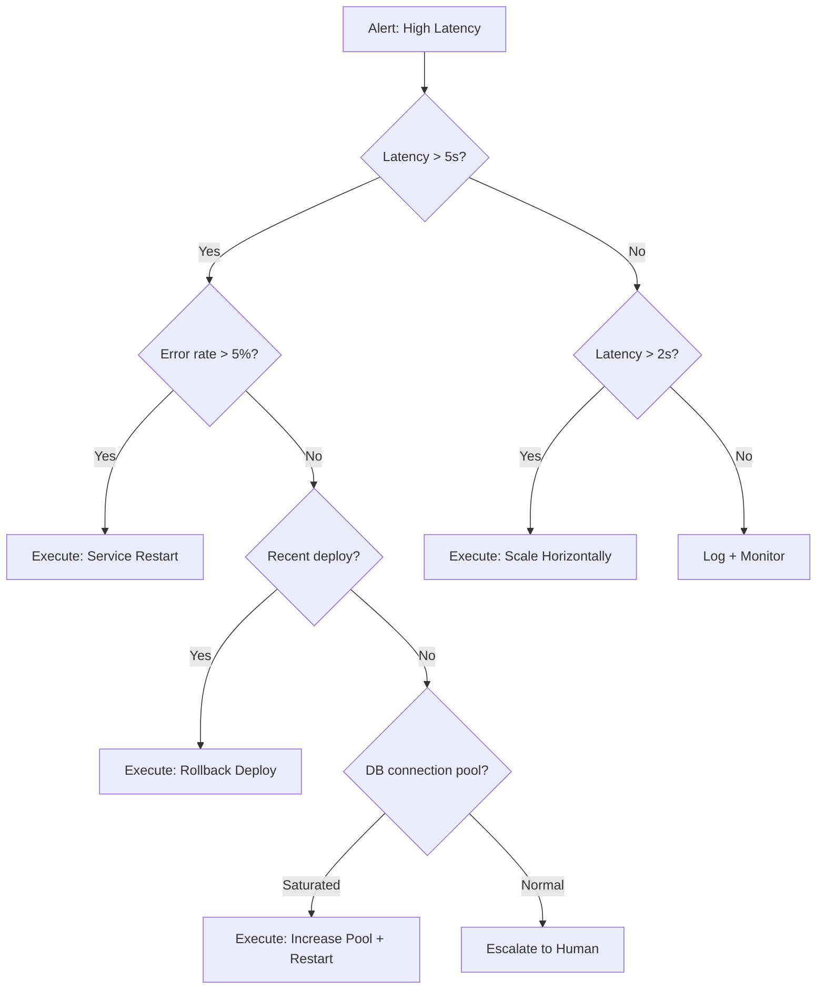
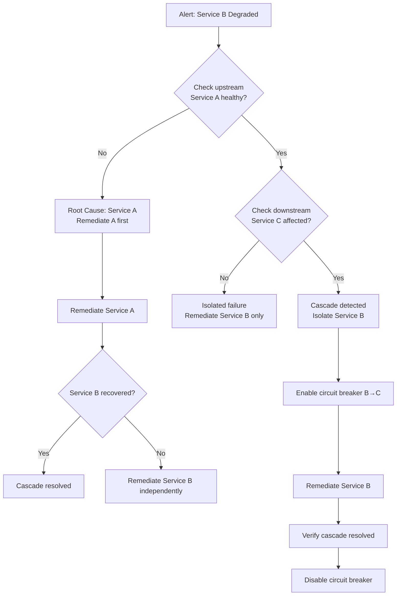
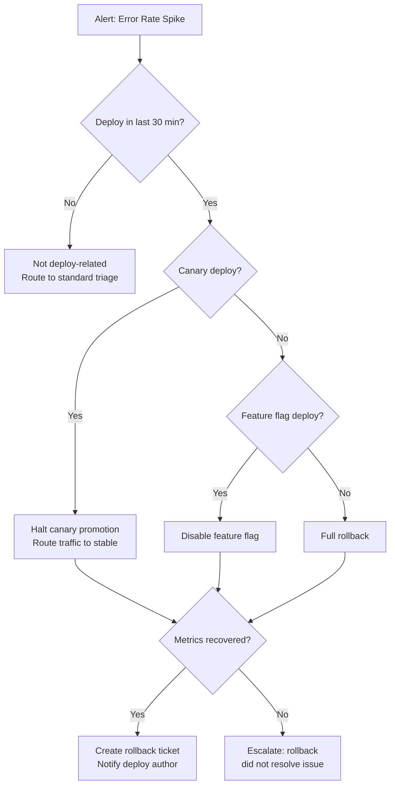
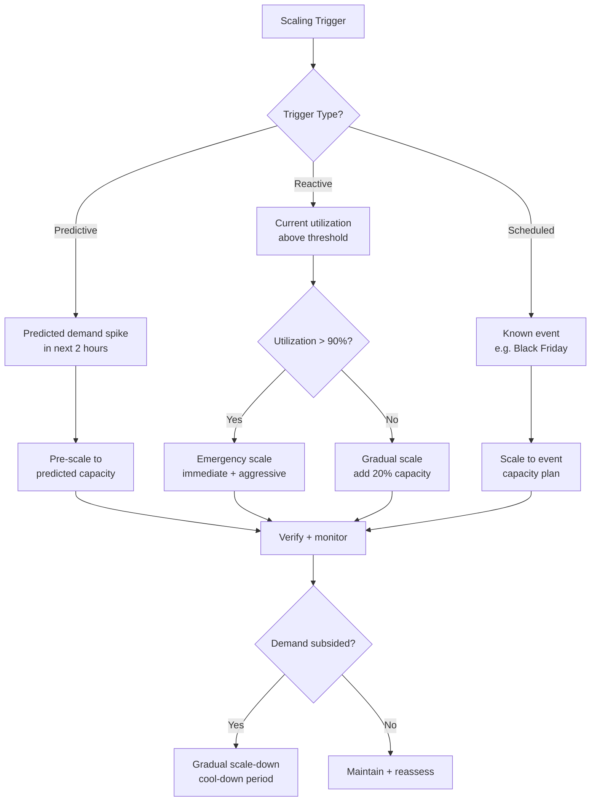
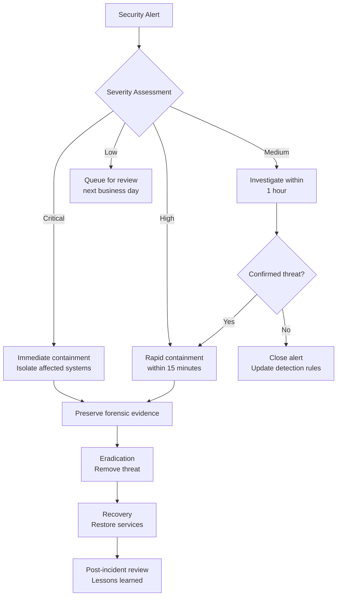

# Advanced Runbook Patterns

> Executable runbook templates for AI-driven operations: decision trees, cascade handling, rollback automation, capacity scaling, and security incident response.

---

## Table of Contents

1. [Decision Tree Runbooks](#1-decision-tree-runbooks)
2. [Multi-Service Cascade Runbooks](#2-multi-service-cascade-runbooks)
3. [Rollback Automation](#3-rollback-automation)
4. [Capacity Scaling Runbooks](#4-capacity-scaling-runbooks)
5. [Security Incident Runbooks](#5-security-incident-runbooks)
6. [Runbook Composition Patterns](#6-runbook-composition-patterns)
7. [AI Enhancement Patterns](#7-ai-enhancement-patterns)

---

## 1. Decision Tree Runbooks

Decision tree runbooks encode diagnostic logic as branching paths. AI traverses the tree, evaluating conditions at each node, and executes the appropriate remediation at the leaf.

### Pattern: Branching Diagnostic Tree



### YAML Template: Decision Tree Runbook

```yaml
runbook:
  name: high-latency-diagnostic
  version: "2.0"
  description: "Diagnose and remediate high latency alerts"
  trigger:
    type: alert
    source: datadog
    condition: "avg:service.latency{env:production} > 2000"

  variables:
    latency_threshold_critical: 5000  # ms
    latency_threshold_warning: 2000   # ms
    error_rate_threshold: 5           # percent
    deploy_lookback_minutes: 30
    confidence_threshold: 0.85

  decision_tree:
    root:
      condition: "metrics.latency_p99 > ${latency_threshold_critical}"
      true_branch: critical_path
      false_branch: warning_path

    critical_path:
      condition: "metrics.error_rate > ${error_rate_threshold}"
      true_branch:
        action: restart_service
        confidence: 0.92
        requires_approval: false
      false_branch: check_recent_deploy

    check_recent_deploy:
      condition: "deployments.last_deploy_minutes < ${deploy_lookback_minutes}"
      true_branch:
        action: rollback_deploy
        confidence: 0.88
        requires_approval: true
      false_branch: check_db_connections

    check_db_connections:
      condition: "metrics.db_pool_utilization > 90"
      true_branch:
        action: increase_db_pool
        confidence: 0.85
        requires_approval: true
      false_branch:
        action: escalate_to_human
        reason: "Unable to determine root cause automatically"

    warning_path:
      condition: "metrics.latency_p99 > ${latency_threshold_warning}"
      true_branch:
        action: scale_horizontally
        confidence: 0.90
        requires_approval: false
      false_branch:
        action: monitor_and_log
        duration_minutes: 15

  actions:
    restart_service:
      type: kubernetes
      command: "kubectl rollout restart deployment/${service_name} -n ${namespace}"
      verification:
        wait_seconds: 60
        check: "metrics.latency_p99 < ${latency_threshold_warning}"
      rollback_on_failure: true

    rollback_deploy:
      type: deployment
      command: "kubectl rollout undo deployment/${service_name} -n ${namespace}"
      verification:
        wait_seconds: 120
        check: "metrics.latency_p99 < ${latency_threshold_warning} AND metrics.error_rate < 1"

    scale_horizontally:
      type: kubernetes
      command: "kubectl scale deployment/${service_name} --replicas=${current_replicas + 2} -n ${namespace}"
      max_replicas: 20
      verification:
        wait_seconds: 180
        check: "metrics.latency_p99 < ${latency_threshold_warning}"

    increase_db_pool:
      type: config_update
      target: "configmap/${service_name}-config"
      changes:
        db_pool_max_size: "${current_pool_size * 1.5}"
      post_action: restart_service

    escalate_to_human:
      type: notification
      channels:
        - slack: "#incidents"
        - pagerduty: "on-call-primary"
      message: "AI unable to determine root cause. Latency: ${metrics.latency_p99}ms, Error rate: ${metrics.error_rate}%"
      include_diagnostic_data: true

    monitor_and_log:
      type: passive
      create_ticket: true
      monitor_duration: 15
      escalate_if: "metrics.latency_p99 > ${latency_threshold_critical}"
```

### JSON Template: Decision Tree Runbook

```json
{
  "runbook": {
    "name": "high-latency-diagnostic",
    "version": "2.0",
    "trigger": {
      "type": "alert",
      "source": "datadog",
      "condition": "avg:service.latency{env:production} > 2000"
    },
    "decision_tree": {
      "root": {
        "evaluate": "metrics.latency_p99",
        "branches": [
          {
            "condition": "> 5000",
            "next": "critical_path"
          },
          {
            "condition": "> 2000",
            "next": "warning_path"
          },
          {
            "condition": "default",
            "action": "monitor_and_log"
          }
        ]
      },
      "critical_path": {
        "evaluate": "metrics.error_rate",
        "branches": [
          {
            "condition": "> 5",
            "action": "restart_service",
            "confidence": 0.92
          },
          {
            "condition": "default",
            "next": "check_deploy"
          }
        ]
      }
    }
  }
}
```

---

## 2. Multi-Service Cascade Runbooks

Cascade runbooks handle failures that propagate across service boundaries. They model service dependencies and execute remediation in the correct order to prevent cascade amplification.

### Pattern: Cascade Detection and Isolation



### YAML Template: Cascade Runbook

```yaml
runbook:
  name: multi-service-cascade
  version: "1.0"
  description: "Handle cascading failures across service dependencies"

  service_topology:
    # Define service dependencies (DAG)
    services:
      api-gateway:
        depends_on: []
        health_check: "https://api-gateway.internal/healthz"
        circuit_breaker: true
      user-service:
        depends_on: [api-gateway]
        health_check: "https://user-service.internal/healthz"
        circuit_breaker: true
      order-service:
        depends_on: [user-service, inventory-service]
        health_check: "https://order-service.internal/healthz"
        circuit_breaker: true
      inventory-service:
        depends_on: [api-gateway]
        health_check: "https://inventory-service.internal/healthz"
        circuit_breaker: true
      payment-service:
        depends_on: [order-service]
        health_check: "https://payment-service.internal/healthz"
        circuit_breaker: true

  trigger:
    type: alert
    condition: "any service error_rate > 10% OR latency_p99 > 5000ms"

  cascade_detection:
    strategy: topological_sort
    steps:
      - name: identify_affected_services
        action: |
          Query all services for health status.
          Build list of unhealthy services.

      - name: find_root_cause_service
        action: |
          Walk dependency graph upstream from affected services.
          The root cause is the furthest-upstream unhealthy service.
          If multiple roots, prioritize by dependency count.

      - name: assess_blast_radius
        action: |
          Walk dependency graph downstream from root cause.
          All downstream services are potentially affected.
          Count total affected users/requests.

  remediation:
    strategy: upstream_first
    steps:
      - name: isolate_cascade
        description: "Enable circuit breakers to stop cascade propagation"
        action:
          type: circuit_breaker
          target: "all edges from ${root_cause_service} to downstream"
          state: open
          fallback: "cached_response OR graceful_degradation"

      - name: remediate_root_cause
        description: "Fix the upstream service causing the cascade"
        action:
          type: runbook_reference
          runbook: "service-specific/${root_cause_service}-remediation"
          timeout_minutes: 10
          on_timeout: escalate_to_human

      - name: verify_root_cause_recovered
        description: "Confirm the root cause service is healthy"
        action:
          type: health_check
          target: "${root_cause_service}"
          retries: 3
          retry_interval_seconds: 30

      - name: gradually_restore_traffic
        description: "Slowly close circuit breakers to restore normal flow"
        action:
          type: circuit_breaker
          target: "all edges from ${root_cause_service}"
          strategy: gradual
          steps:
            - percent: 10
              hold_minutes: 2
              check: "error_rate < 1%"
            - percent: 25
              hold_minutes: 2
              check: "error_rate < 1%"
            - percent: 50
              hold_minutes: 5
              check: "error_rate < 1%"
            - percent: 100
              hold_minutes: 5
              check: "error_rate < 1% AND latency_p99 < 2000ms"

      - name: verify_full_recovery
        description: "Confirm all downstream services recovered"
        action:
          type: health_check
          target: "all services in blast_radius"
          timeout_minutes: 10

  escalation:
    conditions:
      - "root cause not identified within 5 minutes"
      - "remediation fails after 2 attempts"
      - "cascade affects > 5 services"
      - "payment-service affected (revenue impact)"
    action:
      type: page
      targets:
        - pagerduty: "on-call-sre"
        - pagerduty: "on-call-platform"
      include: "cascade analysis, affected services, actions taken"
```

---

## 3. Rollback Automation

Rollback runbooks detect when a deployment causes degradation and automatically revert to the previous known-good state.

### Pattern: Deploy-Correlated Rollback



### YAML Template: Rollback Automation

```yaml
runbook:
  name: deploy-rollback-automation
  version: "2.0"
  description: "Detect deploy-correlated degradation and automatically rollback"

  trigger:
    type: composite
    conditions:
      - "metrics.error_rate > 3x baseline (5 min window)"
      - "deployment.last_deploy_age < 30 minutes"
    require: all

  config:
    deploy_lookback_minutes: 30
    baseline_window_hours: 24
    error_rate_multiplier: 3
    latency_multiplier: 2
    canary_weight_threshold: 10  # percent

  correlation_check:
    - name: temporal_correlation
      description: "Verify degradation started after deploy"
      check: |
        degradation_start_time > deploy_time
        AND degradation_start_time < deploy_time + 15min

    - name: service_correlation
      description: "Verify degradation is in the deployed service or its dependents"
      check: |
        affected_service IN (deployed_service, deployed_service.dependents)

    - name: metric_correlation
      description: "Verify metrics that degraded match expected deploy impact"
      check: |
        (error_rate > baseline * ${error_rate_multiplier})
        OR (latency_p99 > baseline * ${latency_multiplier})

  rollback_strategies:
    canary:
      condition: "deployment.strategy == 'canary' AND canary.weight < ${canary_weight_threshold}"
      steps:
        - name: halt_canary
          action:
            type: deployment
            command: "kubectl argo rollouts abort ${rollout_name} -n ${namespace}"
        - name: verify_traffic_shifted
          action:
            type: check
            condition: "canary.weight == 0"
            timeout_seconds: 60

    feature_flag:
      condition: "deployment.has_feature_flag == true"
      steps:
        - name: disable_feature_flag
          action:
            type: feature_flag
            provider: launchdarkly  # or split, flagsmith, etc.
            flag_key: "${deployment.feature_flag_key}"
            new_state: false
            environment: production
        - name: verify_flag_disabled
          action:
            type: check
            condition: "feature_flag.${deployment.feature_flag_key}.state == false"
            timeout_seconds: 30

    full_rollback:
      condition: "default"
      steps:
        - name: identify_previous_version
          action:
            type: query
            command: "kubectl rollout history deployment/${service_name} -n ${namespace}"
            extract: "previous_revision"

        - name: execute_rollback
          action:
            type: deployment
            command: "kubectl rollout undo deployment/${service_name} -n ${namespace}"
            timeout_seconds: 300

        - name: wait_for_rollout
          action:
            type: wait
            condition: "kubectl rollout status deployment/${service_name} -n ${namespace}"
            timeout_seconds: 600

  post_rollback:
    - name: verify_recovery
      action:
        type: metric_check
        checks:
          - "metrics.error_rate < baseline * 1.5"
          - "metrics.latency_p99 < baseline * 1.5"
        window_minutes: 5
        on_failure:
          action: escalate
          message: "Rollback did not resolve degradation"

    - name: notify_deploy_author
      action:
        type: notification
        channel: slack
        target: "${deployment.author}"
        message: |
          :warning: Your deploy to ${service_name} was automatically rolled back.

          **Reason**: ${correlation_check.summary}
          **Deploy**: ${deployment.id} (${deployment.commit_sha})
          **Metrics**: Error rate ${metrics.error_rate}% (baseline: ${baseline.error_rate}%)

          Please investigate and re-deploy with a fix.
          Rollback ticket: ${ticket.url}

    - name: create_ticket
      action:
        type: ticket
        provider: jira
        project: "SRE"
        type: "Bug"
        title: "Auto-rollback: ${service_name} deploy ${deployment.id}"
        description: |
          Automated rollback triggered for ${service_name}.
          Deploy SHA: ${deployment.commit_sha}
          Author: ${deployment.author}
          Correlation: ${correlation_check.summary}
          Metrics snapshot: ${metrics.snapshot_url}
        assignee: "${deployment.author}"
        labels: ["auto-rollback", "deploy-failure"]

    - name: block_redeploy
      action:
        type: deployment_lock
        service: "${service_name}"
        duration_minutes: 60
        reason: "Auto-rollback in effect. Manual approval required to redeploy."
        unlock_requires: "SRE approval"
```

---

## 4. Capacity Scaling Runbooks

Capacity scaling runbooks handle both reactive (responding to current load) and proactive (predicting future load) scaling scenarios.

### Pattern: Predictive + Reactive Scaling



### YAML Template: Capacity Scaling Runbook

```yaml
runbook:
  name: capacity-scaling
  version: "2.0"
  description: "Reactive, predictive, and scheduled capacity scaling"

  config:
    min_replicas: 3
    max_replicas: 50
    scale_up_cooldown_minutes: 5
    scale_down_cooldown_minutes: 15
    target_utilization: 70  # percent
    emergency_threshold: 90  # percent
    prediction_horizon_hours: 2
    cost_guard_monthly_budget: 50000  # USD

  triggers:
    reactive:
      condition: "avg(cpu_utilization, 5min) > 75% OR avg(memory_utilization, 5min) > 80%"
      priority: high

    predictive:
      condition: "ml_model.predicted_load(+2h) > current_capacity * 0.8"
      priority: medium
      model: "capacity-predictor-v3"
      features:
        - historical_traffic_patterns
        - day_of_week
        - time_of_day
        - active_marketing_campaigns
        - recent_feature_launches

    scheduled:
      events:
        - name: "black_friday"
          cron: "0 0 * 11 5#4"  # 4th Friday of November
          scale_factor: 5.0
          pre_scale_hours: 12
        - name: "end_of_month"
          cron: "0 18 L * *"  # Last day of month, 6 PM
          scale_factor: 2.0
          pre_scale_hours: 2

  scaling_strategies:
    emergency:
      condition: "current_utilization > ${emergency_threshold}"
      action:
        type: scale
        method: immediate
        target_replicas: "current_replicas * 2"
        max_replicas: "${max_replicas}"
        notification:
          channel: "#incidents"
          severity: critical
          message: "Emergency scaling: ${service_name} at ${current_utilization}% utilization"

    gradual:
      condition: "current_utilization > ${target_utilization}"
      action:
        type: scale
        method: stepped
        steps:
          - add_replicas: 2
            wait_minutes: "${scale_up_cooldown_minutes}"
            check: "utilization < ${target_utilization}"
          - add_replicas: 3
            wait_minutes: "${scale_up_cooldown_minutes}"
            check: "utilization < ${target_utilization}"
          - add_replicas: 5
            wait_minutes: "${scale_up_cooldown_minutes}"
            check: "utilization < ${target_utilization}"
        max_replicas: "${max_replicas}"
        on_max_reached:
          action: escalate
          message: "Max replicas reached, utilization still above target"

    predictive:
      action:
        type: scale
        method: pre_scale
        target_replicas: "ml_model.recommended_replicas(+2h)"
        max_replicas: "${max_replicas}"
        schedule: "scale_30min_before_predicted_peak"
        notification:
          channel: "#capacity"
          message: "Predictive scaling: ${service_name} to ${target_replicas} replicas for predicted load"

  scale_down:
    conditions:
      - "utilization < ${target_utilization} * 0.5 for > ${scale_down_cooldown_minutes} minutes"
      - "no active incidents for service"
      - "not in scheduled event window"
    strategy:
      method: gradual
      steps:
        - remove_percent: 20
          wait_minutes: "${scale_down_cooldown_minutes}"
          check: "utilization < ${target_utilization} * 0.7"
        - remove_percent: 20
          wait_minutes: "${scale_down_cooldown_minutes}"
          check: "utilization < ${target_utilization} * 0.7"
      min_replicas: "${min_replicas}"
      time_restriction: "only between 02:00-06:00 UTC"  # low-traffic window

  cost_controls:
    budget_check:
      action: |
        Calculate projected monthly cost at current scale.
        If projected > ${cost_guard_monthly_budget}, alert #finops channel.
        Never auto-scale beyond budget without human approval.
    spot_instance_policy:
      use_spot: true
      spot_percentage: 40  # percent of total capacity
      on_demand_minimum: "${min_replicas}"

  verification:
    post_scale:
      checks:
        - "all new pods in Ready state"
        - "load balancer health checks passing"
        - "no increase in error rate"
        - "latency_p99 within SLO"
      timeout_minutes: 5
      on_failure:
        action: rollback_scale
        method: "revert to previous replica count"
```

---

## 5. Security Incident Runbooks

Security incident runbooks handle detection, containment, eradication, and recovery for security events with appropriate urgency and compliance requirements.

### Pattern: Security Incident Response



### YAML Template: Security Incident Runbook

```yaml
runbook:
  name: security-incident-response
  version: "2.0"
  description: "Automated security incident detection, containment, and response"
  compliance:
    - SOC2
    - PCI-DSS
    - GDPR
  evidence_preservation: required
  audit_logging: mandatory

  severity_classification:
    critical:
      indicators:
        - "active data exfiltration detected"
        - "ransomware indicators present"
        - "privileged account compromise confirmed"
        - "production database unauthorized access"
      response_sla: "immediate (< 5 minutes)"
      auto_containment: true
    high:
      indicators:
        - "suspicious lateral movement"
        - "unauthorized API key usage"
        - "unusual data access patterns"
        - "credential stuffing attack detected"
      response_sla: "< 15 minutes"
      auto_containment: true
    medium:
      indicators:
        - "failed login brute force"
        - "suspicious but unconfirmed access pattern"
        - "vulnerability scan detected"
        - "phishing email reported"
      response_sla: "< 1 hour"
      auto_containment: false
    low:
      indicators:
        - "policy violation (non-malicious)"
        - "outdated TLS version detected"
        - "misconfiguration alert"
      response_sla: "next business day"
      auto_containment: false

  phases:
    detection_and_triage:
      steps:
        - name: classify_alert
          action:
            type: ai_classification
            model: "security-classifier-v2"
            inputs:
              - alert_data
              - source_ip_reputation
              - user_behavior_baseline
              - threat_intelligence_feeds
            output: severity_level

        - name: enrich_context
          action:
            type: parallel
            tasks:
              - query_siem: "related events in last 24h"
              - query_threat_intel: "IOC lookup for ${indicators}"
              - query_asset_inventory: "affected system classification"
              - query_user_directory: "affected user details and role"

        - name: create_incident
          action:
            type: incident
            channel: "slack:#security-incidents"
            participants:
              - security_on_call
              - affected_service_owner
              - if_critical: [ciso, legal, communications]
            war_room: true

    containment:
      critical_auto_actions:
        - name: isolate_compromised_host
          action:
            type: network
            command: |
              # Add host to quarantine security group
              aws ec2 modify-instance-attribute \
                --instance-id ${affected_instance} \
                --groups ${quarantine_security_group}
            reversible: true
            evidence_snapshot: true

        - name: revoke_compromised_credentials
          action:
            type: iam
            commands:
              - "aws iam update-login-profile --user-name ${affected_user} --password-reset-required"
              - "aws iam list-access-keys --user-name ${affected_user} | deactivate all"
              - "aws iam list-mfa-devices --user-name ${affected_user} | deactivate all"
            notification:
              target: "${affected_user.manager}"
              message: "Credentials for ${affected_user} revoked due to security incident"

        - name: block_suspicious_ips
          action:
            type: waf
            command: |
              Add ${suspicious_ips} to WAF blocklist.
              Apply rate limiting to ${suspicious_ip_ranges}.
            duration: "24 hours (auto-review)"

        - name: preserve_evidence
          action:
            type: forensics
            steps:
              - "snapshot EBS volumes of affected instances"
              - "export CloudTrail logs for affected accounts (last 72h)"
              - "export VPC flow logs for affected subnets (last 72h)"
              - "capture memory dump if instance still running"
              - "archive all evidence to locked S3 bucket with legal hold"

      high_auto_actions:
        - name: rate_limit_suspicious_activity
          action:
            type: waf
            command: "Apply aggressive rate limiting to ${suspicious_sources}"
        - name: enable_enhanced_logging
          action:
            type: monitoring
            command: "Enable debug-level logging for ${affected_services}"
            duration: "4 hours"

    eradication:
      steps:
        - name: identify_attack_vector
          action:
            type: ai_analysis
            model: "threat-analysis-v2"
            inputs:
              - containment_evidence
              - siem_correlation
              - threat_intel_matches
            output: attack_vector_report

        - name: remove_threat
          action:
            type: remediation
            strategies:
              malware:
                - "terminate affected instances"
                - "deploy fresh instances from known-good AMI"
                - "rotate all secrets accessed by affected instances"
              compromised_credentials:
                - "rotate all credentials for affected user"
                - "revoke all active sessions"
                - "review and revert unauthorized changes"
              vulnerability_exploit:
                - "patch vulnerability on all affected systems"
                - "deploy compensating controls until full patch"
                - "scan for exploitation on other systems"

    recovery:
      steps:
        - name: restore_services
          action:
            type: deployment
            strategy: gradual
            steps:
              - "deploy patched/clean instances"
              - "restore from known-good backup if needed"
              - "verify service functionality"
              - "gradually restore traffic"

        - name: verify_containment
          action:
            type: monitoring
            checks:
              - "no recurring IOCs in last 4 hours"
              - "all compromised credentials rotated"
              - "affected systems rebuilt from clean images"
              - "enhanced monitoring confirms no reinfection"

    post_incident:
      steps:
        - name: generate_report
          action:
            type: ai_report
            template: security_incident_report
            sections:
              - executive_summary
              - timeline_of_events
              - impact_assessment
              - root_cause_analysis
              - containment_actions_taken
              - eradication_steps
              - recovery_verification
              - lessons_learned
              - action_items

        - name: compliance_notification
          action:
            type: notification
            conditions:
              pci_data_affected: "notify PCI QSA within 24h"
              gdpr_data_affected: "notify DPO within 72h"
              customer_data_affected: "prepare customer notification"

        - name: update_detection_rules
          action:
            type: siem
            command: |
              Create new detection rules based on:
              - IOCs identified in this incident
              - Attack patterns observed
              - Gaps in existing detection
```

---

## 6. Runbook Composition Patterns

### Pattern: Runbook Chaining

Compose complex workflows by chaining simple runbooks together.

```yaml
runbook:
  name: composed-incident-response
  version: "1.0"
  description: "Chain multiple runbooks for complex incident handling"

  chain:
    - runbook: triage/classify-incident
      outputs: [severity, affected_services, probable_cause]

    - runbook: containment/isolate-service
      condition: "severity >= high"
      inputs:
        services: "${affected_services}"

    - runbook: diagnosis/root-cause-analysis
      inputs:
        services: "${affected_services}"
        initial_hypothesis: "${probable_cause}"
      outputs: [root_cause, remediation_plan]

    - runbook: "remediation/${root_cause.category}"
      inputs:
        plan: "${remediation_plan}"
      outputs: [remediation_result]

    - runbook: verification/post-remediation-check
      inputs:
        services: "${affected_services}"
        expected_state: healthy
      outputs: [verification_result]

    - runbook: communication/incident-resolved
      condition: "verification_result == success"
      inputs:
        incident_summary: "${chain.summary}"

  error_handling:
    on_step_failure:
      action: escalate_to_human
      include: "all step outputs so far"
    on_timeout:
      timeout_minutes: 30
      action: escalate_to_human
      message: "Automated resolution timed out"
```

### Pattern: Parallel Runbook Execution

```yaml
runbook:
  name: parallel-diagnostics
  version: "1.0"
  description: "Run diagnostic runbooks in parallel to speed up root cause analysis"

  parallel:
    - runbook: diagnostics/check-infrastructure
      timeout_minutes: 5
    - runbook: diagnostics/check-application
      timeout_minutes: 5
    - runbook: diagnostics/check-database
      timeout_minutes: 5
    - runbook: diagnostics/check-external-deps
      timeout_minutes: 5

  aggregate:
    strategy: first_root_cause
    description: |
      Take the first diagnostic that identifies a root cause
      with confidence > 0.8 and execute its remediation plan.
    fallback:
      action: escalate_to_human
      message: "No diagnostic identified root cause with sufficient confidence"
```

---

## 7. AI Enhancement Patterns

### Pattern: AI-Generated Runbook Updates

```yaml
ai_enhancement:
  name: runbook-self-improvement
  description: "AI analyzes incident resolutions and updates runbooks"

  trigger:
    type: post_incident
    condition: "incident resolved AND resolution_method == manual"

  analysis:
    inputs:
      - incident_timeline
      - actions_taken
      - resolution_steps
      - existing_runbook_for_service

    tasks:
      - name: identify_new_pattern
        prompt: |
          Analyze the incident resolution and determine if the steps taken
          represent a new pattern not covered by existing runbooks.
          If so, generate a new decision tree branch.

      - name: suggest_runbook_update
        prompt: |
          Compare the manual resolution steps with the existing runbook.
          Suggest specific YAML additions or modifications to automate
          this resolution in the future.

      - name: estimate_confidence
        prompt: |
          Based on the number of times this pattern has occurred and
          the consistency of resolution steps, estimate the confidence
          level for autonomous execution.

  output:
    type: pull_request
    target_file: "runbooks/${service_name}.yaml"
    require_human_review: true
    labels: ["ai-generated", "runbook-update"]
```

### Pattern: Confidence-Gated Execution

```yaml
confidence_gating:
  description: "Execute runbook actions based on AI confidence level"

  thresholds:
    autonomous: 0.95      # Execute without approval
    approved: 0.80        # Execute with human approval
    suggested: 0.60       # Suggest but do not offer execution
    investigate: 0.40     # Flag for human investigation
    ignore: 0.20          # Below this, do not act

  action_mapping:
    - range: [0.95, 1.00]
      behavior: execute_immediately
      notification: post_action_summary
      approval: none

    - range: [0.80, 0.95]
      behavior: propose_and_wait
      notification: request_approval
      approval: single_approver
      timeout_minutes: 10
      on_timeout: escalate

    - range: [0.60, 0.80]
      behavior: suggest_only
      notification: suggestion_with_rationale
      approval: not_applicable

    - range: [0.40, 0.60]
      behavior: flag_for_review
      notification: investigation_request
      approval: not_applicable

    - range: [0.00, 0.40]
      behavior: log_only
      notification: none
      approval: not_applicable
```

---

## Sources

- [Rundeck AI-Generated Runbooks](https://docs.rundeck.com/docs/manual/jobs/ai-generated-runbooks.html)
- [Cutover AI Runbooks](https://cutover.com/ai-enabled-runbooks)
- [AWS Systems Manager Automation](https://docs.aws.amazon.com/systems-manager/latest/userguide/automation-documents.html)
- [Algomox Intelligent Runbooks](https://www.algomox.com/resources/blog/intelligent_runbooks_generative_ai_aiops/)
- [NashTech Autonomous Runbooks](https://blog.nashtechglobal.com/autonomous-runbooks/)
- [Autohand Runbook Automation](https://autohand.ai/docs/guides/sre/runbook-automation)
- [SOAR Playbook Patterns](https://securityboulevard.com/2025/11/soar-playbook-to-optimize-incident-response/)
