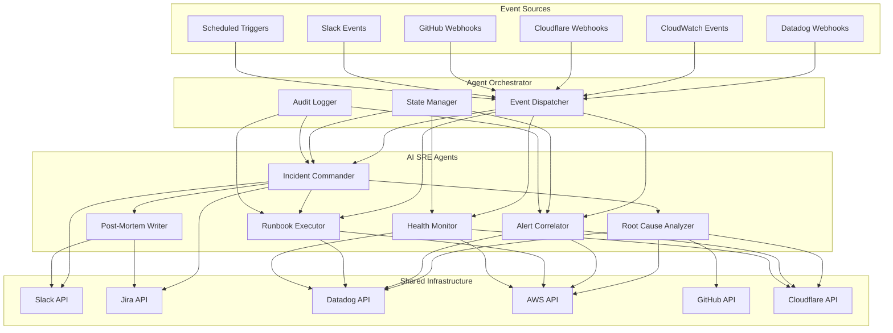
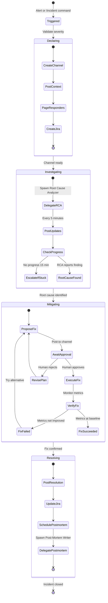
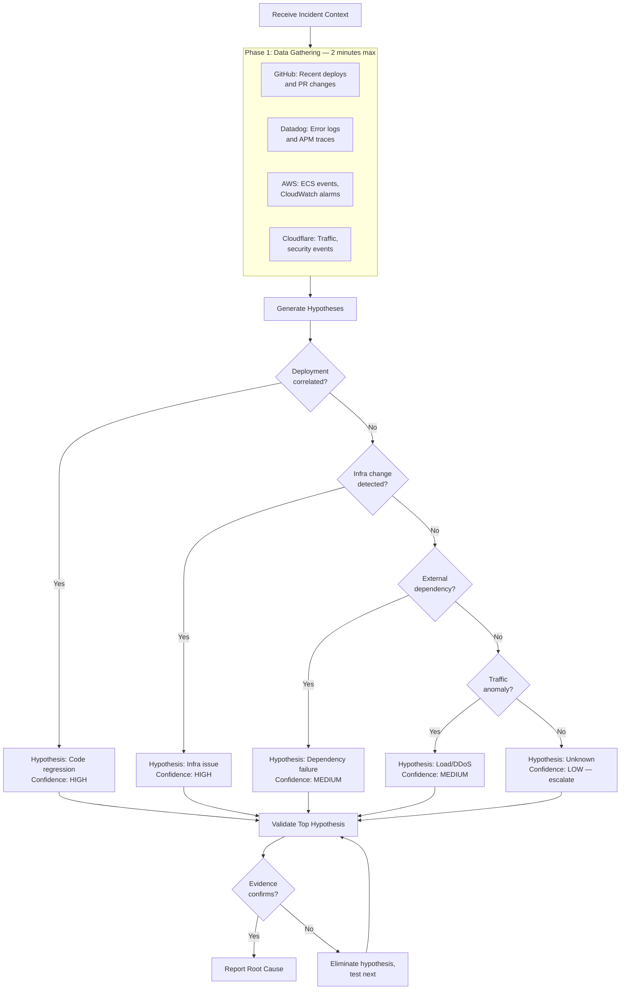
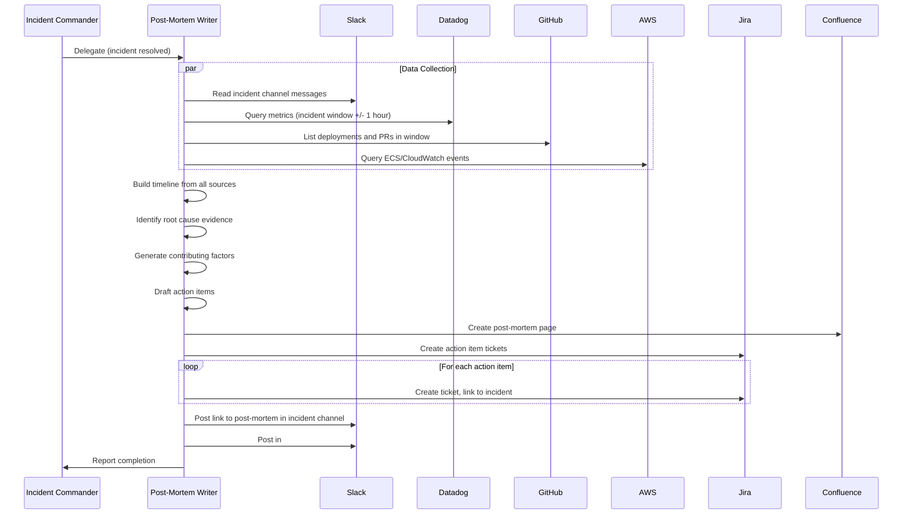
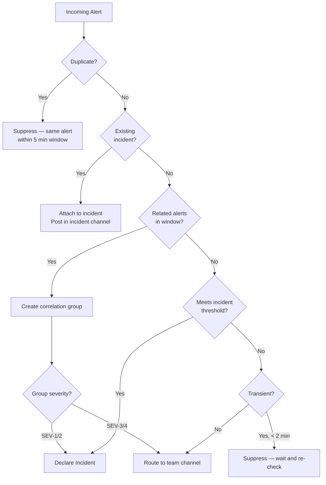
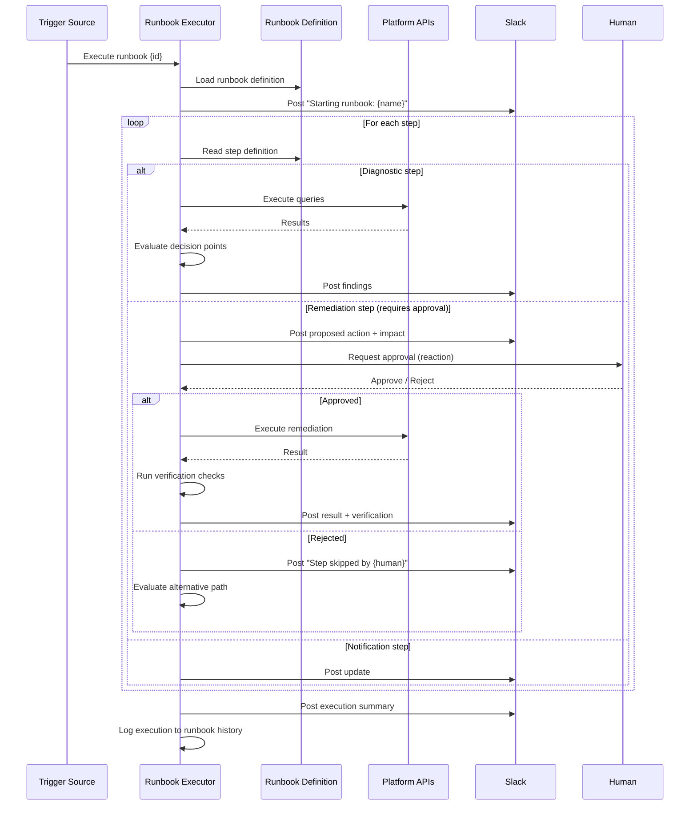
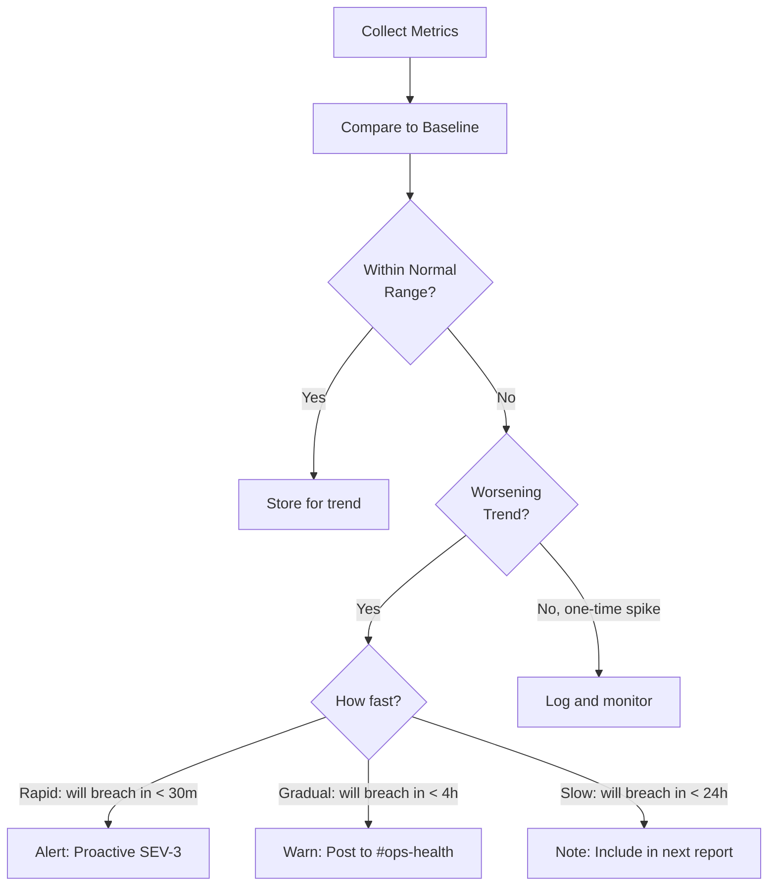
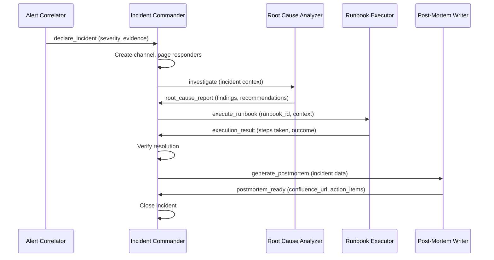
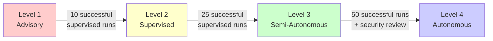

# AI SRE Agents

## Overview

AI SRE agents are specialized autonomous workers built on Claude Code's Agent SDK. Each agent has a focused responsibility, defined tool access, and clear handoff protocols. Agents coordinate through Slack channels and structured message passing.

Unlike skills (which are invoked for a single task), agents run continuously or are triggered by events, maintaining state across interactions within an incident or operational context.

---

## Agent Architecture



---

## Agent Definitions

### 1. Incident Commander Agent

The Incident Commander (IC) is the central orchestrator during incidents. It manages the lifecycle from declaration through resolution and hands off to the Post-Mortem Writer at close.

```yaml
agent:
  name: incident-commander
  description: >
    Orchestrates the full incident lifecycle. Creates channels, pages
    responders, coordinates investigation, tracks mitigation, and
    ensures the incident progresses toward resolution.
  trigger:
    - type: alert
      condition: severity IN [SEV-1, SEV-2] OR alert_correlator.declares_incident
    - type: slash_command
      command: /incident
    - type: slack_message
      pattern: "@ai-sre declare incident"
  allowed_tools:
    - mcp__slack__*
    - mcp__datadog__*
    - mcp__aws-core__*
    - mcp__atlassian__*
    - mcp__github__*
    - mcp__cloudflare__*
  delegated_agents:
    - root-cause-analyzer
    - runbook-executor
    - postmortem-writer
  state:
    - incident_id: string
    - severity: SEV-1|SEV-2|SEV-3|SEV-4
    - status: DECLARED|INVESTIGATING|IDENTIFIED|MITIGATING|RESOLVED|CLOSED
    - channel: string
    - jira_ticket: string
    - responders: list[string]
    - timeline: list[{timestamp, event, actor}]
    - actions_taken: list[{action, result, approved_by}]
  escalation:
    no_human_response_15m: page engineering manager
    no_resolution_60m: page VP engineering
    sev1_no_ic_5m: page SRE manager
```

#### Incident Commander Workflow



#### Incident Commander Behavior Rules

1. **First 30 seconds**: Create channel, post context, page responders. Speed matters.
2. **Every 5 minutes**: Post a status update even if nothing changed. Silence during incidents is worse than repetition.
3. **Human IC takeover**: When a human says "I'm IC" or is assigned IC, transition to advisory role. Provide data and recommendations but defer decisions to the human IC.
4. **Parallel execution**: Gather data from all platforms simultaneously. Do not wait for one query before starting the next.
5. **Never assume resolution**: Even if metrics look better, wait for the full verification window (10 minutes for SEV-1/2, 5 minutes for SEV-3/4) before declaring resolved.
6. **Escalation is not failure**: Escalate early and often. It is always better to over-communicate than under-communicate.

#### Multi-Platform Actions Matrix

| Phase | Slack | Datadog | AWS | GitHub | Jira | Cloudflare |
|-------|-------|---------|-----|--------|------|------------|
| Declaration | Create channel, post context, invite responders | Create notebook, snapshot metrics | Gather ECS/RDS status | Identify recent deploys | Create INC ticket | Check edge health |
| Investigation | Post updates every 5 min | Query logs, traces, metrics | Check CloudWatch, ECS events | Get PR diffs for deploys | Search past incidents | Check origin errors |
| Mitigation | Post proposal, await approval | Monitor metrics during fix | Execute rollback/scale | Trigger rollback workflow | Update ticket status | Enable maintenance page |
| Resolution | Post summary, schedule archive | Annotate graphs | Verify infrastructure | Create fix issue | Resolve ticket | Verify edge health |
| Post-mortem | Read channel history | Snapshot before/during/after | Gather deployment events | Gather PR/deploy data | Create action items | Gather traffic data |

---

### 2. Root Cause Analyzer Agent

A focused investigator that systematically narrows down the cause of an incident using data from all platforms.

```yaml
agent:
  name: root-cause-analyzer
  description: >
    Performs systematic root cause analysis during incidents. Correlates
    deployment data, infrastructure metrics, log patterns, and external
    signals to identify the most likely cause.
  trigger:
    - type: delegation
      from: incident-commander
    - type: slash_command
      command: "/investigate"
  allowed_tools:
    - mcp__datadog__*
    - mcp__aws-core__*
    - mcp__github__*
    - mcp__cloudflare__*
    - mcp__slack__*
  state:
    - incident_id: string
    - hypotheses: list[{description, confidence, evidence}]
    - eliminated: list[{hypothesis, reason}]
    - root_cause: {description, confidence, evidence, category}
  timeout: 15m
```

#### Investigation Method



#### Output Format

```markdown
## Root Cause Analysis Report

**Incident:** {incident_id}
**Analysis Duration:** {minutes}
**Confidence:** {HIGH|MEDIUM|LOW}

### Root Cause
{One paragraph description}

### Category
{deployment | infrastructure | configuration | external_dependency | load | security | unknown}

### Evidence
| # | Source | Finding | Link |
|---|--------|---------|------|
| 1 | {platform} | {finding} | {link} |
| 2 | {platform} | {finding} | {link} |

### Correlation Timeline
| Time | Event | Source |
|------|-------|--------|
| {time} | {event} | {platform} |

### Eliminated Hypotheses
| Hypothesis | Eliminated Because |
|------------|-------------------|
| {description} | {reason with evidence} |

### Recommended Actions
1. **Immediate**: {action} (addresses root cause)
2. **Short-term**: {action} (prevents recurrence)
3. **Long-term**: {action} (systemic improvement)
```

---

### 3. Post-Mortem Writer Agent

Generates comprehensive, blameless post-mortems by synthesizing data from the entire incident lifecycle.

```yaml
agent:
  name: postmortem-writer
  description: >
    Generates blameless post-mortems from incident data. Reads the
    incident channel history, gathers metrics, and produces a
    structured document in Confluence with linked Jira action items.
  trigger:
    - type: delegation
      from: incident-commander
      condition: status == RESOLVED
    - type: slash_command
      command: /postmortem
  allowed_tools:
    - mcp__slack__*
    - mcp__datadog__*
    - mcp__aws-core__*
    - mcp__github__*
    - mcp__atlassian__*
  state:
    - incident_id: string
    - channel: string
    - timeline: list[{timestamp, event, source}]
    - metrics_snapshots: dict
    - draft: string
    - action_items: list[{action, owner, priority, jira_key}]
```

#### Post-Mortem Generation Workflow



#### Post-Mortem Quality Checklist

Before publishing, verify the post-mortem includes:

- [ ] Executive summary understandable by non-engineers
- [ ] Complete timeline with no gaps >5 minutes during active incident
- [ ] Root cause identified with supporting evidence (not speculation)
- [ ] Impact quantified (users, revenue, duration, SLA)
- [ ] At least 3 action items with owners and due dates
- [ ] "What went well" section (reinforces good practices)
- [ ] "Where we got lucky" section (reveals hidden risks)
- [ ] No blame language (names used only for timeline accuracy, not fault)
- [ ] Links to dashboards, logs, and code for verification
- [ ] Metrics comparison: before / during / after incident

#### Blameless Language Guide

| Instead of | Write |
|-----------|-------|
| "@alice broke the deployment" | "The deployment at 14:30 introduced a regression" |
| "@bob didn't catch the bug" | "The existing test suite did not cover this code path" |
| "The team failed to respond" | "The response was delayed due to unclear escalation paths" |
| "@carol made a mistake in the config" | "The configuration change interacted unexpectedly with..." |

---

### 4. Alert Correlator Agent

Runs continuously, processing incoming alerts to reduce noise and identify real incidents.

```yaml
agent:
  name: alert-correlator
  description: >
    Processes incoming alerts from Datadog, CloudWatch, and Cloudflare.
    Deduplicates, groups related alerts, and determines whether to
    suppress noise, route as an alert, or escalate to an incident.
  trigger:
    - type: webhook
      sources: [datadog, cloudwatch, cloudflare]
    - type: scheduled
      interval: 60s
  allowed_tools:
    - mcp__datadog__*
    - mcp__aws-core__*
    - mcp__cloudflare__*
    - mcp__slack__*
  state:
    - active_alerts: dict[alert_id, {source, time, severity, service, status}]
    - correlation_groups: dict[group_id, list[alert_id]]
    - suppressed: list[alert_id]
    - recent_incidents: list[incident_id]
  output:
    - suppress: Drop the alert (noise)
    - route: Send to appropriate Slack channel
    - declare_incident: Trigger Incident Commander
```

#### Correlation Engine



#### Correlation Rules Configuration

```yaml
# correlation_rules.yml
rules:
  - name: deployment_cascade
    description: Errors following a deployment within 30 minutes
    match:
      - source: github
        event: deployment
        window: 30m
      - source: datadog
        type: error_rate_spike
        threshold: 2x_baseline
    action: declare_incident
    severity_override: SEV-2
    confidence: HIGH

  - name: az_failure
    description: Multiple services failing in the same availability zone
    match:
      - source: aws
        type: [ecs_task_failure, ec2_status_check_failed, rds_event]
        count: ">= 2"
        group_by: availability_zone
    action: declare_incident
    severity_override: SEV-1
    confidence: HIGH

  - name: origin_errors
    description: Cloudflare seeing elevated origin errors
    match:
      - source: cloudflare
        type: origin_5xx
        threshold: "> 5%"
      - source: datadog
        type: error_rate
        threshold: "> 2%"
        same_service: true
    action: declare_incident
    severity_override: SEV-2
    confidence: MEDIUM

  - name: dependency_timeout
    description: External dependency timeouts affecting multiple services
    match:
      - source: datadog
        type: timeout
        destination: external
        count: ">= 3"
        group_by: destination_host
    action: route
    channel: "#dependency-alerts"
    confidence: MEDIUM

  - name: ddos_attack
    description: DDoS attack detected at Cloudflare edge
    match:
      - source: cloudflare
        type: ddos_mitigation
      - source: cloudflare
        type: traffic_spike
        threshold: 5x_baseline
    action: declare_incident
    severity_override: SEV-1
    confidence: HIGH

  - name: certificate_expiry
    description: SSL certificate expiring soon
    match:
      - source: cloudflare
        type: ssl_certificate
        days_remaining: "< 7"
    action: route
    channel: "#security"
    confidence: HIGH

  - name: cost_anomaly
    description: Unusual AWS spending detected
    match:
      - source: aws
        type: cost_anomaly
        threshold: "> 150% of forecast"
    action: route
    channel: "#ops-cost"
    confidence: MEDIUM
```

#### Noise Reduction Metrics

Track these to measure correlator effectiveness:

| Metric | Target | Measurement |
|--------|--------|-------------|
| Alert-to-incident ratio | >10:1 | Alerts processed / incidents declared |
| False positive rate | <5% | Suppressed alerts that should have been incidents |
| False negative rate | <1% | Incidents not caught by correlator |
| Correlation accuracy | >90% | Correctly grouped related alerts |
| Mean time to correlate | <30s | Alert received to correlation decision |

---

### 5. Runbook Executor Agent

Executes structured runbooks with human approval gates at critical steps.

```yaml
agent:
  name: runbook-executor
  description: >
    Executes AI-powered runbooks step by step. Handles decision points
    dynamically based on real-time data. Pauses for human approval
    at destructive or irreversible steps.
  trigger:
    - type: delegation
      from: incident-commander
    - type: slash_command
      command: /runbook
    - type: webhook
      source: datadog
      condition: monitor has associated runbook
  allowed_tools:
    - mcp__aws-core__*
    - mcp__datadog__*
    - mcp__cloudflare__*
    - mcp__github__*
    - mcp__slack__*
    - mcp__atlassian__*
  state:
    - runbook_id: string
    - current_step: int
    - step_results: list[{step, action, result, duration}]
    - variables: dict
    - approval_pending: bool
    - started_at: timestamp
    - completed_at: timestamp
```

#### Execution Flow



#### Runbook Execution Log Format

Every execution is logged for audit and improvement:

```markdown
## Runbook Execution Log

**Runbook:** {name} (v{version})
**Trigger:** {manual|automatic} — {trigger details}
**Started:** {ISO timestamp}
**Completed:** {ISO timestamp}
**Duration:** {total minutes}
**Result:** {RESOLVED|ESCALATED|ABORTED|FAILED}

### Step Execution

| # | Step | Type | Action | Result | Duration | Approval |
|---|------|------|--------|--------|----------|----------|
| 1 | {name} | diagnostic | {action} | {output} | {time} | N/A |
| 2 | {name} | remediation | {action} | {output} | {time} | @{user} |
| 3 | {name} | verification | {action} | {pass/fail} | {time} | N/A |

### Decision Points

| Step | Condition | Evaluated To | Branch Taken |
|------|-----------|--------------|--------------|
| {n} | {condition} | {value} | {branch} |

### Variables Collected

| Variable | Value | Source |
|----------|-------|--------|
| error_rate | {value} | Datadog |
| recent_deploy | {value} | GitHub |

### Deviations from Runbook
{List any steps that were skipped, modified, or added during execution}

### Improvement Suggestions
{AI-generated suggestions for runbook improvements based on this execution}
```

#### Runbook Improvement Loop

After every execution, the Runbook Executor evaluates:

1. **Missing steps**: Were manual actions taken outside the runbook? Add them.
2. **Wrong decisions**: Did the runbook branch incorrectly at a decision point? Adjust thresholds.
3. **Slow steps**: Which steps took longest? Can they be parallelized or optimized?
4. **Approval bottlenecks**: Were humans slow to approve? Can any steps be pre-approved for known scenarios?
5. **New scenarios**: Did this execution reveal a case the runbook doesn't cover? Document it.

Post improvement suggestions to `#sre-runbook-improvements` and create Jira tickets.

---

### 6. Health Monitor Agent

Continuously monitors system health and posts periodic reports.

```yaml
agent:
  name: health-monitor
  description: >
    Continuously monitors system health across all platforms. Posts
    periodic health reports and proactively alerts on degradation
    trends before they become incidents.
  trigger:
    - type: scheduled
      interval: 15m  # Full health check
    - type: scheduled
      interval: 5m   # Quick vital signs
    - type: slash_command
      command: /status
  allowed_tools:
    - mcp__datadog__*
    - mcp__aws-core__*
    - mcp__cloudflare__*
    - mcp__slack__*
  state:
    - last_report: timestamp
    - baseline_metrics: dict
    - trend_data: dict
    - active_degradations: list[{service, metric, started}]
```

#### Health Report Cadence

| Interval | Report Type | Channel | Content |
|----------|-------------|---------|---------|
| 5 min | Vital signs | Internal state only | Check for anomalies, only post if degraded |
| 15 min | Health summary | #ops-health | Full platform health status |
| 1 hour | Detailed report | #ops-health | Trends, capacity forecasts, SLO burn |
| Daily (9 AM) | Daily digest | #engineering | 24-hour summary, upcoming risks |
| Weekly (Mon 9 AM) | Weekly report | #sre-weekly | SLOs, incident count, trends, action items |

#### Proactive Detection

The Health Monitor does not just report current state — it predicts issues:



Metrics monitored for trend detection:

| Metric | Source | Breach Threshold | Trend Window |
|--------|--------|-----------------|--------------|
| Error rate | Datadog | >2% | 15 min slope |
| p99 latency | Datadog | >2s | 15 min slope |
| ECS CPU | AWS | >85% | 30 min slope |
| RDS connections | AWS | >80% of max | 30 min slope |
| Disk usage | AWS | >85% | 1 hour slope |
| Cache evictions | AWS | >1000/min | 15 min slope |
| Cloudflare origin errors | Cloudflare | >1% | 15 min slope |
| SLO error budget | Datadog | <10% remaining | Daily burn rate |

---

## Agent Communication Protocol

### Inter-Agent Messages

Agents communicate through structured messages in a defined format:

```json
{
  "from": "alert-correlator",
  "to": "incident-commander",
  "type": "declare_incident",
  "priority": "HIGH",
  "timestamp": "2026-03-22T14:35:00Z",
  "payload": {
    "severity": "SEV-1",
    "title": "Checkout service errors following deployment",
    "services": ["checkout-service", "payment-service"],
    "correlation_group": "group-2026-0322-001",
    "alerts": [
      {"source": "datadog", "id": "12345", "name": "High Error Rate"},
      {"source": "cloudwatch", "id": "67890", "name": "ECS Task Failures"}
    ],
    "evidence": {
      "deployment": {"pr": 459, "deployed_at": "2026-03-22T14:30:00Z"},
      "error_rate": "8.5%",
      "affected_users": "~8% of checkout traffic"
    }
  }
}
```

### Handoff Protocol



---

## Agent Deployment

### Prerequisites

```bash
# Required: Claude Code with Agent SDK
npm install -g @anthropic-ai/claude-code

# Required: All MCP servers configured (see ai_sre_setup.md)
claude mcp list  # Should show all 6 servers

# Required: Agent runner (long-running process)
npm install @anthropic-ai/agent-runner
```

### Configuration

```yaml
# agent_config.yml
orchestrator:
  log_level: INFO
  audit_log: /var/log/ai-sre/audit.jsonl
  state_store: /var/lib/ai-sre/state/
  max_concurrent_agents: 10
  max_concurrent_incidents: 5

agents:
  incident-commander:
    enabled: true
    max_instances: 5
    timeout: 4h
    model: claude-opus-4-6
    temperature: 0

  root-cause-analyzer:
    enabled: true
    max_instances: 5
    timeout: 15m
    model: claude-opus-4-6
    temperature: 0

  postmortem-writer:
    enabled: true
    max_instances: 3
    timeout: 30m
    model: claude-opus-4-6
    temperature: 0.3

  alert-correlator:
    enabled: true
    max_instances: 1
    timeout: null       # Runs continuously
    model: claude-sonnet-4-20250514
    temperature: 0

  runbook-executor:
    enabled: true
    max_instances: 3
    timeout: 1h
    model: claude-opus-4-6
    temperature: 0

  health-monitor:
    enabled: true
    max_instances: 1
    timeout: null       # Runs continuously
    model: claude-sonnet-4-20250514
    temperature: 0

approval_settings:
  sev1_remediation: required
  sev2_remediation: required
  sev3_remediation: recommended
  sev4_remediation: optional
  rollback: always_required
  failover: always_required
  scaling_above_cost_threshold: required
  data_operations: always_required

audit:
  log_all_tool_calls: true
  log_all_decisions: true
  log_all_approvals: true
  retention: 365d
  pii_redaction: true
```

### Running the Agent Fleet

```bash
# Start the agent orchestrator
ai-sre-agent start --config agent_config.yml

# Check agent status
ai-sre-agent status

# View agent logs
ai-sre-agent logs --agent incident-commander --follow

# Stop gracefully (finishes active incidents)
ai-sre-agent stop --graceful

# Force stop (for emergencies only)
ai-sre-agent stop --force
```

### Health Check for the Agent Fleet

```bash
# Verify all agents are running
ai-sre-agent health

# Expected output:
# incident-commander:  READY (0 active incidents)
# root-cause-analyzer: READY (0 active investigations)
# postmortem-writer:   READY (0 pending post-mortems)
# alert-correlator:    RUNNING (processed 142 alerts in last hour)
# runbook-executor:    READY (0 active executions)
# health-monitor:      RUNNING (last report: 3 minutes ago)
```

---

## Agent Maturity and Trust Levels



| Level | Description | Human Role | Agent Capability |
|-------|-------------|-----------|-----------------|
| L1 — Advisory | Agent recommends, human executes | Full control | Read-only access to platforms |
| L2 — Supervised | Agent executes, human approves each step | Approve/reject | Read + write with approval gate |
| L3 — Semi-Autonomous | Agent executes routine steps, human approves critical | Approve critical only | Pre-approved for routine actions |
| L4 — Autonomous | Agent handles end-to-end for known scenarios | Post-hoc review | Full execution for defined playbooks |

### Promotion Criteria

An agent advances from one level to the next when:

1. **Success rate** >95% at current level for 30 days
2. **No false positives** that caused unnecessary escalation in 14 days
3. **No missed incidents** (false negatives) in 30 days
4. **Security review** passed (for L3 to L4 promotion)
5. **Team sign-off** from SRE lead and engineering manager

### Demotion Triggers

An agent is demoted one level when:

1. Any action causes unintended production impact
2. False negative rate exceeds 2% over a 7-day window
3. Approval request is rejected 3 times in a row for the same scenario
4. Security policy violation detected
