# AI SRE Architecture

## Overview

This document describes the complete architecture of the AI SRE system, showing how AWS, GitHub, Datadog, Atlassian (Jira + Confluence), Slack, and Cloudflare connect through the AI SRE brain powered by Claude Code and the Agent SDK.

---

## High-Level Architecture

```mermaid
graph TB
    subgraph "Human Interface Layer"
        SLACK_UI[Slack<br/>Slash Commands + ChatOps]
        GH_UI[GitHub<br/>PRs + Issues + Actions]
        JIRA_UI[Jira<br/>Tickets + Boards]
        CONF_UI[Confluence<br/>Runbooks + Post-Mortems]
    end

    subgraph "AI SRE Core"
        direction TB
        ORCHESTRATOR[Agent Orchestrator]
        subgraph "Agent Fleet"
            IC[Incident Commander]
            RCA[Root Cause Analyzer]
            PMW[Post-Mortem Writer]
            AC[Alert Correlator]
            RE[Runbook Executor]
            HM[Health Monitor]
        end
        subgraph "Skills Library"
            S_INC[Incident Skills]
            S_INV[Investigation Skills]
            S_REM[Remediation Skills]
            S_DOC[Documentation Skills]
            S_MON[Monitoring Skills]
        end
        STATE[State Manager<br/>+ Audit Log]
    end

    subgraph "MCP Integration Layer"
        MCP_SLACK[Slack MCP Server]
        MCP_AWS[AWS MCP Server]
        MCP_DD[Datadog MCP Server]
        MCP_GH[GitHub MCP Server]
        MCP_JIRA[Atlassian MCP Server]
        MCP_CF[Cloudflare MCP Server]
    end

    subgraph "Platform Layer"
        direction TB
        subgraph "AWS"
            ECS[ECS / Fargate]
            RDS[RDS / Aurora]
            CW[CloudWatch]
            ECR[ECR]
            S3[S3]
            LAMBDA[Lambda]
            CF_FRONT[CloudFront]
        end
        subgraph "GitHub"
            REPOS[Repositories]
            ACTIONS[Actions / CI]
            DEPLOYS_GH[Deployments]
        end
        subgraph "Datadog"
            APM[APM / Traces]
            LOGS[Log Management]
            METRICS[Metrics]
            MONITORS[Monitors]
            SLOS[SLOs]
            RUM[Real User Monitoring]
        end
        subgraph "Atlassian"
            JIRA_API_INT[Jira Cloud]
            CONFLUENCE[Confluence]
        end
        subgraph "Slack Platform"
            CHANNELS[Channels]
            EVENTS[Events API]
            CMDS[Slash Commands]
        end
        subgraph "Cloudflare"
            DNS[DNS]
            WAF[WAF / DDoS]
            WORKERS[Workers]
            PAGES[Pages]
            ANALYTICS_CF[Analytics]
        end
    end

    %% Human interfaces connect to AI SRE
    SLACK_UI --> MCP_SLACK
    GH_UI --> MCP_GH
    JIRA_UI --> MCP_JIRA
    CONF_UI --> MCP_JIRA

    %% AI SRE Core connections
    ORCHESTRATOR --> IC
    ORCHESTRATOR --> RCA
    ORCHESTRATOR --> PMW
    ORCHESTRATOR --> AC
    ORCHESTRATOR --> RE
    ORCHESTRATOR --> HM
    IC --> S_INC
    RCA --> S_INV
    RE --> S_REM
    PMW --> S_DOC
    HM --> S_MON
    ORCHESTRATOR --> STATE

    %% MCP connections from skills
    S_INC --> MCP_SLACK
    S_INC --> MCP_AWS
    S_INC --> MCP_DD
    S_INC --> MCP_GH
    S_INC --> MCP_JIRA
    S_INC --> MCP_CF
    S_INV --> MCP_DD
    S_INV --> MCP_AWS
    S_INV --> MCP_GH
    S_INV --> MCP_CF
    S_REM --> MCP_AWS
    S_REM --> MCP_CF
    S_REM --> MCP_DD
    S_DOC --> MCP_JIRA
    S_DOC --> MCP_SLACK
    S_MON --> MCP_DD
    S_MON --> MCP_AWS
    S_MON --> MCP_CF

    %% MCP to platforms
    MCP_SLACK --> CHANNELS
    MCP_SLACK --> EVENTS
    MCP_SLACK --> CMDS
    MCP_AWS --> ECS
    MCP_AWS --> RDS
    MCP_AWS --> CW
    MCP_AWS --> ECR
    MCP_AWS --> S3
    MCP_AWS --> LAMBDA
    MCP_DD --> APM
    MCP_DD --> LOGS
    MCP_DD --> METRICS
    MCP_DD --> MONITORS
    MCP_DD --> SLOS
    MCP_GH --> REPOS
    MCP_GH --> ACTIONS
    MCP_GH --> DEPLOYS_GH
    MCP_JIRA --> JIRA_API_INT
    MCP_JIRA --> CONFLUENCE
    MCP_CF --> DNS
    MCP_CF --> WAF
    MCP_CF --> WORKERS
    MCP_CF --> ANALYTICS_CF
```

---

## Data Flow: Incident Lifecycle

This diagram shows how data flows through all 6 platforms during a complete incident from detection to post-mortem.

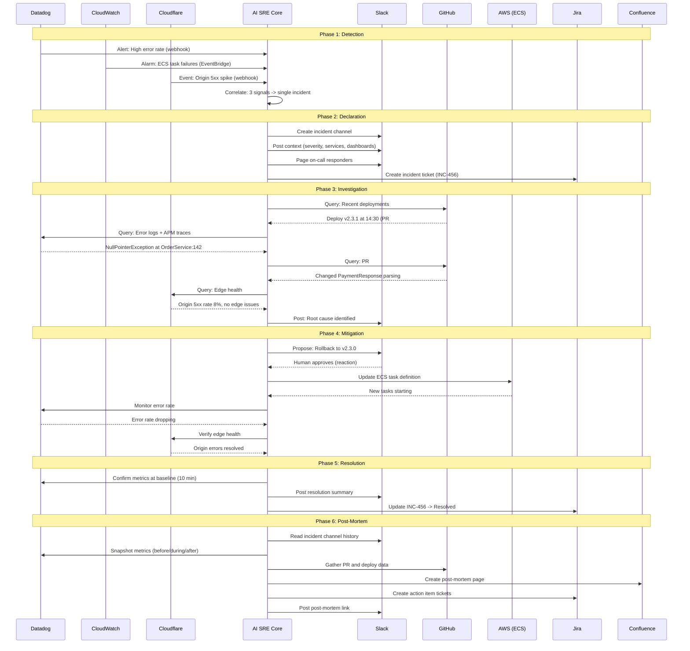

---

## Platform Integration Details

### AWS Integration

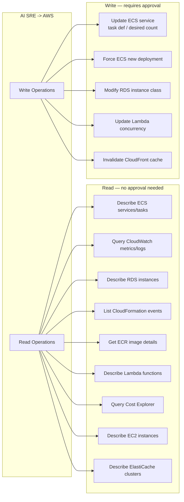

**IAM Policy** (least privilege for the AI SRE):

```json
{
  "Version": "2012-10-17",
  "Statement": [
    {
      "Sid": "ReadAccess",
      "Effect": "Allow",
      "Action": [
        "ecs:Describe*",
        "ecs:List*",
        "rds:Describe*",
        "cloudwatch:GetMetricData",
        "cloudwatch:DescribeAlarms",
        "logs:FilterLogEvents",
        "logs:GetLogEvents",
        "logs:DescribeLogGroups",
        "ecr:DescribeImages",
        "ecr:ListImages",
        "cloudformation:DescribeStacks",
        "cloudformation:DescribeStackEvents",
        "lambda:GetFunction",
        "lambda:ListFunctions",
        "ec2:Describe*",
        "elasticache:Describe*",
        "s3:GetBucketLocation",
        "s3:ListBucket",
        "ce:GetCostAndUsage",
        "ce:GetCostForecast",
        "cloudfront:GetDistribution",
        "cloudfront:ListDistributions",
        "ssm:GetParameter",
        "ssm:GetParametersByPath"
      ],
      "Resource": "*"
    },
    {
      "Sid": "WriteAccessECS",
      "Effect": "Allow",
      "Action": [
        "ecs:UpdateService",
        "ecs:RegisterTaskDefinition"
      ],
      "Resource": [
        "arn:aws:ecs:*:*:service/production/*",
        "arn:aws:ecs:*:*:task-definition/*"
      ],
      "Condition": {
        "StringEquals": {
          "aws:RequestTag/managed-by": "ai-sre"
        }
      }
    },
    {
      "Sid": "WriteAccessLambda",
      "Effect": "Allow",
      "Action": [
        "lambda:PutFunctionConcurrency"
      ],
      "Resource": "arn:aws:lambda:*:*:function:*",
      "Condition": {
        "StringEquals": {
          "aws:ResourceTag/managed-by": "ai-sre"
        }
      }
    },
    {
      "Sid": "WriteAccessCloudFront",
      "Effect": "Allow",
      "Action": [
        "cloudfront:CreateInvalidation"
      ],
      "Resource": "*"
    }
  ]
}
```

---

### GitHub Integration

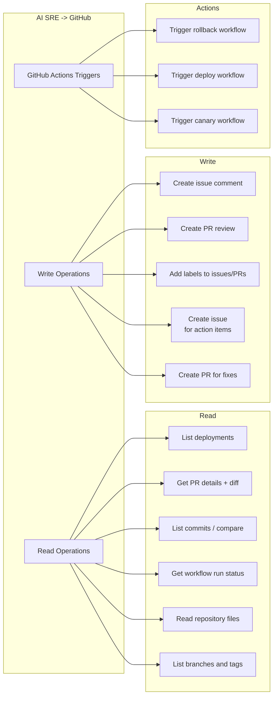

**GitHub Actions Workflow for AI SRE**:

```yaml
# .github/workflows/claude-sre.yml
name: Claude AI SRE
on:
  issue_comment:
    types: [created]
  pull_request:
    types: [opened, synchronize]
  issues:
    types: [labeled]

jobs:
  claude-sre:
    if: |
      (github.event_name == 'issue_comment' && contains(github.event.comment.body, '@claude')) ||
      (github.event_name == 'pull_request') ||
      (github.event_name == 'issues' && contains(github.event.issue.labels.*.name, 'ai-sre'))
    runs-on: ubuntu-latest
    permissions:
      contents: write
      pull-requests: write
      issues: write
    steps:
      - uses: actions/checkout@v4
        with:
          fetch-depth: 0

      - uses: anthropics/claude-code-action@v1
        with:
          anthropic_api_key: ${{ secrets.ANTHROPIC_API_KEY }}
          model: claude-opus-4-6
          timeout_minutes: 30
          mcp_config: |
            {
              "mcpServers": {
                "aws-api": {
                  "command": "npx",
                  "args": ["-y", "@awslabs/aws-api-mcp-server"],
                  "env": {
                    "AWS_ACCESS_KEY_ID": "${{ secrets.AWS_ACCESS_KEY_ID }}",
                    "AWS_SECRET_ACCESS_KEY": "${{ secrets.AWS_SECRET_ACCESS_KEY }}",
                    "AWS_REGION": "us-east-1"
                  }
                },
                "datadog": {
                  "command": "npx",
                  "args": ["-y", "@datadog/mcp-server"],
                  "env": {
                    "DD_API_KEY": "${{ secrets.DD_API_KEY }}",
                    "DD_APP_KEY": "${{ secrets.DD_APP_KEY }}"
                  }
                }
              }
            }
```

**GitHub Actions Workflow for AI SRE Rollback**:

```yaml
# .github/workflows/ai-sre-rollback.yml
name: AI SRE Rollback
on:
  workflow_dispatch:
    inputs:
      service:
        description: "Service to rollback"
        required: true
      target_version:
        description: "Target version (task def revision)"
        required: true
      incident_id:
        description: "Associated incident ID"
        required: true
      approved_by:
        description: "User who approved the rollback"
        required: true

jobs:
  rollback:
    runs-on: ubuntu-latest
    environment: production
    steps:
      - name: Audit log
        run: |
          echo "Rollback initiated by AI SRE"
          echo "Service: ${{ inputs.service }}"
          echo "Target: ${{ inputs.target_version }}"
          echo "Incident: ${{ inputs.incident_id }}"
          echo "Approved by: ${{ inputs.approved_by }}"

      - name: Execute rollback
        uses: aws-actions/amazon-ecs-deploy-task-definition@v1
        with:
          service: ${{ inputs.service }}
          cluster: production
          task-definition: ${{ inputs.target_version }}
          wait-for-service-stability: true

      - name: Verify health
        run: |
          sleep 300
          ERROR_RATE=$(curl -s "https://api.datadoghq.com/api/v1/query?query=avg:trace.http.request.errors{service:${{ inputs.service }}}.as_count()" \
            -H "DD-API-KEY: ${{ secrets.DD_API_KEY }}" \
            -H "DD-APPLICATION-KEY: ${{ secrets.DD_APP_KEY }}" | jq '.series[0].pointlist[-1][1]')
          echo "Error rate after rollback: $ERROR_RATE"
```

---

### Datadog Integration

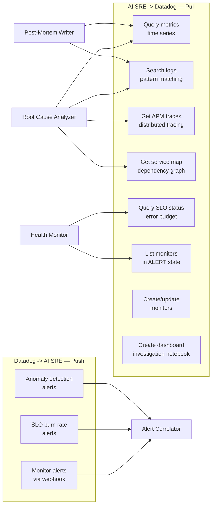

**Datadog Webhook Configuration**:

```json
{
  "name": "ai-sre-webhook",
  "url": "https://your-ai-sre-endpoint/webhooks/datadog",
  "payload": {
    "alert_id": "$ALERT_ID",
    "alert_title": "$ALERT_TITLE",
    "alert_status": "$ALERT_STATUS",
    "alert_query": "$ALERT_QUERY",
    "alert_scope": "$ALERT_SCOPE",
    "alert_metric": "$ALERT_METRIC",
    "alert_transition": "$ALERT_TRANSITION",
    "hostname": "$HOSTNAME",
    "org_name": "$ORG_NAME",
    "tags": "$TAGS",
    "last_updated": "$LAST_UPDATED",
    "event_type": "$EVENT_TYPE",
    "link": "$LINK",
    "snapshot": "$SNAPSHOT"
  },
  "headers": {
    "X-AI-SRE-Token": "${AI_SRE_WEBHOOK_TOKEN}"
  }
}
```

**Standard Monitor Set**:

```bash
# Create these monitors for AI SRE integration
claude "Create the following Datadog monitors:
1. High error rate (>2%) for each production service
2. High p99 latency (>2s) for each production service
3. ECS task failures
4. RDS connection count approaching limit (>80%)
5. Deployment event correlation (error spike within 30 min of deploy)
6. SLO burn rate alerts for all defined SLOs
7. Anomaly detection on request throughput

Configure all monitors to:
- Notify the ai-sre-webhook
- Include tag 'managed-by:ai-sre'
- Route to #incidents for critical, #alerts for warning"
```

---

### Atlassian Integration (Jira + Confluence)

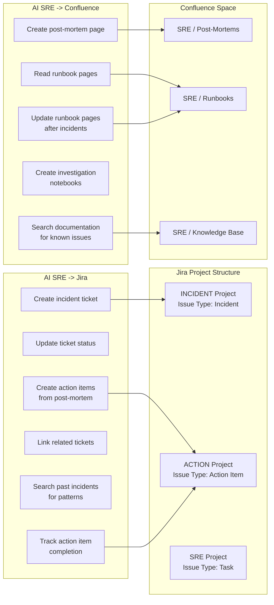

**Jira Issue Templates**:

```yaml
# Incident ticket template
incident_ticket:
  project: INCIDENT
  issue_type: Incident
  fields:
    summary: "[SEV-{severity}] {title}"
    priority: "{mapped_priority}"
    labels: ["ai-sre", "incident", "{service}"]
    components: ["{service}"]
    description: |
      h2. Incident Details
      * *Severity:* SEV-{severity}
      * *Detected:* {detection_time}
      * *Service:* {service}
      * *Slack Channel:* #{channel_name}

      h2. Impact
      {impact_description}

      h2. Root Cause
      _To be filled during investigation_

      h2. Resolution
      _To be filled at resolution_
    custom_fields:
      incident_start: "{detection_time}"
      incident_end: null
      incident_commander: "{ic_name}"
      slack_channel: "{channel_url}"

# Action item ticket template
action_item_ticket:
  project: ACTION
  issue_type: "Action Item"
  fields:
    summary: "[AI-{incident_id}] {action_description}"
    priority: "{priority}"
    assignee: "{owner}"
    due_date: "{due_date}"
    labels: ["ai-sre", "post-mortem", "{incident_id}"]
    description: |
      h2. Context
      This action item was identified in the post-mortem for {incident_id}.

      h2. Action Required
      {detailed_description}

      h2. Post-Mortem
      [{incident_id} Post-Mortem|{confluence_url}]

      h2. Acceptance Criteria
      {criteria}
    links:
      - type: "is caused by"
        key: "{incident_ticket_key}"
```

---

### Slack Integration

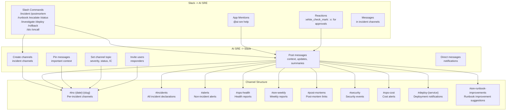

**Channel Naming Convention**:

| Pattern | Purpose | Example | Lifecycle |
|---------|---------|---------|-----------|
| `#inc-{YYYY-MM-DD}-{slug}` | Active incident | `#inc-2026-03-22-checkout-errors` | Archived 7 days after resolution |
| `#incidents` | All incident declarations | Permanent | Never archived |
| `#alerts` | Non-incident alerts | Permanent | Never archived |
| `#ops-health` | Health reports (15 min) | Permanent | Never archived |
| `#ops-cost` | Cost alerts and reports | Permanent | Never archived |
| `#sre-weekly` | Weekly SRE report | Permanent | Never archived |
| `#post-mortems` | Post-mortem announcements | Permanent | Never archived |
| `#security` | Security events | Permanent | Never archived |
| `#deploy-{service}` | Deployment notifications | Per-service | Never archived |
| `#sre-runbook-improvements` | Runbook improvement suggestions | Permanent | Never archived |
| `#ai-sre-health` | AI SRE self-monitoring | Permanent | Never archived |

---

### Cloudflare Integration

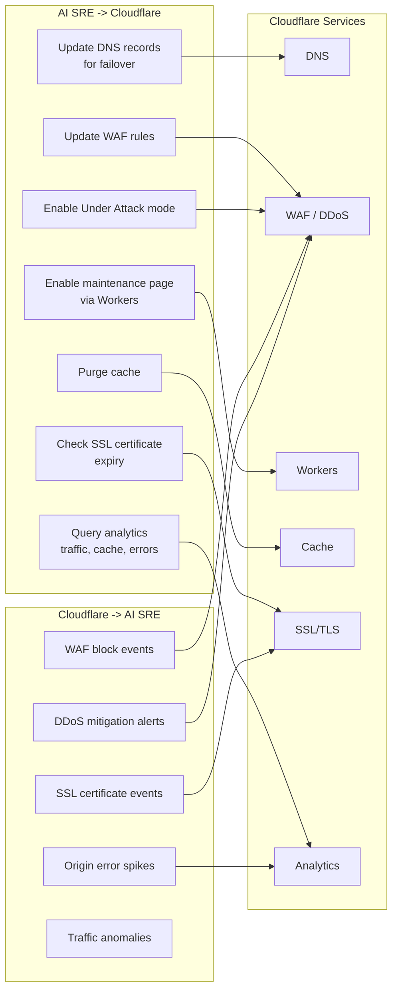

**Cloudflare Worker for Maintenance Page**:

```javascript
// maintenance-page-worker.js
// Deployed as a Cloudflare Worker; toggled via KV flag

const MAINTENANCE_KV = "AI_SRE_FLAGS";

export default {
  async fetch(request, env) {
    const maintenance = await env[MAINTENANCE_KV].get("maintenance_mode");

    if (maintenance === "true") {
      const bypassToken = request.headers.get("X-Bypass-Maintenance");
      if (bypassToken === env.BYPASS_TOKEN) {
        return fetch(request);
      }

      return new Response(maintenanceHTML(), {
        status: 503,
        headers: {
          "Content-Type": "text/html",
          "Retry-After": "300",
        },
      });
    }

    return fetch(request);
  },
};

function maintenanceHTML() {
  return `<!DOCTYPE html>
<html>
<head><title>Scheduled Maintenance</title></head>
<body>
  <h1>We'll be right back</h1>
  <p>We're performing scheduled maintenance. Please check back in a few minutes.</p>
  <p>Status: <a href="https://status.example.com">status.example.com</a></p>
</body>
</html>`;
}
```

---

## Cross-Platform Coordination Flows

### Flow 1: Deployment with Observability

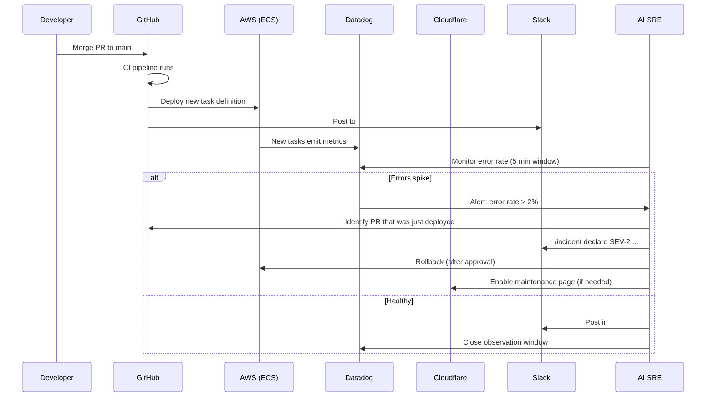

### Flow 2: DDoS Attack Response

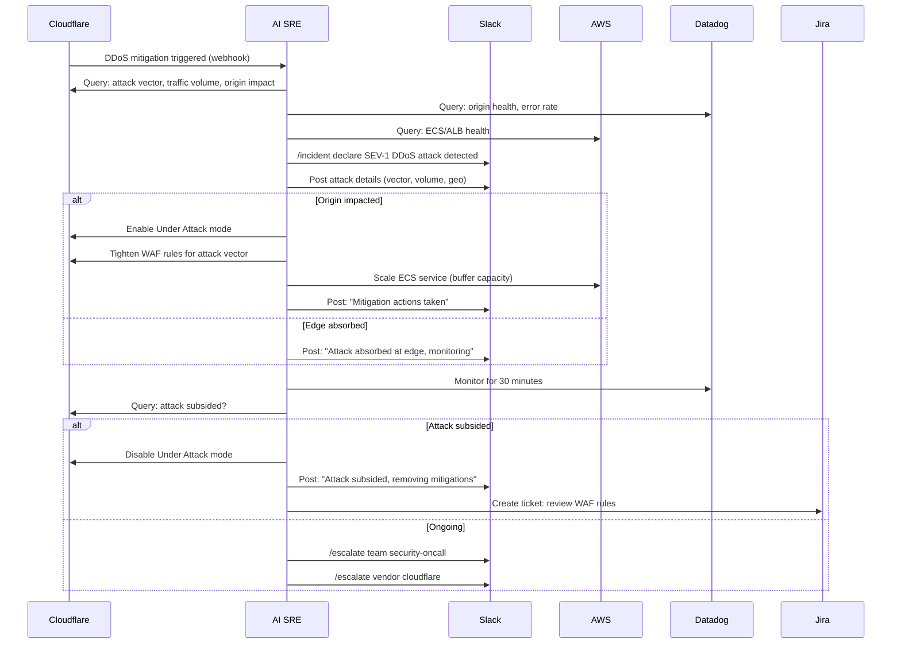

### Flow 3: Database Failover

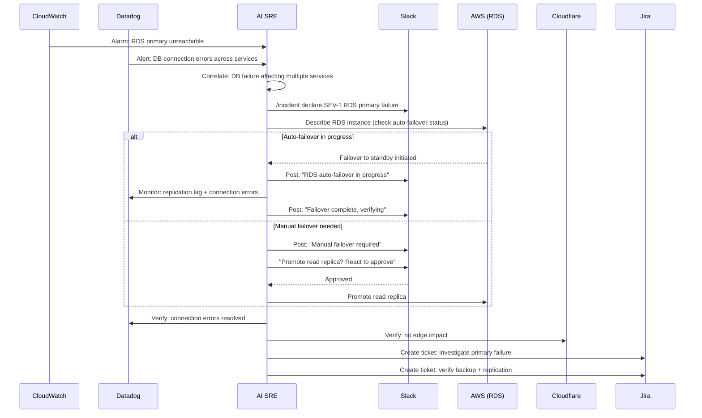

### Flow 4: Certificate Renewal

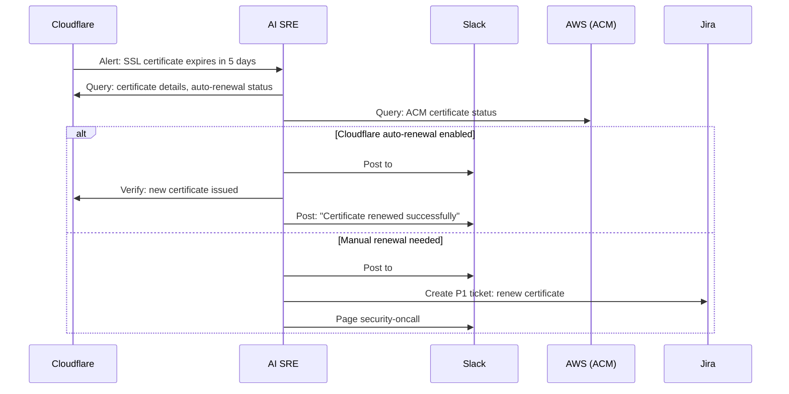

---

## Component Architecture

### MCP Server Topology

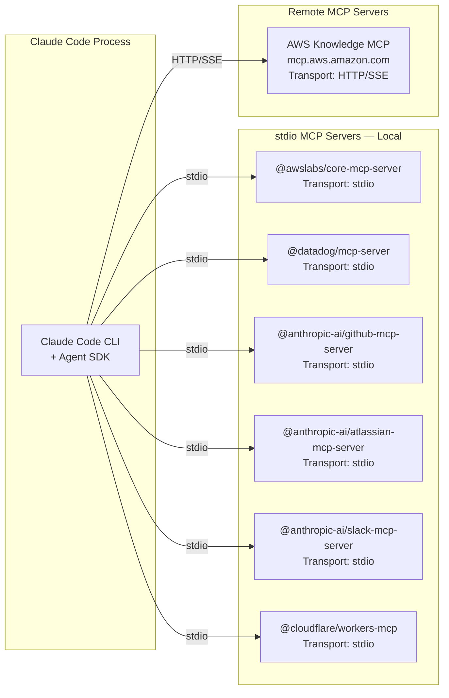

### Skill-Agent Relationship

```mermaid
graph TB
    subgraph "Agents — Autonomous, Event-Driven"
        IC[Incident Commander]
        AC[Alert Correlator]
        PM[Post-Mortem Writer]
        RCA[Root Cause Analyzer]
        RE[Runbook Executor]
        HM[Health Monitor]
    end

    subgraph "Skills — Invocable, Task-Oriented"
        S_INCIDENT[sre-incident]
        S_TRIAGE[sre-triage]
        S_INVESTIGATE[sre-investigate]
        S_CORRELATE[sre-correlate]
        S_ROLLBACK[sre-rollback]
        S_SCALE[sre-scale]
        S_FAILOVER[sre-failover]
        S_POSTMORTEM[sre-postmortem]
        S_MONITOR[sre-monitor]
        S_SLO[sre-slo]
        S_TIMELINE[sre-timeline]
        S_LOGDIVE[sre-logdive]
        S_HANDOFF[sre-handoff]
        S_COST[sre-cost]
    end

    IC --> S_INCIDENT
    IC --> S_TRIAGE
    IC --> S_TIMELINE

    RCA --> S_INVESTIGATE
    RCA --> S_CORRELATE
    RCA --> S_LOGDIVE

    RE --> S_ROLLBACK
    RE --> S_SCALE
    RE --> S_FAILOVER

    PM --> S_POSTMORTEM
    PM --> S_TIMELINE

    AC --> S_CORRELATE
    AC --> S_TRIAGE

    HM --> S_MONITOR
    HM --> S_SLO
    HM --> S_COST
    HM --> S_HANDOFF

    subgraph "Slash Commands — User-Invoked"
        CMD_INC[/incident]
        CMD_PM[/postmortem]
        CMD_RB[/runbook]
        CMD_ESC[/escalate]
        CMD_STATUS[/status]
        CMD_INV[/investigate]
        CMD_DEP[/deploy]
        CMD_ROLL[/rollback]
        CMD_SLO[/slo]
        CMD_OC[/oncall]
    end

    CMD_INC --> IC
    CMD_PM --> PM
    CMD_RB --> RE
    CMD_ESC --> IC
    CMD_STATUS --> HM
    CMD_INV --> RCA
    CMD_DEP --> RE
    CMD_ROLL --> RE
    CMD_SLO --> HM
    CMD_OC --> HM
```

---

## Security Architecture

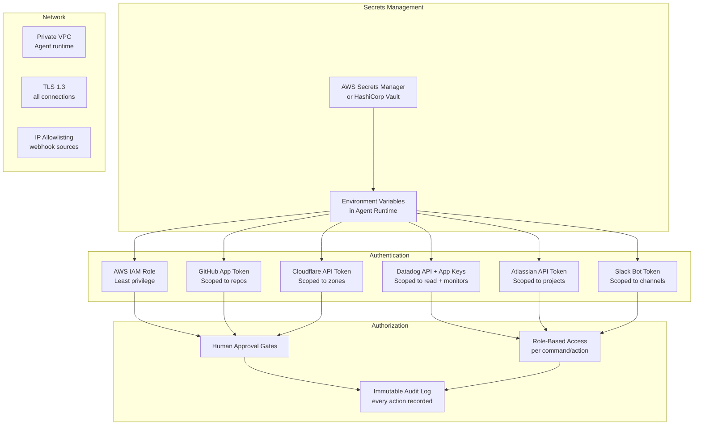

### Principle of Least Privilege

| Platform | Read | Write | Admin | Destructive |
|----------|------|-------|-------|-------------|
| AWS | All metrics, logs, configs | Deploy, scale (with approval) | No | No (rollback only) |
| Datadog | All data | Create monitors, dashboards | No | No deletes |
| GitHub | All repos, PRs, issues | Create PRs, comment, trigger workflows | No | No force push |
| Jira | All issues, boards | Create/update issues | No | No project admin |
| Slack | All channels | Send messages, create channels | No | No workspace admin |
| Cloudflare | All zones, analytics | Deploy Workers, manage DNS (with approval) | No | No zone deletion |

### Token Rotation Schedule

| Token | Rotation | Method |
|-------|----------|--------|
| AWS IAM | Continuous | IAM role with STS temporary credentials (auto) |
| GitHub App | 1 hour | GitHub App installation token (auto-refreshes) |
| Datadog API/App | 90 days | Manual rotation, stored in Secrets Manager |
| Atlassian API | 90 days | Manual rotation, stored in Secrets Manager |
| Slack Bot | 365 days | Regenerate in Slack App settings |
| Cloudflare API | 90 days | Manual rotation, stored in Secrets Manager |

---

## Deployment Architecture

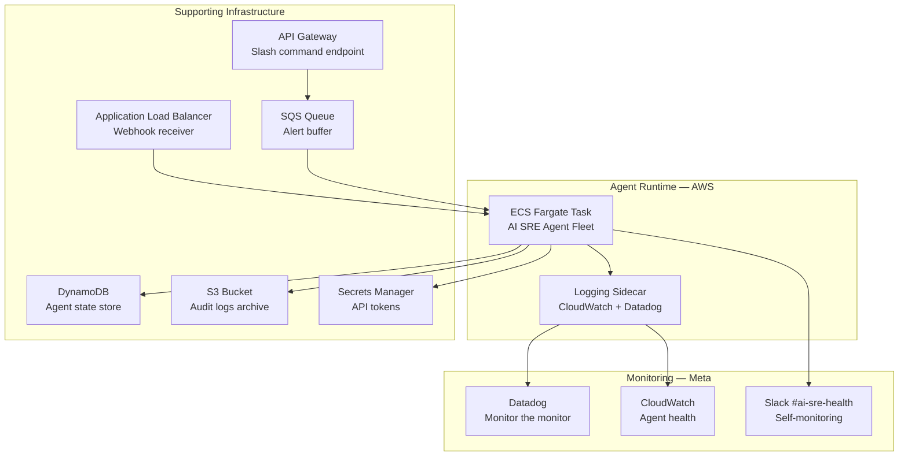

### Deployment Configuration (Terraform)

```hcl
# terraform/ai-sre-agent.tf
resource "aws_ecs_task_definition" "ai_sre" {
  family                   = "ai-sre-agent"
  requires_compatibilities = ["FARGATE"]
  cpu                      = 2048   # 2 vCPU
  memory                   = 4096   # 4 GB
  network_mode             = "awsvpc"

  container_definitions = jsonencode([
    {
      name  = "ai-sre-agent"
      image = "${aws_ecr_repository.ai_sre.repository_url}:latest"
      environment = [
        { name = "AGENT_CONFIG", value = "/config/agent_config.yml" },
        { name = "LOG_LEVEL", value = "INFO" },
      ]
      secrets = [
        { name = "ANTHROPIC_API_KEY", valueFrom = aws_secretsmanager_secret.anthropic.arn },
        { name = "DD_API_KEY", valueFrom = aws_secretsmanager_secret.datadog_api.arn },
        { name = "DD_APP_KEY", valueFrom = aws_secretsmanager_secret.datadog_app.arn },
        { name = "SLACK_BOT_TOKEN", valueFrom = aws_secretsmanager_secret.slack.arn },
        { name = "GITHUB_TOKEN", valueFrom = aws_secretsmanager_secret.github.arn },
        { name = "ATLASSIAN_API_TOKEN", valueFrom = aws_secretsmanager_secret.atlassian.arn },
        { name = "CF_API_TOKEN", valueFrom = aws_secretsmanager_secret.cloudflare.arn },
      ]
      logConfiguration = {
        logDriver = "awslogs"
        options = {
          "awslogs-group"         = "/ecs/ai-sre-agent"
          "awslogs-region"        = var.aws_region
          "awslogs-stream-prefix" = "agent"
        }
      }
    }
  ])
}

resource "aws_ecs_service" "ai_sre" {
  name            = "ai-sre-agent"
  cluster         = aws_ecs_cluster.production.id
  task_definition = aws_ecs_task_definition.ai_sre.arn
  desired_count   = 1
  launch_type     = "FARGATE"

  network_configuration {
    subnets         = var.private_subnets
    security_groups = [aws_security_group.ai_sre.id]
  }
}

resource "aws_dynamodb_table" "ai_sre_state" {
  name         = "ai-sre-state"
  billing_mode = "PAY_PER_REQUEST"
  hash_key     = "agent_id"
  range_key    = "incident_id"

  attribute {
    name = "agent_id"
    type = "S"
  }
  attribute {
    name = "incident_id"
    type = "S"
  }

  ttl {
    attribute_name = "expires_at"
    enabled        = true
  }
}
```

---

## Failure Modes and Resilience

### What happens when the AI SRE itself fails?

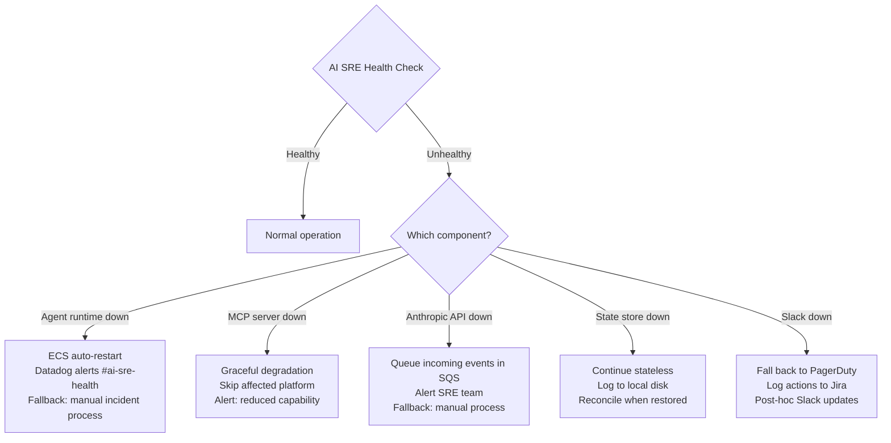

### Resilience Measures

| Failure | Detection | Mitigation | Recovery |
|---------|-----------|------------|----------|
| Agent crash | ECS health check (30s) | Auto-restart (ECS) | Resume from DynamoDB state |
| Anthropic API outage | Health check + latency | Queue events in SQS | Process queue on recovery |
| Slack outage | API error rate | Route to PagerDuty + email | Replay queued messages |
| Datadog outage | Health check | Fall back to CloudWatch only | Resume dual-source |
| AWS MCP failure | Tool call errors | Alert, skip AWS queries | Restart MCP server |
| State store failure | DynamoDB health | Continue stateless | Reconcile from audit log |
| Cloudflare MCP failure | Tool call errors | Skip edge checks | Restart MCP server |
| GitHub MCP failure | Tool call errors | Skip deploy correlation | Restart MCP server |

### Self-Monitoring

The AI SRE monitors itself using the same tools it uses for production:

```yaml
# self_monitoring.yml
monitors:
  - name: "AI SRE Agent Health"
    type: datadog
    query: "avg:ecs.service.running{service:ai-sre-agent}"
    threshold: "< 1"
    severity: CRITICAL
    notify: "#ai-sre-health, pagerduty:sre-oncall"

  - name: "AI SRE Response Time"
    type: datadog
    query: "avg:ai_sre.command.latency{*}"
    threshold: "> 30s"
    severity: WARNING
    notify: "#ai-sre-health"

  - name: "AI SRE Error Rate"
    type: datadog
    query: "sum:ai_sre.tool_call.errors{*}.as_count() / sum:ai_sre.tool_call.total{*}.as_count() * 100"
    threshold: "> 5%"
    severity: HIGH
    notify: "#ai-sre-health"

  - name: "AI SRE Audit Log Gap"
    type: cloudwatch
    query: "Time since last audit log entry"
    threshold: "> 5m"
    severity: WARNING
    notify: "#ai-sre-health"

  - name: "AI SRE API Cost"
    type: custom
    query: "Daily Anthropic API spend"
    threshold: "> $500/day"
    severity: WARNING
    notify: "#ops-cost"

  - name: "AI SRE SQS Queue Depth"
    type: cloudwatch
    query: "ApproximateNumberOfMessagesVisible for ai-sre-events queue"
    threshold: "> 100"
    severity: WARNING
    notify: "#ai-sre-health"
```

---

## Implementation Roadmap

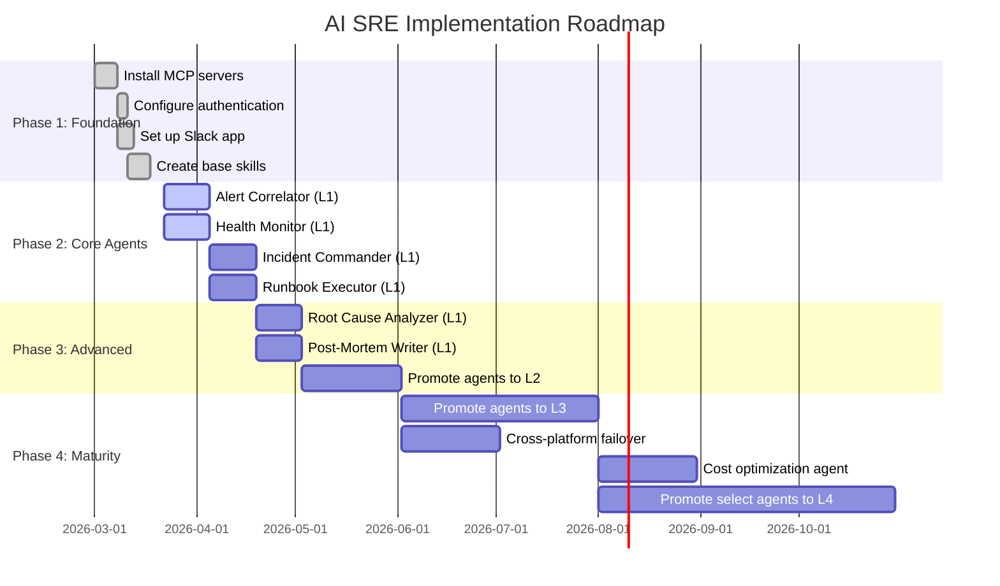

### Phase 1: Foundation (Weeks 1-3)
- Install and configure all 6 MCP servers
- Set up Slack app with all slash commands
- Create core skills (monitor, investigate, rollback, correlate)
- Establish channel structure and alert routing
- Deploy agent runtime infrastructure (ECS + DynamoDB + SQS)
- Configure webhook endpoints for Datadog, CloudWatch, Cloudflare, GitHub

### Phase 2: Core Agents (Weeks 4-6)
- Deploy Alert Correlator at L1 (advisory mode, recommends but does not act)
- Deploy Health Monitor at L1 (report-only mode)
- Deploy Incident Commander at L1 (human does everything, AI suggests)
- Deploy Runbook Executor at L1 (dry-run mode only)
- Begin tracking success metrics and collecting feedback

### Phase 3: Advanced Agents (Weeks 7-10)
- Deploy Root Cause Analyzer and Post-Mortem Writer
- Promote Alert Correlator and Health Monitor to L2 (supervised execution)
- Begin promoting Incident Commander to L2 for well-understood scenarios
- Conduct first security review of all agent permissions and audit logs
- Run first chaos engineering test against the AI SRE system

### Phase 4: Maturity (Weeks 11-20+)
- Promote agents to L3 (semi-autonomous) based on track record
- Implement cross-region failover orchestration
- Add cost optimization agent
- Evaluate L4 (autonomous) promotion for Alert Correlator
- Conduct quarterly security audit
- Publish internal reliability report on AI SRE effectiveness
