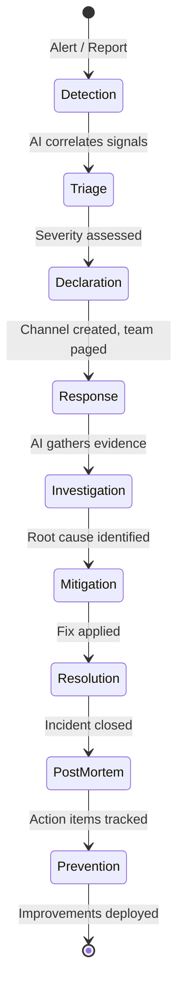
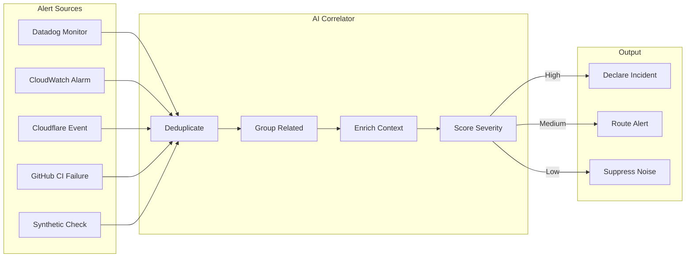
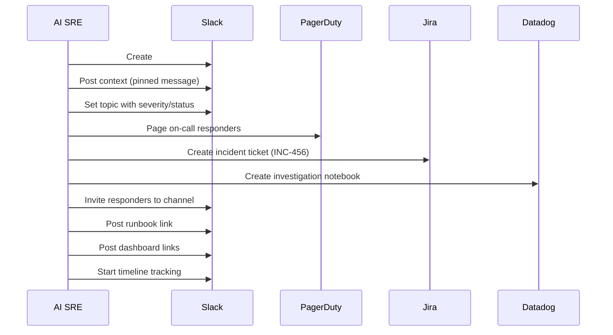
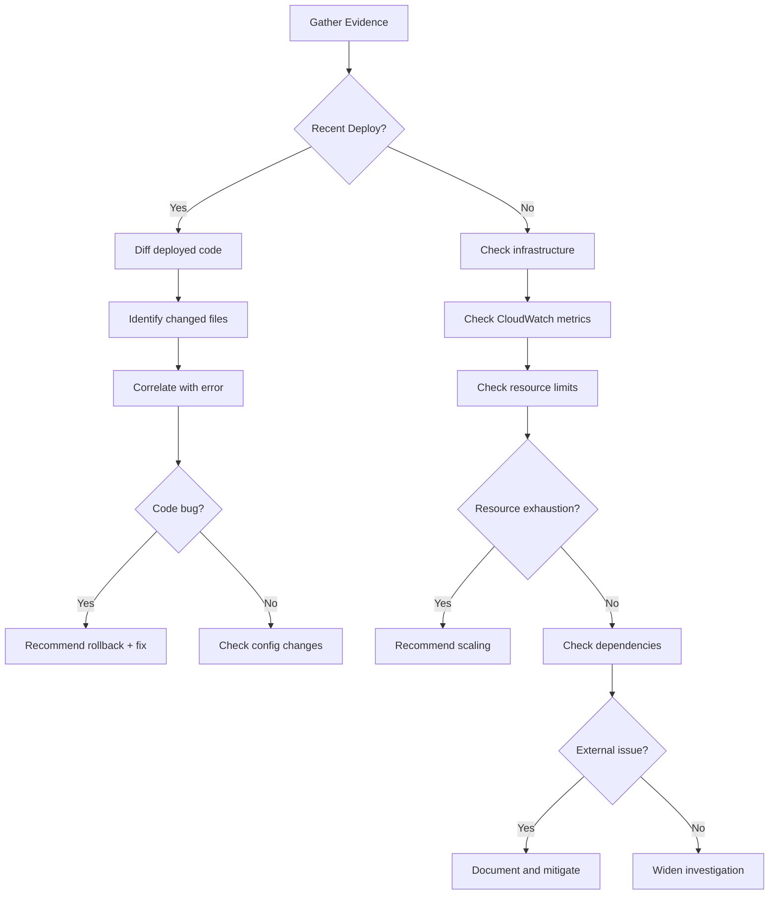
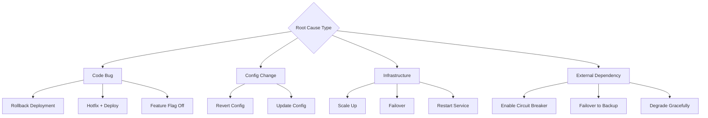
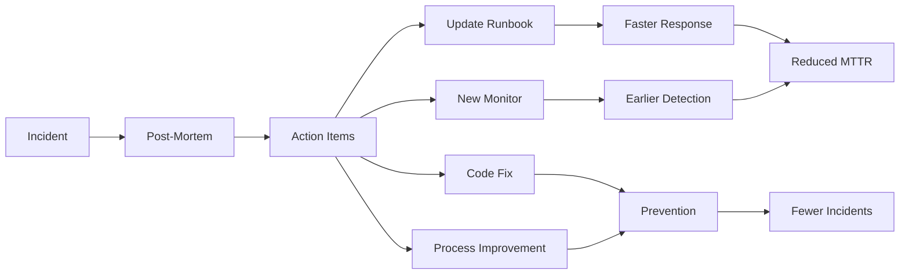

# AI-Powered Incident Management

## Complete Incident Lifecycle



---

## Phase 1: Detection

### Multi-Source Alert Correlation

The AI SRE correlates alerts from multiple sources to reduce noise and identify real incidents.



### Alert Correlation Rules

```yaml
# Correlation rules for the AI SRE
correlation_rules:
  - name: "deploy_failure_cascade"
    description: "Errors following a deployment"
    signals:
      - type: deployment
        window: 30m
      - type: error_rate_spike
        threshold: 2x_baseline
    action: correlate_as_deployment_issue
    severity: HIGH

  - name: "infrastructure_degradation"
    description: "Multiple infrastructure alerts from same AZ/region"
    signals:
      - type: ec2_health_check
        count: ">= 2"
      - type: rds_connection_spike
        or: ecs_task_failure
    action: correlate_as_infra_issue
    severity: CRITICAL

  - name: "external_dependency"
    description: "Errors from third-party service"
    signals:
      - type: http_5xx
        destination: external
      - type: timeout
        destination: external
    action: correlate_as_dependency_issue
    severity: MEDIUM
```

---

## Phase 2: Triage

### AI-Assisted Severity Assessment

```markdown
## Severity Matrix

| Factor | SEV-1 (Critical) | SEV-2 (Major) | SEV-3 (Minor) | SEV-4 (Low) |
|--------|-------------------|----------------|----------------|--------------|
| User Impact | >50% users affected | 10-50% users | <10% users | No direct impact |
| Revenue | Revenue impacted | Revenue at risk | Potential impact | No impact |
| Data | Data loss/corruption | Data delayed | Data degraded | No data impact |
| Security | Active breach | Vulnerability exploited | Misconfiguration | Best practice gap |
| Duration | Ongoing, no workaround | Ongoing, workaround exists | Intermittent | One-time |
```

### Triage Checklist (AI Automated)

1. **What services are affected?** (query Datadog service map)
2. **How many users impacted?** (query RUM/APM data)
3. **What changed recently?** (query GitHub deploys, CloudFormation events)
4. **Is there a workaround?** (check runbooks)
5. **What's the blast radius?** (check dependencies)
6. **Is it getting worse?** (check error rate trend)

---

## Phase 3: Declaration & Response

### Automated Incident Declaration

When AI declares an incident, the following happens automatically:



### Initial Context Message

```
:rotating_light: *INCIDENT DECLARED: SEV-1*

*Title:* Checkout service returning 500 errors
*Impact:* ~8% of checkout requests failing
*Detected:* 2026-03-22 14:32 UTC (3 minutes ago)
*IC:* AI SRE (pending human IC assignment)

---

*Alert Source:*
- Datadog: "High Error Rate - checkout-service" (CRITICAL)
- CloudWatch: "ECS Task Failures - checkout" (ALARM)

*Affected Services:*
- checkout-service (primary)
- payment-service (downstream)
- order-service (upstream)

*Recent Changes:*
- 14:30 UTC: Deployment v2.3.1 to checkout-service (PR #459 by @alice)
- 14:25 UTC: Feature flag `new-payment-flow` enabled

*Dashboards:*
- [Checkout Service Dashboard](https://app.datadoghq.com/dashboard/checkout)
- [CloudWatch Logs](https://console.aws.amazon.com/cloudwatch/...)

*Runbook:*
- [Checkout Service Runbook](https://org.atlassian.net/wiki/spaces/SRE/pages/123)

*Jira:* INC-456
*On-call:* @bob (backend), @carol (SRE)

---

:robot_face: *AI Analysis:*
Error spike correlates with deployment v2.3.1 at 14:30 UTC. Primary error: `NullPointerException in OrderService.processPayment()`. This appears to be a regression introduced in PR #459. Recommended action: rollback to v2.3.0.
```

---

## Phase 4: Investigation

### AI-Driven Investigation Flow



### Evidence Collection

The AI SRE automatically gathers:

| Source | Data | Tool |
|--------|------|------|
| Datadog | Error logs, APM traces, metrics | MCP: datadog |
| AWS | CloudWatch logs, ECS events, deployments | MCP: aws-api |
| GitHub | Recent commits, PR changes, CI status | gh CLI |
| Cloudflare | Security events, traffic patterns | MCP: cloudflare |
| Jira | Related incidents, known issues | MCP: atlassian |

### Investigation Updates (Posted to Slack)

```
:mag: *Investigation Update* - 14:45 UTC

*Status:* Root cause identified

*Findings:*
1. Error started at 14:32 UTC, 2 minutes after deployment v2.3.1
2. Primary error: `NullPointerException` at `OrderService.java:142`
3. Root cause: PR #459 changed `PaymentResponse` parsing, new field can be null
4. Affected code: `response.getTransactionId()` called without null check
5. Impact: All orders using credit card payment (78% of total)

*Evidence:*
- [Error log sample](link) - 847 occurrences in 13 minutes
- [APM trace](link) - Shows null response from payment provider
- [Git diff](link) - Line 142 of OrderService.java

*Correlation:*
| Time | Event |
|------|-------|
| 14:25 | Feature flag `new-payment-flow` enabled |
| 14:30 | Deployment v2.3.1 completed |
| 14:32 | First NullPointerException |
| 14:33 | Error rate exceeds 2% threshold |
| 14:35 | Datadog alert fires |
```

---

## Phase 5: Mitigation & Resolution

### Mitigation Strategies



### Rollback Procedure (AI-Assisted)

```
:wrench: *Mitigation Action: Rollback*

I recommend rolling back checkout-service from v2.3.1 to v2.3.0.

*Impact of rollback:*
- Reverts PR #459 (payment response parsing)
- Reverts PR #457 (rate limiting update) - low risk
- Reverts PR #458 (dependency update) - low risk

*Steps:*
1. Rollback ECS task definition to previous version
2. Wait for new tasks to reach RUNNING state
3. Verify error rate returns to baseline
4. Verify health checks pass

*Estimated time:* 5 minutes

:warning: *Requires human approval to proceed.*
React with :white_check_mark: to approve or :x: to reject.
```

### Resolution Confirmation

```
:white_check_mark: *INCIDENT RESOLVED*

*Title:* Checkout service returning 500 errors
*Duration:* 25 minutes (14:32 - 14:57 UTC)
*Resolution:* Rolled back checkout-service to v2.3.0

*Impact Summary:*
- Duration: 25 minutes
- Failed requests: ~2,100 checkout attempts
- Estimated revenue impact: $15,400
- Users affected: ~1,800

*Metrics Recovered:*
- Error rate: 8.5% -> 0.2% (normal)
- p99 latency: 4.2s -> 180ms (normal)
- Success rate: 91.5% -> 99.8% (normal)

*Next Steps:*
1. @alice to fix null check in PR #460 (Jira: PROJ-500)
2. Post-mortem scheduled for March 23, 10:00 AM
3. This channel will be archived in 7 days

*Jira:* INC-456 (resolved)
```

---

## Phase 6: Post-Mortem

### AI-Generated Post-Mortem

The AI SRE automatically generates a post-mortem from:
- Incident channel messages (timeline)
- Datadog metrics and logs (evidence)
- GitHub commits and PRs (changes)
- Resolution actions taken

```markdown
# Post-Mortem: Checkout Service Errors (INC-456)

**Date:** 2026-03-22
**Severity:** SEV-1
**Duration:** 25 minutes
**Author:** AI SRE (reviewed by @bob)

## Executive Summary
A deployment (v2.3.1) introduced a null pointer exception in the checkout service's payment processing path, causing 8.5% of checkout requests to fail for 25 minutes. The issue was resolved by rolling back to v2.3.0.

## Timeline
| Time (UTC) | Event |
|-----------|-------|
| 14:25 | Feature flag `new-payment-flow` enabled |
| 14:30 | Deployment v2.3.1 completed |
| 14:32 | First NullPointerException in checkout-service |
| 14:33 | Error rate exceeds 2% threshold |
| 14:35 | Datadog alert fires, AI SRE declares incident |
| 14:35 | Incident channel created, on-call paged |
| 14:38 | @alice joins channel, confirms code regression |
| 14:42 | Rollback approved by @bob |
| 14:43 | Rollback initiated |
| 14:47 | New task definition active |
| 14:52 | Error rate drops to 0.3% |
| 14:57 | Confirmed resolved, error rate at baseline |

## Root Cause
PR #459 modified the `PaymentResponse` deserialization in `OrderService.java`. The `transactionId` field can be null when the payment provider's fallback endpoint is used. The code called `response.getTransactionId().substring(0, 8)` without a null check, causing a NullPointerException.

## Impact
- ~2,100 failed checkout attempts
- ~1,800 unique users affected
- Estimated $15,400 in delayed/lost revenue
- 25 minutes of degraded service

## Contributing Factors
1. No null-safety check in the payment response parsing
2. The test suite mocked the payment provider and never returned null transactionId
3. The staging environment doesn't use the payment provider's fallback endpoint
4. No canary deployment - went directly to 100% traffic

## Action Items
| # | Action | Owner | Priority | Due | Jira |
|---|--------|-------|----------|-----|------|
| 1 | Fix null check in OrderService | @alice | P1 | Mar 23 | PROJ-500 |
| 2 | Add integration test for null transactionId | @alice | P1 | Mar 24 | PROJ-501 |
| 3 | Implement canary deployments for checkout | @carol | P2 | Apr 5 | PROJ-502 |
| 4 | Add payment provider fallback endpoint to staging | @dave | P2 | Apr 5 | PROJ-503 |
| 5 | Review all payment response field null handling | @alice | P2 | Apr 1 | PROJ-504 |

## Lessons Learned
### What went well
- AI alert correlation identified the deployment as the likely cause within 3 minutes
- Rollback was executed smoothly and resolved the issue quickly
- Team responded promptly to pages

### What went poorly
- No canary deployment meant all users were immediately affected
- Staging environment doesn't match production payment provider behavior
- Integration tests didn't cover the null response case

### Where we got lucky
- The issue manifested immediately (not a slow leak that would be harder to diagnose)
- The previous version (v2.3.0) was still healthy to rollback to
```

---

## Phase 7: Prevention

### AI-Driven Improvements

After each incident, the AI SRE:

1. **Updates runbooks** with the new scenario and resolution steps
2. **Creates monitors** for the specific failure pattern
3. **Suggests code changes** to prevent recurrence
4. **Proposes process improvements** (e.g., canary deployments)
5. **Tracks action items** in Jira and follows up on completion

### Feedback Loop


