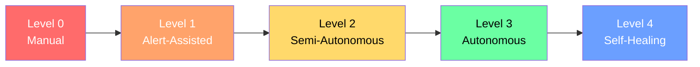
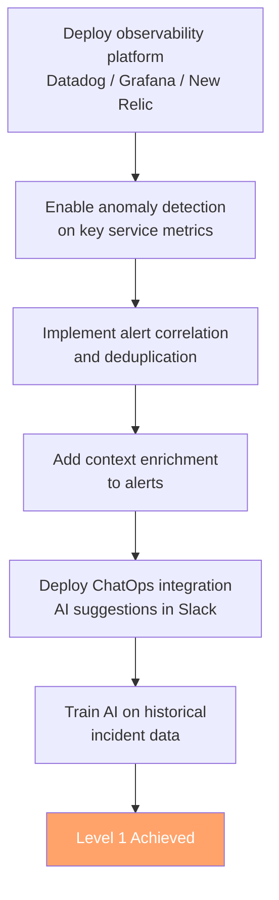
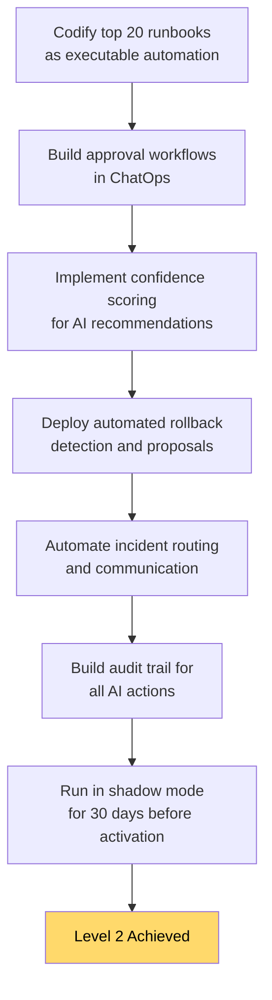
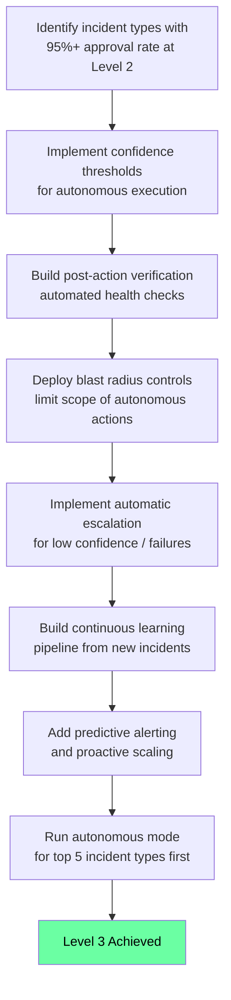
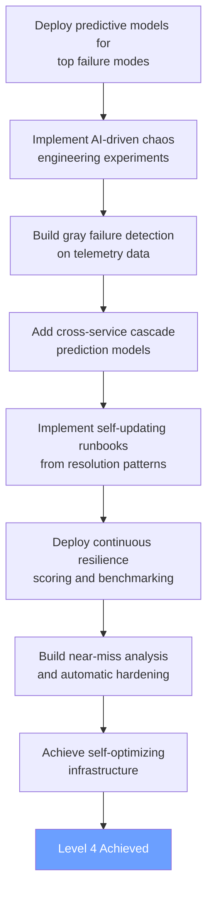
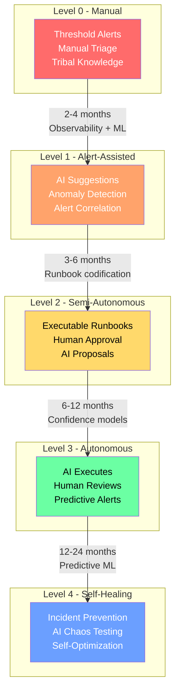

# AI SRE Maturity Model

> A structured framework for assessing and advancing AI adoption in Site Reliability Engineering, from fully manual operations to self-healing infrastructure.

---

## Overview

---

## Level 0: Manual (All Human)

**Description**: Operations are entirely reactive and human-driven. Monitoring exists but alerts are basic threshold-based rules. Incident response follows tribal knowledge. Runbooks, if they exist, are static documents.

### Characteristics

- Static threshold alerts (CPU > 90%, disk > 85%)
- Manual log searching during incidents
- Tribal knowledge for root cause analysis
- Ad-hoc incident response -- whoever is available
- Postmortems are optional or skipped
- No correlation between alerts from different systems
- Runbooks are Word docs or wiki pages, rarely updated

### Assessment Checklist

- [ ] Monitoring is deployed but alerts are threshold-based only
- [ ] No automated correlation between alerts
- [ ] Incident response depends on individual engineer knowledge
- [ ] Runbooks are static documents (wiki, Confluence, Google Docs)
- [ ] Postmortems are manual and inconsistent
- [ ] On-call engineers handle triage, diagnosis, AND remediation
- [ ] No ChatOps integration -- incidents managed via ad-hoc communication
- [ ] Mean time to detect (MTTD) measured in hours
- [ ] No automated remediation for any incident type

### Typical Metrics

| Metric | Range |
|--------|-------|
| MTTD | 30 min - 4 hours |
| MTTR | 2 - 8 hours |
| Alert noise ratio | 80-95% noise |
| Automated resolution | 0% |
| On-call burnout | High |

---

## Level 1: Alert-Assisted (AI Suggests)

**Description**: AI augments human decision-making but does not take action. ML models analyze alerts and suggest probable root causes. Alert correlation reduces noise. AI assists with triage but humans make all decisions and take all actions.

### Characteristics

- AI-powered alert clustering and deduplication
- Suggested root causes presented to on-call engineer
- Anomaly detection beyond static thresholds
- AI-assisted search across logs, metrics, and traces
- Automated alert enrichment (context, runbook links, recent changes)
- Natural language queries against observability data
- AI-generated incident summaries

### Assessment Checklist

- [ ] Alert correlation/clustering deployed (reduces noise by 50%+)
- [ ] AI suggests probable root cause during incidents
- [ ] Anomaly detection identifies issues before threshold alerts fire
- [ ] Alerts are enriched with context (related services, recent deploys, runbook links)
- [ ] Natural language interface available for querying observability data
- [ ] AI generates incident summaries and draft postmortems
- [ ] On-call engineer still makes all decisions and takes all actions
- [ ] MTTD reduced to minutes through anomaly detection
- [ ] ChatOps integration delivers AI suggestions in Slack/Teams

### Typical Metrics

| Metric | Range |
|--------|-------|
| MTTD | 2 - 15 minutes |
| MTTR | 30 min - 2 hours |
| Alert noise ratio | 30-50% noise |
| Automated resolution | 0% (suggestions only) |
| On-call burnout | Moderate |

### Migration from Level 0

**Typical timeline**: 2-4 months
**Key investment**: Observability platform, data integration, initial ML training

---

## Level 2: Semi-Autonomous (AI Acts with Approval)

**Description**: AI can execute remediation actions but requires human approval. Runbooks are codified and executable. AI proposes specific actions (restart service, scale pods, rollback deploy) and waits for engineer confirmation. Human-in-the-loop for all changes.

### Characteristics

- Executable runbooks triggered by AI with human approval
- AI proposes specific remediation actions with confidence scores
- Automated rollback proposals when deploys correlate with incidents
- Capacity scaling recommendations executed on approval
- AI-driven triage assigns incidents to correct team automatically
- Automated communication (status page updates, stakeholder notifications)
- Decision trees codified as executable workflows

### Assessment Checklist

- [ ] Runbooks are codified as executable automation (not just documents)
- [ ] AI proposes specific remediation actions with confidence scores
- [ ] Human approval required before any automated action executes
- [ ] Automated rollback proposals when incidents correlate with recent deploys
- [ ] AI-driven incident routing to correct team (>90% accuracy)
- [ ] Status page and stakeholder notifications automated
- [ ] Capacity scaling recommendations generated and executable on approval
- [ ] Approval workflows integrated into ChatOps (approve/reject in Slack)
- [ ] Audit trail for all proposed and executed actions
- [ ] Mean time to remediate < 30 minutes for known incident types

### Typical Metrics

| Metric | Range |
|--------|-------|
| MTTD | 1 - 5 minutes |
| MTTR | 10 - 30 minutes |
| Alert noise ratio | 10-20% noise |
| Automated resolution | 20-40% (with approval) |
| On-call burnout | Low-Moderate |

### Migration from Level 1

**Typical timeline**: 3-6 months
**Key investment**: Runbook codification, approval workflow, audit infrastructure

---

## Level 3: Autonomous (AI Acts, Human Reviews)

**Description**: AI executes remediation for known incident patterns without waiting for approval. Humans review actions after the fact. AI handles routine incidents end-to-end: detect, diagnose, remediate, verify, communicate. Humans focus on novel problems and strategic work.

### Characteristics

- Autonomous remediation for high-confidence, known incident types
- AI executes actions immediately, notifies humans after
- Post-action verification (AI confirms the fix worked)
- Automatic escalation to humans when confidence is low or action fails
- AI-driven capacity planning and proactive scaling
- Predictive alerting (issues detected before user impact)
- Automated postmortem generation with action items
- Continuous learning from new incidents

### Assessment Checklist

- [ ] AI autonomously remediates known incident types without human approval
- [ ] Confidence thresholds define autonomous vs. approval-required actions
- [ ] Post-action verification confirms remediation success
- [ ] Automatic escalation when AI confidence is below threshold
- [ ] Automatic escalation when automated remediation fails
- [ ] Predictive alerting detects issues before user impact
- [ ] AI-driven capacity planning prevents resource exhaustion
- [ ] Postmortems auto-generated with structured action items
- [ ] Continuous learning loop -- new patterns added to autonomous catalog
- [ ] Human review of autonomous actions within defined SLA (e.g., next business day)
- [ ] Blast radius controls limit autonomous action scope

### Typical Metrics

| Metric | Range |
|--------|-------|
| MTTD | < 1 minute |
| MTTR | 1 - 10 minutes (known patterns) |
| Alert noise ratio | < 5% noise |
| Automated resolution | 50-70% |
| On-call burnout | Low |

### Migration from Level 2

**Typical timeline**: 6-12 months
**Key investment**: Confidence modeling, blast radius controls, continuous learning pipeline, predictive models

---

## Level 4: Self-Healing (AI Prevents and Fixes)

**Description**: The system proactively prevents incidents before they occur. AI predicts failures, automatically adjusts infrastructure, and continuously optimizes for reliability. Chaos engineering is AI-driven. The system learns from near-misses and automatically hardens itself.

### Characteristics

- Proactive incident prevention (predicted issues mitigated automatically)
- AI-driven chaos engineering (automatic resilience testing)
- Self-optimizing infrastructure (performance, cost, reliability tradeoffs)
- Gray failure detection (subtle degradation caught before impact)
- Automated capacity planning with predictive scaling
- Self-updating runbooks based on new incident patterns
- Cross-service impact prediction (cascade prevention)
- Continuous resilience scoring and improvement

### Assessment Checklist

- [ ] AI predicts failures and mitigates before user impact
- [ ] Chaos engineering experiments designed and executed by AI
- [ ] Infrastructure self-optimizes for performance/cost/reliability
- [ ] Gray failures detected through ML on telemetry data
- [ ] Capacity automatically scaled based on predictive demand models
- [ ] Runbooks self-update based on new incident resolution patterns
- [ ] Cross-service cascade prediction prevents multi-service outages
- [ ] Continuous resilience scoring quantifies system health
- [ ] Near-miss analysis automatically identifies and addresses weaknesses
- [ ] System explains its preventive actions in natural language
- [ ] Human oversight is strategic, not operational
- [ ] AI SRE handles >90% of operational work autonomously

### Typical Metrics

| Metric | Range |
|--------|-------|
| MTTD | Predictive (before occurrence) |
| MTTR | < 1 minute (autonomous) |
| Alert noise ratio | < 1% |
| Automated resolution | 80-95% |
| Incidents prevented | 30-50% of potential incidents |
| On-call burnout | Minimal |

### Migration from Level 3

**Typical timeline**: 12-24 months
**Key investment**: Predictive ML models, chaos engineering platform, cross-service topology models, continuous optimization

---

## Full Maturity Journey

---

## Assessment Scoring Guide

For each level, score your organization on each checklist item:

| Score | Meaning |
|-------|---------|
| 0 | Not started |
| 1 | In progress / partial |
| 2 | Fully implemented |

**Level achievement threshold**: Score 80%+ on all checklist items for that level.

**Current level** = Highest level where you score 80%+.

### Quick Assessment Matrix

| Capability | L0 | L1 | L2 | L3 | L4 |
|-----------|----|----|----|----|-----|
| Alert management | Threshold | AI correlation | AI correlation + routing | Predictive | Preventive |
| Triage | Manual | AI suggests | AI routes | AI resolves | AI prevents |
| Remediation | Manual | Manual | Approved automation | Autonomous | Proactive |
| Runbooks | Static docs | Linked to alerts | Executable | Self-executing | Self-updating |
| Postmortems | Manual/skipped | AI-drafted | AI-generated | Auto-generated + actions | Near-miss analysis |
| Chaos testing | None | None | Manual experiments | Automated experiments | AI-designed experiments |
| Capacity | Reactive | Monitored | Recommendations | Predictive scaling | Self-optimizing |
| Human role | Do everything | Review suggestions | Approve actions | Review actions | Strategic oversight |

---

## Common Anti-Patterns

### Skipping Levels

Attempting to jump from Level 0 to Level 3 without building the foundation. Each level depends on capabilities established at the previous level.

### Automation Without Observability

Deploying automated remediation without comprehensive metrics, logs, and traces. AI cannot make good decisions with incomplete data.

### Ignoring the Approval Phase

Moving from Level 1 to Level 3 without the Level 2 approval phase. The approval phase builds confidence data that determines which actions can be autonomous.

### Over-Automating Novel Incidents

Trying to automate resolution for incident types that have never been seen before. AI excels at pattern matching on known failures, not novel debugging.

### No Blast Radius Controls

Autonomous AI without limits on the scope of actions it can take. Always constrain what AI can do (e.g., "can restart a single pod but cannot scale down an entire service").

---

## Industry Benchmarks (2025-2026)

Based on Gartner research and vendor data:

- **85% of enterprises** will use AI SRE tooling by 2029 (up from <5% in 2025)
- **Most organizations** are currently at Level 0-1
- **Leading technology companies** (Netflix, Google, Uber) operate at Level 3-4 for core services
- **Average enterprise** targets Level 2-3 within 2 years of starting
- **Regulated industries** (finance, healthcare) often stay at Level 2 for compliance reasons

---

## Sources

- [Virtana AIOps Maturity Model](https://www.virtana.com/blog/aiops-maturity-model/)
- [TM Forum AIOps Maturity Model v2.0](https://www.tmforum.org/resources/how-to-guide/ig1322-aiops-maturity-model-v2-0-0/)
- [Gartner AI Maturity Models](https://www.bmc.com/blogs/ai-maturity-models/)
- [DZone Observability Maturity Model](https://dzone.com/refcardz/observability-maturity-model)
- [PagerDuty State of Digital Operations 2025](https://www.pagerduty.com/newsroom/2025-state-of-digital-operations-study/)
- [Rootly AI SRE Guide](https://rootly.com/blog/the-complete-guide-to-ai-sre-transforming-site-reliability-engineering)
