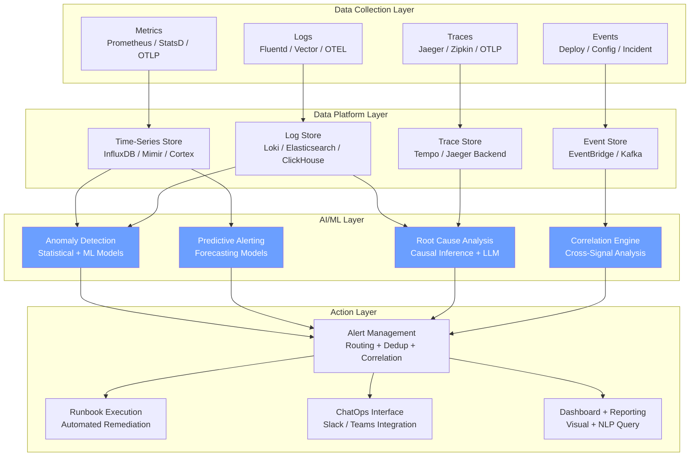
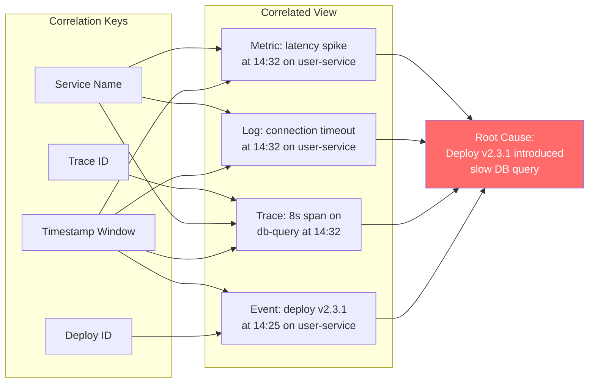
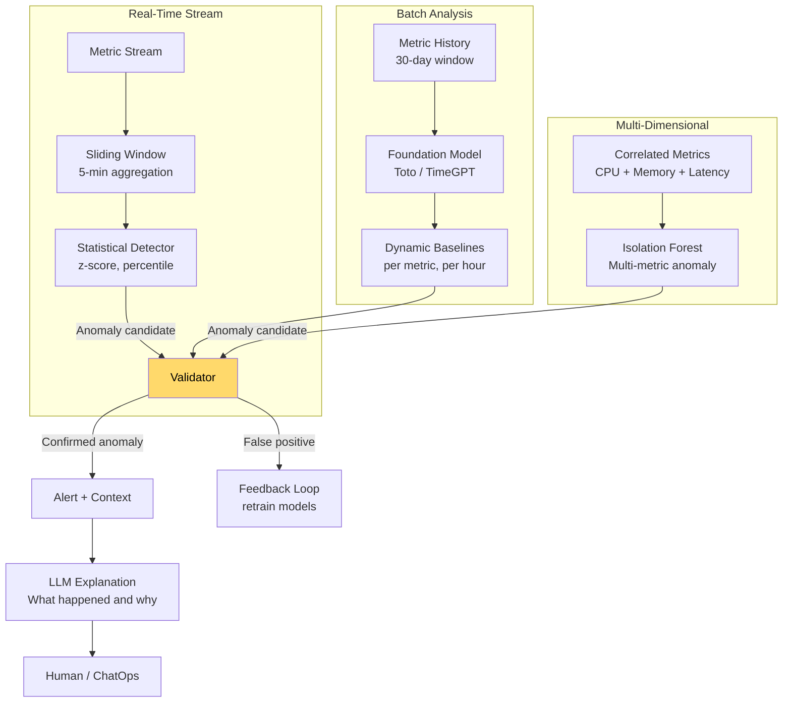
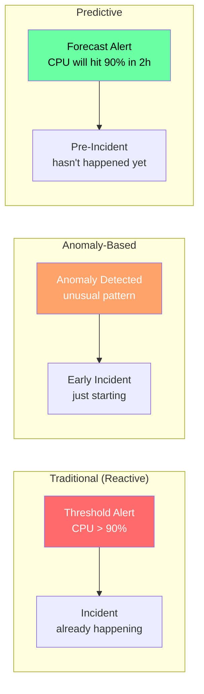
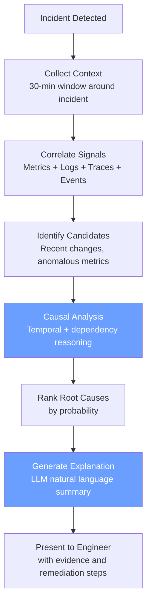
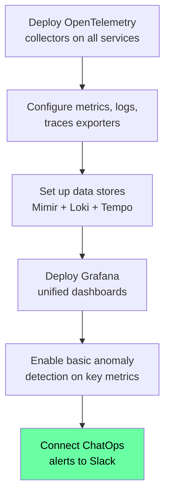

# Building an AI-Powered Observability Stack

> Architecture, patterns, and tool comparisons for integrating AI into metrics, logs, traces, anomaly detection, predictive alerting, and automated root cause analysis.

---

## Table of Contents

1. [Architecture Overview](#architecture-overview)
2. [Metrics, Logs, Traces Integration](#metrics-logs-traces-integration)
3. [AI Anomaly Detection](#ai-anomaly-detection)
4. [Predictive Alerting](#predictive-alerting)
5. [Automated Root Cause Analysis](#automated-root-cause-analysis)
6. [Tool Comparison](#tool-comparison)
7. [Implementation Guide](#implementation-guide)
8. [Anti-Patterns and Pitfalls](#anti-patterns-and-pitfalls)

---

## Architecture Overview



---

## Metrics, Logs, Traces Integration

### The Three Pillars + Events

Modern observability requires four signal types working together:

| Signal | Purpose | AI Application |
|--------|---------|----------------|
| **Metrics** | Quantitative measurements over time (CPU, latency, error rate) | Anomaly detection, forecasting, capacity planning |
| **Logs** | Discrete events with structured/unstructured data | Pattern recognition, error classification, NLP search |
| **Traces** | Request flow across services | Dependency mapping, bottleneck identification, cascade detection |
| **Events** | Deployments, config changes, incidents | Change correlation, impact analysis |

### OpenTelemetry Unified Collection

OpenTelemetry (OTEL) provides a vendor-neutral standard for collecting all three signal types:

```yaml
# otel-collector-config.yaml
receivers:
  otlp:
    protocols:
      grpc:
        endpoint: 0.0.0.0:4317
      http:
        endpoint: 0.0.0.0:4318

processors:
  batch:
    send_batch_size: 10000
    timeout: 10s

  # AI-relevant: add resource attributes for correlation
  resource:
    attributes:
      - key: deployment.environment
        value: production
        action: upsert
      - key: service.version
        from_attribute: app.version
        action: upsert

  # AI-relevant: tail sampling for interesting traces
  tail_sampling:
    decision_wait: 10s
    policies:
      - name: error-traces
        type: status_code
        status_code: { status_codes: [ERROR] }
      - name: high-latency
        type: latency
        latency: { threshold_ms: 2000 }
      - name: probabilistic
        type: probabilistic
        probabilistic: { sampling_percentage: 10 }

exporters:
  # Metrics to Prometheus/Mimir
  prometheusremotewrite:
    endpoint: "http://mimir:9009/api/v1/push"

  # Logs to Loki
  loki:
    endpoint: "http://loki:3100/loki/api/v1/push"

  # Traces to Tempo
  otlp/tempo:
    endpoint: "tempo:4317"
    tls:
      insecure: true

service:
  pipelines:
    metrics:
      receivers: [otlp]
      processors: [batch, resource]
      exporters: [prometheusremotewrite]
    logs:
      receivers: [otlp]
      processors: [batch, resource]
      exporters: [loki]
    traces:
      receivers: [otlp]
      processors: [batch, resource, tail_sampling]
      exporters: [otlp/tempo]
```

### Cross-Signal Correlation

The key to AI-powered observability is correlating signals across types:



**Key implementation patterns**:

1. **Exemplars**: Attach trace IDs to metrics so you can jump from a metric spike to the exact traces that caused it
2. **Structured logging**: Include trace ID, span ID, and service metadata in every log line
3. **Deploy events**: Push deployment events to the same data platform so AI can correlate changes with degradation
4. **Service catalog**: Maintain a service dependency graph that AI can query to understand blast radius

---

## AI Anomaly Detection

### Detection Approaches

| Approach | Strengths | Weaknesses | Best For |
|----------|-----------|------------|----------|
| **Statistical** (z-score, IQR) | Simple, interpretable, low compute | Poor with seasonality, high false positives | Stationary metrics (error counts) |
| **Time-Series Models** (ARIMA, Prophet) | Handles seasonality and trends | Requires per-metric tuning, slow to adapt | Metrics with strong patterns (traffic) |
| **Foundation Models** (Toto, TimeGPT) | Zero-shot, no per-metric tuning | Higher compute cost, newer technology | Large-scale deployment, diverse metrics |
| **Unsupervised ML** (Isolation Forest, DBSCAN) | Catches multi-dimensional anomalies | Hard to interpret, requires feature engineering | Complex multi-metric anomalies |
| **LLM-Assisted** | Natural language explanation, context-aware | Latency, cost, hallucination risk | Post-detection analysis and explanation |

### Datadog Toto Model

Datadog's Toto is a state-of-the-art open-weights time-series foundation model trained on observability data. Key capabilities:

- **Zero-shot forecasting**: Instant anomaly detection with no per-series tuning
- **Multi-metric**: Handles metrics, logs, and event patterns
- **Trained on operational data**: Unlike general-purpose models, Toto understands infrastructure patterns

### Implementation Architecture



### Gray Failure Detection

Gray failures are partial degradations that do not trigger threshold-based alerts. HPE research shows AI excels at detecting these:

- **Pattern**: Service responds but 5% slower than baseline across all endpoints
- **Detection**: Time-series models detect the shift; statistical methods miss it because no single metric crosses a threshold
- **Solution**: Foundation models trained on infrastructure telemetry recognize multi-signal degradation patterns

---

## Predictive Alerting

### From Reactive to Predictive



### Predictive Alert Types

| Alert Type | Prediction Horizon | Confidence Required | Example |
|-----------|-------------------|---------------------|---------|
| **Capacity exhaustion** | 2-24 hours | 85%+ | "Disk will be full in 6 hours at current write rate" |
| **Performance degradation** | 30 min - 2 hours | 80%+ | "Latency trending toward SLO breach in 90 minutes" |
| **Cascade risk** | 15-60 minutes | 75%+ | "If service A continues degrading, service B will be affected" |
| **Cost overrun** | 1-7 days | 80%+ | "At current scaling rate, monthly cost will exceed budget by 30%" |
| **SLO burn rate** | 1-30 days | 90%+ | "Error budget will be exhausted in 5 days at current burn rate" |

### Implementation Pattern

```yaml
predictive_alerting:
  models:
    capacity_forecaster:
      type: "time_series_forecast"
      model: "toto-v1"  # or Prophet, LSTM
      metrics:
        - "disk.usage_percent"
        - "memory.usage_percent"
        - "cpu.usage_percent"
      forecast_horizon: "24h"
      alert_threshold: 90  # percent
      confidence_required: 0.85
      alert_template: |
        PREDICTIVE: ${metric} on ${host} predicted to reach
        ${threshold}% in ${time_to_threshold}.
        Current: ${current_value}%
        Trend: ${trend_direction} at ${trend_rate}/hour
        Confidence: ${confidence}%
        Recommended action: ${recommended_action}

    slo_burn_rate:
      type: "burn_rate_forecast"
      slos:
        - name: "api-availability"
          target: 99.9
          window: 30  # days
      alert_when: "error_budget_exhaustion < 7 days"
      alert_template: |
        SLO BURN RATE: ${slo_name} error budget will be exhausted
        in ${days_to_exhaustion} days at current rate.
        Current availability: ${current_availability}%
        Error budget remaining: ${error_budget_remaining}%

    cascade_predictor:
      type: "dependency_impact"
      inputs:
        - service_topology
        - current_degradation_metrics
        - historical_cascade_data
      alert_when: "predicted_cascade_probability > 0.75"
      alert_template: |
        CASCADE RISK: ${source_service} degradation predicted to
        impact ${affected_services} within ${time_to_impact}.
        Recommended: ${preventive_action}
```

---

## Automated Root Cause Analysis

### RCA Pipeline



### RCA Techniques

| Technique | Description | Accuracy | Speed |
|-----------|-------------|----------|-------|
| **Change correlation** | Correlate incident with recent deploys, config changes, infrastructure changes | High for deploy-related issues | Fast (seconds) |
| **Topology-aware analysis** | Walk service dependency graph to find upstream root cause | High for cascade failures | Medium (30-60s) |
| **Log pattern analysis** | NLP/ML on log patterns to identify error signatures | Medium-High | Medium (1-5 min) |
| **Trace analysis** | Identify slow/erroring spans in distributed traces | High for latency issues | Fast (seconds) |
| **Causal inference** | Statistical causal analysis across metric time series | High but requires data | Slow (5-15 min) |
| **LLM reasoning** | Feed all context to LLM for natural language analysis | Variable (depends on context) | Medium (30-60s) |

### New Relic AI Root Cause Analysis

New Relic AI (NRAI) combines multiple techniques:

- **Systems of Intelligence**: Unifies MELTx (Metrics, Events, Logs, Traces + context) data
- **Causal AI**: Determines cause-effect relationships, not just correlations
- **Agentic AI**: Embeds in existing workflows (GitHub Copilot, ServiceNow)
- **Results**: Users resolve issues 25% faster; 27% less alert noise; 2x higher correlation rate; 80% higher code shipping frequency

### Grafana Assistant Investigations

Grafana's AI-powered investigation workflow:

1. **Trigger**: Incident detected or engineer initiates investigation
2. **Analysis**: AI agent analyzes metrics (PromQL), logs (LogQL), and traces (TraceQL)
3. **Findings**: Generates hypotheses with supporting evidence
4. **Recommendations**: Provides actionable mitigation and remediation steps
5. **Integration**: Results delivered in Grafana UI and Slack via ChatOps

### Implementation Example

```yaml
root_cause_analysis:
  pipeline:
    - stage: context_collection
      parallel: true
      sources:
        metrics:
          query: "all metrics for ${affected_services} in [-30m, +5m] window"
          resolution: "10s"
        logs:
          query: "all logs for ${affected_services} in [-30m, +5m] window"
          filter: "severity >= WARN"
        traces:
          query: "traces with errors or p99 latency for ${affected_services}"
          window: "[-30m, +5m]"
        events:
          query: "deploys, config changes, scaling events in [-60m, now]"
        topology:
          query: "service dependency graph for ${affected_services}"

    - stage: change_correlation
      description: "Find changes that correlate temporally with incident"
      method: temporal_correlation
      window: "[-60m, incident_start]"
      confidence_boost: 0.2  # Changes get +20% confidence

    - stage: topology_analysis
      description: "Walk dependency graph to find upstream root cause"
      method: upstream_walk
      starting_services: "${affected_services}"
      look_for: "first unhealthy upstream service"

    - stage: log_analysis
      description: "Analyze log patterns for error signatures"
      method: llm_analysis
      prompt: |
        Analyze the following logs from the incident window.
        Identify error patterns, their first occurrence, and frequency.
        Determine if any log pattern indicates a root cause.
        Logs: ${context.logs}

    - stage: trace_analysis
      description: "Identify bottleneck spans in traces"
      method: span_analysis
      look_for:
        - "spans with error status"
        - "spans > 2x their baseline duration"
        - "new spans not seen before incident"

    - stage: synthesis
      description: "Combine all evidence into ranked root causes"
      method: llm_synthesis
      prompt: |
        Given the following evidence from an incident:
        - Change correlation: ${change_correlation.results}
        - Topology analysis: ${topology_analysis.results}
        - Log analysis: ${log_analysis.results}
        - Trace analysis: ${trace_analysis.results}

        Rank the most probable root causes with confidence scores.
        For each candidate, provide:
        1. What happened
        2. Why you believe this is the root cause
        3. Supporting evidence
        4. Recommended remediation steps

  output:
    format: structured
    deliver_to:
      - slack_incident_channel
      - incident_timeline
      - runbook_engine  # for automated remediation
```

---

## Tool Comparison

### Full-Stack Observability Platforms

| Feature | Datadog | Grafana Cloud | New Relic | Dynatrace |
|---------|---------|--------------|-----------|-----------|
| **Pricing Model** | Per host + ingestion | Per metric/log/trace | Per user + ingestion | Per host (full-stack) |
| **AI Anomaly Detection** | Watchdog (built-in) | Grafana AI (ML toolkit) | NRAI (compound AI) | Davis AI (causal) |
| **Foundation Model** | Toto (open-weights) | N/A (uses third-party) | Proprietary | Proprietary |
| **LLM Integration** | Bits AI (SRE agent) | Grafana Assistant (GA) | NRAI Chat | Davis CoPilot |
| **Natural Language Query** | Yes (Bits AI) | Yes (PromQL/LogQL/TraceQL) | Yes (NRQL generation) | Yes (DQL generation) |
| **Auto Root Cause** | Watchdog RCA | Assistant Investigations | AI RCA | Davis automatic RCA |
| **Predictive Alerting** | Forecast monitors | ML-based forecasting | AI-powered forecasting | Problem prediction |
| **ChatOps** | Slack/Teams integration | Native Slack + OnCall | Slack integration | Slack/Teams integration |
| **Open Source Option** | No | Yes (Grafana OSS + LGTM) | No | No |
| **OpenTelemetry** | Full support | Full support | Full support | Full support |
| **Strengths** | Unified platform, Toto model | Open source, flexibility | Per-user pricing, AI depth | Automatic topology, causal AI |
| **Weaknesses** | Cost at scale | Complexity of assembly | UI learning curve | Cost, lock-in |

### AI-Specific Capabilities Comparison

| AI Capability | Datadog | Grafana | New Relic | Dynatrace |
|--------------|---------|---------|-----------|-----------|
| **Zero-shot anomaly detection** | Yes (Toto) | Partial | Partial | Yes (Davis) |
| **Multi-signal correlation** | Yes (Watchdog) | Yes (Assistant) | Yes (NRAI) | Yes (Davis) |
| **Automated postmortems** | Yes | No (manual) | Yes | Yes |
| **Self-learning baselines** | Yes | Yes (ML toolkit) | Yes | Yes |
| **Agentic AI (autonomous)** | Bits AI SRE | Investigations (preview) | SRE Agent | Davis auto-remediation |
| **LLM observability** | Yes (LLM Monitoring) | Yes (AI Observability) | Yes (AI Monitoring) | Yes |
| **Cost optimization AI** | Yes | Yes (Adaptive Metrics) | Yes | Yes |

### Specialized AI SRE Tools (2025-2026)

| Tool | Focus | Key Feature | Pricing |
|------|-------|-------------|---------|
| **Rootly** | Incident management | AI-native incident lifecycle, auto-postmortems | Per seat |
| **incident.io** | Incident management | Slack-native, AI triage | Per seat |
| **Traversal** | AI SRE | Topology-aware AI agents, auto-triage | Enterprise |
| **Ciroos.AI** | AI SRE | AI SRE teammate | Enterprise |
| **Observe** | Observability | AI SRE + o11y.ai agents, 10x faster triage | Usage-based |
| **Firefly (Thinkerbell)** | AI SRE | Gartner-recognized, infrastructure AI | Enterprise |
| **PagerDuty AIOps** | Incident response | AI agent suite, 50% faster resolution | Per user |
| **BigPanda** | AIOps | Alert correlation, AI copilot | Enterprise |

---

## Implementation Guide

### Phase 1: Foundation (Month 1-2)

**Goal**: Unified data collection and basic AI-assisted alerting.



**Checklist**:
- [ ] OpenTelemetry SDK instrumented in all production services
- [ ] Metrics, logs, and traces flowing to data stores
- [ ] Service catalog with dependency graph maintained
- [ ] Basic dashboards for SLOs, error rates, latency
- [ ] Alert routing to Slack/Teams
- [ ] Exemplars connecting metrics to traces

### Phase 2: AI-Assisted (Month 3-4)

**Goal**: AI-powered anomaly detection, alert correlation, and natural language querying.

**Checklist**:
- [ ] Anomaly detection enabled on top 20 critical metrics
- [ ] Alert correlation reducing noise by 50%+
- [ ] Natural language query interface deployed
- [ ] AI-generated alert context (runbook links, recent changes, impact)
- [ ] Deploy event correlation (deploys auto-correlated with incidents)
- [ ] AI-assisted postmortem generation

### Phase 3: Predictive (Month 5-8)

**Goal**: Predictive alerting and automated root cause analysis.

**Checklist**:
- [ ] Capacity forecasting models deployed for compute, storage, network
- [ ] SLO burn rate predictions operational
- [ ] Automated RCA pipeline for top 10 incident types
- [ ] Cascade prediction based on service topology
- [ ] Predictive alerts delivering 15+ minutes lead time
- [ ] AI confidence scoring for all recommendations

### Phase 4: Autonomous (Month 9-12+)

**Goal**: AI-driven remediation and self-healing capabilities.

**Checklist**:
- [ ] Executable runbooks linked to AI root cause analysis
- [ ] Autonomous remediation for high-confidence, known patterns
- [ ] Self-updating runbooks from resolution analysis
- [ ] AI-driven chaos engineering experiments
- [ ] Continuous resilience scoring
- [ ] Gray failure detection operational

---

## Anti-Patterns and Pitfalls

### 1. Tool Sprawl

**Problem**: Deploying Datadog for metrics, Splunk for logs, Jaeger for traces, and PagerDuty for alerting creates correlation gaps that AI cannot bridge.

**Solution**: Consolidate to a platform that handles all signal types, or invest heavily in the correlation layer (OpenTelemetry + unified query layer).

### 2. AI Without Data Quality

**Problem**: Deploying AI anomaly detection on noisy, inconsistent, or incomplete metrics produces unreliable results.

**Solution**: Invest in data quality first. Standardize metric names, enforce structured logging, ensure trace propagation works end-to-end.

### 3. Alert Fatigue Transfer

**Problem**: AI reduces alert noise but creates a new stream of "AI recommendations" that engineers ignore.

**Solution**: Apply the same noise reduction principles to AI output. Only surface recommendations above a confidence threshold. Track recommendation acceptance rate and tune accordingly.

### 4. Black Box AI

**Problem**: AI says "restart the service" but cannot explain why. Engineers do not trust it, so they ignore recommendations.

**Solution**: Every AI recommendation must include evidence: which metrics are anomalous, what changed, why this remediation is suggested. LLMs can generate natural language explanations from structured evidence.

### 5. One-Size-Fits-All Models

**Problem**: Using the same anomaly detection model for all metrics. Batch processing metrics behave differently from real-time API metrics.

**Solution**: Use foundation models for breadth (zero-shot) and fine-tuned models for critical services. The foundation model catches the long tail; specialized models handle known-important metrics with higher accuracy.

### 6. Ignoring the Human Feedback Loop

**Problem**: AI generates recommendations but there is no feedback mechanism. False positives never decrease because the model does not learn.

**Solution**: Build explicit feedback loops. When an engineer dismisses a recommendation, capture why. Feed acceptance/rejection data back into model training.

---

## Key Metrics for AI Observability Success

| Metric | Target | How to Measure |
|--------|--------|----------------|
| MTTD (Mean Time to Detect) | < 5 minutes | Time from issue start to first alert |
| MTTR (Mean Time to Resolve) | < 30 minutes | Time from alert to resolution confirmed |
| Alert noise ratio | < 10% | Alerts dismissed without action / total alerts |
| AI recommendation acceptance rate | > 60% | Recommendations acted on / total recommendations |
| False positive rate | < 5% | False alerts / total alerts |
| Prediction accuracy | > 85% | Predicted issues that occurred / total predictions |
| Autonomous resolution rate | > 40% | Incidents resolved without human / total incidents |
| RCA accuracy | > 80% | Correct root cause identified / total incidents |

---

## Sources

- [Datadog AI Innovation](https://www.datadoghq.com/blog/datadog-ai-innovation/)
- [Datadog Toto Foundation Model](https://www.datadoghq.com/about/latest-news/press-releases/datadog-ai-research-launches-new-open-weights-ai-foundation-model-and-observability-benchmark/)
- [Datadog AI Metrics Monitoring](https://www.datadoghq.com/blog/ai-powered-metrics-monitoring/)
- [Grafana AI Observability](https://grafana.com/products/cloud/ai-tools-for-observability/)
- [Grafana Assistant GA](https://grafana.com/about/press/2025/10/08/grafana-labs-revolutionizes-ai-powered-observability-with-ga-of-grafana-assistant-and-introduces-assistant-investigations/)
- [Grafana ChatOps](https://grafana.com/blog/chatops-that-actually-works-grafana-cloud-slack-and-ai-powered-observability/)
- [New Relic NRAI GA](https://newrelic.com/blog/ai/nrai-agentic-ga)
- [New Relic AI Impact Report 2026](https://newrelic.com/blog/ai/new-relic-ai-impact-report-2026)
- [New Relic SRE Agent](https://newrelic.com/press-release/20260224)
- [HPE Self-Healing AI](https://thenewstack.io/hpe-self-healing-ai-infrastructure/)
- [PagerDuty AI Agent Suite](https://www.pagerduty.com/?page_id=96831)
- [incident.io AI Tools](https://incident.io/blog/sre-ai-tools-transform-devops-2025)
- [Rootly AI SRE Guide](https://rootly.com/blog/the-complete-guide-to-ai-sre-transforming-site-reliability-engineering)
- [Dash0 AI SRE Tools](https://www.dash0.com/comparisons/best-ai-sre-tools)
