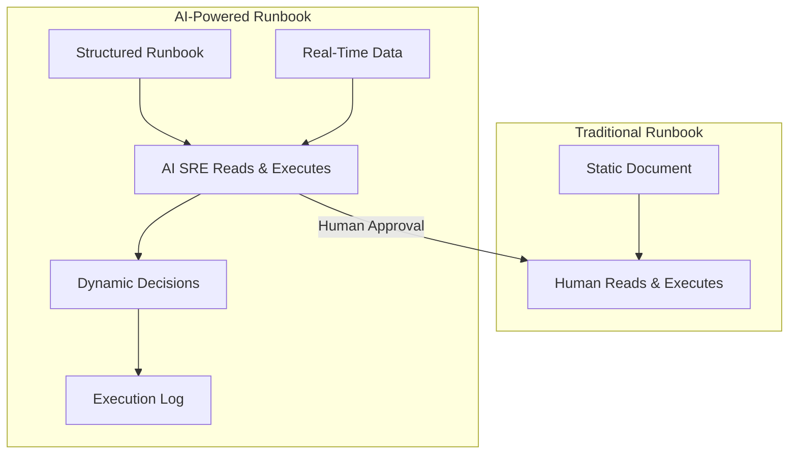
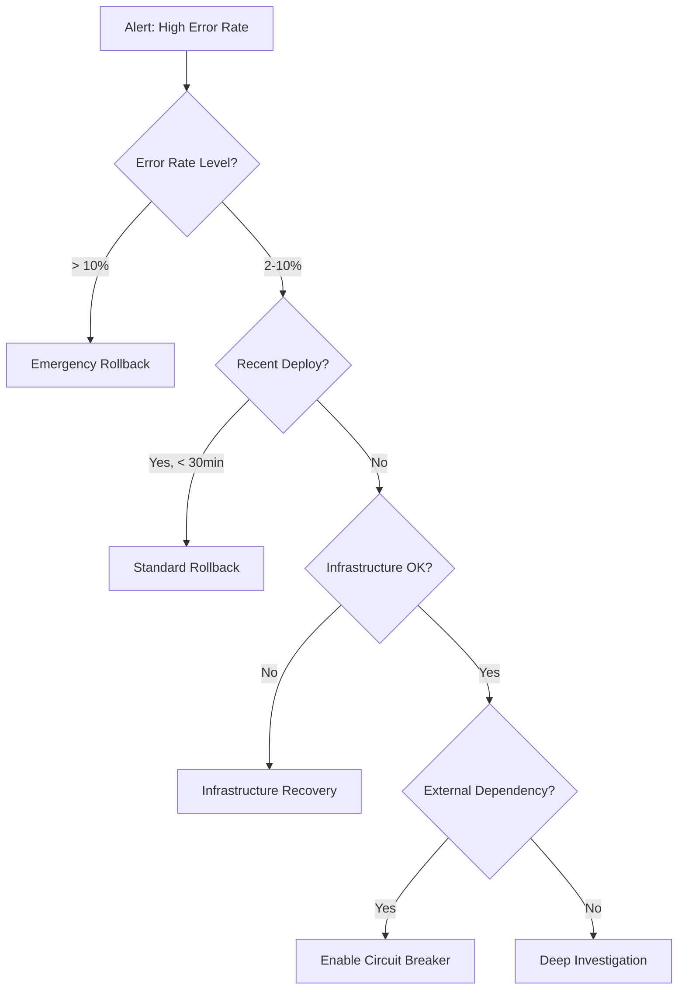

# AI-Powered Runbook Automation

## Overview

AI-powered runbooks transform static documents into executable, intelligent guides that Claude Code can follow step-by-step, adapting based on real-time data from your infrastructure.

## Architecture



## Runbook Structure

### Standard Template

```yaml
# runbooks/checkout-service-errors.yml
name: "Checkout Service High Error Rate"
service: checkout-service
severity_trigger: [SEV-1, SEV-2]
monitors:
  - "High Error Rate - checkout-service"
  - "Checkout p99 Latency"

symptoms:
  - "Error rate exceeds 2%"
  - "HTTP 500 responses from /api/checkout"
  - "Payment processing failures"

steps:
  - name: "Assess current state"
    type: diagnostic
    actions:
      - tool: datadog
        action: query_metrics
        query: "sum:trace.http.request.errors{service:checkout-service,env:production}.as_count() / sum:trace.http.request.hits{service:checkout-service,env:production}.as_count() * 100"
        output: error_rate
      - tool: datadog
        action: query_metrics
        query: "p99:trace.http.request.duration{service:checkout-service,env:production}"
        output: p99_latency
    decision:
      if: "error_rate > 10"
      then: goto_step("emergency_rollback")
      else: goto_step("investigate_cause")

  - name: "investigate_cause"
    type: diagnostic
    actions:
      - tool: datadog
        action: search_logs
        query: "service:checkout-service status:error"
        timerange: "15m"
        output: error_logs
      - tool: aws
        action: describe_ecs_services
        cluster: production
        service: checkout-service
        output: ecs_status
      - tool: github
        action: list_deployments
        environment: production
        limit: 5
        output: recent_deploys
    decision:
      if: "recent_deploys[0].age < 30m AND error_logs.count > 100"
      then: goto_step("deployment_rollback")
      elif: "ecs_status.running_count < ecs_status.desired_count"
      then: goto_step("ecs_recovery")
      else: goto_step("deep_investigation")

  - name: "deployment_rollback"
    type: remediation
    requires_approval: true
    approval_channel: "#inc-current"
    actions:
      - tool: aws
        action: update_ecs_service
        cluster: production
        service: checkout-service
        task_definition: "previous"
      - tool: slack
        action: post_update
        message: "Rollback initiated for checkout-service to previous version"
    verify:
      - tool: datadog
        action: query_metrics
        query: "error_rate"
        wait: 300  # 5 minutes
        expect: "< 1%"

  - name: "emergency_rollback"
    type: remediation
    requires_approval: true
    escalation: page_engineering_manager
    actions:
      - tool: aws
        action: update_ecs_service
        cluster: production
        service: checkout-service
        task_definition: "previous"
      - tool: cloudflare
        action: enable_maintenance_page
        zone: checkout.example.com
      - tool: slack
        action: post_update
        message: ":rotating_light: EMERGENCY: Rollback + maintenance page enabled"

  - name: "ecs_recovery"
    type: remediation
    actions:
      - tool: aws
        action: ecs_force_new_deployment
        cluster: production
        service: checkout-service
      - tool: slack
        action: post_update
        message: "Forcing new ECS deployment to recover failed tasks"
    verify:
      - tool: aws
        action: wait_for_stable
        cluster: production
        service: checkout-service
        timeout: 600

  - name: "deep_investigation"
    type: diagnostic
    actions:
      - tool: datadog
        action: search_logs
        query: "service:checkout-service @error.kind:*"
        group_by: "@error.kind"
      - tool: datadog
        action: get_traces
        query: "service:checkout-service error:true"
        limit: 10
      - tool: aws
        action: query_cloudwatch_logs
        log_group: /ecs/checkout-service
        filter: "ERROR"
      - tool: slack
        action: post_update
        message: "Deep investigation in progress. Gathering logs, traces, and metrics..."

escalation:
  30_min_no_resolution:
    action: page
    target: engineering_manager
  60_min_no_resolution:
    action: page
    target: vp_engineering
```

---

## Runbook Library

### Service Runbooks

| Runbook | Trigger | Primary Action |
|---------|---------|---------------|
| `checkout-errors` | Error rate > 2% | Rollback or scale |
| `payment-timeout` | Payment p99 > 5s | Check provider, circuit breaker |
| `auth-failures` | Auth error rate > 1% | Check OAuth provider, rollback |
| `database-connections` | Connections > 80% | Scale RDS, kill idle connections |
| `disk-space` | Disk > 85% | Archive logs, expand volume |
| `memory-pressure` | OOM kills detected | Scale up, check for leaks |
| `certificate-expiry` | Cert expires < 7d | Renew certificate |

### Infrastructure Runbooks

| Runbook | Trigger | Primary Action |
|---------|---------|---------------|
| `ecs-task-failures` | Task failure count > 3 | Force new deployment |
| `rds-failover` | Primary unavailable | Verify failover, check replica lag |
| `elasticache-evictions` | Eviction rate high | Scale cluster, review TTLs |
| `nat-gateway-errors` | NAT Gateway errors | Check routes, AZ health |
| `lambda-throttling` | Throttle count > 0 | Increase concurrency limit |

### Security Runbooks

| Runbook | Trigger | Primary Action |
|---------|---------|---------------|
| `ddos-attack` | Cloudflare DDoS alert | Review WAF rules, Under Attack mode |
| `unauthorized-access` | GuardDuty finding | Isolate resource, review IAM |
| `data-exposure` | Public S3/DB detected | Block access, audit data |
| `credential-leak` | Secret in commit | Rotate credential, revoke tokens |

---

## Creating AI-Executable Runbooks

### Step 1: Document the Current Manual Process

Interview the on-call team:
- What steps do you take when this alert fires?
- What data do you look at first?
- What decisions do you make at each step?
- What are the common resolutions?
- What are the edge cases?

### Step 2: Structure as Decision Tree



### Step 3: Convert to Structured YAML

Use the template above, ensuring:
- Each step has clear inputs and outputs
- Decision points are explicit with conditions
- Approval gates are set for destructive actions
- Verification steps confirm the fix worked
- Escalation paths are defined with timeouts

### Step 4: Test in Non-Production

```bash
# Run the runbook in dry-run mode against staging
claude "Execute runbook checkout-errors in dry-run mode against staging environment.
Show me what actions would be taken at each step without executing them."
```

### Step 5: Deploy and Iterate

After each real incident:
1. Was the runbook followed?
2. Were any steps missing or wrong?
3. Did the AI make correct decisions at branch points?
4. Update the runbook based on findings

---

## Runbook Execution via Claude Code

### Manual Trigger

```
/sre-runbook Execute checkout-errors runbook

# With context
/sre-runbook Execute checkout-errors - error rate is 5.2%, started 10 minutes ago
```

### Automatic Trigger

Configure Datadog monitors to trigger runbooks via webhook:

```json
{
  "monitor_id": 12345,
  "webhook_url": "https://your-ai-sre-endpoint/runbook/execute",
  "payload": {
    "runbook": "checkout-errors",
    "severity": "{{alert.severity}}",
    "service": "{{alert.service}}",
    "alert_value": "{{alert.value}}"
  }
}
```

### Execution Log

Every runbook execution is logged:

```markdown
## Runbook Execution Log

**Runbook:** checkout-errors
**Triggered:** 2026-03-22 14:35 UTC
**Trigger:** Datadog Monitor "High Error Rate - checkout-service"

| Step | Action | Result | Duration |
|------|--------|--------|----------|
| 1. Assess | Query error rate | 8.5% (> 2%) | 2s |
| 2. Investigate | Query logs + deploys | Deploy v2.3.1 at 14:30 | 5s |
| 3. Decision | Recent deploy + high errors | -> deployment_rollback | 0s |
| 4. Approve | Posted to #inc channel | Approved by @bob | 3m 12s |
| 5. Rollback | Update ECS task definition | Success | 4m 30s |
| 6. Verify | Error rate check | 0.3% (< 1%) | 5m 0s |

**Result:** RESOLVED
**Total Duration:** 12m 44s
```
