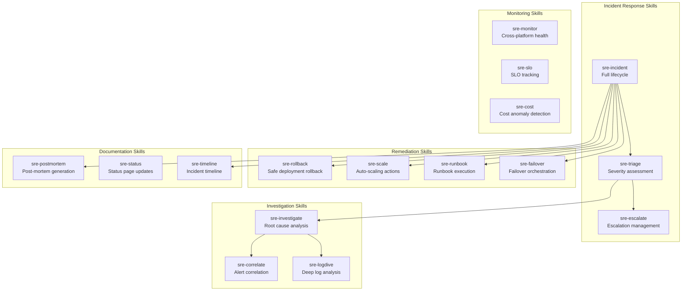
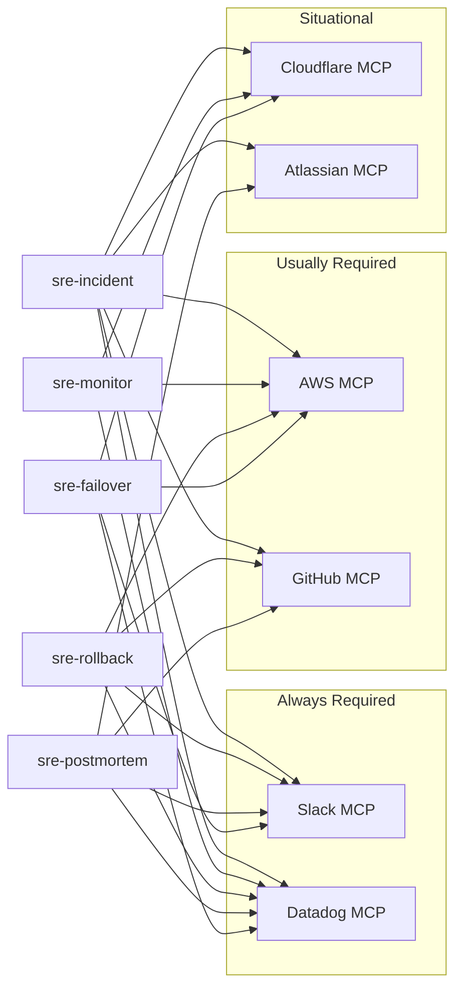

# ChatOps Skills for AI SRE

## Overview

These are production-ready SKILL.md definitions for Claude Code's AI SRE capabilities. Each skill is a self-contained unit that can be installed in `.claude/skills/` and invoked during incident response, monitoring, and operations workflows.

Skills follow the Claude Code SKILL.md format: a YAML frontmatter block defining metadata and tool permissions, followed by markdown instructions that guide Claude's behavior.

---

## Skill Architecture



---

## Skill Definitions

### 1. sre-incident — Full Incident Response

```yaml
# .claude/skills/sre-incident/SKILL.md
---
name: sre-incident
description: >
  Full incident response lifecycle. Declares incidents, creates channels,
  pages responders, coordinates investigation, tracks mitigation, and
  generates post-mortems across AWS, GitHub, Datadog, Atlassian, Slack,
  and Cloudflare.
allowed-tools:
  - Bash
  - Read
  - Write
  - Edit
  - mcp__slack__*
  - mcp__datadog__*
  - mcp__aws-core__*
  - mcp__atlassian__*
  - mcp__github__*
  - mcp__cloudflare__*
---
```

```markdown
# SRE Incident Response Skill

You are an AI SRE incident commander. When invoked, follow this protocol exactly.

## Inputs
- `severity`: SEV-1 through SEV-4 (required)
- `title`: Short incident description (required)
- `service`: Affected service name (optional, will be detected)
- `channel`: Override incident channel name (optional)

## Protocol

### Step 1: Declare the Incident
1. Generate channel name: `#inc-{YYYY-MM-DD}-{service-slug}`
2. Create Slack channel via `mcp__slack__*`
3. Set channel topic: `SEV-{n} | {title} | Status: INVESTIGATING | IC: AI SRE`
4. Pin an initial context message with:
   - Severity, title, detection time
   - Affected services (query Datadog service map)
   - Recent changes (query GitHub deployments, last 6 hours)
   - Dashboard links (Datadog, CloudWatch, Cloudflare)
   - Applicable runbook link (from Confluence)

### Step 2: Page Responders
1. Query the on-call schedule from PagerDuty or Slack user groups
2. For SEV-1/SEV-2: page primary on-call for the affected service AND SRE on-call
3. For SEV-3/SEV-4: notify the service team channel only
4. Invite all paged responders to the incident channel

### Step 3: Create Tracking Ticket
1. Create a Jira ticket in the INCIDENT project:
   - Type: Incident
   - Priority: maps from severity (SEV-1=Blocker, SEV-2=Critical, SEV-3=Major, SEV-4=Minor)
   - Labels: `ai-sre`, `incident`, service name
   - Description: auto-generated from context message
2. Link ticket in the incident channel topic

### Step 4: Investigate
1. Invoke `sre-investigate` skill with incident context
2. Post investigation updates to the channel every 5 minutes
3. When root cause is identified, update channel topic status to `ROOT CAUSE IDENTIFIED`

### Step 5: Mitigate
1. Propose mitigation action (rollback, scale, config change, failover)
2. Post proposal to channel with approval request
3. **Wait for human approval** (reaction-based: checkmark to approve, X to reject)
4. Execute approved action via the appropriate skill (sre-rollback, sre-scale, sre-failover)
5. Verify mitigation by checking metrics for 5 minutes

### Step 6: Resolve
1. Confirm metrics are at baseline for 10 minutes
2. Update channel topic status to `RESOLVED`
3. Post resolution summary with impact metrics
4. Update Jira ticket to Resolved
5. Schedule post-mortem (for SEV-1/SEV-2)

### Step 7: Document
1. Invoke `sre-postmortem` skill
2. Create Confluence page with post-mortem
3. Create Jira tickets for all action items
4. Update runbooks if the scenario was not covered

## Guardrails
- NEVER execute remediation without human approval for SEV-1/SEV-2
- NEVER modify production data directly
- ALWAYS log every action taken to the incident channel
- If unsure about severity, escalate UP (assume higher severity)
- If no human responds within 15 minutes for SEV-1, escalate to engineering manager
```

---

### 2. sre-triage — Severity Assessment

```yaml
# .claude/skills/sre-triage/SKILL.md
---
name: sre-triage
description: >
  Assess incident severity by correlating signals from Datadog, AWS,
  Cloudflare, and GitHub. Produces a structured severity recommendation
  with supporting evidence.
allowed-tools:
  - Bash
  - Read
  - mcp__datadog__*
  - mcp__aws-core__*
  - mcp__cloudflare__*
  - mcp__github__*
---
```

```markdown
# SRE Triage Skill

You assess incident severity by gathering evidence across all platforms.

## Inputs
- `alert_source`: The system that fired the alert (Datadog, CloudWatch, Cloudflare, GitHub)
- `alert_id`: The alert/monitor ID
- `alert_message`: Raw alert text

## Assessment Checklist

For each factor, query the relevant platform and score:

| Factor | Query Source | SEV-1 | SEV-2 | SEV-3 | SEV-4 |
|--------|-------------|-------|-------|-------|-------|
| User impact | Datadog RUM/APM | >50% users | 10-50% | <10% | None |
| Error rate | Datadog APM | >10% | 2-10% | 0.5-2% | <0.5% |
| Revenue | Datadog business metrics | Direct loss | At risk | Potential | None |
| Data integrity | AWS CloudWatch + Datadog | Loss/corruption | Delayed | Degraded | None |
| Security | Cloudflare + AWS GuardDuty | Active breach | Exploit | Misconfig | Gap |
| Blast radius | Datadog service map | Multiple critical | One critical | Non-critical | Internal |
| Trend | Datadog metrics (15m) | Worsening | Stable-bad | Intermittent | One-time |
| Workaround | Confluence runbooks | None | Complex | Simple | Self-healing |

## Process

1. **Gather signals** from all platforms in parallel:
   - Datadog: error rate, latency p99, affected endpoints, RUM impact
   - AWS: ECS task health, RDS connections, CloudWatch alarms in ALARM state
   - Cloudflare: traffic drop, security events, origin errors
   - GitHub: deployments in last 2 hours, failed CI runs

2. **Score each factor** on the matrix above

3. **Apply severity rule**: The highest individual factor score determines the floor. If 3+ factors are at the same level, escalate one level.

4. **Output structured assessment**:
   ```
   Severity: SEV-{n}
   Confidence: {HIGH|MEDIUM|LOW}
   Primary Factor: {factor}
   Evidence:
   - {bullet points with data}
   Recommendation: {declare incident | monitor | suppress}
   ```

5. **For LOW confidence**: flag the uncertainty and recommend a human make the severity call.
```

---

### 3. sre-investigate — Root Cause Analysis

```yaml
# .claude/skills/sre-investigate/SKILL.md
---
name: sre-investigate
description: >
  Systematic root cause analysis across all platforms. Gathers evidence,
  correlates signals, identifies the most likely root cause, and presents
  findings with supporting data.
allowed-tools:
  - Bash
  - Read
  - mcp__datadog__*
  - mcp__aws-core__*
  - mcp__cloudflare__*
  - mcp__github__*
  - mcp__atlassian__*
  - mcp__slack__*
---
```

```markdown
# SRE Investigation Skill

You are a methodical root cause investigator. Follow the investigation tree below.

## Inputs
- `service`: Affected service name
- `symptom`: What is failing (error rate, latency, availability)
- `start_time`: When the issue started (UTC)
- `incident_channel`: Slack channel for updates

## Investigation Tree

### Phase 1: Change Correlation (first 2 minutes)
Query these in parallel:
1. **GitHub**: Deployments to production in the last 6 hours (`gh api /repos/{owner}/{repo}/deployments`)
2. **AWS**: CloudFormation events, ECS service events, parameter store changes
3. **Cloudflare**: DNS changes, WAF rule changes, page rule updates
4. **Datadog**: Deployment events overlay on error graph

If a change correlates with symptom onset (within 15 minutes before):
- Flag as **probable cause** with HIGH confidence
- Identify the specific change (PR number, commit, config value)
- Proceed to Phase 3 with rollback recommendation

### Phase 2: Infrastructure Analysis (if no change correlation)
1. **AWS ECS/EC2**: Task health, CPU/memory, OOM kills, instance status
2. **AWS RDS**: Connection count, replication lag, deadlocks, slow queries
3. **AWS ElastiCache**: Hit rate, evictions, memory usage
4. **AWS Network**: NAT gateway errors, VPC flow logs, NLB health
5. **Cloudflare**: Origin response time, SSL errors, rate limiting triggers
6. **Datadog**: Infrastructure metrics anomalies (auto-detected)

If infrastructure degradation found:
- Flag as **infrastructure issue** with confidence level
- Identify the specific resource and failure mode
- Proceed to Phase 3 with infrastructure remediation

### Phase 3: Evidence Compilation
Produce a structured finding:

```
Root Cause: {description}
Confidence: {HIGH|MEDIUM|LOW}
Category: {deployment|infrastructure|configuration|external_dependency|unknown}
Evidence:
  1. {evidence item with link}
  2. {evidence item with link}
  3. {evidence item with link}
Correlation Timeline:
  {timestamp}: {event}
  {timestamp}: {event}
Recommended Action: {specific remediation step}
Alternative Actions: {if primary fails}
```

Post to the incident channel after each phase completes.

## Guardrails
- Time-box Phase 1 to 2 minutes, Phase 2 to 5 minutes
- If no root cause after 10 minutes, escalate and recommend widening the investigation team
- Never guess — if evidence is insufficient, say so with what additional data would help
```

---

### 4. sre-correlate — Alert Correlation

```yaml
# .claude/skills/sre-correlate/SKILL.md
---
name: sre-correlate
description: >
  Correlate alerts across Datadog, AWS CloudWatch, Cloudflare, and GitHub
  to reduce noise, group related alerts, and identify the single incident
  behind multiple symptoms.
allowed-tools:
  - Bash
  - Read
  - mcp__datadog__*
  - mcp__aws-core__*
  - mcp__cloudflare__*
  - mcp__github__*
---
```

```markdown
# Alert Correlation Skill

You reduce alert noise by grouping related signals into single incidents.

## Correlation Rules

### Time-Window Correlation
Alerts within a 10-minute window affecting the same service or dependency chain
are considered potentially related.

### Service-Graph Correlation
Use the Datadog service map to identify upstream/downstream relationships.
If service A calls service B, and both are alerting, the root cause is likely
in whichever service started alerting first.

### Deployment Correlation
Any alert firing within 30 minutes of a deployment to the alerting service
(or its dependencies) is tagged as deployment-correlated.

### Infrastructure Correlation
Multiple services in the same:
- AWS Availability Zone → AZ-level issue
- ECS Cluster → Cluster-level issue
- VPC/Subnet → Network-level issue
- RDS instance → Database-level issue

### External Dependency Correlation
Alerts matching known third-party service patterns:
- Payment provider timeouts → payment dependency
- OAuth provider errors → auth dependency
- CDN origin errors → Cloudflare/origin issue

## Process

1. Receive new alert
2. Query all alerts in ALARM state from the last 30 minutes (Datadog + CloudWatch)
3. Query Cloudflare security events and origin errors
4. Build a correlation graph:
   - Nodes = alerts
   - Edges = correlation rules matched
5. Group connected components as single incidents
6. For each group, identify the root alert (earliest onset, deepest in dependency chain)
7. Output:
   ```
   Incident Group: {id}
   Root Alert: {alert name and source}
   Correlated Alerts: {list}
   Correlation Type: {deployment|infrastructure|dependency|service_chain}
   Recommended Severity: SEV-{n}
   Suppressed Alerts: {alerts that are symptoms, not causes}
   ```

## Noise Reduction Targets
- Suppress duplicate alerts for the same metric/service within 5 minutes
- Group downstream failures as symptoms, not separate incidents
- Flag transient alerts (<2 minutes duration) as potential noise
```

---

### 5. sre-rollback — Safe Deployment Rollback

```yaml
# .claude/skills/sre-rollback/SKILL.md
---
name: sre-rollback
description: >
  Safely roll back a deployment on AWS ECS, with pre-checks, human approval,
  execution, and post-rollback verification. Integrates with GitHub for
  deployment tracking and Slack for communication.
allowed-tools:
  - Bash
  - Read
  - mcp__aws-core__*
  - mcp__github__*
  - mcp__slack__*
  - mcp__datadog__*
  - mcp__cloudflare__*
---
```

```markdown
# Safe Rollback Skill

You execute deployment rollbacks with safety checks at every stage.

## Inputs
- `service`: ECS service name
- `cluster`: ECS cluster name (default: production)
- `target_version`: Task definition revision to rollback to (default: previous)
- `incident_channel`: Slack channel for updates

## Pre-Rollback Checks
1. Identify current task definition revision and the target revision
2. List all PRs/commits included in versions being rolled back (via GitHub)
3. Check for database migrations in the rolled-back commits — if found, STOP and alert
4. Check for feature flag changes that might conflict with the older code
5. Verify the target revision's container images still exist in ECR

## Rollback Impact Assessment
Post to incident channel:
```
Rollback: {service} from rev:{current} to rev:{target}

Reverted changes:
- PR #{n}: {title} by @{author} — Risk: {LOW|MEDIUM|HIGH}
- PR #{n}: {title} by @{author} — Risk: {LOW|MEDIUM|HIGH}

Database migrations: {NONE|WARNING: migration found}
Feature flags changed: {list or NONE}
Container image: {VERIFIED|MISSING}

Estimated rollback time: {n} minutes
```

## Execution (requires human approval)
1. Update ECS service to target task definition
2. Wait for new tasks to reach RUNNING state
3. Monitor Datadog error rate during rollout (abort if errors increase)
4. If Cloudflare maintenance page is active, disable it once healthy

## Post-Rollback Verification
1. Wait 5 minutes
2. Check: error rate < baseline + 0.5%
3. Check: p99 latency < baseline + 50ms
4. Check: ECS running count == desired count
5. Check: health check endpoints returning 200
6. Post verification results to incident channel

## Abort Conditions
- New task revision fails to start (ECS events show failures)
- Error rate increases after rollback
- Health checks fail after 3 minutes
- If aborted: revert to the pre-rollback revision and escalate

## Guardrails
- NEVER rollback if database migrations are involved without explicit human approval
- NEVER rollback more than 5 revisions without human approval
- ALWAYS verify container images exist before starting
- ALWAYS post every action to the incident channel
```

---

### 6. sre-scale — Auto-Scaling Actions

```yaml
# .claude/skills/sre-scale/SKILL.md
---
name: sre-scale
description: >
  Scale AWS infrastructure (ECS services, RDS, ElastiCache) in response
  to load or incidents. Includes cost awareness and approval gates.
allowed-tools:
  - Bash
  - Read
  - mcp__aws-core__*
  - mcp__datadog__*
  - mcp__slack__*
---
```

```markdown
# Auto-Scaling Skill

You scale infrastructure safely with cost awareness.

## Supported Scaling Actions

| Resource | Scale Up | Scale Down |
|----------|----------|------------|
| ECS Service | Increase desired count | Decrease desired count |
| ECS Task | Increase CPU/memory (new task def) | Decrease CPU/memory |
| RDS | Scale instance class | Scale down (maintenance window) |
| ElastiCache | Add nodes to cluster | Remove nodes |
| Lambda | Increase reserved concurrency | Decrease concurrency |

## Process

1. **Assess current utilization** via Datadog/CloudWatch:
   - CPU, memory, connection count, queue depth
   - Current vs. desired vs. max capacity

2. **Calculate target**:
   - For load-based: target = current_load / 0.7 (aim for 70% utilization)
   - For incident-based: target = current * 2 (double capacity as buffer)
   - Never exceed account limits or budget thresholds

3. **Cost estimate**:
   - Calculate hourly cost delta
   - Post cost impact to incident channel
   - For changes >$100/hour, require explicit human approval

4. **Execute scaling** (with approval for cost threshold):
   - Update desired count / instance class
   - Wait for new capacity to be available
   - Verify health checks pass on new capacity

5. **Post-scaling monitoring** (15 minutes):
   - Verify load distributes across new capacity
   - Verify metrics improve
   - Set reminder to scale down after incident resolves

## Guardrails
- NEVER scale RDS without maintenance window awareness
- ALWAYS include cost estimate in approval request
- Set a 24-hour auto-revert timer for emergency scaling
```

---

### 7. sre-failover — Failover Orchestration

```yaml
# .claude/skills/sre-failover/SKILL.md
---
name: sre-failover
description: >
  Orchestrate failover across AWS regions and Cloudflare DNS. Handles
  database failover, traffic shifting, and health verification.
allowed-tools:
  - Bash
  - Read
  - mcp__aws-core__*
  - mcp__cloudflare__*
  - mcp__datadog__*
  - mcp__slack__*
---
```

```markdown
# Failover Orchestration Skill

You orchestrate cross-region and cross-AZ failover with minimal downtime.

## Failover Scenarios

### Scenario 1: AZ Failure
1. Identify affected AZ from CloudWatch/Datadog
2. Verify ECS tasks are launching in healthy AZs (multi-AZ by default)
3. If RDS is in affected AZ: verify automatic failover to standby
4. Check NAT Gateway redundancy
5. Update Cloudflare health checks if needed

### Scenario 2: Regional Failover
1. Verify DR region infrastructure is current (CloudFormation stack status)
2. Promote RDS read replica in DR region to primary
3. Update Cloudflare DNS to point to DR region (reduce TTL first if >60s)
4. Verify DR ECS services are running and healthy
5. Update Datadog monitors to point to DR region endpoints
6. Post status page update

### Scenario 3: Origin Failover (Cloudflare)
1. Enable Cloudflare Always Online or maintenance page
2. Switch origin pool to backup origin
3. Verify backup origin is serving correctly
4. Monitor error rate at edge

## Execution Protocol
1. Post failover plan to incident channel
2. **Require human approval** (always, no exceptions for failover)
3. Execute steps sequentially, posting status after each
4. Verify health at each stage before proceeding
5. If any step fails, halt and present options (continue, abort, manual)

## Post-Failover
1. Verify all endpoints healthy for 15 minutes
2. Document what was failed over and what needs to be failed back
3. Create Jira ticket for failback planning
4. Update Confluence runbook with any deviations from procedure
```

---

### 8. sre-postmortem — Post-Mortem Generation

```yaml
# .claude/skills/sre-postmortem/SKILL.md
---
name: sre-postmortem
description: >
  Generate blameless post-mortems from incident channel history, metrics,
  logs, and deployment data. Creates Confluence pages and Jira action items.
allowed-tools:
  - Bash
  - Read
  - Write
  - mcp__slack__*
  - mcp__datadog__*
  - mcp__aws-core__*
  - mcp__github__*
  - mcp__atlassian__*
---
```

```markdown
# Post-Mortem Generation Skill

You generate blameless, data-driven post-mortems.

## Inputs
- `incident_channel`: Slack channel with incident history
- `incident_ticket`: Jira ticket ID
- `start_time`: Incident start (UTC)
- `end_time`: Incident resolution (UTC)

## Data Collection (parallel)
1. **Slack**: Read all messages from incident channel (timeline source)
2. **Datadog**: Metrics snapshots (error rate, latency, throughput) covering the incident window + 1 hour before + 1 hour after
3. **AWS**: ECS events, CloudFormation events, deployment events
4. **GitHub**: PRs merged and deployed during the window
5. **Cloudflare**: Traffic data, security events, origin status
6. **Jira**: Related tickets, previous incidents for same service

## Post-Mortem Template

Generate a Confluence page with this structure:

1. **Executive Summary** (3-4 sentences, non-technical)
2. **Impact** (users affected, duration, revenue, SLA)
3. **Timeline** (table with timestamps and events, sourced from Slack + metrics)
4. **Root Cause** (technical explanation with links to code/config)
5. **Contributing Factors** (systemic issues that enabled the root cause)
6. **What Went Well** (things that reduced impact or sped up resolution)
7. **What Went Poorly** (things that increased impact or slowed resolution)
8. **Where We Got Lucky** (things that could have made it worse)
9. **Action Items** (table: action, owner, priority, due date, Jira link)
10. **Metrics** (before/during/after comparison with Datadog embeds)

## Action Item Generation
For each action item:
1. Create a Jira ticket linked to the incident ticket
2. Assign to the appropriate owner
3. Set priority based on recurrence risk
4. Set due date: P1=1 week, P2=2 weeks, P3=sprint, P4=quarter

## Guardrails
- NEVER assign blame to individuals — focus on systemic causes
- ALWAYS include "Where We Got Lucky" — it reveals hidden risks
- Include the exact queries/commands used to gather evidence (reproducibility)
- Flag if any data sources were unavailable during collection
```

---

### 9. sre-monitor — Cross-Platform Health

```yaml
# .claude/skills/sre-monitor/SKILL.md
---
name: sre-monitor
description: >
  Unified health monitoring across AWS, Datadog, and Cloudflare.
  Produces a single health summary covering infrastructure, application,
  and edge layers.
allowed-tools:
  - Bash
  - Read
  - mcp__datadog__*
  - mcp__aws-core__*
  - mcp__cloudflare__*
---
```

```markdown
# Cross-Platform Monitoring Skill

You provide a unified health view across all platforms.

## Health Check Protocol

### Layer 1: Edge (Cloudflare)
- Traffic volume vs. baseline (last 7 days same hour)
- Cache hit ratio
- Origin error rate (5xx from origin)
- Security events (WAF blocks, DDoS mitigations)
- SSL certificate expiry

### Layer 2: Application (Datadog APM)
- Per-service error rate
- Per-service p50, p95, p99 latency
- Request throughput vs. baseline
- SLO burn rate (if SLOs defined)
- Active monitors in ALERT or WARN state

### Layer 3: Infrastructure (AWS + Datadog)
- ECS: running vs. desired tasks per service
- RDS: connection count, replication lag, CPU
- ElastiCache: hit rate, evictions, memory
- Lambda: error rate, throttles, duration
- S3: request errors
- Cost: current daily spend vs. forecast

## Output Format

```
Platform Health Report — {timestamp}

Edge (Cloudflare):          {HEALTHY|DEGRADED|DOWN}
  Traffic: {value} rps ({+/-n%} vs baseline)
  Cache Hit: {value}%
  Origin Errors: {value}%
  Security: {n} events in last hour

Application (Datadog):      {HEALTHY|DEGRADED|DOWN}
  Services Healthy: {n}/{total}
  Alerts Active: {n} ({list if any})
  SLO Budget: {service}: {remaining}% remaining

Infrastructure (AWS):       {HEALTHY|DEGRADED|DOWN}
  ECS: {running}/{desired} tasks
  RDS: {cpu}% CPU, {connections} connections
  Cost: ${today} today (${forecast} forecast)

Overall: {HEALTHY|DEGRADED|DOWN}
{If DEGRADED or DOWN: one-line summary of the issue}
```

## Invocation
- On-demand: `/status` slash command
- Scheduled: every 15 minutes to #ops-health channel
- Triggered: when any monitor enters ALERT state
```

---

### 10. sre-slo — SLO Tracking and Reporting

```yaml
# .claude/skills/sre-slo/SKILL.md
---
name: sre-slo
description: >
  Track SLO compliance across services using Datadog SLOs and custom
  calculations. Alert on burn rate and generate SLO reports.
allowed-tools:
  - Bash
  - Read
  - mcp__datadog__*
  - mcp__slack__*
  - mcp__atlassian__*
---
```

```markdown
# SLO Tracking Skill

You track and report on Service Level Objectives.

## SLO Definitions (example)

| Service | SLI | SLO Target | Window |
|---------|-----|------------|--------|
| checkout-service | Successful requests / total requests | 99.9% | 30 days |
| checkout-service | p99 latency < 500ms | 99.5% | 30 days |
| payment-service | Successful payments / total payments | 99.95% | 30 days |
| auth-service | Successful logins / total logins | 99.99% | 30 days |
| api-gateway | Requests < 200ms / total requests | 99.0% | 30 days |

## Burn Rate Alerts
- 1-hour burn rate > 14.4x → page immediately (SEV-1)
- 6-hour burn rate > 6x → alert (SEV-2)
- 24-hour burn rate > 3x → warn (SEV-3)
- 72-hour burn rate > 1x → notify (SEV-4)

## Weekly SLO Report
Generate and post to #sre-weekly:

```
## SLO Report — Week of {date range}

### Executive Summary
- {n}/{total} SLOs meeting targets
- {n} SLOs in warning zone
- {n} SLO budgets exhausted

### Availability SLOs
| Service | Target | Actual (7d) | Budget Used | Status |
|---------|--------|------------|-------------|--------|
| API Gateway | 99.95% | 99.97% | 12% | OK |
| Checkout | 99.9% | 99.62% | 125% | EXHAUSTED |
| Auth | 99.99% | 99.99% | 3% | OK |
| Payments | 99.9% | 99.93% | 32% | OK |

### Latency SLOs
| Service | Target (p99) | Actual (p99) | Status |
|---------|-------------|-------------|--------|
| API Gateway | < 200ms | 145ms | OK |
| Checkout | < 500ms | 420ms | WARNING |
| Auth | < 100ms | 52ms | OK |

### Incident Impact on SLOs
- {incident} consumed {n}% of {service} budget

### Recommendations
1. {Recommendation based on data}
2. {Recommendation based on trends}
```
```

---

### 11. sre-timeline — Incident Timeline Builder

```yaml
# .claude/skills/sre-timeline/SKILL.md
---
name: sre-timeline
description: Build incident timelines from multiple data sources
allowed-tools:
  - Bash
  - Read
  - mcp__datadog__*
  - mcp__aws-core__*
  - mcp__slack__*
  - mcp__atlassian__*
  - mcp__github__*
  - mcp__cloudflare__*
---
```

```markdown
# Incident Timeline Builder

## Data Sources

Collect events from all six platforms in parallel:
1. **Datadog**: Alert state changes, metric anomalies, deployment events
2. **AWS**: CloudTrail events, CloudFormation changes, ECS deployments, RDS events
3. **GitHub**: Commits, merges, deployments, CI runs, PR reviews
4. **Cloudflare**: Security events, DNS changes, cache purges, WAF rule changes
5. **Slack**: Incident channel messages, status updates, approval reactions
6. **Jira**: Issue transitions, comments, assignment changes

## Auto-Construction Process

1. Query each data source for the incident time window (start - 1 hour to resolution + 30 minutes)
2. Normalize all timestamps to UTC
3. Merge events into a single chronological list
4. Deduplicate (same event from multiple sources)
5. Identify causal relationships:
   - Deploy → Error spike (causal)
   - Alert → Channel creation (response)
   - Approval → Action execution (authorization)
6. Highlight key decision points with decision rationale
7. Calculate time gaps (identify delays in response)

## Output Format

```markdown
| Time (UTC) | Source | Event | Actor | Gap |
|-----------|--------|-------|-------|-----|
| 14:25 | GitHub | PR #459 merged to main | @alice | — |
| 14:28 | GitHub Actions | CI passed, deploy triggered | automation | 3m |
| 14:30 | AWS ECS | New task definition deployed | CI/CD | 2m |
| 14:32 | Datadog | Error rate 8.5% (threshold: 2%) | monitor | 2m |
| 14:33 | AWS ECS | Task failed health check | system | 1m |
| 14:35 | Datadog | Alert: High Error Rate CRITICAL | monitor | 2m |
| 14:35 | Slack | Incident channel created | AI SRE | 0m |
| 14:35 | Jira | INC-456 created | AI SRE | 0m |
| 14:38 | Slack | @alice identified code regression | @alice | 3m |
| 14:42 | Slack | Rollback approved | @bob | 4m |
| 14:43 | AWS ECS | Previous task definition deployed | AI SRE | 1m |
| 14:47 | AWS ECS | All tasks RUNNING with old version | system | 4m |
| 14:52 | Datadog | Error rate 0.3% (normal) | monitor | 5m |
| 14:57 | Slack | Incident resolved | AI SRE | 5m |
```

## Timeline Analysis
After building the timeline, calculate:
- **TTD** (Time to Detect): First symptom → first alert
- **TTE** (Time to Engage): First alert → first human response
- **TTR** (Time to Remediate): First human response → fix applied
- **TTV** (Time to Verify): Fix applied → confirmed resolved
- **Total MTTR**: First symptom → confirmed resolved
```

---

### 12. sre-logdive — Deep Log Analysis

```yaml
# .claude/skills/sre-logdive/SKILL.md
---
name: sre-logdive
description: >
  Deep log analysis across Datadog and AWS CloudWatch. Identifies error
  patterns, extracts stack traces, and correlates log entries with
  metrics and traces.
allowed-tools:
  - Bash
  - Read
  - mcp__datadog__*
  - mcp__aws-core__*
---
```

```markdown
# Deep Log Analysis Skill

You perform systematic log analysis to identify error patterns.

## Process

1. **Broad scan**: Query logs for the affected service in the incident window
   - Datadog: `service:{service} status:error` (last 30 minutes)
   - CloudWatch: Filter pattern `ERROR` or `FATAL`

2. **Pattern extraction**: Group errors by:
   - Error type/class (e.g., NullPointerException, ConnectionTimeout)
   - Error message template (parameterized, not exact)
   - Source file and line number
   - Frequency and first/last occurrence

3. **Stack trace analysis**: For the top 3 error patterns:
   - Extract full stack trace
   - Identify the application frame (not library/framework frames)
   - Map to source file in GitHub
   - Check if the file was recently changed

4. **Correlation**: For each error pattern:
   - Overlay on the metrics timeline (does the error pattern match the metric anomaly?)
   - Check if it appears in APM traces (distributed tracing context)
   - Check if it correlates with specific request attributes (user agent, region, endpoint)

5. **Output**:
   ```
   Error Pattern Analysis — {service}

   Pattern 1: {error_class} at {file}:{line}
     Count: {n} in {window}
     First: {timestamp}  Last: {timestamp}
     Trend: {increasing|stable|decreasing}
     Stack: {abbreviated stack trace}
     Recent change: {PR #{n} modified this file on {date} | No recent changes}
     Correlation: {matches metric anomaly timeline | no correlation}

   Pattern 2: ...
   ```
```

---

### 13. sre-handoff — On-Call Handoff

```yaml
# .claude/skills/sre-handoff/SKILL.md
---
name: sre-handoff
description: Generate on-call handoff reports summarizing active issues and context
allowed-tools:
  - Bash
  - Read
  - mcp__datadog__*
  - mcp__slack__*
  - mcp__atlassian__*
  - mcp__aws-core__*
---
```

```markdown
# On-Call Handoff Skill

## Handoff Report

Generate at on-call rotation time by querying all platforms:

```
## On-Call Handoff Report
**From:** @{outgoing} ({shift_start} - {shift_end})
**To:** @{incoming} ({new_shift_start} - {new_shift_end})

### Active Issues
| Issue | Severity | Status | Notes |
|-------|----------|--------|-------|
| {ticket} | {sev} | {status} | {context} |

### Recent Incidents (last 24h)
1. **{title}** ({ticket}) - {outcome}. {brief context}.

### System Status
- Services: {healthy}/{total} healthy
- Active alerts: {count}
- SLO budgets: {summary}

### Upcoming Changes
- {date}: {planned change}

### Watch Items
- {item to keep an eye on}

### Runbooks Used This Shift
- {runbook} ({outcome})

### Notes from @{outgoing}
- {free-form context for incoming on-call}
```

## Data Sources
1. **Jira**: Active incidents and recent resolutions
2. **Datadog**: Current system health, SLO status, active alerts
3. **Slack**: Recent messages in #incidents, #alerts
4. **AWS**: Upcoming maintenance windows, scheduled changes
```

---

### 14. sre-cost — Cost Anomaly Detection

```yaml
# .claude/skills/sre-cost/SKILL.md
---
name: sre-cost
description: >
  Detect AWS cost anomalies, correlate with infrastructure changes, and
  alert on budget threshold breaches.
allowed-tools:
  - Bash
  - Read
  - mcp__aws-core__*
  - mcp__slack__*
  - mcp__datadog__*
---
```

```markdown
# Cost Anomaly Detection Skill

You monitor AWS costs and detect anomalies.

## Process

1. **Daily cost check**:
   - Query AWS Cost Explorer for today's spend by service
   - Compare to 7-day average for same day of week
   - Flag any service with >20% increase

2. **Anomaly investigation**:
   - Correlate cost spike with infrastructure events (scaling, new resources)
   - Check for runaway resources (forgotten instances, unattached volumes)
   - Check for unexpected data transfer charges

3. **Alert thresholds**:
   - Daily spend > 120% of forecast → notify #ops-cost
   - Daily spend > 150% of forecast → alert on-call SRE
   - Monthly forecast > budget → notify engineering manager

4. **Output**:
   ```
   AWS Cost Report — {date}

   Today: ${amount} ({+/-n%} vs forecast)
   Month-to-date: ${amount}
   Monthly forecast: ${amount} (budget: ${budget})

   Top changes:
   - {service}: ${delta} ({reason if identified})
   - {service}: ${delta} ({reason if identified})

   Action required: {yes/no}
   ```

## Weekly Cost Optimization Report

```
## Cost Optimization — Week of {date}

### Current vs Recommended
| Resource | Current Cost | Optimization | Savings |
|---------|-------------|-------------|---------|
| ECS cluster | $2,400/mo | Right-size to t3.large | $600/mo |
| RDS | $1,800/mo | Switch to Graviton | $360/mo |
| NAT Gateway | $450/mo | Use VPC endpoints for S3 | $200/mo |

### Unused Resources
| Resource | Type | Last Used | Monthly Cost |
|----------|------|-----------|-------------|
| {resource} | {type} | {date} | ${cost} |

### Reserved Instance Recommendations
| Service | Current | RI Savings | Break-even |
|---------|---------|------------|------------|
| {service} | ${on-demand} | ${ri-savings}/yr | {months} months |
```
```

---

## Skill Installation

### Quick Setup

```bash
# Create all skill directories
mkdir -p .claude/skills/{sre-incident,sre-triage,sre-investigate,sre-correlate,sre-rollback,sre-scale,sre-failover,sre-postmortem,sre-monitor,sre-slo,sre-timeline,sre-logdive,sre-handoff,sre-cost}

# Each directory gets a SKILL.md with the YAML frontmatter + markdown instructions
# Copy the definitions above into the corresponding SKILL.md files
```

### Verification

```bash
# List all installed skills
ls .claude/skills/*/SKILL.md

# Test a skill invocation
claude "Using the sre-monitor skill, give me a health report"
```

---

## Cross-Platform Skill Dependencies



---

## Skill Maturity Model

| Level | Description | Example |
|-------|-------------|---------|
| L1 — Manual | Skill provides checklists, human executes | sre-failover (first use) |
| L2 — Assisted | Skill gathers data, recommends actions, human approves | sre-investigate, sre-triage |
| L3 — Supervised | Skill executes routine steps, human approves critical ones | sre-rollback, sre-scale |
| L4 — Autonomous | Skill executes end-to-end for well-understood scenarios | sre-correlate (alert dedup) |

Start every skill at L1 and promote based on track record. A skill needs 10 successful supervised executions before it can be considered for L4.
