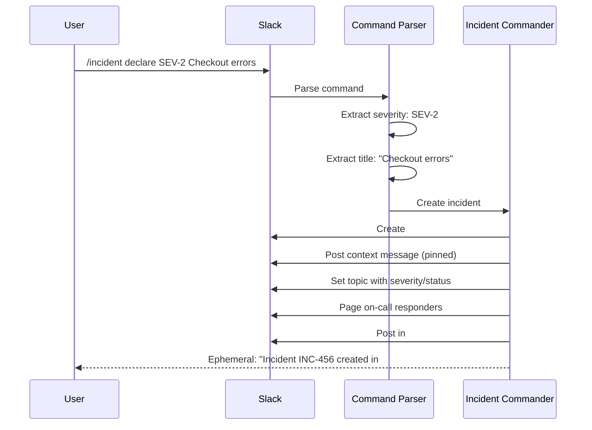
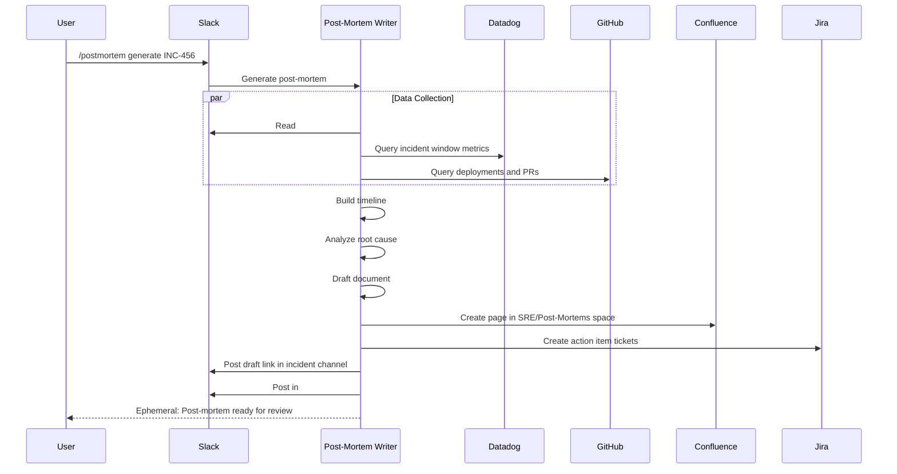
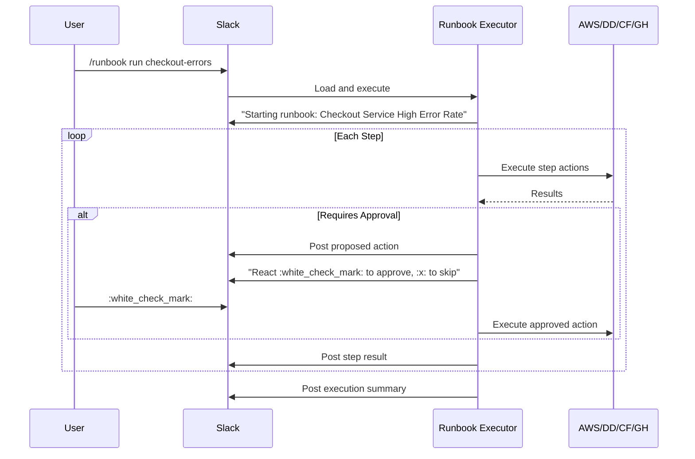
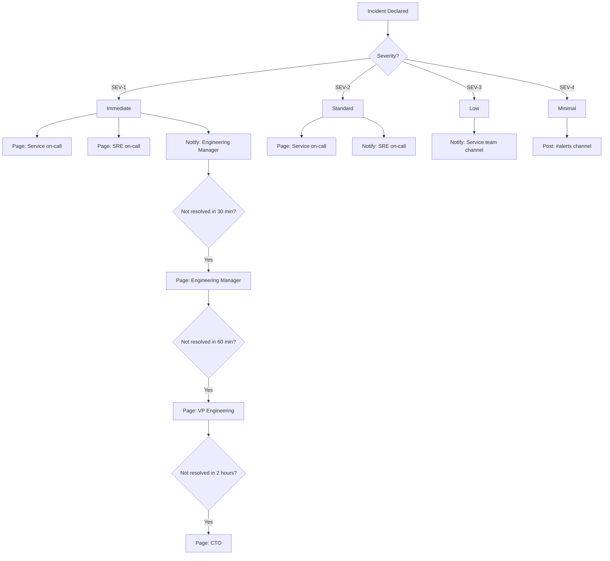
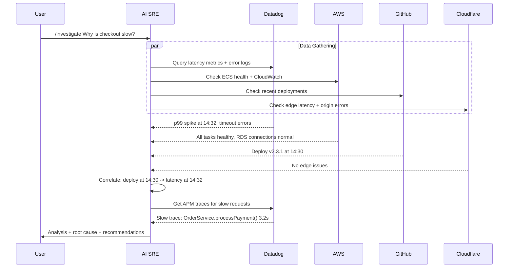
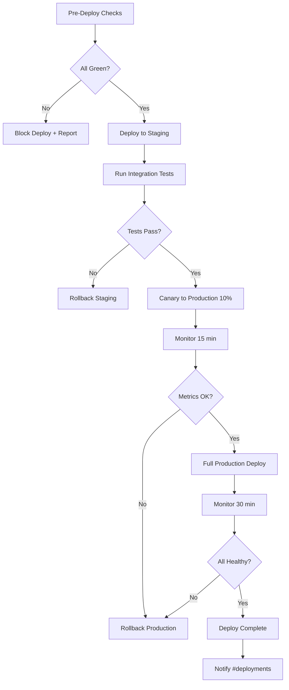

# ChatOps Slash Commands

## Overview

These slash commands provide the primary human interface to the AI SRE system. They are invoked in Slack and can also be used directly in Claude Code sessions. Each command maps to one or more skills and agents.

---

## Command Architecture

```mermaid
flowchart LR
    subgraph "Slack Interface"
        IC_CMD[/incident]
        PM_CMD[/postmortem]
        RB_CMD[/runbook]
        ESC_CMD[/escalate]
        ST_CMD[/status]
        INV_CMD[/investigate]
        DEP_CMD[/deploy]
        ROLL_CMD[/rollback]
        SLO_CMD[/slo]
        OC_CMD[/oncall]
    end

    subgraph "AI SRE Dispatch"
        PARSE[Command Parser]
        AUTH[Permission Check]
        DISPATCH[Agent Dispatcher]
    end

    subgraph "Agents & Skills"
        IC_AGENT[Incident Commander]
        PMW_AGENT[Post-Mortem Writer]
        RB_AGENT[Runbook Executor]
        IC_ESC[IC Escalation Handler]
        HM_AGENT[Health Monitor]
        RCA_AGENT[Root Cause Analyzer]
    end

    IC_CMD --> PARSE
    PM_CMD --> PARSE
    RB_CMD --> PARSE
    ESC_CMD --> PARSE
    ST_CMD --> PARSE
    INV_CMD --> PARSE
    DEP_CMD --> PARSE
    ROLL_CMD --> PARSE
    SLO_CMD --> PARSE
    OC_CMD --> PARSE

    PARSE --> AUTH
    AUTH --> DISPATCH

    DISPATCH --> IC_AGENT
    DISPATCH --> PMW_AGENT
    DISPATCH --> RB_AGENT
    DISPATCH --> IC_ESC
    DISPATCH --> HM_AGENT
    DISPATCH --> RCA_AGENT
```

---

## Command Reference (Quick)

| Command | Description | Primary Agent/Skill |
|---------|-------------|-------------------|
| `/incident` | Declare and manage incidents | Incident Commander |
| `/postmortem` | Generate and manage post-mortems | Post-Mortem Writer |
| `/runbook` | Execute operational runbooks | Runbook Executor |
| `/escalate` | Escalation management | Incident Commander |
| `/status` | System health status | Health Monitor |
| `/investigate` | Deep investigation of production issues | Root Cause Analyzer |
| `/deploy` | Deploy with full observability | sre-rollback + sre-monitor |
| `/rollback` | Rollback a deployment | sre-rollback |
| `/slo` | SLO and error budget report | sre-slo |
| `/oncall` | On-call information and handoff | sre-handoff |

---

## `/incident` — Declare and Manage Incidents

Declares a new incident or manages an existing one. This is the most frequently used command during production issues.

### Syntax

```
/incident <subcommand> [options]
```

### Subcommands

| Subcommand | Description | Example |
|-----------|-------------|---------|
| `declare` | Declare a new incident | `/incident declare SEV-2 Checkout errors after deploy` |
| `update` | Post a status update | `/incident update Root cause identified, preparing rollback` |
| `severity` | Change incident severity | `/incident severity SEV-1` |
| `ic` | Assign incident commander | `/incident ic @alice` |
| `resolve` | Mark incident as resolved | `/incident resolve Rolled back to v2.3.0` |
| `close` | Close incident (archive channel) | `/incident close` |
| `summary` | Get current incident summary | `/incident summary` |
| `timeline` | Show incident timeline | `/incident timeline` |
| `add` | Add a responder | `/incident add @bob @carol` |
| `list` | List active incidents | `/incident list` |

### Declare Workflow



### Examples

```
# Declare a new SEV-1 incident
/incident declare SEV-1 Complete checkout outage - no orders processing

# Declare with affected service specified
/incident declare SEV-2 Payment timeouts --service payment-service

# Update incident status
/incident update We've identified the root cause as a null pointer in OrderService.
  PR #459 introduced the regression. Preparing rollback.

# Escalate severity
/incident severity SEV-1
> Reason: Error rate has increased from 5% to 25% in the last 10 minutes

# Assign a human incident commander
/incident ic @alice
> AI SRE transitions to advisory role

# Resolve the incident
/incident resolve Rolled back checkout-service to v2.3.0. Error rate back to baseline.

# View timeline
/incident timeline

# List active incidents
/incident list
```

### Declare Command Response

```
:rotating_light: Incident Declared: SEV-2

Title: Checkout errors after deploy
Channel: #inc-2026-03-22-checkout-errors
Ticket: INC-456
IC: AI SRE (pending human assignment)

On-call paged: @bob (backend), @carol (SRE)

I'm gathering initial context now. Updates will be posted in the incident channel.
```

### Permissions

| Action | Who Can Do It |
|--------|--------------|
| Declare SEV-1/2 | Any engineer |
| Declare SEV-3/4 | Any engineer |
| Change severity UP | Any responder |
| Change severity DOWN | IC only |
| Assign IC | Current IC or SRE manager |
| Resolve | IC only |
| Close | IC or SRE manager |

---

## `/postmortem` — Generate and Manage Post-Mortems

Generates a post-mortem for a resolved incident, or manages existing post-mortems.

### Syntax

```
/postmortem <subcommand> [options]
```

### Subcommands

| Subcommand | Description | Example |
|-----------|-------------|---------|
| `generate` | Generate post-mortem for an incident | `/postmortem generate INC-456` |
| `generate` (in channel) | Generate for current incident channel | `/postmortem generate` |
| `status` | Check post-mortem status | `/postmortem status INC-456` |
| `actions` | List open action items | `/postmortem actions INC-456` |
| `list` | List recent post-mortems | `/postmortem list` |
| `remind` | Send reminders for overdue action items | `/postmortem remind` |

### Generate Workflow



### Examples

```
# Generate post-mortem for a specific incident
/postmortem generate INC-456

# Generate from within the incident channel (auto-detects incident)
/postmortem generate

# List recent post-mortems
/postmortem list
> Last 10 post-mortems:
> INC-456: Checkout errors (2026-03-22) — 3/5 action items complete
> INC-451: Auth service timeout (2026-03-19) — 2/4 action items complete
> ...

# Check action items for a post-mortem
/postmortem actions INC-456
> Action items for INC-456:
> :white_check_mark: PROJ-500: Fix null check in OrderService (@alice) — Done
> :white_check_mark: PROJ-501: Add integration test (@alice) — Done
> :hourglass: PROJ-502: Implement canary deployments (@carol) — Due Apr 5
> :hourglass: PROJ-503: Add fallback endpoint to staging (@dave) — Due Apr 5
> :hourglass: PROJ-504: Review all null handling (@alice) — Due Apr 1

# Send reminders for overdue items
/postmortem remind
> Sent reminders for 3 overdue action items across 2 post-mortems
```

### Response: Generate

```
:memo: Post-Mortem Generation Started

Incident: INC-456 — Checkout errors after deploy
Duration: 25 minutes (14:32 - 14:57 UTC)

Collecting data from:
:white_check_mark: Slack incident channel (47 messages)
:white_check_mark: Datadog metrics and logs
:white_check_mark: GitHub deployments and PRs
:hourglass_flowing_sand: Building timeline...
:hourglass_flowing_sand: Analyzing root cause...

I'll post the draft in this channel when ready (~2 minutes).
```

---

## `/runbook` — Execute Runbooks

Executes a runbook manually or lists available runbooks.

### Syntax

```
/runbook <subcommand> [options]
```

### Subcommands

| Subcommand | Description | Example |
|-----------|-------------|---------|
| `run` | Execute a runbook | `/runbook run checkout-errors` |
| `run` with context | Execute with additional context | `/runbook run checkout-errors --error-rate 5.2%` |
| `dry-run` | Simulate execution without making changes | `/runbook dry-run checkout-errors` |
| `list` | List available runbooks | `/runbook list` |
| `show` | Show runbook steps | `/runbook show checkout-errors` |
| `history` | Show execution history | `/runbook history checkout-errors` |
| `status` | Show currently executing runbooks | `/runbook status` |
| `create` | Create a new runbook | `/runbook create database-failover` |

### Execution Workflow



### Examples

```
# List available runbooks
/runbook list
> Available runbooks:
> Service:
>   checkout-errors — Checkout Service High Error Rate
>   payment-timeout — Payment Service Timeout
>   auth-failures — Auth Service Failures
>   database-connections — Database Connection Pool Exhaustion
> Infrastructure:
>   ecs-task-failures — ECS Task Recovery
>   rds-failover — RDS Failover Procedure
>   disk-space — Disk Space Recovery
> Security:
>   ddos-attack — DDoS Attack Response
>   credential-leak — Credential Leak Response

# Show runbook steps without executing
/runbook show checkout-errors
> Checkout Service High Error Rate
> Triggers: Error rate > 2%, HTTP 500 on /api/checkout
> Steps:
>   1. Assess current state (diagnostic)
>   2. Investigate cause (diagnostic)
>   3a. Deployment rollback (requires approval)
>   3b. Emergency rollback (requires approval + EM page)
>   3c. ECS recovery (auto)
>   3d. Deep investigation (diagnostic)

# Execute with context
/runbook run checkout-errors --error-rate 5.2% --started "10 minutes ago"

# Dry run (simulation only)
/runbook dry-run checkout-errors
> DRY RUN — No changes will be made
> Step 1: Would query Datadog for error rate -> simulated: 5.2%
> Step 2: Would query logs, ECS status, deploys -> simulated: deploy v2.3.1 at 14:30
> Decision: Recent deploy + high errors -> branch: deployment_rollback
> Step 3: Would rollback ECS to previous task def (REQUIRES APPROVAL)
> Step 4: Would verify error rate < 1% after 5 minutes
> DRY RUN COMPLETE — 4 steps, 1 approval required

# View execution history
/runbook history checkout-errors
> Last 5 executions:
> 2026-03-22 14:35 — RESOLVED (12m 44s) — triggered by Datadog
> 2026-03-15 09:12 — RESOLVED (8m 20s) — triggered by /runbook
> 2026-03-01 22:45 — ESCALATED (15m) — triggered by Datadog
> 2026-02-20 11:30 — RESOLVED (6m 10s) — triggered by /runbook
> 2026-02-08 03:15 — RESOLVED (9m 55s) — triggered by Datadog
```

### Response: Run

```
:gear: Runbook Execution Started

Runbook: Checkout Service High Error Rate
Mode: LIVE
Context: error-rate=5.2%, started ~10 minutes ago

Step 1/4: Assess current state
  Querying Datadog... error rate: 5.2%  p99 latency: 1.8s
  Decision: error_rate < 10% -> proceed to investigation

Step 2/4: Investigate cause
  Querying logs... 312 errors in last 15 minutes
  Querying ECS... 4/4 tasks running (healthy)
  Querying deploys... v2.3.1 deployed 12 minutes ago
  Decision: recent deploy (12 min) + high errors (312) -> deployment rollback

Step 3/4: Deployment rollback :lock:
  Proposed action: Rollback checkout-service from v2.3.1 to v2.3.0
  Reverted PRs: #459 (payment response parsing), #457 (rate limiting), #458 (deps)
  Database migrations: NONE
  React :white_check_mark: to approve or :x: to skip
```

---

## `/escalate` — Escalation Management

Escalates an incident to additional responders, management, or external parties.

### Syntax

```
/escalate <subcommand> [options]
```

### Subcommands

| Subcommand | Description | Example |
|-----------|-------------|---------|
| `page` | Page a specific person or team | `/escalate page @alice` |
| `team` | Page an entire team | `/escalate team backend-oncall` |
| `management` | Escalate to engineering management | `/escalate management` |
| `executive` | Escalate to executive leadership | `/escalate executive` |
| `vendor` | Open a support ticket with a vendor | `/escalate vendor aws` |
| `status` | Show current escalation chain | `/escalate status` |

### Escalation Matrix



### Escalation Configuration

```yaml
# escalation_matrix.yml
teams:
  backend-oncall:
    primary: "@bob"
    secondary: "@alice"
    manager: "@charlie"
    schedule: pagerduty://backend-primary

  sre-oncall:
    primary: "@carol"
    secondary: "@dave"
    manager: "@eve"
    schedule: pagerduty://sre-primary

  frontend-oncall:
    primary: "@frank"
    secondary: "@grace"
    manager: "@charlie"
    schedule: pagerduty://frontend-primary

  security-oncall:
    primary: "@heidi"
    secondary: "@ivan"
    manager: "@judy"
    schedule: pagerduty://security-primary

management:
  engineering_manager: "@charlie"
  vp_engineering: "@karen"
  cto: "@larry"

vendors:
  aws:
    method: support_case
    severity_map:
      SEV-1: critical
      SEV-2: urgent
      SEV-3: high
      SEV-4: normal
    account_id: "123456789012"

  datadog:
    method: support_ticket
    url: "https://help.datadoghq.com"
    priority_map:
      SEV-1: urgent
      SEV-2: high

  cloudflare:
    method: support_ticket
    url: "https://dash.cloudflare.com/support"
    plan: enterprise

timeouts:
  sev1:
    no_ack_5m: page secondary on-call
    no_ack_10m: page manager
    no_resolution_30m: escalate to management
    no_resolution_60m: escalate to VP
    no_resolution_120m: escalate to CTO
  sev2:
    no_ack_10m: page secondary on-call
    no_ack_20m: page manager
    no_resolution_60m: escalate to management
  sev3:
    no_ack_30m: page secondary on-call
    no_resolution_120m: notify manager
```

### Examples

```
# Page a specific person
/escalate page @alice
> :telephone_receiver: Paging @alice for INC-456 (SEV-2: Checkout errors)

# Page a team
/escalate team security-oncall
> :telephone_receiver: Paging security on-call: @heidi (primary), @ivan (secondary)

# Escalate to management
/escalate management
> :arrow_up: Escalating INC-456 to engineering management
> Notifying: @charlie (Engineering Manager)
> Reason: SEV-1 incident, 45 minutes without resolution

# Open vendor support case
/escalate vendor aws
> :ticket: Opening AWS Support Case
> Severity: Critical (mapped from SEV-1)
> Service: ECS (checkout-service)
> Subject: ECS task failures in us-east-1 during incident INC-456
> Status: Case opened — ID: 1234567890

# View current escalation status
/escalate status
> Escalation Status for INC-456:
> :white_check_mark: @bob (backend on-call) — Acknowledged at 14:37
> :white_check_mark: @carol (SRE on-call) — Acknowledged at 14:38
> :hourglass: @charlie (Engineering Manager) — Notified at 14:50, awaiting ack
> :clock3: VP Engineering — Auto-escalation in 15 minutes if unresolved
```

---

## `/status` — System Health Status

Provides a quick health overview or detailed status for a specific service.

### Syntax

```
/status [service] [options]
```

### Subcommands

| Subcommand | Description | Example |
|-----------|-------------|---------|
| (none) | Overall system health | `/status` |
| `<service>` | Specific service health | `/status checkout-service` |
| `incidents` | Active incidents | `/status incidents` |
| `slos` | SLO compliance | `/status slos` |
| `deploys` | Recent deployments | `/status deploys` |
| `costs` | AWS cost summary | `/status costs` |

### Overall Status Workflow

```mermaid
flowchart LR
    CMD[/status] --> HM[Health Monitor Agent]

    HM --> DD_Q[Query Datadog<br/>APM + Monitors]
    HM --> AWS_Q[Query AWS<br/>ECS + RDS + CW]
    HM --> CF_Q[Query Cloudflare<br/>Traffic + Security]

    DD_Q --> MERGE[Merge Results]
    AWS_Q --> MERGE
    CF_Q --> MERGE

    MERGE --> FORMAT[Format Report]
    FORMAT --> SLACK[Post to Slack]
```

### Examples

```
# Quick overall status
/status
```

Response:

```
:bar_chart: System Health — 2026-03-22 15:00 UTC

Edge (Cloudflare):          :large_green_circle: HEALTHY
  Traffic: 12,450 rps (+2% vs baseline)
  Cache Hit: 94.2%
  Origin Errors: 0.01%
  Security: 3 WAF blocks in last hour

Application (Datadog):      :large_green_circle: HEALTHY
  Services: 12/12 healthy
  Alerts: 0 active
  SLO: All within budget

Infrastructure (AWS):       :large_green_circle: HEALTHY
  ECS: 47/47 tasks running
  RDS: 32% CPU, 145/500 connections
  Cost: $1,240 today ($38,200 forecast, budget: $40,000)

Active Incidents: None
Last Incident: INC-456 (resolved 2 hours ago)

Overall: :large_green_circle: ALL SYSTEMS OPERATIONAL
```

```
# Specific service status
/status checkout-service
```

Response:

```
:bar_chart: Service Health — checkout-service

Status: :large_green_circle: HEALTHY
Version: v2.3.0 (deployed 2 hours ago, rollback from v2.3.1)

Metrics (last 15 min):
  Error rate: 0.18% (baseline: 0.2%)
  p50 latency: 45ms
  p95 latency: 120ms
  p99 latency: 180ms
  Throughput: 850 req/s

Infrastructure:
  ECS Tasks: 4/4 running (us-east-1a: 2, us-east-1b: 2)
  CPU: 35% average
  Memory: 48% average
  Last deploy: v2.3.0 at 14:57 UTC (rollback)

Dependencies:
  payment-service: :large_green_circle: healthy (12ms p50)
  order-service: :large_green_circle: healthy (8ms p50)
  RDS primary: :large_green_circle: healthy (2ms p50)
  ElastiCache: :large_green_circle: healthy (0.5ms p50)

SLO (30-day window):
  Availability: 99.92% (target: 99.9%) — :large_yellow_circle: 0.02% budget remaining
  Latency: 99.7% (target: 99.5%) — :large_green_circle: 0.2% budget remaining

Recent Incidents:
  INC-456: Checkout errors (resolved, 2 hours ago)
```

```
# SLO dashboard
/status slos
```

Response:

```
:bar_chart: SLO Compliance — 30-Day Window

| Service | SLI | Target | Current | Budget | Status |
|---------|-----|--------|---------|--------|--------|
| checkout | Availability | 99.9% | 99.92% | 0.02% left | :large_yellow_circle: Low budget |
| checkout | Latency <500ms | 99.5% | 99.7% | 0.2% left | :large_green_circle: OK |
| payment | Availability | 99.95% | 99.98% | 0.03% left | :large_green_circle: OK |
| auth | Availability | 99.99% | 99.995% | 0.005% left | :large_green_circle: OK |
| api-gateway | Latency <200ms | 99.0% | 99.4% | 0.4% left | :large_green_circle: OK |

:warning: checkout-service availability SLO budget is low (0.02% remaining).
Recommendation: Consider freezing non-critical deployments until budget recovers.
```

```
# Recent deployments
/status deploys
```

Response:

```
:rocket: Recent Deployments (last 24 hours)

| Time (UTC) | Service | Version | Deployer | Status |
|-----------|---------|---------|----------|--------|
| 14:57 | checkout-service | v2.3.0 | AI SRE (rollback) | :large_green_circle: Healthy |
| 14:30 | checkout-service | v2.3.1 | @alice (PR #459) | :red_circle: Rolled back |
| 12:15 | auth-service | v1.8.0 | @frank (PR #452) | :large_green_circle: Healthy |
| 10:00 | api-gateway | v3.1.2 | @grace (PR #448) | :large_green_circle: Healthy |
| 08:30 | payment-service | v2.0.1 | @bob (PR #445) | :large_green_circle: Healthy |
```

```
# Cost summary
/status costs
```

Response:

```
:moneybag: AWS Cost Summary — 2026-03-22

Today: $1,240 (forecast: $1,380)
Month-to-date: $28,600
Monthly forecast: $38,200 (budget: $40,000)

Top services today:
  ECS/Fargate: $420 (normal)
  RDS: $280 (normal)
  Data Transfer: $180 (+12% vs avg — investigate?)
  S3: $95 (normal)
  Lambda: $45 (normal)

Anomalies: None detected
Savings opportunities: 2 identified ($960/mo) — run /status costs detail
```

---

## `/investigate` — Deep Investigation

Performs a deep investigation of a production issue across all platforms.

### Syntax

```
/investigate <description>
```

### Examples

```
# Symptom-based
/investigate Why is the checkout page slow?

# Alert-based
/investigate The high error rate alert fired for api-gateway

# Proactive
/investigate Our error budget is burning fast on the auth SLO

# Specific trace
/investigate Trace request ID abc-123-def through all services
```

### Investigation Flow



### Response

```
:mag: Investigation: Why is checkout slow?

Root Cause: Deployment v2.3.1 (PR #459) introduced inefficient query
Confidence: HIGH
Category: Deployment regression

Evidence:
1. Datadog APM: p99 latency increased from 180ms to 3.2s at 14:32 UTC
2. GitHub: Deploy v2.3.1 completed at 14:30 UTC (2 min before spike)
3. Datadog Traces: Slow span is OrderService.processPayment() -> DB query
4. PR #459 diff: Changed payment query from indexed to full table scan

Impact:
- p99 latency: 180ms -> 3.2s (17x increase)
- Affected: ~15% of checkout requests (those using credit card)
- No errors, but timeouts increasing

Recommendations:
1. Immediate: Rollback to v2.3.0 (run /rollback checkout-service)
2. Fix: Add index on payment_transactions.order_id (PR needed)
3. Prevent: Add query performance tests to CI pipeline
```

---

## `/deploy` — Deploy with Observability

Deploys a service with pre-deploy checks, canary phase, and monitoring.

### Syntax

```
/deploy <service> <version> [options]
```

### Examples

```
# Standard deploy
/deploy checkout-service v2.3.2

# Canary deploy
/deploy checkout-service v2.3.2 --canary 10%

# Deploy with skip staging (emergency hotfix)
/deploy checkout-service v2.3.2 --skip-staging --reason "hotfix for INC-456"
```

### Deploy Workflow



### Pre-Deploy Checks

| Check | Source | Blocks Deploy If |
|-------|--------|-----------------|
| Active incidents for service | Jira | SEV-1 or SEV-2 active |
| SLO budget | Datadog | Budget <5% remaining |
| CI status | GitHub | Tests failing on main |
| Infrastructure health | AWS | ECS tasks unhealthy |
| Recent rollback | GitHub | Rollback in last 2 hours |
| Maintenance window | Jira | Scheduled maintenance active |

---

## `/rollback` — Rollback a Deployment

Rolls back a service to a previous version with safety checks.

### Syntax

```
/rollback <service> [target_version]
```

### Examples

```
# Rollback to previous version
/rollback checkout-service

# Rollback to specific version
/rollback checkout-service v2.3.0

# Emergency rollback with maintenance page
/rollback checkout-service --emergency --maintenance-page
```

---

## `/slo` — SLO and Error Budget

Provides SLO compliance and error budget information.

### Syntax

```
/slo [subcommand] [service]
```

### Examples

```
# All SLOs
/slo
/slo dashboard

# Specific service
/slo checkout-service

# Weekly report
/slo report

# Budget projection
/slo forecast checkout-service
```

---

## `/oncall` — On-Call Management

On-call information, handoff reports, and shift management.

### Syntax

```
/oncall [subcommand]
```

### Examples

```
# Who's on call
/oncall who

# Handoff report (generated by sre-handoff skill)
/oncall handoff

# Shift summary
/oncall summary

# Swap on-call shift
/oncall swap @alice @bob 2026-03-25
```

---

## Slack App Configuration

### Creating the Slack App

1. Go to https://api.slack.com/apps and create a new app
2. Choose "From an app manifest" and paste:

```yaml
# slack_app_manifest.yml
display_information:
  name: AI SRE
  description: AI-powered Site Reliability Engineering assistant
  background_color: "#1a1a2e"

features:
  bot_user:
    display_name: AI SRE
    always_online: true
  slash_commands:
    - command: /incident
      url: https://your-ai-sre-endpoint/slack/commands
      description: Declare and manage incidents
      usage_hint: "declare SEV-2 [description]"
    - command: /postmortem
      url: https://your-ai-sre-endpoint/slack/commands
      description: Generate and manage post-mortems
      usage_hint: "generate [INC-xxx]"
    - command: /runbook
      url: https://your-ai-sre-endpoint/slack/commands
      description: Execute operational runbooks
      usage_hint: "run [runbook-name]"
    - command: /escalate
      url: https://your-ai-sre-endpoint/slack/commands
      description: Escalate incidents
      usage_hint: "page @person | team [team-name] | management"
    - command: /status
      url: https://your-ai-sre-endpoint/slack/commands
      description: Check system health status
      usage_hint: "[service-name] | incidents | slos | deploys | costs"
    - command: /investigate
      url: https://your-ai-sre-endpoint/slack/commands
      description: Investigate a production issue
      usage_hint: "[description of the issue]"
    - command: /deploy
      url: https://your-ai-sre-endpoint/slack/commands
      description: Deploy with observability
      usage_hint: "[service] [version]"
    - command: /rollback
      url: https://your-ai-sre-endpoint/slack/commands
      description: Rollback a deployment
      usage_hint: "[service] [target-version]"
    - command: /slo
      url: https://your-ai-sre-endpoint/slack/commands
      description: SLO compliance and error budgets
      usage_hint: "[service-name] | report | forecast"
    - command: /oncall
      url: https://your-ai-sre-endpoint/slack/commands
      description: On-call information and handoff
      usage_hint: "who | handoff | summary"

oauth_config:
  scopes:
    bot:
      - channels:history
      - channels:read
      - channels:write
      - channels:manage
      - chat:write
      - chat:write.customize
      - commands
      - groups:history
      - groups:read
      - groups:write
      - im:read
      - im:write
      - pins:write
      - reactions:read
      - reactions:write
      - users:read
      - users:read.email
      - app_mentions:read

settings:
  event_subscriptions:
    bot_events:
      - app_mention
      - message.channels
      - reaction_added
    request_url: https://your-ai-sre-endpoint/slack/events
  interactivity:
    is_enabled: true
    request_url: https://your-ai-sre-endpoint/slack/interactive
  socket_mode_enabled: true
```

---

## Command Handler Implementation

```python
# command_handler.py — Slack command router
import json
from datetime import datetime, timezone

COMMANDS = {
    "/incident": {
        "subcommands": ["declare", "update", "severity", "ic", "resolve", "close",
                        "summary", "timeline", "add", "list"],
        "default": "summary",
        "agent": "incident-commander",
        "permissions": {
            "declare": "any_engineer",
            "severity_up": "any_responder",
            "severity_down": "ic_only",
            "resolve": "ic_only",
            "close": "ic_or_sre_manager",
        }
    },
    "/postmortem": {
        "subcommands": ["generate", "status", "actions", "list", "remind"],
        "default": "list",
        "agent": "postmortem-writer",
        "permissions": {
            "generate": "any_engineer",
            "remind": "sre_team",
        }
    },
    "/runbook": {
        "subcommands": ["run", "dry-run", "list", "show", "history", "status", "create"],
        "default": "list",
        "agent": "runbook-executor",
        "permissions": {
            "run": "any_engineer",
            "dry-run": "any_engineer",
            "create": "sre_team",
        }
    },
    "/escalate": {
        "subcommands": ["page", "team", "management", "executive", "vendor", "status"],
        "default": "status",
        "agent": "incident-commander",
        "permissions": {
            "page": "any_responder",
            "management": "ic_or_sre_manager",
            "executive": "sre_manager",
            "vendor": "sre_team",
        }
    },
    "/status": {
        "subcommands": ["incidents", "slos", "deploys", "costs"],
        "default": "overview",
        "agent": "health-monitor",
        "permissions": {"*": "any_engineer"}
    },
    "/investigate": {
        "subcommands": [],
        "default": "investigate",
        "agent": "root-cause-analyzer",
        "permissions": {"*": "any_engineer"}
    },
    "/deploy": {
        "subcommands": [],
        "default": "deploy",
        "agent": "runbook-executor",
        "permissions": {"*": "any_engineer"}
    },
    "/rollback": {
        "subcommands": [],
        "default": "rollback",
        "agent": "runbook-executor",
        "permissions": {"*": "any_engineer"}
    },
    "/slo": {
        "subcommands": ["dashboard", "report", "forecast"],
        "default": "dashboard",
        "agent": "health-monitor",
        "permissions": {"*": "any_engineer"}
    },
    "/oncall": {
        "subcommands": ["who", "handoff", "summary", "swap"],
        "default": "who",
        "agent": "health-monitor",
        "permissions": {
            "who": "any_engineer",
            "handoff": "any_engineer",
            "swap": "sre_manager",
        }
    },
}


def handle_command(command: str, text: str, user_id: str, channel_id: str) -> dict:
    """Route a slash command to the appropriate agent."""
    config = COMMANDS.get(command)
    if not config:
        return {"text": f"Unknown command: {command}"}

    # Parse subcommand
    parts = text.strip().split(maxsplit=1)
    subcommand = parts[0] if parts and parts[0] in config["subcommands"] else config["default"]
    args = parts[1] if len(parts) > 1 else ""
    if subcommand == config["default"] and parts:
        args = text.strip()  # Pass full text as args for default subcommand

    # Check permissions
    required_perm = config["permissions"].get(subcommand, config["permissions"].get("*", "any_engineer"))
    if not check_permission(user_id, required_perm, channel_id):
        return {"text": f"Permission denied. `{subcommand}` requires `{required_perm}` access."}

    # Dispatch to agent
    dispatch_to_agent(
        agent=config["agent"],
        command=command,
        subcommand=subcommand,
        args=args,
        user_id=user_id,
        channel_id=channel_id,
        timestamp=datetime.now(timezone.utc).isoformat(),
    )

    return {
        "response_type": "ephemeral",
        "text": f"Processing `{command} {subcommand} {args}`..."
    }
```

---

## Webhook Endpoint for Automated Triggers

Commands can also be triggered by webhooks from monitoring platforms:

```python
# webhook_handler.py
WEBHOOK_ROUTES = {
    "datadog": {
        "alert": {
            "severity_map": {
                "critical": "SEV-1",
                "high": "SEV-2",
                "warning": "SEV-3",
                "info": "SEV-4",
            },
            "action": "incident_or_runbook",  # Check if runbook exists first
        }
    },
    "cloudwatch": {
        "alarm": {
            "state_map": {
                "ALARM": "evaluate_severity",
                "OK": "auto_resolve_if_incident",
            }
        }
    },
    "cloudflare": {
        "security_event": {
            "action": "route_to_security_channel",
            "auto_incident_types": ["ddos_attack", "waf_rate_limit_exceeded"],
        }
    },
    "github": {
        "deployment_status": {
            "failure_action": "notify_deployer_channel",
            "rollback_action": "log_in_incident_if_active",
        },
        "check_run": {
            "failure_action": "notify_pr_author",
        }
    },
}
```

---

## Command Cheat Sheet

Quick reference card to post in `#sre-help`:

```
:robot_face: AI SRE Command Cheat Sheet

INCIDENTS
  /incident declare SEV-{1-4} {title}  — Start a new incident
  /incident update {message}            — Post status update
  /incident severity SEV-{1-4}          — Change severity
  /incident ic @{person}                — Assign incident commander
  /incident resolve {message}           — Resolve the incident
  /incident timeline                    — View incident timeline
  /incident list                        — List active incidents

POST-MORTEMS
  /postmortem generate                  — Generate from current incident
  /postmortem generate INC-{xxx}        — Generate for specific incident
  /postmortem actions INC-{xxx}         — View action items
  /postmortem remind                    — Send overdue reminders

RUNBOOKS
  /runbook list                         — List available runbooks
  /runbook run {name}                   — Execute a runbook
  /runbook dry-run {name}               — Simulate execution
  /runbook show {name}                  — View runbook steps

INVESTIGATION
  /investigate {description}            — Deep investigation
  /investigate Why is {service} slow?   — Symptom-based investigation

DEPLOY & ROLLBACK
  /deploy {service} {version}           — Deploy with observability
  /rollback {service}                   — Rollback to previous version
  /rollback {service} {version}         — Rollback to specific version

ESCALATION
  /escalate page @{person}              — Page someone
  /escalate team {team-name}            — Page a team
  /escalate management                  — Escalate to management
  /escalate vendor {aws|datadog|cf}     — Open vendor support case

STATUS & MONITORING
  /status                               — Overall system health
  /status {service-name}                — Service-specific health
  /status slos                          — SLO compliance dashboard
  /status deploys                       — Recent deployments
  /status incidents                     — Active incidents
  /status costs                         — AWS cost summary

SLO & ON-CALL
  /slo                                  — SLO dashboard
  /slo forecast {service}               — Budget projection
  /oncall who                           — Who's on call
  /oncall handoff                       — Generate handoff report
```
