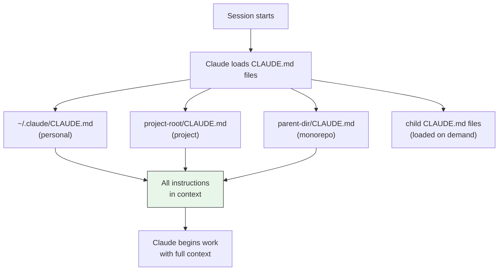
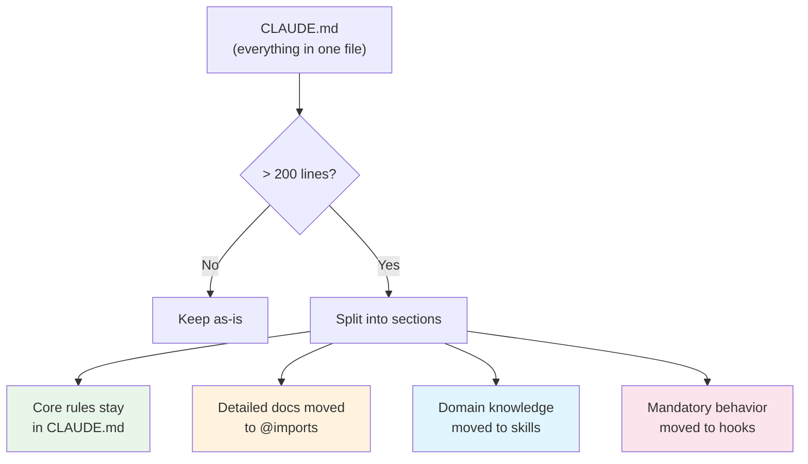
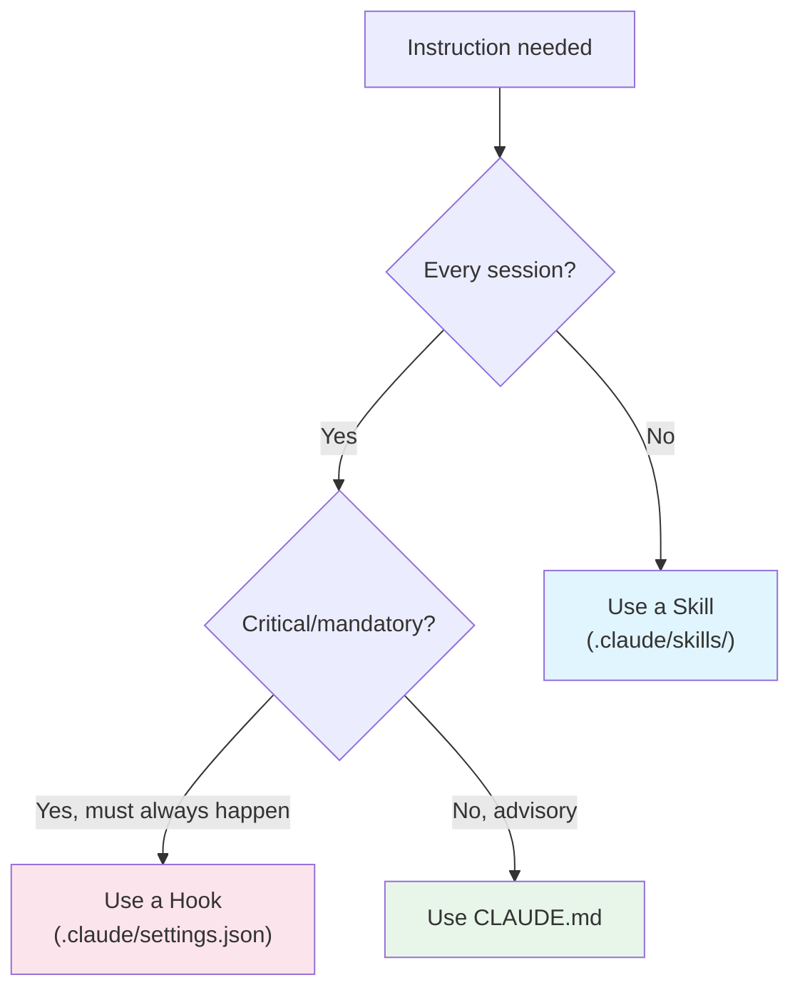

# Comprehensive CLAUDE.md Guide

> Everything you need to know about writing effective CLAUDE.md files: what to include, how to structure them, where to place them, and real-world examples.

---

## Table of Contents

1. [What is CLAUDE.md?](#what-is-claudemd)
2. [Why It Matters](#why-it-matters)
3. [File Placement & Hierarchy](#file-placement--hierarchy)
4. [Core Sections to Include](#core-sections-to-include)
5. [What NOT to Include](#what-not-to-include)
6. [Import System](#import-system)
7. [Emphasis & Priority](#emphasis--priority)
8. [Complete Examples](#complete-examples)
9. [CLAUDE.md for Different Project Types](#claudemd-for-different-project-types)
10. [Maintenance & Evolution](#maintenance--evolution)
11. [Debugging CLAUDE.md Issues](#debugging-claudemd-issues)
12. [Relationship to Skills and Rules](#relationship-to-skills-and-rules)
13. [Advanced Patterns](#advanced-patterns)

---

## What is CLAUDE.md?

CLAUDE.md is a special configuration file that Claude Code reads **at the start of every conversation**. It provides project-specific context, coding conventions, workflow instructions, and architectural knowledge that Claude cannot infer from code alone.

Think of it as the onboarding document for your AI pair programmer -- the same things you would tell a new team member on their first day.

### How It Works



---

## Why It Matters

### The Context Window Problem

Claude Code's context window holds your entire conversation: messages, file contents, command output. Performance degrades as this fills. CLAUDE.md front-loads the most important information so Claude has it from the start without needing to discover it.

### Compounding Engineering

This is Anthropic's internal term for a key practice: **every time Claude does something wrong, add a note to CLAUDE.md so it never makes that class of error again.** Each correction becomes permanent context, compounding over time.

Week 1: Claude uses CommonJS imports
You add: "Use ES modules (import/export), not CommonJS (require)"
Week 2: Claude forgets to run typecheck
You add: "IMPORTANT: Always run npm run typecheck after code changes"
Week 3: Claude creates massive PRs
You add: "Keep PRs under 400 lines of diff. Split larger changes."

After a few weeks, your CLAUDE.md captures the team's working knowledge in a way that benefits every engineer using Claude Code on the project.

### Why Not Just Use Comments?

| Approach | Pros | Cons |
|----------|------|------|
| Code comments | Close to the code | Only visible when Claude reads that file |
| README.md | Standard documentation | Not automatically loaded by Claude |
| CLAUDE.md | Always loaded, always in context | Consumes context budget every session |
| Skills | Loaded on demand | Not available unless invoked or matched |

CLAUDE.md is the only mechanism that guarantees Claude sees your instructions at the start of every session.

---

## File Placement & Hierarchy

### Locations (All Loaded Automatically)

| Location | Scope | Typical Use |
|----------|-------|-------------|
| `~/.claude/CLAUDE.md` | All sessions on your machine | Personal coding style, preferences |
| `./CLAUDE.md` (project root) | This project, all team members | Project conventions, commands |
| `./parent/CLAUDE.md` + `./parent/child/CLAUDE.md` | Monorepo setup | Shared + package-specific rules |
| `./.claude/CLAUDE.md` | Alternative project location | Same as root, different path |

### Loading Behavior

- **Root and parent CLAUDE.md**: Loaded at session start, always in context
- **Child directory CLAUDE.md**: Loaded **on demand** when Claude works with files in that directory
- **Personal CLAUDE.md**: Loaded at session start, applies to everything

### Monorepo Example

```
my-monorepo/
  CLAUDE.md                    # Shared conventions (loaded always)
  packages/
    frontend/
      CLAUDE.md                # React/Next.js specific (loaded on demand)
    backend/
      CLAUDE.md                # API specific (loaded on demand)
    shared/
      CLAUDE.md                # Shared library rules (loaded on demand)
```

**Root CLAUDE.md** (always loaded):
```markdown
# Monorepo Conventions

## Git
- Use conventional commits
- PRs must reference a ticket number
- All packages share the same version

## Common Commands
- `pnpm install` - Install all dependencies
- `pnpm build` - Build all packages
- `pnpm test` - Run all tests

## Architecture
- Monorepo managed with pnpm workspaces
- Shared types in packages/shared/
- All packages use TypeScript strict mode
```

**packages/frontend/CLAUDE.md** (loaded when working in frontend):
```markdown
# Frontend Package

## Stack
- Next.js 14 (App Router)
- Tailwind CSS
- React Server Components by default

## Commands
- `pnpm --filter frontend dev` - Start dev server
- `pnpm --filter frontend test` - Run frontend tests

## Conventions
- Use 'use client' only when hooks or browser APIs are needed
- All pages are Server Components unless marked otherwise
- Components in src/components/ use barrel exports
```

---

## Core Sections to Include

### 1. Project Overview (2-3 lines)

Keep it brief. Tell Claude what this project is so it can make informed decisions.

```markdown
# Project: InvoiceTracker
A SaaS invoicing tool for freelancers. Next.js frontend, tRPC API,
PostgreSQL database. Currently in beta with ~500 users.
```

### 2. Tech Stack

List technologies so Claude uses the right APIs and patterns.

```markdown
## Tech Stack
- Runtime: Node.js 20
- Language: TypeScript 5.4 (strict mode)
- Framework: Next.js 14.2 (App Router)
- Database: PostgreSQL 16 + Prisma 5.x
- Auth: NextAuth.js v5 with JWT
- Testing: Vitest (unit), Playwright (E2E)
- Styling: Tailwind CSS 3.4
- Package Manager: pnpm 9.x
```

### 3. Common Commands

The commands Claude needs to run. Only include non-obvious ones.

```markdown
## Commands
- `pnpm dev` - Start development server (port 3000)
- `pnpm build` - Production build
- `pnpm test` - Run unit tests
- `pnpm test:e2e` - Run E2E tests (requires dev server running)
- `pnpm typecheck` - TypeScript checking
- `pnpm lint` - ESLint + Prettier check
- `pnpm db:migrate` - Run pending migrations
- `pnpm db:generate` - Regenerate Prisma client
- `pnpm db:seed` - Seed development database
```

### 4. Code Style Rules

Only rules that **differ from defaults** or that Claude gets wrong.

```markdown
## Code Style
- Use ES modules (import/export), never CommonJS (require)
- Destructure imports: `import { useState } from 'react'`
- Use `type` for type-only imports: `import type { User } from './types'`
- Prefer named exports over default exports
- Use arrow functions for components, regular functions for utilities
- IMPORTANT: No barrel exports in src/lib/ (causes circular deps)
```

### 5. Architecture & Patterns

Point Claude to patterns in your codebase rather than explaining them abstractly.

```markdown
## Architecture
- Pages: src/app/ (Next.js App Router conventions)
- API: src/server/routers/ (tRPC routers, see userRouter.ts for pattern)
- Database: prisma/schema.prisma (source of truth for data model)
- Components: src/components/ (see Button.tsx for component pattern)
- Hooks: src/hooks/ (custom React hooks)
- Utils: src/lib/ (pure utility functions)
- Types: src/types/ (shared TypeScript types)

State management uses Zustand. See src/stores/useAuthStore.ts for pattern.
Server state uses tRPC + React Query. Never use raw fetch for API calls.
```

### 6. Testing Instructions

Tell Claude how you test and what to test.

```markdown
## Testing
- Unit tests: Vitest, colocated with source (`foo.ts` -> `foo.test.ts`)
- E2E tests: Playwright, in tests/e2e/
- Run single test: `pnpm vitest run src/lib/utils.test.ts`
- Run with coverage: `pnpm test -- --coverage`
- IMPORTANT: Run relevant tests after changes, not the full suite
- IMPORTANT: Avoid mocks unless testing external service boundaries
- Write tests for: new functions, bug fixes, edge cases
- Test naming: `should [expected behavior] when [condition]`
```

### 7. Git & PR Conventions

```markdown
## Git
- Branch naming: `feature/TICKET-description` or `fix/TICKET-description`
- Commit format: conventional commits (feat:, fix:, chore:, docs:, test:)
- PR descriptions must include:
  - ## Summary (1-3 bullet points)
  - ## Test Plan (how to verify the change)
- Keep PRs under 400 lines of diff; split larger changes
- Never force push to main
```

### 8. Environment & Configuration

```markdown
## Environment
- Copy .env.example to .env.local for development
- Required vars: DATABASE_URL, NEXTAUTH_SECRET, STRIPE_SECRET_KEY
- CI runs on Node 20 (not 22)
- Database migrations auto-run in CI but require manual `db:generate` locally
```

### 9. Gotchas & Common Mistakes

This is the most valuable section over time. Add entries whenever Claude (or anyone) makes a mistake.

```markdown
## Gotchas
- After modifying prisma/schema.prisma, ALWAYS run `pnpm db:generate`
- The `useUser()` hook only works in Client Components
- Rate limiting middleware uses Redis; tests need TEST_RATE_LIMIT=true
- The search endpoint has a 5-second timeout; paginate results > 100 items
- Stripe webhooks require raw body parsing; don't use JSON middleware on /api/webhooks/stripe
- The CI build fails silently on TypeScript errors; always run typecheck locally
```

### 10. References (Pointers, Not Copies)

Link to detailed docs rather than duplicating content.

```markdown
## References
See @README.md for project overview and setup instructions.
See @docs/architecture.md for detailed architecture documentation.
See @docs/api-conventions.md for API design patterns.
See @CONTRIBUTING.md for contribution guidelines.
```

---

## What NOT to Include

| Do Not Include | Why |
|----------------|-----|
| Standard language conventions | Claude already knows TypeScript, Python, etc. |
| Anything Claude can infer from code | Reading `package.json` tells Claude the framework |
| Long API documentation | Link to docs instead; copying wastes context |
| File-by-file descriptions | Claude can read the files directly |
| Frequently changing info | Becomes stale and misleading |
| Self-evident practices | "Write clean code" adds nothing |
| Detailed tutorials | Use skills or linked docs for teaching |
| Entire configuration files | Reference them with `@path/to/file` instead |

### The Litmus Test

For every line in your CLAUDE.md, ask:

> "Would removing this cause Claude to make mistakes?"

If not, remove it. A lean CLAUDE.md is more effective than a bloated one because important rules do not get lost in noise.

---

## Import System

CLAUDE.md supports importing other files with `@path/to/file` syntax:

```markdown
# CLAUDE.md

## Project Overview
See @README.md for what this project does.

## API Conventions
See @docs/api-conventions.md for REST API patterns.

## Testing
See @docs/testing-guide.md for comprehensive testing instructions.

## Git Workflow
See @docs/git-instructions.md for branching and PR conventions.

## Personal Overrides
See @~/.claude/my-project-instructions.md for personal preferences.
```

### Import Rules

- Imports can be **recursive** (referenced files can reference other files)
- Maximum depth: **5 levels** of recursion
- This solves the "one giant file" problem
- Keep CLAUDE.md lean; move detailed guidance into separate files

### Pattern: Hub and Spoke

```
CLAUDE.md (hub - short, high-level)
  @docs/code-style.md (spoke - detailed style rules)
  @docs/testing.md (spoke - testing patterns)
  @docs/architecture.md (spoke - architecture details)
  @docs/deployment.md (spoke - deployment process)
```

The hub stays under 200 lines. The spokes contain detailed guidance that Claude loads via the import system.

---

## Emphasis & Priority

Claude Code responds to emphasis markers. Use them to increase adherence to critical rules:

### Emphasis Levels

```markdown
# Standard (normal priority)
- Use conventional commits for all changes

# Emphasized (higher priority)
- IMPORTANT: Always run typecheck after code changes

# Strong emphasis (highest priority)
- YOU MUST never modify files in the migrations/ directory without explicit approval
- NEVER use `any` type in TypeScript; always provide proper types
- ALWAYS create a feature branch; never commit directly to main
```

### When to Use Emphasis

| Level | When to Use | Example |
|-------|-------------|---------|
| Standard | General preferences | "Prefer named exports" |
| IMPORTANT | Rules Claude sometimes forgets | "IMPORTANT: Run tests after changes" |
| NEVER/ALWAYS | Hard constraints | "NEVER commit .env files" |
| YOU MUST | Critical safety rules | "YOU MUST validate all user input" |

Use emphasis sparingly. If everything is IMPORTANT, nothing is.

---

## Complete Examples

### Example 1: Next.js SaaS Application

```markdown
# InvoiceTracker

A SaaS invoicing tool for freelancers. Next.js + tRPC + PostgreSQL.

## Commands
- `pnpm dev` - Development server (port 3000)
- `pnpm build` - Production build
- `pnpm test` - Unit tests (Vitest)
- `pnpm test:e2e` - E2E tests (Playwright, needs dev server)
- `pnpm typecheck` - TypeScript checking
- `pnpm db:migrate` - Run migrations
- `pnpm db:generate` - Regenerate Prisma client after schema changes

## Code Style
- ES modules only (import/export)
- Type-only imports: `import type { X } from './types'`
- Named exports, not default exports
- React Server Components by default; 'use client' only for hooks/browser APIs
- IMPORTANT: Always run typecheck after code changes

## Architecture
- Pages: src/app/ (App Router)
- API: src/server/routers/ (tRPC, see userRouter.ts for pattern)
- DB: prisma/schema.prisma
- Components: src/components/ (see Button.tsx for pattern)
- State: Zustand (see src/stores/)

## Testing
- Colocated tests: `foo.ts` -> `foo.test.ts`
- Run single: `pnpm vitest run path/to/test`
- IMPORTANT: Avoid mocks; test real behavior

## Git
- Branches: feature/TICKET-desc, fix/TICKET-desc
- Conventional commits required
- PRs need ## Summary and ## Test Plan

## Gotchas
- ALWAYS run `pnpm db:generate` after schema changes
- Rate limiter uses Redis; set TEST_RATE_LIMIT=true for tests
- Stripe webhooks need raw body; no JSON middleware on /api/webhooks/stripe
- CI runs Node 20, not 22

See @README.md for setup. See @docs/architecture.md for details.
```

### Example 2: Python FastAPI Microservice

```markdown
# UserService

FastAPI microservice handling user registration, auth, and profiles.
Part of a microservices architecture; communicates via RabbitMQ events.

## Commands
- `make dev` - Start with hot reload (uvicorn)
- `make test` - Run pytest
- `make test-cov` - Run with coverage report
- `make lint` - Ruff + mypy
- `make migrate` - Run Alembic migrations
- `make docker-up` - Start local dependencies (Postgres, Redis, RabbitMQ)

## Code Style
- Python 3.12+ features OK (match statements, type unions with |)
- Use Pydantic v2 models for all request/response schemas
- Async everywhere: all endpoints, all DB operations
- IMPORTANT: Always add type hints; mypy strict mode is enforced in CI

## Architecture
- Endpoints: src/api/routes/ (one file per resource)
- Services: src/services/ (business logic, see user_service.py for pattern)
- Models: src/models/ (SQLAlchemy 2.0 models)
- Schemas: src/schemas/ (Pydantic request/response)
- Events: src/events/ (RabbitMQ publishers/consumers)
- Config: src/core/config.py (Pydantic Settings)

## Testing
- Tests in tests/ mirror src/ structure
- Use pytest fixtures in conftest.py
- Database tests use transaction rollback (see conftest.py)
- NEVER mock the database; use the test database

## Gotchas
- Alembic autogenerate misses some changes; always review migration files
- RabbitMQ consumer must ack messages; unacked messages block the queue
- Rate limiting is per-service; check src/middleware/rate_limit.py
- Health check endpoint at /health must stay fast (no DB queries)

See @README.md for service overview. See @docs/events.md for event contracts.
```

### Example 3: Personal Global CLAUDE.md

```markdown
# Personal Defaults

## Preferences
- I prefer TypeScript over JavaScript
- I prefer functional patterns (map, filter, reduce) over imperative loops
- I prefer explicit types over inference for function signatures
- Keep things simple; avoid over-engineering

## Communication
- Be concise; I do not need lengthy explanations for straightforward changes
- When trade-offs exist, list them briefly and ask
- Show me the command to run; do not explain what a command does unless asked

## Git
- Conventional commits (feat:, fix:, chore:)
- Never force push to main
- Feature branches for everything

## When Uncertain
- Ask rather than guess
- If a decision seems important, explain options before proceeding
- If you are about to make a large change (>100 lines), outline it first
```

---

## CLAUDE.md for Different Project Types

### Rust Project

```markdown
## Commands
- `cargo build` - Compile
- `cargo test` - Run tests
- `cargo clippy` - Lint
- `cargo fmt -- --check` - Format check
- IMPORTANT: Run `cargo clippy` before committing; CI fails on warnings

## Style
- Use `thiserror` for library errors, `anyhow` for application errors
- Prefer `impl Into<T>` over concrete types in function signatures
- No unsafe code without a `SAFETY:` comment explaining why
```

### Go Project

```markdown
## Commands
- `go build ./...` - Build all
- `go test ./...` - Test all
- `go vet ./...` - Vet
- `golangci-lint run` - Lint

## Style
- Follow effective Go conventions
- Use table-driven tests
- Error wrapping: `fmt.Errorf("doing X: %w", err)`
- NEVER use `panic` except in init functions
```

### Mobile (React Native)

```markdown
## Commands
- `npx expo start` - Start Expo dev server
- `npx expo run:ios` - iOS simulator
- `npx expo run:android` - Android emulator
- `npm test` - Jest tests

## Style
- Use React Navigation for routing (see src/navigation/)
- Use Zustand for state (see src/stores/)
- StyleSheet.create for all styles (no inline styles)
- IMPORTANT: Test on both iOS and Android before marking PR ready
```

---

## Maintenance & Evolution

### Review Cadence

| Frequency | Action |
|-----------|--------|
| Every time Claude makes a mistake | Add a gotcha or rule |
| Weekly | Review and prune outdated rules |
| Monthly | Consolidate and reorganize sections |
| Quarterly | Major review; archive old patterns |

### Growth Management

When CLAUDE.md exceeds 200 lines:

1. **Move detailed guidance** to separate files and use `@imports`
2. **Move domain knowledge** to skills (loaded on demand, not every session)
3. **Convert mandatory behaviors** to hooks (deterministic, not advisory)
4. **Delete rules** that Claude follows without the instruction

### Migration Path



---

## Debugging CLAUDE.md Issues

### Claude Ignores a Rule

**Symptom:** Claude keeps doing something your CLAUDE.md says not to do.

**Possible causes:**
1. **File is too long.** Important rules get lost in noise. Prune aggressively.
2. **Rule is ambiguous.** Rephrase to be more specific and direct.
3. **Rule conflicts with another rule.** Check for contradictions.
4. **Not enough emphasis.** Add "IMPORTANT:" or "YOU MUST" prefix.

**Diagnostic:**
```
What does your CLAUDE.md say about [topic]?
```

If Claude cannot accurately recall the rule, the file is too long or the rule is buried.

### Claude Asks Questions Answered in CLAUDE.md

**Symptom:** Claude asks about conventions that are documented.

**Possible causes:**
1. **Phrasing is ambiguous.** The rule exists but Claude interprets it differently.
2. **Context compaction.** In long sessions, CLAUDE.md may have been compacted. Run `/compact` with instructions to preserve CLAUDE.md rules.

### Rules File Keeps Growing

**Symptom:** CLAUDE.md is 500+ lines and unwieldy.

**Fix:**
1. Run `/init` to generate a fresh baseline from code analysis
2. Diff the generated version against yours
3. Remove anything Claude got right without the instruction
4. Move detailed sections to separate files with `@imports`
5. Move workflow instructions to skills

---

## Relationship to Skills and Rules

### When to Use Each



| Mechanism | When to Use | Behavior |
|-----------|-------------|----------|
| **CLAUDE.md** | Applies broadly, every session | Advisory, always in context |
| **Skills** | Domain-specific, on-demand | Loaded when relevant or invoked |
| **Rules** (`.claude/rules/`) | Path-specific rules | Loaded when working in matching paths |
| **Hooks** | Must always happen, no exceptions | Deterministic, runs scripts |

### Moving Rules Out of CLAUDE.md

**Before (everything in CLAUDE.md):**
```markdown
## API Conventions
- Use kebab-case for URL paths
- Use camelCase for JSON properties
- Always include pagination for list endpoints
- Version APIs in the URL path (/v1/, /v2/)
- Return consistent error format...
[30 more lines of API rules]
```

**After (lean CLAUDE.md + skill):**

CLAUDE.md:
```markdown
## API
- See @docs/api-conventions.md for API patterns
- IMPORTANT: All new endpoints must follow the patterns in src/server/routers/userRouter.ts
```

`.claude/skills/api-conventions/SKILL.md`:
```yaml
---
name: api-conventions
description: REST API design conventions for our services. Load when writing API endpoints.
---
[Full 30 lines of API rules here]
```

The skill loads automatically when Claude is working on API code, but does not consume context during frontend work.

---

## Advanced Patterns

### Conditional Context with Rules

`.claude/rules/` files are loaded based on the paths Claude is working with:

```bash
mkdir -p .claude/rules

# Only loaded when working in test files
cat > .claude/rules/testing.md << 'EOF'
When writing tests in this project:
- Use describe/it blocks, not test()
- Always include a "should" in the test name
- Group related tests with nested describe blocks
- Use beforeEach for setup, not repeated code
EOF

# Only loaded when working in API routes
cat > .claude/rules/api.md << 'EOF'
When writing API routes:
- Always validate input with Zod schemas
- Return 400 for validation errors, 500 for unexpected errors
- Log all errors with request ID
- Include rate limiting on public endpoints
EOF
```

### Dynamic Context Injection

Skills can inject live data into the context:

```yaml
---
name: pr-context
description: Load current PR context
context: fork
---

## Current PR State
- Diff: !`git diff main...HEAD`
- Changed files: !`git diff main...HEAD --name-only`
- Recent commits: !`git log main..HEAD --oneline`

Analyze these changes and provide feedback.
```

The `` !`command` `` syntax runs before the skill content is sent to Claude, injecting live data.

### Team-Shared CLAUDE.md with Personal Overrides

```
project/CLAUDE.md          # Shared team conventions (in git)
~/.claude/CLAUDE.md        # Personal preferences (not in git)
```

Personal overrides load alongside project rules. Use personal CLAUDE.md for things like:
- Your preferred communication style
- Editor-specific preferences
- Personal workflow habits

### Auto-Generating CLAUDE.md

Use Claude itself to maintain the file:

```
Analyze this codebase and update CLAUDE.md with any new patterns,
commands, or conventions you can detect. Remove any rules that are
no longer accurate based on the current code.
```

Or use the built-in command:
```
/init
```

This analyzes your codebase and generates a starter CLAUDE.md based on detected patterns.

---

## Quick Reference

### Minimum Viable CLAUDE.md

If you do nothing else, include these three things:

```markdown
# [Project Name]

## Commands
- [build command]
- [test command]
- [lint command]

## Gotchas
- [Thing that wastes time if you don't know about it]
```

### Maximum Effective Size

- **Target**: Under 200 lines
- **Hard limit**: If over 300 lines, split into imports and skills
- **Pruning test**: Delete a rule, observe if Claude's behavior changes. If not, keep it deleted.

### Checklist

- [ ] Project overview (2-3 lines)
- [ ] Tech stack listed
- [ ] Build/test/lint commands
- [ ] Code style rules (only non-default ones)
- [ ] Architecture pointers (where to find patterns)
- [ ] Testing instructions
- [ ] Git conventions
- [ ] Gotchas section
- [ ] References with @imports
- [ ] Under 200 lines
- [ ] Checked into git

---

## Sources

- [Claude Code Best Practices - Official Docs](https://code.claude.com/docs/en/best-practices)
- [Using CLAUDE.md Files - Anthropic Blog](https://claude.com/blog/using-claude-md-files)
- [CLAUDE.md Best Practices - UX Planet](https://uxplanet.org/claude-md-best-practices-1ef4f861ce7c)
- [Writing a Good CLAUDE.md - HumanLayer](https://www.humanlayer.dev/blog/writing-a-good-claude-md)
- [50 Claude Code Tips and Best Practices - Builder.io](https://www.builder.io/blog/claude-code-tips-best-practices)
- [Claude Code Best Practice - GitHub](https://github.com/shanraisshan/claude-code-best-practice)
- [Claude Code Project Structure Best Practices - UX Planet](https://uxplanet.org/claude-code-project-structure-best-practices-5a9c3c97f121)
- [The Complete Guide to CLAUDE.md - AI Advances](https://ai.gopubby.com/the-complete-guide-to-claude-code-claude-md-743d4cbac757)
- [A Powerful Framework for Mastering Claude Code - Level Up Coding](https://levelup.gitconnected.com/a-powerful-framework-for-mastering-claude-code-533a4b19c600)
