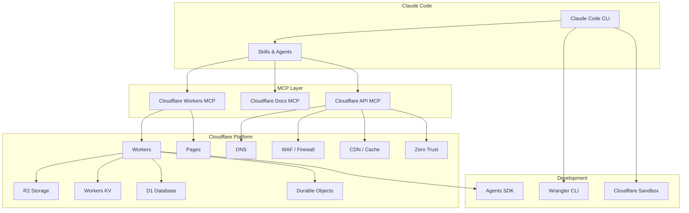
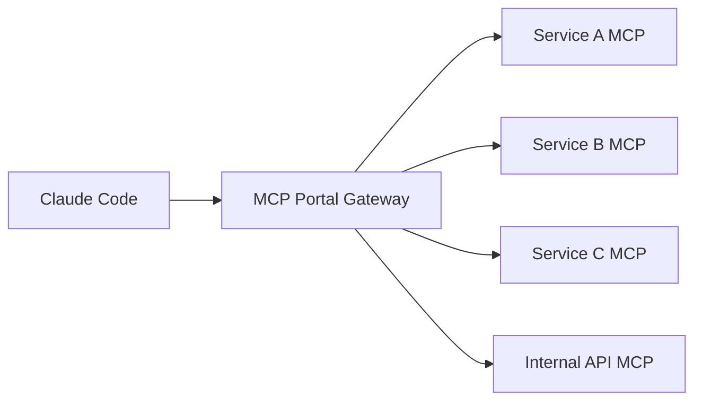

# Cloudflare Integration with Claude Code

## Overview

Claude Code integrates with Cloudflare through Workers MCP servers, the Cloudflare Agents SDK, and deployment tools. This enables AI-powered edge computing, DNS management, security configuration, and serverless application development directly from Claude Code.

## Architecture



## Quick Start

### Install Cloudflare MCP Servers

```bash
# Cloudflare Workers MCP (talk to your Workers from Claude)
claude mcp add cloudflare-workers \
  --transport stdio \
  -- npx -y @cloudflare/workers-mcp

# Cloudflare Docs MCP (access documentation)
claude mcp add cloudflare-docs \
  --transport stdio \
  -- npx -y @cloudflare/docs-mcp-server
```

### Configuration

```json
// .claude/mcp.json
{
  "mcpServers": {
    "cloudflare": {
      "command": "npx",
      "args": ["-y", "@cloudflare/workers-mcp"],
      "env": {
        "CLOUDFLARE_API_TOKEN": "your-api-token",
        "CLOUDFLARE_ACCOUNT_ID": "your-account-id"
      }
    },
    "cloudflare-docs": {
      "command": "npx",
      "args": ["-y", "@cloudflare/docs-mcp-server"]
    }
  }
}
```

### Authentication

```bash
# Create an API token at https://dash.cloudflare.com/profile/api-tokens
# Recommended permissions:
# - Workers Scripts: Edit
# - Workers Routes: Edit
# - DNS: Edit
# - Zone: Read
# - Page Rules: Edit

export CLOUDFLARE_API_TOKEN="your-token"
export CLOUDFLARE_ACCOUNT_ID="your-account-id"
```

## Key Capabilities

### Workers Development
- Generate Workers from natural language prompts
- Deploy Workers with `wrangler deploy`
- Build MCP servers that run on Workers
- Use Code Mode for token-efficient API interactions (99.9% reduction)

### Edge Deployment
- Deploy static sites to Cloudflare Pages
- Zero-config deployment from GitHub repos
- Automatic SSL/TLS certificates
- Global CDN distribution

### Building MCP Servers on Workers
Cloudflare Workers can host MCP servers, making any API accessible through Claude:

```typescript
// src/index.ts - MCP server on Cloudflare Workers
import { McpAgent } from "agents/mcp";
import { McpServer } from "@modelcontextprotocol/sdk/server/mcp.js";

export class MyMCPServer extends McpAgent {
  server = new McpServer({ name: "my-service", version: "1.0.0" });

  async init() {
    this.server.tool("get_data", "Fetch data from my service", {
      query: { type: "string", description: "Search query" }
    }, async ({ query }) => {
      const data = await fetchFromMyAPI(query);
      return { content: [{ type: "text", text: JSON.stringify(data) }] };
    });
  }
}
```

### Sandbox Execution
Run Claude Code in Cloudflare Sandbox for safe code execution:

```bash
# Run Claude Code in a sandboxed environment
npx @cloudflare/sandbox-cli run -- claude "Solve this GitHub issue"
```

## MCP Server Portal

Cloudflare MCP Server Portals compose multiple MCP servers behind a single gateway with unified auth and access control:



## File Index

- [skills.md](skills.md) - Cloudflare skills (Workers, DNS, security)
- [agents.md](agents.md) - Cloudflare agents
- [slash_commands.md](slash_commands.md) - Cloudflare slash commands
- [mcp_setup.md](mcp_setup.md) - Detailed MCP server setup guide

## Sources

- [Cloudflare Claude Connector](https://claude.com/connectors/cloudflare)
- [Cloudflare Code Mode Blog](https://blog.cloudflare.com/code-mode-mcp/)
- [Build MCP on Workers Blog](https://blog.cloudflare.com/model-context-protocol/)
- [Workers MCP GitHub](https://github.com/cloudflare/workers-mcp)
- [Cloudflare Sandbox + Claude Code](https://developers.cloudflare.com/sandbox/tutorials/claude-code/)
- [Claude Code Containers on Cloudflare](https://github.com/ghostwriternr/claude-code-containers)
