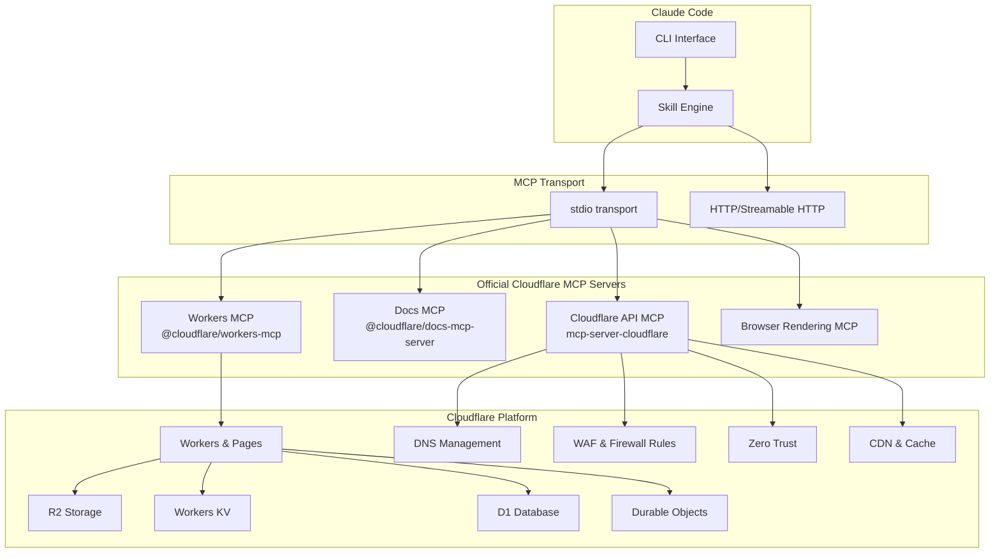

# Setting Up MCP Servers for Cloudflare

## Overview

The Model Context Protocol (MCP) connects Claude Code to Cloudflare's platform, enabling AI-powered Workers development, DNS management, security configuration, and edge deployment directly from your terminal. Cloudflare provides official MCP servers for Workers, documentation, and the full Cloudflare API.

## Architecture



## Prerequisites

```bash
# Verify requirements
node --version      # 18+
npx wrangler --version  # Wrangler CLI (recommended)
claude --version    # Latest
```

You also need:
- A Cloudflare account
- An API token with appropriate permissions

## Option 1: Cloudflare Workers MCP (Talk to Your Workers)

This server lets Claude Code communicate directly with your deployed Cloudflare Workers.

### Install via CLI

```bash
claude mcp add cloudflare-workers \
  --transport stdio \
  -- npx -y @cloudflare/workers-mcp
```

### Configuration File

```json
// .claude/mcp.json
{
  "mcpServers": {
    "cloudflare-workers": {
      "command": "npx",
      "args": ["-y", "@cloudflare/workers-mcp"],
      "env": {
        "CLOUDFLARE_API_TOKEN": "${CLOUDFLARE_API_TOKEN}",
        "CLOUDFLARE_ACCOUNT_ID": "${CLOUDFLARE_ACCOUNT_ID}"
      }
    }
  }
}
```

## Option 2: Cloudflare Documentation MCP

Access Cloudflare documentation from within Claude Code.

```bash
claude mcp add cloudflare-docs \
  --transport stdio \
  -- npx -y @cloudflare/docs-mcp-server
```

```json
// .claude/mcp.json (add alongside other servers)
{
  "mcpServers": {
    "cloudflare-docs": {
      "command": "npx",
      "args": ["-y", "@cloudflare/docs-mcp-server"]
    }
  }
}
```

No authentication required -- the docs server provides read-only access to public Cloudflare documentation.

## Option 3: Cloudflare API MCP Server (Full API Access)

Provides access to the entire Cloudflare API -- over 2,500 endpoints across DNS, Workers, R2, Zero Trust, and every other product -- through just two tools: `search()` and `execute()`.

### Install via CLI

```bash
claude mcp add cloudflare-api \
  --transport stdio \
  -- npx -y @cloudflare/mcp-server-cloudflare
```

### Configuration File

```json
{
  "mcpServers": {
    "cloudflare-api": {
      "command": "npx",
      "args": ["-y", "@cloudflare/mcp-server-cloudflare"],
      "env": {
        "CLOUDFLARE_API_TOKEN": "${CLOUDFLARE_API_TOKEN}",
        "CLOUDFLARE_ACCOUNT_ID": "${CLOUDFLARE_ACCOUNT_ID}"
      }
    }
  }
}
```

### Code Mode (Token-Efficient)

The Cloudflare API MCP server supports **Code Mode**, which reduces token usage by up to 99.9% for API interactions. Instead of sending full API specifications, it sends executable code snippets that Claude can run:

```json
{
  "mcpServers": {
    "cloudflare-api": {
      "command": "npx",
      "args": ["-y", "@cloudflare/mcp-server-cloudflare", "--code-mode"],
      "env": {
        "CLOUDFLARE_API_TOKEN": "${CLOUDFLARE_API_TOKEN}",
        "CLOUDFLARE_ACCOUNT_ID": "${CLOUDFLARE_ACCOUNT_ID}"
      }
    }
  }
}
```

## Option 4: Browser Rendering MCP

Use Cloudflare's browser rendering to take screenshots and interact with web pages:

```bash
claude mcp add cloudflare-browser \
  --transport stdio \
  -- npx -y @cloudflare/browser-rendering-mcp
```

## Recommended: Combined Setup

Install multiple Cloudflare MCP servers for full coverage:

```json
// .claude/mcp.json
{
  "mcpServers": {
    "cloudflare-api": {
      "command": "npx",
      "args": ["-y", "@cloudflare/mcp-server-cloudflare"],
      "env": {
        "CLOUDFLARE_API_TOKEN": "${CLOUDFLARE_API_TOKEN}",
        "CLOUDFLARE_ACCOUNT_ID": "${CLOUDFLARE_ACCOUNT_ID}"
      }
    },
    "cloudflare-docs": {
      "command": "npx",
      "args": ["-y", "@cloudflare/docs-mcp-server"]
    },
    "cloudflare-workers": {
      "command": "npx",
      "args": ["-y", "@cloudflare/workers-mcp"],
      "env": {
        "CLOUDFLARE_API_TOKEN": "${CLOUDFLARE_API_TOKEN}",
        "CLOUDFLARE_ACCOUNT_ID": "${CLOUDFLARE_ACCOUNT_ID}"
      }
    }
  }
}
```

---

## Authentication Setup

### Create an API Token

1. Go to https://dash.cloudflare.com/profile/api-tokens
2. Click "Create Token"
3. Choose a template or create custom:

### Recommended Token Permissions

| Permission | Access | Use Case |
|-----------|--------|----------|
| **Workers Scripts** | Edit | Deploy and manage Workers |
| **Workers Routes** | Edit | Configure Worker routes |
| **DNS** | Edit | Manage DNS records |
| **Zone** | Read | List and read zone settings |
| **Page Rules** | Edit | Manage page rules and redirects |
| **R2 Storage** | Edit | Manage R2 buckets and objects |
| **D1** | Edit | Manage D1 databases |
| **Firewall Services** | Edit | Manage WAF rules |
| **Zero Trust** | Read | Read Zero Trust configurations |

### Get Account ID

```bash
# From the Cloudflare dashboard URL
# https://dash.cloudflare.com/<account-id>/...

# Or via API
curl -s -H "Authorization: Bearer $CLOUDFLARE_API_TOKEN" \
  "https://api.cloudflare.com/client/v4/accounts" | jq '.result[0].id'
```

### Store Credentials Securely

```bash
# Shell profile
echo 'export CLOUDFLARE_API_TOKEN="your-api-token"' >> ~/.zshrc
echo 'export CLOUDFLARE_ACCOUNT_ID="your-account-id"' >> ~/.zshrc

# macOS Keychain
security add-generic-password -s "cloudflare-api" -a "$USER" -w "your-api-token"
export CLOUDFLARE_API_TOKEN=$(security find-generic-password -s "cloudflare-api" -w)
```

## MCP Server Tools

### Cloudflare API MCP (2 tools, 2,500+ endpoints)

| Tool | Description |
|------|-------------|
| `search` | Search the Cloudflare API for endpoints matching a query |
| `execute` | Execute any Cloudflare API endpoint with parameters |

### Workers MCP

| Tool | Description |
|------|-------------|
| `list_workers` | List deployed Workers |
| `get_worker_script` | Read Worker source code |
| `deploy_worker` | Deploy a Worker script |
| `get_worker_logs` | Fetch Worker execution logs |
| `list_kv_namespaces` | List KV namespaces |
| `kv_get` / `kv_put` | Read/write KV values |

### Building Your Own MCP Server on Workers

Cloudflare Workers can host custom MCP servers, making any internal API accessible through Claude:

```typescript
// src/index.ts - Custom MCP server on Workers
import { McpAgent } from "agents/mcp";
import { McpServer } from "@modelcontextprotocol/sdk/server/mcp.js";

export class MyMCPServer extends McpAgent {
  server = new McpServer({ name: "my-service", version: "1.0.0" });

  async init() {
    this.server.tool("get_data", "Fetch data from internal API", {
      query: { type: "string", description: "Search query" }
    }, async ({ query }) => {
      const data = await fetchFromInternalAPI(query);
      return { content: [{ type: "text", text: JSON.stringify(data) }] };
    });
  }
}
```

Deploy with:
```bash
npx wrangler deploy
```

Then connect to it:
```bash
claude mcp add my-service \
  --transport http \
  --url https://my-service.your-account.workers.dev/mcp
```

---

## Verification

After setup, verify the MCP servers are connected:

```bash
# List configured MCP servers
claude mcp list

# Test the API connection
claude "Use Cloudflare to list my DNS records for example.com"

# Test the docs connection
claude "Search Cloudflare docs for how to set up a D1 database"

# Check server health
/mcp
```

## Troubleshooting

| Issue | Solution |
|-------|----------|
| `401 Unauthorized` | Verify API token has not expired; check token permissions |
| `Account ID not found` | Ensure `CLOUDFLARE_ACCOUNT_ID` is set correctly |
| `Permission denied` | Check token has the required permission for the operation |
| `MCP server failed to start` | Check Node.js 18+; run the npx command standalone to see errors |
| `Worker not found` | Verify Worker name and that it is deployed to the correct account |
| `Rate limited` | Cloudflare API rate limits apply; wait and retry |
| `Code Mode errors` | Try without `--code-mode` flag to use standard mode |

## Sources

- [Cloudflare MCP Servers - Official Docs](https://developers.cloudflare.com/agents/model-context-protocol/mcp-servers-for-cloudflare/)
- [Build a Remote MCP Server on Workers](https://developers.cloudflare.com/agents/guides/remote-mcp-server/)
- [Workers MCP GitHub Repository](https://github.com/cloudflare/workers-mcp)
- [Cloudflare API MCP Server Repository](https://github.com/cloudflare/mcp-server-cloudflare)
- [Code Mode Blog Post](https://blog.cloudflare.com/code-mode-mcp/)
- [Build MCP on Workers Blog Post](https://blog.cloudflare.com/model-context-protocol/)
- [Claude Code MCP Documentation](https://code.claude.com/docs/en/mcp)
