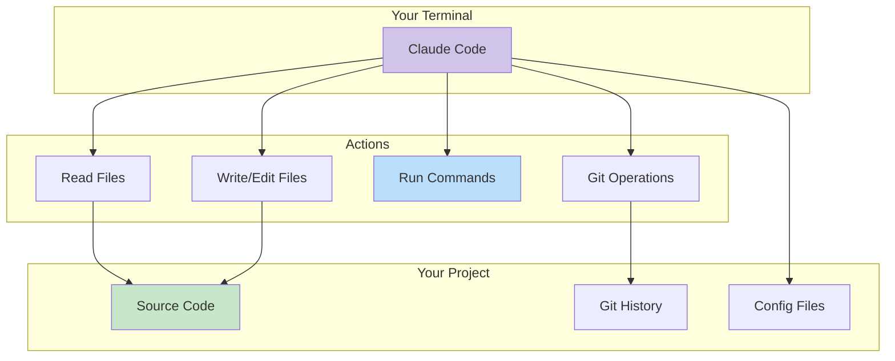
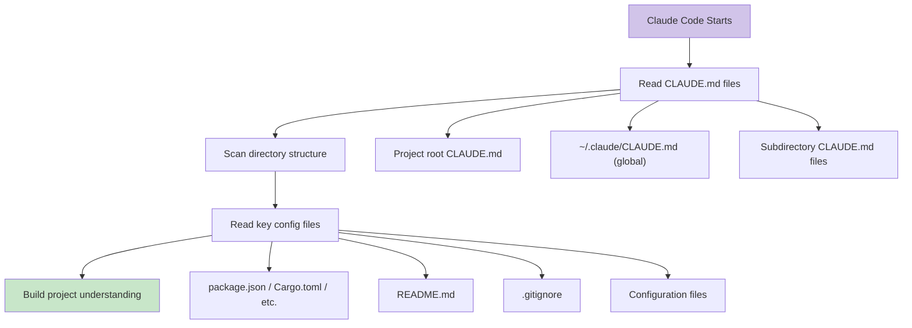

# Module 01: Getting Started with Claude Code

---

## Learning Objectives

By the end of this module, you will be able to:

- [ ] Install Claude Code on your system
- [ ] Authenticate with your Claude account
- [ ] Run basic commands and understand the output
- [ ] Use Plan Mode for complex tasks
- [ ] Navigate the Claude Code interface effectively
- [ ] Understand how Claude Code reads your project

---

## 1. What Is Claude Code?

Claude Code is an **agentic coding tool** that runs in your terminal. Unlike chat-based AI tools, it can:

- **Read your entire codebase** -- it scans files, understands structure, and tracks dependencies
- **Write and modify files** -- it creates, edits, and refactors code directly on disk
- **Run commands** -- it executes shell commands, runs tests, and manages builds
- **Manage git** -- it creates branches, commits, and even opens pull requests
- **Use external tools** -- through MCP servers, it can access databases, APIs, and cloud services



---

## 2. Installation

### Step 1: Verify Node.js

```bash
node --version
# Must be 18.0.0 or higher
```

If you need Node.js, install it:
- **macOS**: `brew install node` or download from [nodejs.org](https://nodejs.org)
- **Linux**: Use your package manager or [NodeSource](https://github.com/nodesource/distributions)
- **Windows**: Download from [nodejs.org](https://nodejs.org)

### Step 2: Install Claude Code

```bash
npm install -g @anthropic-ai/claude-code
```

### Step 3: Verify Installation

```bash
claude --version
```

### Step 4: First Launch

```bash
# Navigate to any project directory
cd your-project

# Launch Claude Code
claude
```

On first launch, Claude will open your browser to authenticate. Choose either:
- **Claude Pro** ($20/month) -- simplest setup, includes Claude Code access
- **API Key** -- more control over costs, pay per use

---

## 3. Your First Session

### The Welcome Experience

When you start Claude Code in a project directory, it:
1. Scans the directory structure
2. Reads key files (README, package.json, CLAUDE.md, etc.)
3. Builds an understanding of your project
4. Presents a prompt for your input

### Basic Commands

Try these in order:

**1. Ask about the project:**
```
What is this project and how is it structured?
```

Claude will analyze your files and give a structured summary.

**2. Ask about a specific file:**
```
Explain what src/index.js does
```

**3. Make a change:**
```
Add a comment at the top of README.md explaining this is a demo project
```

Claude will show you the proposed change and ask for confirmation before writing.

**4. Run a command:**
```
Run the tests and tell me if anything fails
```

**5. Search the codebase:**
```
Find all files that import the database module
```

### Understanding the Interface

```
╭──────────────────────────────────────────────╮
│ Claude Code                                   │
│                                               │
│ > Your prompt goes here                       │
│                                               │
│ Claude's response appears here, with:         │
│ - File contents (syntax highlighted)          │
│ - Proposed changes (diff format)              │
│ - Command outputs                             │
│ - Explanations                                │
│                                               │
│ [Accept] [Reject] [Edit] when changes shown   │
╰──────────────────────────────────────────────╯
```

### Key Keyboard Shortcuts

| Shortcut | Action |
|----------|--------|
| `Enter` | Send your message |
| `Ctrl+C` | Cancel current operation |
| `Ctrl+D` | Exit Claude Code |
| `/help` | Show available commands |
| `/plan` | Enter Plan Mode |
| `/clear` | Clear conversation history |

---

## 4. Plan Mode

Plan Mode is one of Claude Code's most powerful features. When you enter Plan Mode, Claude:
1. Analyzes the problem
2. Creates a step-by-step plan
3. Shows its reasoning
4. **Waits for your approval before executing anything**

### When to Use Plan Mode

- Complex changes that touch multiple files
- Refactoring existing code
- Adding new features with many moving parts
- When you want to understand the approach before committing

### How to Use Plan Mode

```
/plan

Add a user authentication system to this Express.js app.
It should support:
- Email/password registration
- Login with JWT tokens
- Password reset via email
- Protected route middleware
```

Claude will respond with something like:

```
Plan: Add User Authentication

Step 1: Install dependencies
  - bcrypt (password hashing)
  - jsonwebtoken (JWT)
  - nodemailer (email)

Step 2: Create User model (models/User.js)
  - Fields: email, passwordHash, resetToken, resetExpiry
  - Methods: comparePassword, generateResetToken

Step 3: Create auth middleware (middleware/auth.js)
  - Verify JWT from Authorization header
  - Attach user to request object

Step 4: Create auth routes (routes/auth.js)
  - POST /auth/register
  - POST /auth/login
  - POST /auth/forgot-password
  - POST /auth/reset-password

Step 5: Update app.js
  - Add auth routes
  - Apply middleware to protected routes

Step 6: Create email templates
  - Password reset email

Shall I proceed with this plan?
```

You can:
- **Approve**: "Yes, proceed"
- **Modify**: "Looks good but skip the email part for now"
- **Question**: "Why bcrypt instead of argon2?"

---

## 5. How Claude Reads Your Project

Understanding how Claude builds context helps you work with it effectively:



### Context Priority

1. **CLAUDE.md** (highest priority) -- your custom instructions
2. **Project structure** -- directory layout, file types
3. **Config files** -- dependencies, scripts, settings
4. **README** -- project description and documentation
5. **Source code** -- read on-demand as needed

### Tips for Better Context

- **Start Claude in the project root** -- it reads the structure from where you launch it
- **Write a CLAUDE.md** (covered in Module 02) -- the single most impactful thing you can do
- **Keep your project organized** -- Claude understands well-structured projects better
- **Name files descriptively** -- `userAuth.js` is better than `ua.js` for Claude's understanding

---

## 6. Common First-Session Commands

Here are prompts to try with any project:

| What You Want | What to Say |
|---------------|-------------|
| Understand the project | "What does this project do? Give me a tour." |
| Find a bug | "The login form doesn't submit. Help me find why." |
| Add a feature | "Add a dark mode toggle to the header." |
| Write tests | "Write tests for the User model." |
| Refactor code | "This function is too long. Break it into smaller functions." |
| Fix an error | "I get this error when I run npm start: [paste error]" |
| Code review | "Review src/api.js for bugs, security issues, and improvements." |
| Documentation | "Add JSDoc comments to all functions in src/utils.js" |
| Git operations | "Create a new branch called feature/dark-mode and commit the current changes." |

---

## 7. Try It Yourself

### Exercise 1: Project Explorer

1. Open Claude Code in any project (or create a new one)
2. Ask Claude to explain the project structure
3. Ask about a specific file
4. Ask Claude to find something in the codebase

### Exercise 2: Your First Change

1. Ask Claude to add a new file to your project
2. Review the proposed changes
3. Accept or modify the changes
4. Verify the file was created correctly

### Exercise 3: Plan Mode Practice

1. Enter Plan Mode with `/plan`
2. Describe a multi-step feature you'd like to add
3. Review Claude's plan
4. Modify the plan with feedback
5. Approve and watch Claude execute

---

## Quiz

**Q1: How do you enter Plan Mode in Claude Code?**

<details>
<summary>Answer</summary>

Type `/plan` before your request, or type `/plan` to enter Plan Mode and then describe your task. Plan Mode makes Claude create a detailed plan and wait for approval before executing any changes.

</details>

**Q2: What does Claude Code read when it first starts in a project?**

<details>
<summary>Answer</summary>

In order of priority: CLAUDE.md files (project root, home directory, and subdirectories), the directory structure, key config files (package.json, Cargo.toml, etc.), README.md, .gitignore, and other configuration files. Source code is read on-demand as needed.

</details>

**Q3: What's the difference between Claude Code and a regular AI chatbot for coding?**

<details>
<summary>Answer</summary>

Claude Code is agentic -- it can read your actual files, write changes to disk, run shell commands, and manage git operations directly. A regular chatbot can only see what you paste into the conversation and can only output text that you then copy-paste. Claude Code operates directly on your project.

</details>

---

## Next Module

Now that you can use Claude Code, let's make it truly understand your project. Continue to [Module 02: Mastering CLAUDE.md](02_claude_md.md).
