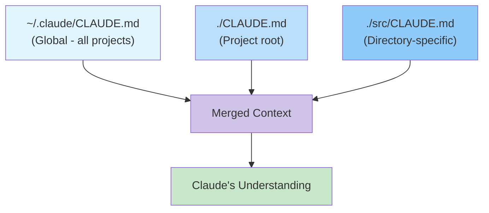

# Module 02: Mastering CLAUDE.md Files

---

## Learning Objectives

By the end of this module, you will be able to:

- [ ] Explain the purpose and priority hierarchy of CLAUDE.md files
- [ ] Write an effective project-level CLAUDE.md
- [ ] Create global and directory-level CLAUDE.md files
- [ ] Use CLAUDE.md to enforce coding standards and preferences
- [ ] Update CLAUDE.md iteratively as your project evolves

---

## 1. What Is CLAUDE.md?

CLAUDE.md is a special file that Claude Code reads automatically at the start of every session. Think of it as **persistent memory for Claude** -- it tells Claude about your project, your preferences, and your rules.

### Why It Matters

Without CLAUDE.md, Claude starts every session with zero context about your preferences. You'd need to repeat instructions like "Use TypeScript, not JavaScript" or "We use tabs, not spaces" every time.

With CLAUDE.md, Claude knows your project intimately from the first prompt.

### The Hierarchy



| Level | File Location | Purpose | Priority |
|-------|--------------|---------|----------|
| **Global** | `~/.claude/CLAUDE.md` | Personal preferences across all projects | Lowest |
| **Project** | `./CLAUDE.md` in project root | Project-specific context and rules | Medium |
| **Directory** | `./src/CLAUDE.md`, etc. | Module-specific instructions | Highest (most specific) |

When multiple CLAUDE.md files exist, they're all read and combined. More specific files override more general ones.

---

## 2. Writing Your Project CLAUDE.md

### The Essential Sections

A good CLAUDE.md has these sections:

```markdown
# Project: [Name]

## Description
[What this project is and who it's for]

## Tech Stack
[Languages, frameworks, libraries, tools]

## Project Structure
[Key directories and what they contain]

## Coding Standards
[Style, naming, patterns to follow]

## Commands
[How to build, test, run, deploy]

## Rules
[Things Claude must always or never do]
```

### A Complete Example

```markdown
# Project: TaskFlow API

## Description
A REST API for a task management application. Used by the TaskFlow
web app and mobile app. Serves ~5,000 daily active users.

## Tech Stack
- Language: TypeScript 5.x (strict mode)
- Runtime: Node.js 20
- Framework: Express.js 4
- Database: PostgreSQL 15 via Prisma ORM
- Testing: Jest + Supertest
- Linting: ESLint with @typescript-eslint
- Package manager: pnpm

## Project Structure
- src/
  - routes/       # Express route handlers (one file per resource)
  - services/     # Business logic (one file per domain)
  - models/       # Prisma schema and generated types
  - middleware/    # Express middleware (auth, validation, errors)
  - utils/        # Helper functions
  - types/        # Shared TypeScript types
- tests/
  - unit/         # Unit tests (mirror src/ structure)
  - integration/  # API integration tests
  - fixtures/     # Test data
- prisma/
  - schema.prisma # Database schema
  - migrations/   # Database migrations

## Coding Standards
- Use `async/await`, never raw Promises or callbacks
- All functions must have explicit return types
- Use named exports, not default exports
- Error handling: throw custom errors from services, catch in middleware
- Naming: camelCase for variables/functions, PascalCase for types/classes
- Max function length: 30 lines (refactor if longer)
- All business logic goes in services/, never in routes/

## Commands
- `pnpm dev` -- Start dev server with hot reload
- `pnpm test` -- Run all tests
- `pnpm test:unit` -- Run unit tests only
- `pnpm test:integration` -- Run integration tests
- `pnpm lint` -- Run ESLint
- `pnpm build` -- Build for production
- `pnpm db:migrate` -- Run pending migrations
- `pnpm db:seed` -- Seed the database

## Rules
- ALWAYS run `pnpm lint` before committing
- ALWAYS write tests for new functions (aim for >80% coverage)
- NEVER store secrets in code -- use environment variables
- NEVER modify migration files after they've been applied
- When adding a new route, also add it to the OpenAPI spec in docs/api.yaml
- Prefer Prisma queries over raw SQL unless there's a performance reason
- When creating a new service, follow the pattern in src/services/taskService.ts
```

---

## 3. Global CLAUDE.md

Your global CLAUDE.md applies to all projects. Put personal preferences here:

```bash
# Create the global config directory
mkdir -p ~/.claude

# Create your global CLAUDE.md
```

### Example Global CLAUDE.md

```markdown
# Global Preferences

## Communication Style
- Be concise. Don't explain things I didn't ask about.
- Show code changes as diffs when possible.
- When I say "fix it", check the most recent error and fix it.

## Coding Preferences
- I prefer functional programming patterns over OOP
- Use const by default, let only when reassignment is needed
- Always use strict equality (=== not ==)
- Prefer template literals over string concatenation
- Use meaningful variable names -- no single-letter variables except in loops

## Git Preferences
- Use conventional commits (feat:, fix:, chore:, docs:, refactor:)
- Keep commits atomic -- one logical change per commit
- Always run tests before committing

## Don't
- Don't add comments that just restate what the code does
- Don't use console.log for debugging -- use a proper logger
- Don't create files I didn't ask for
```

---

## 4. Directory-Level CLAUDE.md

Use these for specific parts of your codebase:

### Example: `src/api/CLAUDE.md`

```markdown
# API Routes

All files in this directory are Express route handlers.

## Pattern to Follow
Every route file must:
1. Import the corresponding service
2. Validate input with zod schemas
3. Call the service function
4. Return a consistent response format: { data, error, meta }

## Example
See taskRoutes.ts for the canonical example.

## Response Format
Always use this structure:
- Success: { data: <result>, error: null, meta: { page, total } }
- Error: { data: null, error: { code, message }, meta: null }
```

### Example: `tests/CLAUDE.md`

```markdown
# Test Files

## Conventions
- Test files mirror the source structure: tests/unit/services/taskService.test.ts
- Use descriptive test names: "should return 404 when task not found"
- Group related tests with describe blocks
- Each test should be independent -- no shared mutable state
- Use fixtures from tests/fixtures/ for test data

## Running
- `pnpm test` runs everything
- `pnpm test -- --watch` for watch mode during development
- `pnpm test -- path/to/file` to run specific tests
```

---

## 5. Advanced CLAUDE.md Patterns

### Pattern 1: Dynamic Instructions Based on Context

```markdown
## Conditional Rules
- If modifying database-related code: always generate a migration
- If adding a new API endpoint: update the OpenAPI spec
- If changing authentication logic: flag it for security review
- If the task involves frontend: remember we use React 18 + Tailwind
```

### Pattern 2: Error-Prevention Rules

```markdown
## Common Mistakes to Avoid
- The `users` table has a unique constraint on email -- handle duplicates
- The payment service times out after 5s -- always add a timeout handler
- The search endpoint is rate-limited to 10 req/min -- cache results
- Don't use `any` type in TypeScript -- find the correct type or create one
```

### Pattern 3: Architecture Decision Records

```markdown
## Architecture Decisions
- We use Prisma instead of TypeORM because of better TypeScript support
- We use JWT (not sessions) because the mobile app needs stateless auth
- We use pnpm (not npm/yarn) for faster installs and strict dependency resolution
- PostgreSQL was chosen over MongoDB because our data is highly relational
```

### Pattern 4: Workflow Instructions

```markdown
## When Adding a New Feature
1. Create a branch: `feat/feature-name`
2. Add types first (in src/types/)
3. Implement the service (in src/services/)
4. Add route handlers (in src/routes/)
5. Write tests (unit + integration)
6. Update API docs (docs/api.yaml)
7. Run linter and tests
8. Commit with conventional commit message
```

---

## 6. Maintaining CLAUDE.md Over Time

CLAUDE.md should evolve with your project:

### When to Update

- **New technology added** -- update the Tech Stack section
- **New convention established** -- add to Coding Standards
- **Common mistake discovered** -- add to the avoidance list
- **Structure changed** -- update the Project Structure section
- **New team member patterns** -- capture what you keep telling Claude

### You Can Ask Claude to Update It

```
We just added Redis caching. Update CLAUDE.md to reflect this:
- Add Redis to the tech stack
- Add the REDIS_URL environment variable to the env section
- Add caching guidelines (cache for 5 minutes by default, invalidate on write)
```

---

## 7. Try It Yourself

### Exercise 1: Write a CLAUDE.md from Scratch

1. Pick any project you have (or create a new one)
2. Write a CLAUDE.md with all essential sections
3. Start Claude Code and ask: "Based on my CLAUDE.md, summarize what you know about this project"
4. Note anything Claude missed or misunderstood
5. Refine the CLAUDE.md

### Exercise 2: Create a Global CLAUDE.md

1. Create `~/.claude/CLAUDE.md`
2. Add your personal coding preferences
3. Start Claude Code in a project and verify it picks up your global preferences

### Exercise 3: Test the Hierarchy

1. Put one instruction in your global CLAUDE.md (e.g., "Use 2-space indentation")
2. Put a conflicting instruction in your project CLAUDE.md (e.g., "Use 4-space indentation")
3. Ask Claude to create a file and observe which rule it follows
4. The project-level rule should win

---

## Quiz

**Q1: What is the priority order for CLAUDE.md files?**

<details>
<summary>Answer</summary>

From lowest to highest priority:
1. Global (`~/.claude/CLAUDE.md`) -- lowest priority
2. Project root (`./CLAUDE.md`) -- medium priority
3. Directory-specific (`./src/CLAUDE.md`, etc.) -- highest priority

More specific files override more general ones when there are conflicts.

</details>

**Q2: What are the essential sections of a project CLAUDE.md?**

<details>
<summary>Answer</summary>

Description, Tech Stack, Project Structure, Coding Standards, Commands (build/test/run), and Rules (must do / must not do). Additional useful sections include Architecture Decisions, Common Mistakes, and Workflow Instructions.

</details>

**Q3: Why should you include common commands in CLAUDE.md?**

<details>
<summary>Answer</summary>

When Claude knows your project's commands (how to build, test, run, lint), it can run them automatically after making changes. For example, after modifying code, it can run `pnpm lint` and `pnpm test` to verify nothing broke, without you having to ask.

</details>

**Q4: When should you update CLAUDE.md?**

<details>
<summary>Answer</summary>

When new technology is added, new conventions are established, common mistakes are discovered, the project structure changes, or you find yourself repeatedly telling Claude the same thing. You can also ask Claude to update it for you.

</details>

---

## Next Module

Extend Claude with custom capabilities. Continue to [Module 03: Skills, Agents, and Slash Commands](03_skills_agents.md).
