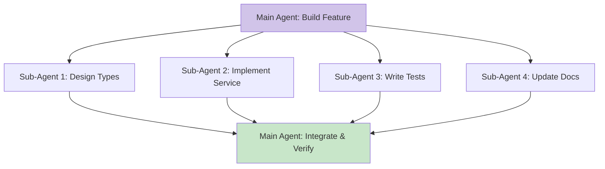

# Module 03: Skills, Agents, and Slash Commands

---

## Learning Objectives

By the end of this module, you will be able to:

- [ ] Create custom slash commands for repetitive tasks
- [ ] Build reusable skills that Claude can invoke
- [ ] Design agent workflows for complex multi-step tasks
- [ ] Organize and manage your custom commands
- [ ] Share skills and commands across projects

---

## 1. Custom Slash Commands

Slash commands are shortcuts for common prompts. Instead of typing the same long instruction every time, create a command.

### Where Commands Live

```
.claude/
  commands/
    review.md        # /project:review
    test.md          # /project:test
    deploy.md        # /project:deploy
~/.claude/
  commands/
    commit.md        # /user:commit (global, all projects)
    explain.md       # /user:explain
```

| Location | Prefix | Scope |
|----------|--------|-------|
| `.claude/commands/` | `/project:` | This project only |
| `~/.claude/commands/` | `/user:` | All projects |

### Creating a Slash Command

Each command is a Markdown file whose contents become the prompt when invoked.

**Example: `.claude/commands/review.md`**

```markdown
Review the code changes in the current git diff. For each changed file:

1. Check for bugs or logic errors
2. Check for security vulnerabilities
3. Check for performance issues
4. Verify it follows our coding standards (see CLAUDE.md)
5. Suggest improvements

Format the review as:
- File: [filename]
  - [severity] [issue description]
  - [severity] [suggestion]

Severities: CRITICAL, WARNING, INFO
```

**Usage:** Type `/project:review` in Claude Code.

**Example: `~/.claude/commands/commit.md`**

```markdown
Look at the current git diff (staged and unstaged changes). Create a commit with:

1. A conventional commit message (feat:, fix:, chore:, etc.)
2. A clear, concise description of what changed and why
3. Stage all relevant files (but not .env or other sensitive files)

Show me the proposed commit message before committing.
```

**Usage:** Type `/user:commit` in any project.

### Commands with Arguments

Commands can reference `$ARGUMENTS` to accept input:

**Example: `.claude/commands/test-for.md`**

```markdown
Write comprehensive tests for $ARGUMENTS.

Include:
- Happy path tests
- Edge cases
- Error handling
- At least 5 test cases

Follow the testing patterns in our tests/ directory.
Run the tests after writing them and fix any failures.
```

**Usage:** `/project:test-for src/services/userService.ts`

---

## 2. Building Skills

Skills are more structured than slash commands. They combine instructions, context, and patterns into reusable capabilities.

### Skill File Structure

Create skills as detailed Markdown files in `.claude/commands/` or a dedicated skills directory referenced in CLAUDE.md:

**Example: `.claude/commands/api-endpoint.md`**

```markdown
Create a new API endpoint based on these specifications: $ARGUMENTS

Follow this exact process:

## Step 1: Type Definition
Create or update types in `src/types/` for the request and response:
- Request type with validation schema (using zod)
- Response type matching our standard format: { data, error, meta }

## Step 2: Service Layer
Create the business logic in `src/services/`:
- Function name: descriptive verb + noun (e.g., createTask, getUserById)
- Handle all error cases with custom error classes
- Add JSDoc comments

## Step 3: Route Handler
Create the route handler in `src/routes/`:
- Use the validation middleware for request validation
- Call the service function
- Transform the response to standard format

## Step 4: Tests
Create tests in `tests/`:
- Unit tests for the service function
- Integration tests for the route handler
- Test both success and error cases

## Step 5: Documentation
Update `docs/api.yaml` with the new endpoint specification.

## Step 6: Verify
Run `pnpm lint` and `pnpm test` to verify everything works.
```

**Usage:** `/project:api-endpoint POST /api/tasks - Create a new task with title, description, and due date`

---

## 3. Agent Workflows

Agents are multi-step workflows where Claude operates autonomously across several tasks. You can design agent patterns that Claude follows for complex work.

### The Sub-Agent Pattern

Claude Code can spawn sub-agents using the `Task` tool to handle focused sub-tasks:



### Designing Agent Workflows

**Example: Feature Development Agent**

Create `.claude/commands/build-feature.md`:

```markdown
Build the feature described in: $ARGUMENTS

Follow this agent workflow:

### Phase 1: Planning
- Read the feature description
- Identify affected files and components
- Create a step-by-step implementation plan
- Present the plan for my approval before proceeding

### Phase 2: Implementation
For each component in the plan:
1. Implement the changes
2. Run linting after each file change
3. If lint fails, fix before continuing

### Phase 3: Testing
1. Write unit tests for all new functions
2. Write integration tests for new endpoints or workflows
3. Run the full test suite
4. Fix any failures

### Phase 4: Quality Check
1. Run `pnpm lint`
2. Review all changes for:
   - Consistent naming
   - Error handling coverage
   - TypeScript strict mode compliance
3. Check that no TODO or FIXME comments were left

### Phase 5: Git
1. Stage all relevant files
2. Create a conventional commit with a clear message
3. Show me a summary of everything that was done

If at any point something is unclear or a decision needs to be made,
stop and ask me rather than guessing.
```

### The Review Agent

Create `.claude/commands/full-review.md`:

```markdown
Perform a comprehensive review of all changes since the last commit.

### Security Review
- Check for hardcoded secrets
- Check for SQL injection vulnerabilities
- Check for XSS vulnerabilities
- Check for insecure deserialization
- Verify authentication/authorization checks

### Performance Review
- Check for N+1 query patterns
- Check for unnecessary database calls
- Check for missing indexes (based on query patterns)
- Check for memory leaks (unclosed resources)

### Code Quality Review
- Verify TypeScript types are correct and complete
- Check for code duplication
- Verify error handling is comprehensive
- Check function length (flag anything >30 lines)
- Verify naming conventions

### Test Coverage Review
- Check that new functions have tests
- Check that error paths are tested
- Verify test assertions are meaningful

Present findings grouped by severity (CRITICAL, WARNING, INFO)
with specific file locations and suggested fixes.
```

---

## 4. Organizing Your Commands

### Recommended Structure

```
.claude/
  commands/
    # Development
    build-feature.md    # /project:build-feature
    api-endpoint.md     # /project:api-endpoint
    component.md        # /project:component

    # Quality
    review.md           # /project:review
    full-review.md      # /project:full-review
    test-for.md         # /project:test-for

    # Git
    pr.md               # /project:pr
    changelog.md        # /project:changelog

    # Ops
    deploy.md           # /project:deploy
    status.md           # /project:status
```

### Naming Conventions

| Pattern | Example | When to Use |
|---------|---------|-------------|
| Verb | `review`, `deploy`, `test` | Single-action commands |
| Verb-noun | `build-feature`, `test-for` | Commands that take a target |
| Noun | `status`, `changelog` | Informational commands |

---

## 5. Sharing Commands Across Projects

### Method 1: Git Submodule

```bash
# Create a shared commands repo
git init shared-claude-commands

# Add it as a submodule to projects
cd your-project
git submodule add https://github.com/you/shared-claude-commands .claude/shared-commands
```

Reference in CLAUDE.md:
```markdown
## Shared Commands
Additional commands are available in `.claude/shared-commands/`.
```

### Method 2: Global Commands

Put universally useful commands in `~/.claude/commands/`:

```bash
~/.claude/commands/
  commit.md          # Smart git commits
  explain.md         # Explain code in detail
  refactor.md        # Guided refactoring
  security-check.md  # Quick security audit
```

### Method 3: Template Repository

Create a template repo with your standard `.claude/` directory:

```bash
# Use as template when starting new projects
gh repo create my-new-project --template my-claude-template
```

---

## 6. Try It Yourself

### Exercise 1: Create Your First Slash Command

1. Create the `.claude/commands/` directory in a project
2. Create a `review.md` command that reviews git changes
3. Make some code changes
4. Run `/project:review` and evaluate the output
5. Refine the command based on the results

### Exercise 2: Build a Skill

1. Create a command for a repetitive task in your project
   (e.g., creating a new React component, adding an API endpoint)
2. Include step-by-step instructions with your project's patterns
3. Test it with a real task
4. Iterate on the instructions

### Exercise 3: Design an Agent Workflow

1. Identify a complex task that has multiple phases
2. Create a command that breaks it into phases
3. Include checkpoints where Claude should ask for approval
4. Test the full workflow

---

## Quiz

**Q1: What is the difference between a `/project:` command and a `/user:` command?**

<details>
<summary>Answer</summary>

`/project:` commands live in `.claude/commands/` within a specific project and are only available in that project. `/user:` commands live in `~/.claude/commands/` and are available in all projects. Use project commands for project-specific workflows and user commands for personal preferences that apply everywhere.

</details>

**Q2: How do slash commands accept arguments?**

<details>
<summary>Answer</summary>

Use `$ARGUMENTS` in the command's Markdown file. Whatever text the user types after the command name gets substituted in. For example, if the command file contains "Write tests for $ARGUMENTS" and the user types `/project:test-for src/auth.ts`, Claude receives "Write tests for src/auth.ts".

</details>

**Q3: What should an agent workflow include that a simple command doesn't?**

<details>
<summary>Answer</summary>

Agent workflows should include multiple phases with clear boundaries, verification steps between phases (lint, test), checkpoints where Claude stops and asks for human approval, error handling instructions (what to do if a step fails), and a final summary of everything that was done. Simple commands are fire-and-forget; agent workflows are multi-step processes with human oversight.

</details>

---

## Next Module

Connect Claude to external tools and services. Continue to [Module 04: MCP Servers Deep Dive](04_mcp_servers.md).
