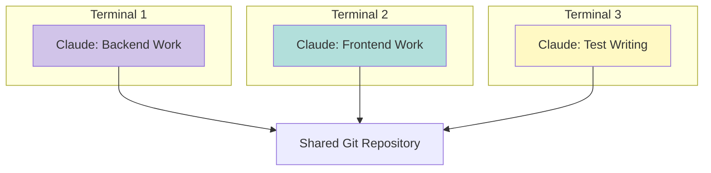
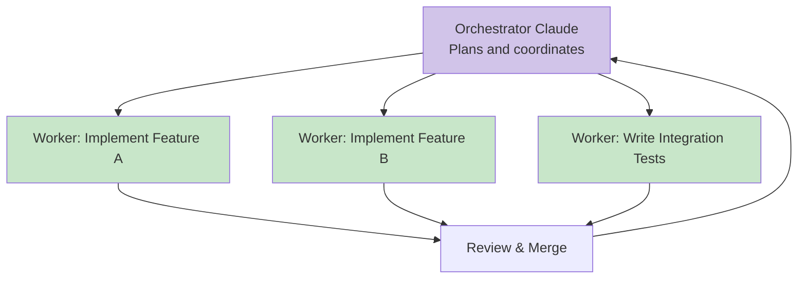
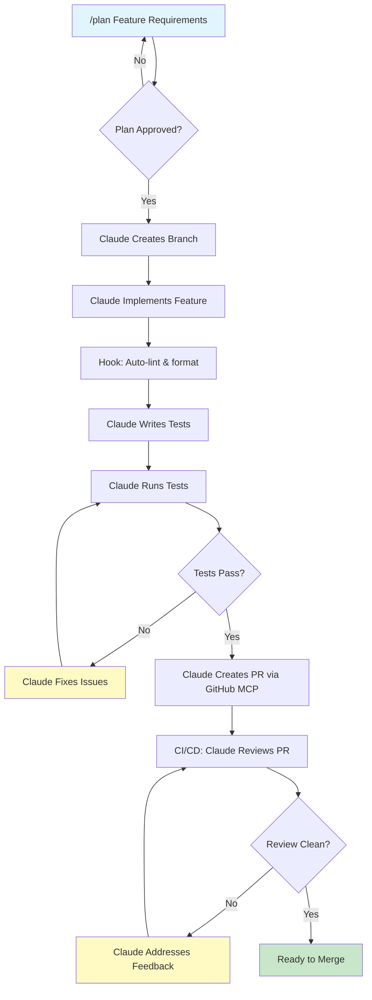

# Module 05: Advanced Usage -- Hooks, Remote Access, and Multi-Agent Patterns

---

## Learning Objectives

By the end of this module, you will be able to:

- [ ] Create hooks for automated quality gates
- [ ] Run Claude Code in CI/CD pipelines
- [ ] Use Claude Code for remote and headless operations
- [ ] Design multi-agent workflows for complex projects
- [ ] Optimize Claude Code performance and cost

---

## 1. Hooks

Hooks are scripts that run automatically at specific points in Claude Code's workflow. They let you enforce rules and automate quality checks.

### Hook Types

| Hook | When It Runs | Use Case |
|------|-------------|----------|
| **PreToolUse** | Before Claude uses a tool (file write, command) | Block dangerous operations |
| **PostToolUse** | After Claude uses a tool | Auto-lint, auto-format |
| **Notification** | When specific events occur | Logging, alerts |

### Configuring Hooks

Hooks are configured in `.claude/settings.json`:

```json
{
  "hooks": {
    "PreToolUse": [
      {
        "matcher": "Write|Edit",
        "command": "node .claude/hooks/pre-write-check.js"
      }
    ],
    "PostToolUse": [
      {
        "matcher": "Write|Edit",
        "command": "npx eslint --fix ${file}"
      }
    ]
  }
}
```

### Example: Pre-Write Safety Hook

Prevent Claude from writing to protected files:

```javascript
// .claude/hooks/pre-write-check.js
const input = JSON.parse(require("fs").readFileSync("/dev/stdin", "utf8"));
const protectedPaths = [
  ".env",
  ".env.local",
  "prisma/migrations/",
  "package-lock.json",
];

const filePath = input.tool_input?.file_path || "";
const blocked = protectedPaths.some((p) => filePath.includes(p));

if (blocked) {
  console.log(
    JSON.stringify({
      decision: "block",
      reason: `Writing to ${filePath} is blocked by safety hook. This file is protected.`,
    })
  );
} else {
  console.log(JSON.stringify({ decision: "allow" }));
}
```

### Example: Post-Write Auto-Format

Automatically format files after Claude writes them:

```json
{
  "hooks": {
    "PostToolUse": [
      {
        "matcher": "Write|Edit",
        "command": "npx prettier --write ${file} 2>/dev/null; exit 0"
      }
    ]
  }
}
```

### Example: Notification Hook

Log all Claude operations:

```json
{
  "hooks": {
    "PostToolUse": [
      {
        "matcher": ".*",
        "command": "echo \"$(date -u +%Y-%m-%dT%H:%M:%SZ) ${tool_name} ${file}\" >> .claude/activity.log"
      }
    ]
  }
}
```

---

## 2. Claude Code in CI/CD

Run Claude Code as part of your automated pipelines.

### Use Cases

| Use Case | When |
|----------|------|
| **Automated code review** | On every PR |
| **Test generation** | When new code lacks tests |
| **Documentation update** | When APIs change |
| **Migration generation** | When schema changes are detected |
| **Dependency updates** | Scheduled weekly/monthly |

### GitHub Actions Example: Automated PR Review

```yaml
# .github/workflows/claude-review.yml
name: Claude Code Review

on:
  pull_request:
    types: [opened, synchronize]

jobs:
  review:
    runs-on: ubuntu-latest
    steps:
      - uses: actions/checkout@v4
        with:
          fetch-depth: 0

      - uses: actions/setup-node@v4
        with:
          node-version: '20'

      - name: Install Claude Code
        run: npm install -g @anthropic-ai/claude-code

      - name: Run Claude Review
        env:
          ANTHROPIC_API_KEY: ${{ secrets.ANTHROPIC_API_KEY }}
        run: |
          claude --print "Review the changes in this PR. \
            Check for bugs, security issues, and style violations. \
            Output your review as a GitHub-flavored markdown comment." \
            > review.md

      - name: Post Review Comment
        uses: actions/github-script@v7
        with:
          script: |
            const fs = require('fs');
            const review = fs.readFileSync('review.md', 'utf8');
            await github.rest.issues.createComment({
              owner: context.repo.owner,
              repo: context.repo.repo,
              issue_number: context.issue.number,
              body: review,
            });
```

### Headless Mode

For CI/CD, Claude Code runs in non-interactive mode:

```bash
# Single prompt, print result, exit
claude --print "Explain what this project does"

# Pipe input
echo "Fix all TypeScript errors in src/" | claude --print

# With specific files as context
claude --print "Review this file for security issues" < src/auth.ts
```

---

## 3. Remote and Headless Usage

### SSH Tunneling

Run Claude Code on a remote server:

```bash
# SSH into your development server
ssh dev-server

# Run Claude Code there (it uses the remote filesystem)
claude
```

### Docker Container

Run Claude Code in a container for isolated environments:

```dockerfile
FROM node:20-slim
RUN npm install -g @anthropic-ai/claude-code
WORKDIR /workspace
COPY . .
CMD ["claude"]
```

### Tmux / Screen for Long-Running Sessions

```bash
# Start a tmux session
tmux new -s claude-session

# Run Claude Code
cd /your/project
claude

# Detach: Ctrl+B, then D
# Reattach later: tmux attach -t claude-session
```

---

## 4. Multi-Agent Patterns

For complex projects, use multiple Claude Code instances working together.

### Pattern 1: Parallel Specialists

Run separate Claude instances for different aspects of your project:



**Setup:**
```bash
# Terminal 1: Backend
cd my-project
claude
# "Focus on the backend API in src/api/. Don't modify frontend files."

# Terminal 2: Frontend
cd my-project
claude
# "Focus on the frontend in src/app/. Don't modify API files."

# Terminal 3: Tests
cd my-project
claude
# "Write tests for changes made by other developers. Watch the git log for new commits."
```

### Pattern 2: Orchestrator + Workers

One Claude instance coordinates, others execute:



### Pattern 3: Review Chain

Every change goes through an automated review:

```
Developer Claude -> Review Claude -> Fix Claude -> Final Check Claude
```

---

## 5. Performance and Cost Optimization

### Reducing Token Usage

| Strategy | Impact | How |
|----------|--------|-----|
| **Good CLAUDE.md** | High | Reduces back-and-forth clarifications |
| **Specific prompts** | High | Less guessing, fewer retries |
| **Scope conversations** | Medium | Clear new sessions for new topics |
| **Use /clear** | Medium | Reset context when switching tasks |
| **Plan Mode** | Medium | Avoids wasted work on wrong approaches |

### Context Window Management

Claude Code manages context automatically, but you can help:

```
# Good: Focused request
"Fix the TypeScript error in src/services/userService.ts on line 42"

# Bad: Overly broad request that forces reading many files
"Find and fix all errors everywhere in the project"
```

### Cost Monitoring

```bash
# Check your usage
claude --usage

# Set spending limits in your Anthropic Console
# https://console.anthropic.com
```

### Model Selection

```
# Use the default model (balanced cost/quality)
claude

# If available, specify a model for cost-sensitive work
# Check current documentation for model options
```

---

## 6. Advanced Workflow: Full Feature Development

Putting it all together -- here's an advanced workflow for building a complete feature:



---

## 7. Try It Yourself

### Exercise 1: Create a Safety Hook

1. Create a PreToolUse hook that prevents writing to `.env` files
2. Test it by asking Claude to modify `.env`
3. Verify the hook blocks the operation
4. Make the hook log blocked attempts to a file

### Exercise 2: CI/CD Integration

1. Create a GitHub Actions workflow that uses Claude Code
2. Have it run on pull requests
3. Have it post a review comment with findings
4. (Use `--print` mode for non-interactive execution)

### Exercise 3: Multi-Agent Workflow

1. Open two terminal windows in the same project
2. In Terminal 1: have Claude implement a feature
3. In Terminal 2: have Claude write tests for the feature
4. Coordinate through git commits
5. Resolve any conflicts

---

## Quiz

**Q1: What are the three types of hooks in Claude Code?**

<details>
<summary>Answer</summary>

1. **PreToolUse** -- runs before Claude uses a tool (can block operations)
2. **PostToolUse** -- runs after Claude uses a tool (can auto-format, lint)
3. **Notification** -- runs when specific events occur (for logging, alerts)

</details>

**Q2: How do you run Claude Code in a CI/CD pipeline?**

<details>
<summary>Answer</summary>

Use the `--print` flag for non-interactive, headless execution. Claude takes the prompt, processes it, prints the output, and exits. Set the `ANTHROPIC_API_KEY` environment variable from your CI/CD secrets. Example: `claude --print "Review changes for bugs and security issues"`

</details>

**Q3: What is the most impactful thing you can do to reduce Claude Code costs?**

<details>
<summary>Answer</summary>

Write a good CLAUDE.md file. It dramatically reduces the number of back-and-forth clarifications needed, meaning fewer tokens used per task. Specific prompts and using Plan Mode for complex tasks are also highly effective.

</details>

**Q4: When would you use the multi-agent parallel specialist pattern?**

<details>
<summary>Answer</summary>

When working on a project with clearly separable domains (e.g., backend API + frontend UI + tests). Each Claude instance focuses on its specialty without interfering with others. They coordinate through the shared git repository. This is useful for large features that span multiple areas of the codebase.

</details>

---

## Next Module

Put everything into practice. Continue to [Module 06: Interactive Exercises](06_exercises.md).
