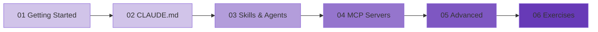

# Claude Code: From Installation to Mastery

> An interactive course on Anthropic's terminal-based AI coding assistant.

---

## Course Overview

Claude Code is Anthropic's agentic coding tool that lives in your terminal. It reads your entire codebase, understands your project structure, writes code, runs commands, manages git workflows, and more -- all through natural language conversation.

This course takes you from first install to advanced usage patterns including MCP servers, hooks, multi-agent workflows, and remote development.

## Prerequisites

- A terminal/command line (macOS Terminal, Windows Terminal, or Linux shell)
- Node.js 18+ installed
- A Claude account (Pro subscription or API key)
- Basic familiarity with git (helpful but not required)

## Course Modules

| Module | Title | Duration | Description |
|--------|-------|----------|-------------|
| [01](01_getting_started.md) | Getting Started | 30 min | Installation, authentication, and first commands |
| [02](02_claude_md.md) | Mastering CLAUDE.md | 45 min | Project memory, custom instructions, and configuration |
| [03](03_skills_agents.md) | Skills, Agents, and Slash Commands | 60 min | Extending Claude Code with custom capabilities |
| [04](04_mcp_servers.md) | MCP Servers Deep Dive | 60 min | Connecting Claude to external tools and services |
| [05](05_advanced.md) | Advanced Usage | 60 min | Hooks, remote access, multi-agent patterns |
| [06](06_exercises.md) | Interactive Exercises | Open-ended | Practice projects with solutions |

## Learning Path

## What You Will Learn

1. Install and configure Claude Code for any project
2. Write effective CLAUDE.md files that give Claude deep project context
3. Create custom slash commands, skills, and agent workflows
4. Connect Claude to external tools via MCP servers
5. Use hooks for automation and quality control
6. Run Claude Code in CI/CD pipelines and remote environments
7. Build multi-agent workflows for complex tasks
