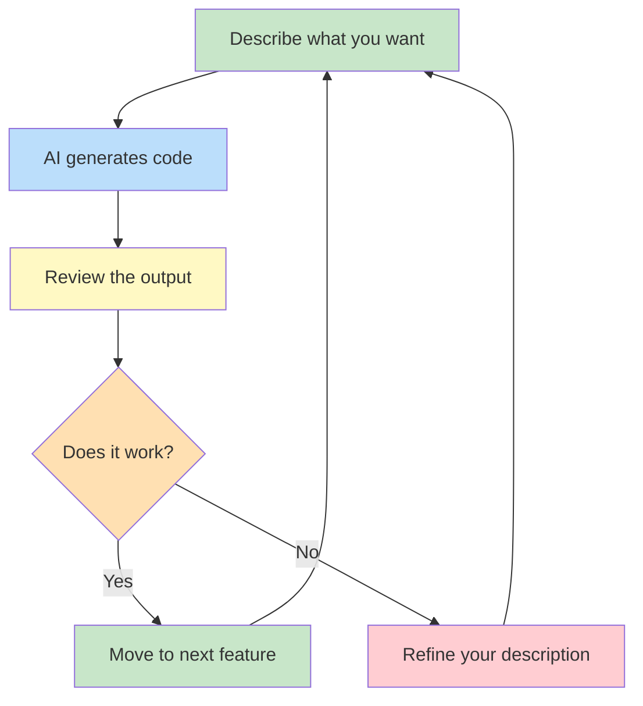
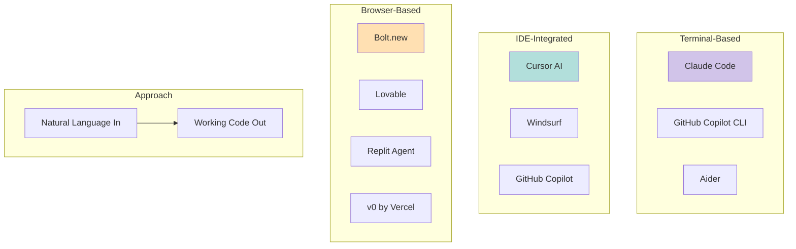

# Module 01: Introduction to Vibe Coding

> "I just see things, say things, run things, and copy-paste things, and it mostly works." -- Andrej Karpathy

---

## Learning Objectives

By the end of this module, you will be able to:

- [ ] Define vibe coding and explain its origins
- [ ] Describe the philosophy behind the approach
- [ ] Identify the key differences between vibe coding and traditional coding
- [ ] List the major tools in the vibe coding ecosystem
- [ ] Recognize appropriate use cases for vibe coding

---

## 1. What Is Vibe Coding?

Vibe coding is a software development approach where you **describe what you want in natural language** and an AI generates the code for you. Rather than writing code line by line, you guide the AI through conversation, iteration, and feedback.

The key insight: **you become a director, not a typist**. You focus on *what* you want to build, and the AI handles *how* to build it.

### The Core Loop



---

## 2. History and Origins

### The Karpathy Moment (February 2025)

On February 2, 2025, **Andrej Karpathy** -- former AI director at Tesla and co-founder of OpenAI -- posted on X (formerly Twitter):

> "There's a new kind of coding I call 'vibe coding', where you fully give in to the vibes, embrace exponentials, and forget that the code even exists."

This wasn't just a tweet -- it captured something that thousands of developers were already doing but didn't have a name for. The term went viral and was named **Collins Dictionary's Word of the Year for 2026**.

### Timeline

| Date | Event |
|------|-------|
| 2022-2023 | GitHub Copilot popularizes AI-assisted code completion |
| 2024 | Cursor AI, Claude, and ChatGPT make conversational coding mainstream |
| Feb 2025 | Karpathy coins "vibe coding" |
| Mid 2025 | Dedicated vibe coding tools emerge (Bolt, Lovable, Replit Agent) |
| 2026 | "Vibe coding" named Collins Word of the Year; university courses begin |

---

## 3. The Philosophy

Vibe coding rests on three philosophical pillars:

### Pillar 1: Intent Over Implementation

Traditional coding requires you to know the exact syntax, APIs, and patterns. Vibe coding only requires you to know **what you want**.

```
Traditional: "Create a React component with useState hook that manages a counter..."
Vibe coding: "I want a counter that goes up and down when I click buttons."
```

### Pillar 2: Iteration Over Perfection

You don't need to get it right the first time. You describe, review, refine, and repeat. Each cycle gets closer to what you want.

### Pillar 3: Flow Over Knowledge

Instead of stopping to look up documentation, you stay in a flow state. The AI is your documentation, your Stack Overflow, and your pair programmer -- all in one.

---

## 4. Vibe Coding vs. Traditional Coding

| Aspect | Traditional Coding | Vibe Coding |
|--------|-------------------|-------------|
| **Input** | Code syntax | Natural language |
| **Skill needed** | Programming language mastery | Clear communication |
| **Debugging** | Read stack traces, reason about logic | Describe the problem, let AI fix it |
| **Speed** | Hours to days for features | Minutes to hours |
| **Understanding** | Deep understanding of every line | High-level understanding of behavior |
| **Best for** | Critical systems, performance-sensitive code | Prototypes, MVPs, internal tools, learning |
| **Risk** | Bugs from developer mistakes | Bugs from AI misunderstanding intent |

### When Vibe Coding Excels

- Prototyping and MVPs
- Internal tools and dashboards
- Learning and experimentation
- One-off scripts and automation
- Front-end UI work

### When to Be Cautious

- Safety-critical systems (medical, aerospace)
- High-performance computing
- Code that handles sensitive data (review every line)
- Very large, complex codebases (without experienced oversight)

---

## 5. The Tool Ecosystem



### Tool Categories

**Terminal-based** (for developers comfortable with the command line):
- **Claude Code** -- Anthropic's agentic CLI tool; reads your codebase, writes files, runs commands
- **Aider** -- Open-source terminal pair programmer
- **GitHub Copilot CLI** -- Copilot for the terminal

**IDE-integrated** (for developers who prefer visual editors):
- **Cursor AI** -- VS Code fork with deep AI integration
- **Windsurf** -- AI-native code editor
- **GitHub Copilot** -- Inline completions and chat in VS Code/JetBrains

**Browser-based** (no installation required):
- **Bolt.new** -- Build and deploy web apps entirely in the browser
- **Lovable** -- AI app builder focused on beautiful UI
- **Replit Agent** -- Build apps through conversation on Replit
- **v0 by Vercel** -- Generate React UI components from descriptions

---

## 6. Try It Yourself

### Exercise 1: Identify the Approach

For each scenario below, decide whether vibe coding or traditional coding is more appropriate:

1. Building a personal budget tracker for yourself
2. Writing firmware for a pacemaker
3. Creating a landing page for a startup idea
4. Optimizing a database query that handles millions of rows
5. Building a Slack bot that summarizes daily messages

<details>
<summary>Click to see answers</summary>

1. **Vibe coding** -- Personal tool, low risk, speed matters more than perfection
2. **Traditional coding** -- Safety-critical; every line must be understood and verified
3. **Vibe coding** -- Perfect use case; fast iteration, visual output
4. **Traditional coding** (with AI assistance) -- Performance optimization requires deep understanding
5. **Vibe coding** -- Integration project, well-documented APIs, iteration-friendly

</details>

### Exercise 2: Rewrite as a Vibe Coding Prompt

Take this traditional coding task description and rewrite it as a natural language prompt you'd give to an AI:

> "Create a Node.js Express server with a GET endpoint at /api/users that returns a JSON array of user objects with id, name, and email fields. Include CORS middleware and listen on port 3000."

<details>
<summary>Click to see a sample answer</summary>

> "Build me a simple API server that returns a list of users. Each user should have an id, name, and email. Make sure it works when called from a different website (handle CORS). Use Node.js."

Notice how the vibe coding prompt focuses on **what** (a user list API) and **why** (cross-origin access needed), while the traditional description specifies **how** (Express, specific endpoint path, port number). Both are valid -- but the vibe coding prompt gives the AI room to make sensible default choices.

</details>

---

## Quiz

Test your understanding of this module:

**Q1: Who coined the term "vibe coding"?**

<details>
<summary>Answer</summary>

Andrej Karpathy, in a post on X (formerly Twitter) on February 2, 2025.

</details>

**Q2: What is the primary difference between vibe coding and traditional coding?**

<details>
<summary>Answer</summary>

In vibe coding, you describe what you want in natural language and AI generates the code. In traditional coding, you write the code yourself using programming language syntax. The focus shifts from implementation details to intent and iteration.

</details>

**Q3: Name three scenarios where vibe coding is particularly effective.**

<details>
<summary>Answer</summary>

Any three of: prototyping/MVPs, internal tools, learning/experimentation, one-off scripts and automation, front-end UI work, personal projects, landing pages, quick demos.

</details>

**Q4: What are the three philosophical pillars of vibe coding?**

<details>
<summary>Answer</summary>

1. Intent Over Implementation -- focus on what, not how
2. Iteration Over Perfection -- refine through cycles, not upfront planning
3. Flow Over Knowledge -- stay in the creative zone instead of looking up docs

</details>

---

## Next Module

Ready to set up your environment? Continue to [Module 02: Environment Setup](02_setup.md).
