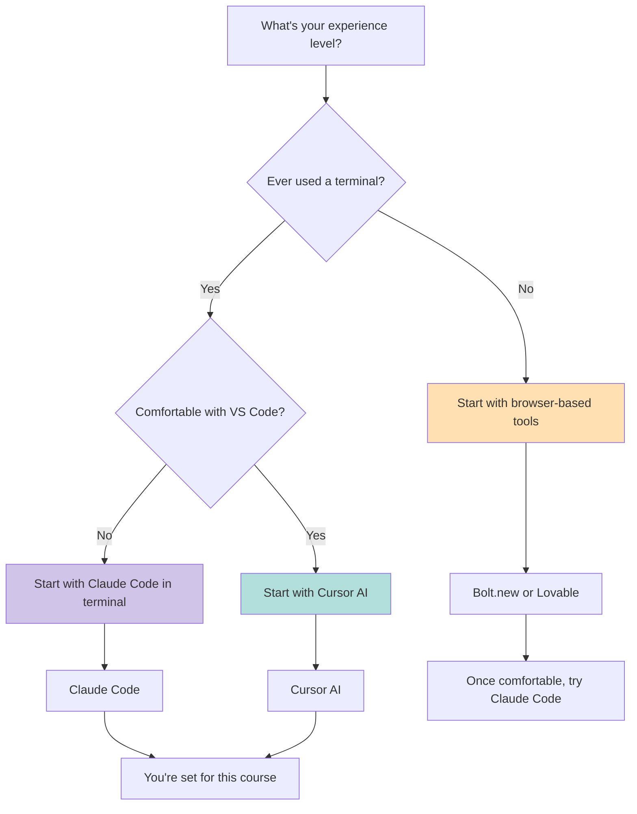
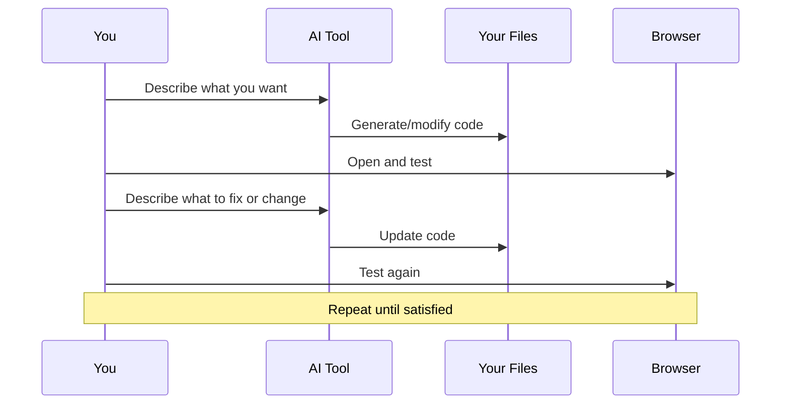

# Module 02: Setting Up Your Vibe Coding Environment

---

## Learning Objectives

By the end of this module, you will be able to:

- [ ] Choose the right vibe coding tool for your skill level and goals
- [ ] Install and configure at least one terminal-based tool (Claude Code)
- [ ] Install and configure at least one IDE-based tool (Cursor)
- [ ] Set up a browser-based tool for zero-install projects
- [ ] Verify your environment is working with a simple test

---

## 1. Choosing Your Tool

Use this decision tree to pick your starting tool:



### Quick Comparison

| Tool | Install? | Cost | Best For |
|------|----------|------|----------|
| **Bolt.new** | No (browser) | Free tier available | Absolute beginners, web apps |
| **Lovable** | No (browser) | Free tier available | Beautiful UI prototypes |
| **Claude Code** | Yes (CLI) | Requires Claude Pro ($20/mo) or API key | Developers, full control |
| **Cursor** | Yes (desktop) | Free tier + Pro ($20/mo) | VS Code users, visual workflow |
| **GitHub Copilot** | Yes (extension) | Free tier + Pro ($10/mo) | Existing VS Code/JetBrains users |

---

## 2. Setting Up Claude Code (Recommended for This Course)

Claude Code is Anthropic's terminal-based AI coding assistant. It reads your entire codebase, writes files, and runs commands -- all through natural language.

### Prerequisites

- **Node.js 18+** installed
- **A Claude account** (Pro subscription at $20/month, or an API key)

### Step 1: Install Node.js (if needed)

```bash
# Check if Node.js is installed
node --version

# If not installed, use the official installer:
# macOS: https://nodejs.org or use Homebrew
brew install node

# Linux (Ubuntu/Debian)
curl -fsSL https://deb.nodesource.com/setup_20.x | sudo -E bash -
sudo apt-get install -y nodejs

# Windows: Download from https://nodejs.org
```

### Step 2: Install Claude Code

```bash
# Install globally via npm
npm install -g @anthropic-ai/claude-code
```

### Step 3: Authenticate

```bash
# Start Claude Code -- it will guide you through authentication
claude

# You'll be prompted to log in via your browser
# Choose either:
# - Claude Pro account (recommended for beginners)
# - Anthropic API key (for more control over costs)
```

### Step 4: Verify Installation

```bash
# Create a test project
mkdir my-first-vibe-project
cd my-first-vibe-project

# Start Claude Code
claude

# Type this prompt:
# "Create a simple HTML page that says Hello World with a nice gradient background"
```

If Claude creates the file and you can open it in a browser, you're set.

### Try It Yourself

Run Claude Code in any project directory and ask:

```
What files are in this project and what does it do?
```

Claude will scan the directory and give you a summary. This confirms it can read your filesystem.

---

## 3. Setting Up Cursor AI (Alternative)

Cursor is a VS Code fork with deep AI integration. If you prefer a visual editor, this is your tool.

### Step 1: Download and Install

1. Go to [cursor.com](https://cursor.com)
2. Download for your OS
3. Install and launch

### Step 2: Sign In

1. Create a Cursor account (free tier available)
2. Sign in through the app

### Step 3: Open a Project

1. File > Open Folder > select your project
2. Press `Cmd+K` (macOS) or `Ctrl+K` (Windows/Linux) to open the AI prompt
3. Type: "Create a simple HTML page that says Hello World"

### Step 4: Use Composer Mode

For larger tasks, use Composer (Cmd+Shift+I / Ctrl+Shift+I):

1. Describe your full project idea
2. Cursor generates multiple files at once
3. Review and accept the changes

---

## 4. Setting Up Browser-Based Tools (Zero Install)

For the fastest start with no installation:

### Bolt.new

1. Go to [bolt.new](https://bolt.new)
2. Sign up for a free account
3. Type your project idea in the prompt box
4. Watch it generate a full project in real time
5. Preview runs in the browser -- no local setup needed

### Lovable

1. Go to [lovable.dev](https://lovable.dev)
2. Create a free account
3. Describe your app in natural language
4. Iterate on the design by chatting with the AI

---

## 5. Essential Configuration

### For Claude Code: Create a CLAUDE.md File

The `CLAUDE.md` file gives Claude persistent context about your project. Create one in your project root:

```markdown
# Project: My Vibe Coding Project

## Tech Stack
- Frontend: HTML, CSS, JavaScript
- No frameworks yet -- keep it simple

## Preferences
- Use modern ES6+ JavaScript
- Prefer simple, readable code over clever code
- Always add comments explaining what each section does
- Use semantic HTML

## Project Goals
- Learning vibe coding through small experiments
- Each experiment should be self-contained in its own folder
```

### For Cursor: Configure AI Settings

1. Open Settings (Cmd+,)
2. Search for "AI"
3. Set your preferred model (Claude Sonnet recommended)
4. Enable "Always use context from open files"

---

## 6. Your Development Workflow

Here's the workflow you'll use throughout this course:



---

## Quiz

**Q1: What is the minimum Node.js version required for Claude Code?**

<details>
<summary>Answer</summary>

Node.js 18 or higher.

</details>

**Q2: What is the purpose of a CLAUDE.md file?**

<details>
<summary>Answer</summary>

It gives Claude Code persistent context about your project, including your tech stack, preferences, coding style, and project goals. Claude reads it automatically when you start a session in that directory.

</details>

**Q3: Which tool requires zero installation?**

<details>
<summary>Answer</summary>

Browser-based tools like Bolt.new and Lovable require no installation at all. You just visit the website and start building.

</details>

**Q4: If you are comfortable with VS Code but have never used a terminal, which tool should you start with?**

<details>
<summary>Answer</summary>

Cursor AI -- it's a VS Code fork, so the interface will be familiar, and you can use the AI features directly within the editor without needing terminal skills.

</details>

---

## Next Module

Your environment is ready. Let's build something. Continue to [Module 03: Your First Project](03_first_project.md).
