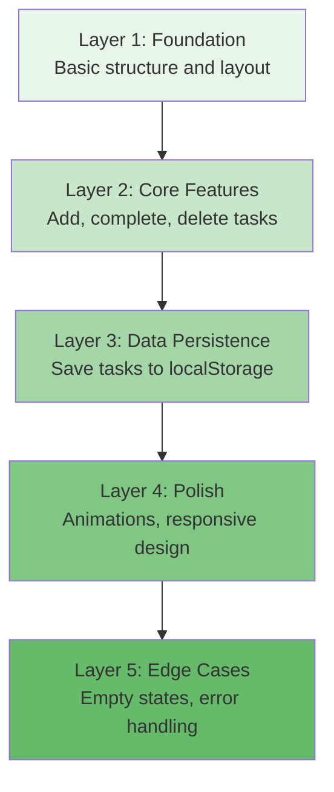

# Module 03: Build Your First Project with Vibe Coding

---

## Learning Objectives

By the end of this module, you will be able to:

- [ ] Plan a vibe coding project with a clear prompt strategy
- [ ] Build a complete web application using only natural language prompts
- [ ] Iterate on AI-generated code effectively
- [ ] Debug issues by describing problems rather than reading code
- [ ] Deploy your finished project

---

## Project: Personal Task Manager

We'll build a fully functional task manager web app. No code writing -- only prompts.

### What We're Building

- A single-page task manager
- Add, complete, and delete tasks
- Tasks persist in the browser (localStorage)
- Clean, modern UI with animations
- Responsive design (works on mobile)

---

## 1. The Prompt Strategy

Before typing anything, plan your prompts. Think in layers:



**Golden Rule**: Start broad, then refine. Don't try to specify everything in one prompt.

---

## 2. Building Step by Step

### Step 1: The Foundation

Open Claude Code (or your chosen tool) in a new project directory:

```bash
mkdir task-manager
cd task-manager
claude
```

**Your first prompt:**

> Build me a task manager web app. Single HTML file with embedded CSS and JavaScript. I want to be able to add tasks, mark them as complete, and delete them. Use a modern, clean design with a blue color scheme.

**What to expect**: The AI will generate an `index.html` file with the basic structure, styling, and functionality.

**Review it:**

```bash
# In a new terminal, open the file
open index.html  # macOS
# or: xdg-open index.html  # Linux
# or: start index.html  # Windows
```

### Step 2: Iterate on the Design

Look at what was generated. It probably works but might not look exactly how you want. This is where iteration begins.

**Example follow-up prompts:**

> The design looks a bit plain. Make it more modern -- add subtle shadows, rounded corners, and a gradient header. The font should be something clean like Inter or system-ui.

> The delete button is too close to the checkbox. Add more spacing and make the delete button only appear when hovering over a task.

> Add a nice animation when tasks are added or removed. Something smooth, not flashy.

### Step 3: Add Persistence

> Tasks disappear when I refresh the page. Save them to localStorage so they persist across page reloads. When the page loads, it should read tasks from localStorage and display them.

### Step 4: Polish the Experience

> Add an empty state message when there are no tasks -- something friendly like "No tasks yet. Add one above!" with a subtle illustration or emoji.

> Add a counter at the top showing "3 of 7 tasks completed" that updates as I check/uncheck tasks.

> Make it responsive so it looks good on mobile. The input field and button should stack on small screens.

### Step 5: Handle Edge Cases

> What happens if I try to add a blank task? Prevent that and show a gentle shake animation on the input field.

> Add keyboard support -- I should be able to press Enter to add a task instead of clicking the button.

---

## 3. The Iteration Mindset

### Good Iteration Patterns

| Pattern | Example |
|---------|---------|
| **Be specific about what's wrong** | "The shadow on the task cards is too heavy -- make it more subtle" |
| **Reference visual elements** | "The button in the top-right corner should be blue, not grey" |
| **Describe behavior, not code** | "When I complete a task, it should slide down to the bottom of the list" |
| **Give context for preferences** | "I prefer minimalist design -- remove the border and use spacing to separate items" |

### Anti-Patterns to Avoid

| Anti-Pattern | Why It's Bad | Better Approach |
|-------------|-------------|-----------------|
| "Fix it" | Too vague -- fix what? | "The tasks don't save when I refresh the page" |
| "Make it better" | Subjective with no direction | "Make the colors more muted and add more whitespace" |
| "Rewrite everything" | Throws away working code | "Keep the functionality but redesign the header section" |
| One massive prompt | Hard to debug if something breaks | Build in layers, one feature at a time |

---

## 4. Debugging Through Description

When something doesn't work, describe the **symptom**, not the cause:

**Instead of:**
> "There's a bug in the event listener for the delete button."

**Say:**
> "When I click the delete button, nothing happens. The task stays in the list."

**Or even better:**
> "Clicking delete on the first task works, but clicking delete on any other task deletes the first task instead."

The AI can reason about the problem from the description and fix the underlying code.

---

## 5. Try It Yourself: Build the Project

Follow the steps above and build the task manager. Here's a checklist:

- [ ] Created project directory and started AI tool
- [ ] Generated the basic task manager with first prompt
- [ ] Iterated on the visual design (at least 2 rounds)
- [ ] Added localStorage persistence
- [ ] Added empty state handling
- [ ] Added task counter
- [ ] Made it responsive
- [ ] Added keyboard support (Enter to add)
- [ ] Handled edge cases (empty input)

### Bonus Challenges

If you finish early, try these extensions:

1. **Categories**: Add the ability to tag tasks with categories (Work, Personal, Shopping)
2. **Due dates**: Add optional due dates and highlight overdue tasks
3. **Dark mode**: Add a toggle that switches between light and dark themes
4. **Export**: Add a button that exports tasks as a JSON or CSV file

---

## 6. Deployment (Optional)

Once your task manager is working, deploy it so anyone can use it.

**Using GitHub Pages (free):**

> Create a git repository for this project, add all files, and make an initial commit. Then explain to me how to enable GitHub Pages in the repository settings.

**Using Vercel (free):**

> Help me deploy this to Vercel. What steps do I need to take?

**Using Netlify (free):**

> Walk me through deploying this single HTML file to Netlify using drag-and-drop deployment.

---

## Quiz

**Q1: Why is it better to build features in layers rather than requesting everything in one prompt?**

<details>
<summary>Answer</summary>

Building in layers lets you verify each piece works before adding the next. If something breaks, you know which layer caused the issue. One massive prompt can produce code where multiple things are wrong simultaneously, making debugging much harder.

</details>

**Q2: How should you report a bug when vibe coding?**

<details>
<summary>Answer</summary>

Describe the symptom (what you see happening) rather than the cause (what you think is wrong in the code). For example: "When I click the delete button on the second task, the first task gets deleted instead" is better than "There's a bug in the event listener."

</details>

**Q3: What's wrong with the prompt "Make it better"?**

<details>
<summary>Answer</summary>

It's too vague and subjective. "Better" means different things in different contexts. Instead, be specific about what to improve: "Add more whitespace between tasks and use a softer color palette" gives the AI clear direction.

</details>

---

## Next Module

You've built your first project. Now let's explore advanced patterns. Continue to [Module 04: Advanced Patterns](04_advanced_patterns.md).
