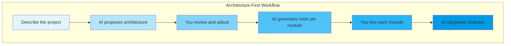

# Module 04: Advanced Patterns and Techniques

---

## Learning Objectives

By the end of this module, you will be able to:

- [ ] Use structured prompting techniques for complex projects
- [ ] Manage multi-file projects through conversation
- [ ] Apply the "scaffold then refine" pattern
- [ ] Use reference-driven development (showing examples)
- [ ] Handle state management and API integrations via prompts
- [ ] Review AI-generated code for quality and security

---

## 1. Structured Prompting Techniques

### The SPARC Framework

For complex requests, structure your prompt with SPARC:

| Letter | Meaning | Example |
|--------|---------|---------|
| **S** | Situation | "I'm building a recipe app for home cooks" |
| **P** | Problem | "Users need to search recipes by ingredients they have" |
| **A** | Action | "Create a search feature with ingredient-based filtering" |
| **R** | Result | "Users should see matching recipes ranked by match percentage" |
| **C** | Constraints | "Use only vanilla JS, no frameworks. Must work offline." |

**Full SPARC prompt example:**

> I'm building a recipe app for home cooks (Situation). Users need a way to find recipes based on what ingredients they already have at home (Problem). Create a search feature where users can type or select ingredients and see matching recipes (Action). Recipes should be ranked by how many of the user's ingredients they match, shown as a percentage (Result). Use vanilla JavaScript with no external dependencies and make it work offline using a hardcoded recipe dataset (Constraints).

### The Persona Pattern

Tell the AI to adopt a specific expertise:

> You are an experienced front-end developer who specializes in accessible, performant web applications. Build me a dashboard that displays real-time data from a weather API. Prioritize accessibility (ARIA labels, keyboard navigation) and performance (lazy loading, minimal DOM updates).

### The Incremental Specification Pattern

Start vague, then add specificity in follow-ups:

```
Prompt 1: "Build a chat interface"
Prompt 2: "Add message timestamps and user avatars"
Prompt 3: "Messages should appear with a typing animation"
Prompt 4: "Add a 'seen' indicator like WhatsApp uses"
Prompt 5: "Handle the case where the user sends multiple messages quickly"
```

---

## 2. Multi-File Project Management

Real projects have multiple files. Here's how to manage them:

### Project Structure Prompt

> Set up a project with this structure:
> - `index.html` -- main page
> - `css/styles.css` -- all styling
> - `js/app.js` -- main application logic
> - `js/api.js` -- API interaction functions
> - `js/utils.js` -- utility/helper functions
>
> Create the initial boilerplate with proper imports between files.

### File-Specific Modifications

When your project has multiple files, be explicit about which file to modify:

> In `js/api.js`, add a function that fetches weather data from the OpenWeatherMap API. It should accept a city name and return the temperature, humidity, and weather description.

### The Architecture Prompt

For larger projects, start with architecture:

> Before writing any code, outline the architecture for a kanban board application (like Trello). Show me:
> 1. File structure
> 2. Key components/modules and their responsibilities
> 3. Data flow between components
> 4. State management approach
>
> Present this as a plan. Don't write code yet.



---

## 3. The Scaffold-Then-Refine Pattern

Build the skeleton first, then flesh it out:

### Phase 1: Scaffold

> Create a dashboard page with placeholder sections for:
> - A header with navigation
> - A sidebar with menu items
> - A main content area with 4 metric cards
> - A chart section (just a placeholder box for now)
> - A recent activity table (empty structure)
>
> Use placeholder text and grey boxes where content will go later.

### Phase 2: Refine Each Section

> Now fill in the metric cards. They should show:
> 1. Total Revenue ($45,230) with a green +12% badge
> 2. Active Users (1,847) with a blue +5% badge
> 3. Conversion Rate (3.2%) with a red -0.4% badge
> 4. Avg Response Time (142ms) with a green -8ms badge
>
> Each card should have an icon, the metric name, the value, and the change badge.

### Phase 3: Make It Dynamic

> Replace the hardcoded data with a data object at the top of the JavaScript file. The dashboard should read from this object so I can easily update the numbers later.

---

## 4. Reference-Driven Development

Show the AI what you want by referencing existing designs or patterns:

### Using Screenshots

> I want the navigation to look like GitHub's top navigation bar -- a dark bar with logo on the left, search in the middle, and user avatar with dropdown on the right.

### Using Code Patterns

> Here's a pattern I like for error handling. Apply this same pattern to all the API functions:
>
> ```javascript
> async function fetchData(url) {
>   try {
>     const response = await fetch(url);
>     if (!response.ok) throw new Error(`HTTP ${response.status}`);
>     return { data: await response.json(), error: null };
>   } catch (error) {
>     return { data: null, error: error.message };
>   }
> }
> ```

### Using Design Systems

> Style this component using a design system approach:
> - Primary color: #2563eb (blue-600)
> - Font: Inter, system-ui
> - Border radius: 8px for cards, 4px for buttons
> - Spacing scale: 4px, 8px, 12px, 16px, 24px, 32px, 48px
> - Shadow: 0 1px 3px rgba(0,0,0,0.1)

---

## 5. State Management Through Conversation

For apps with complex state, describe the data model:

> The app needs to track this state:
> - A list of boards (each board has an id, title, and list of columns)
> - Each column has an id, title, position, and list of cards
> - Each card has an id, title, description, due date, labels, and assigned user
> - The current user (id, name, avatar)
> - Which board is currently active
> - Whether the sidebar is expanded or collapsed
>
> Create the state management layer. When any state changes, the relevant parts of the UI should update automatically.

---

## 6. API Integration Patterns

### The Contract-First Approach

> I need to integrate with this API:
>
> **GET** `/api/tasks` -- returns `{ tasks: [{ id, title, completed, created_at }] }`
> **POST** `/api/tasks` -- body: `{ title: string }` -- returns the created task
> **PATCH** `/api/tasks/:id` -- body: `{ completed: boolean }` -- returns updated task
> **DELETE** `/api/tasks/:id` -- returns `{ success: true }`
>
> Create an API module that handles all these endpoints, including loading states and error handling. Show a spinner while data is loading and a toast notification on errors.

### The Mock-First Approach

> Before connecting to a real API, create a mock API layer that uses localStorage. It should have the same interface as a real API (async functions that return promises) so I can swap it out later with real fetch calls.

---

## 7. Security and Code Review

Vibe coding is fast, but you must review what the AI generates:

### Security Checklist

Ask the AI to audit its own code:

> Review the code you just generated for security issues. Check for:
> - XSS vulnerabilities (innerHTML with user input)
> - SQL injection (if applicable)
> - Exposed secrets or API keys
> - Missing input validation
> - Insecure data storage
>
> List any issues found and fix them.

### Performance Audit

> Review this code for performance. Check for:
> - Unnecessary DOM manipulations
> - Memory leaks (event listeners not cleaned up)
> - Large bundle sizes or unused dependencies
> - Missing debounce/throttle on frequent events
> - Render-blocking operations

---

## Try It Yourself

### Exercise: Build a Weather Dashboard

Using the patterns from this module, build a weather dashboard:

1. **Start with architecture** -- ask the AI to plan the project structure
2. **Use SPARC** -- write a structured prompt for the main feature
3. **Scaffold** -- build the layout with placeholders
4. **Refine** -- fill in each section one at a time
5. **Integrate an API** -- use the OpenWeatherMap free tier (or mock the data)
6. **Audit** -- ask the AI to review for security and performance

<details>
<summary>Sample architecture prompt to start with</summary>

> Plan a weather dashboard application with these requirements:
> - Show current weather for a searched city
> - Display a 5-day forecast
> - Show temperature, humidity, wind speed, and conditions
> - Include a search bar with autocomplete for city names
> - Responsive design for mobile and desktop
>
> Give me the file structure, component breakdown, and data flow diagram before writing any code.

</details>

---

## Quiz

**Q1: What does SPARC stand for in the structured prompting framework?**

<details>
<summary>Answer</summary>

Situation, Problem, Action, Result, Constraints.

</details>

**Q2: Why should you ask the AI to plan the architecture before writing code?**

<details>
<summary>Answer</summary>

Planning the architecture first ensures all components are designed to work together. It prevents situations where you need to rewrite large sections because a foundational design decision was wrong. You can also review and adjust the plan before any code is written, which is much cheaper than rewriting code.

</details>

**Q3: What is the scaffold-then-refine pattern?**

<details>
<summary>Answer</summary>

Build the complete structure of the application first using placeholders and grey boxes, then fill in each section one at a time with real content and functionality. This gives you a complete layout to work within and lets you refine individual sections without losing sight of the overall design.

</details>

**Q4: Why is it important to ask the AI to audit its own code?**

<details>
<summary>Answer</summary>

AI-generated code can contain security vulnerabilities (XSS, injection), performance issues (memory leaks, unnecessary DOM operations), or bad practices. Asking it to audit its own output catches many of these issues. However, for production code, human review is still essential -- the AI might miss the same class of issues it introduced.

</details>

---

## Next Module

Put everything into practice with guided exercises. Continue to [Module 05: Interactive Exercises](05_exercises.md).
