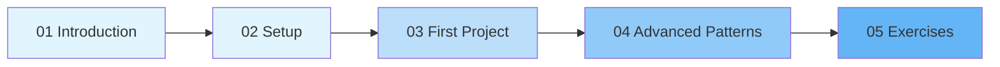

# Vibe Coding: From Zero to Flow State

> An interactive course on building software through natural language and AI collaboration.

---

## Course Overview

Vibe coding is a software development approach where you describe what you want to build in plain language and let AI generate the code. Coined by Andrej Karpathy in February 2025, it represents a fundamental shift in how humans interact with computers to create software.

This course takes you from understanding the philosophy to building real projects and mastering advanced patterns.

## Prerequisites

- No prior coding experience required (though it helps)
- A computer with internet access
- Willingness to experiment and iterate

## Course Modules

| Module | Title | Duration | Description |
|--------|-------|----------|-------------|
| [01](01_introduction.md) | Introduction | 30 min | What is vibe coding, its history, and the philosophy behind it |
| [02](02_setup.md) | Environment Setup | 45 min | Setting up your tools and workspace |
| [03](03_first_project.md) | Your First Project | 60 min | Build a complete web app through vibe coding |
| [04](04_advanced_patterns.md) | Advanced Patterns | 90 min | Techniques for complex projects and production code |
| [05](05_exercises.md) | Interactive Exercises | Open-ended | Practice exercises with solutions |

## Learning Path

## What You Will Learn

By the end of this course, you will be able to:

1. Explain what vibe coding is and how it differs from traditional development
2. Set up a complete vibe coding environment with multiple tool options
3. Write effective prompts that produce working software
4. Iterate on AI-generated code through structured feedback loops
5. Handle debugging, testing, and deployment in a vibe coding workflow
6. Recognize when vibe coding is (and is not) the right approach

## Who This Course Is For

- **Non-developers** who want to build software without learning to code from scratch
- **Developers** who want to dramatically speed up their workflow
- **Product managers** who want to prototype ideas quickly
- **Students** exploring modern approaches to software creation
