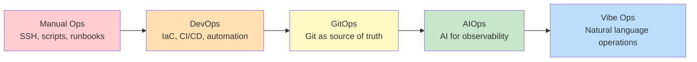
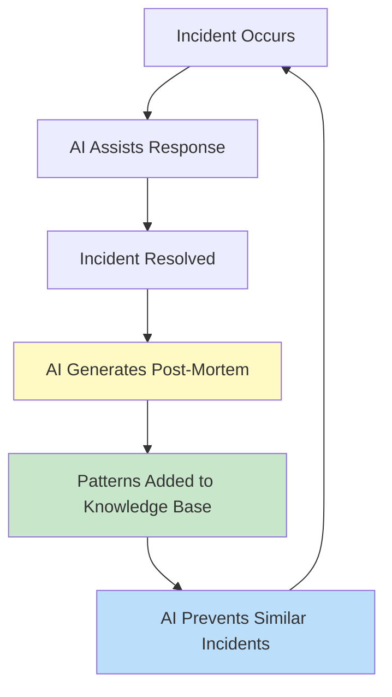
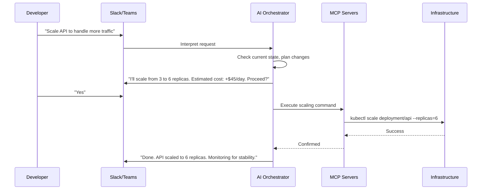

# Module 01: Introduction to Vibe Ops

---

## Learning Objectives

By the end of this module, you will be able to:

- [ ] Define vibe ops and its relationship to DevOps and vibe coding
- [ ] Explain the problems vibe ops solves
- [ ] Identify the core principles of AI-driven operations
- [ ] Describe the spectrum from manual ops to fully autonomous ops
- [ ] List real-world applications of vibe ops

---

## 1. What Is Vibe Ops?

Vibe Ops is an **AI-dependent operations approach** focused on maximizing developer productivity by removing operational friction. Developers describe what they need in conversational language, and AI handles the implementation details for infrastructure, deployment, monitoring, and maintenance.

### The Core Idea

Traditional DevOps requires developers to context-switch between writing code and managing infrastructure. Vibe Ops makes operational concerns **nearly invisible**:

```
Traditional DevOps:
  Developer writes code -> Writes Dockerfile -> Writes Kubernetes YAML
  -> Configures CI/CD -> Sets up monitoring -> Writes runbooks

Vibe Ops:
  Developer writes code -> Tells AI: "Deploy this with monitoring and auto-scaling"
  -> AI handles everything else
```

### Origin Story

The concept evolved naturally from vibe coding. As developers began using AI to write application code, the next logical question was: "Why am I still writing YAML and shell scripts for infrastructure?" Natu Lauchande formalized the concept in his 2025 article "Introducing Vibe Ops," defining it as a developer-centric methodology where operational tasks are handled through natural language.

---

## 2. The Evolution: From Manual Ops to Vibe Ops



| Era | How You Deploy | How You Monitor | How You Respond to Incidents |
|-----|---------------|-----------------|------------------------------|
| **Manual Ops** | SSH into server, copy files | Check logs manually | Get paged, SSH in, read logs |
| **DevOps** | CI/CD pipeline, IaC (Terraform) | Prometheus, Grafana dashboards | PagerDuty alert, follow runbook |
| **GitOps** | Merge PR triggers deployment | Automated alerts and dashboards | Alert triggers automated playbook |
| **AIOps** | Same as GitOps + AI anomaly detection | AI correlates metrics and logs | AI suggests root cause |
| **Vibe Ops** | "Deploy the new version with canary rollout" | "Alert me if anything unusual happens" | AI detects, diagnoses, and can auto-remediate |

---

## 3. Core Principles

### Principle 1: Developer Flow Is Sacred

Every time a developer context-switches (from code to Terraform, from debugging to dashboard navigation), they lose 15-25 minutes of productive focus. Vibe Ops minimizes these switches.

### Principle 2: Natural Language Is the Interface

Operations commands should be expressible in plain English:

| Traditional | Vibe Ops |
|------------|----------|
| `kubectl scale deployment/api --replicas=5` | "Scale the API to 5 instances" |
| Write 40 lines of Terraform | "Add a Redis cache to the staging environment" |
| Navigate 3 dashboards to check health | "How's the API doing right now?" |
| Read through 200 log lines | "What caused the spike in errors at 3pm?" |

### Principle 3: Automation with Guardrails

AI handles routine operations autonomously but escalates to humans for:
- Changes to production infrastructure
- Cost implications above a threshold
- Security-sensitive operations
- Situations it hasn't encountered before

### Principle 4: Operational Knowledge Compounds

Every incident, deployment, and operational decision feeds back into the AI's understanding. Over time, it gets better at predicting problems and suggesting solutions.



---

## 4. The Vibe Ops Stack

A typical vibe ops setup includes:

| Layer | Purpose | Tools |
|-------|---------|-------|
| **Chat Interface** | Where humans interact with ops | Slack, Microsoft Teams |
| **AI Orchestrator** | Interprets intent and coordinates actions | Claude, GPT-4, custom agents |
| **MCP Servers** | Bridge between AI and operational tools | Model Context Protocol servers |
| **Infrastructure** | Actual resources being managed | AWS, GCP, Azure, Kubernetes |
| **Observability** | Metrics, logs, traces | Datadog, Grafana, PagerDuty |
| **Source of Truth** | Configuration and state | Git repos, Terraform state |

### How It Fits Together



---

## 5. When Vibe Ops Works (and When It Doesn't)

### Ideal Use Cases

- **Routine deployments**: "Deploy the latest main branch to staging"
- **Scaling decisions**: "We're launching tomorrow, prepare for 10x traffic"
- **Status checks**: "Is anything wrong with the payment service?"
- **Configuration changes**: "Add a new environment variable DATABASE_URL to production"
- **Log analysis**: "Why are we seeing timeout errors in the checkout flow?"

### Proceed with Caution

- **Database migrations** -- always require human review
- **Security changes** -- firewall rules, IAM policies need careful verification
- **Cost-sensitive operations** -- spinning up expensive resources
- **Multi-region failovers** -- too complex for fully autonomous handling (today)
- **Compliance-regulated environments** -- may require explicit human approval chains

---

## 6. Try It Yourself

### Exercise 1: Identify the Ops Style

For each scenario, identify whether it's Manual Ops, DevOps, GitOps, AIOps, or Vibe Ops:

1. A developer SSHs into a server to restart a crashed process
2. A merged PR automatically triggers a deployment pipeline
3. An AI system detects anomalous CPU patterns and pages the on-call engineer
4. A developer types in Slack: "Deploy PR #42 to staging" and it happens
5. A developer writes a Terraform file and runs `terraform apply`

<details>
<summary>Answers</summary>

1. **Manual Ops** -- direct server access, no automation
2. **GitOps** -- Git merge triggers automated deployment
3. **AIOps** -- AI detection but human response
4. **Vibe Ops** -- natural language command in chat triggers automated action
5. **DevOps (IaC)** -- Infrastructure as Code but manual execution

</details>

### Exercise 2: Translate to Vibe Ops

Rewrite these traditional operations commands as natural language requests:

1. `docker-compose up -d --build`
2. `aws s3 sync ./dist s3://my-bucket --delete`
3. `kubectl rollout restart deployment/api -n production`
4. `terraform plan -var="instance_count=5"`

<details>
<summary>Sample Answers</summary>

1. "Rebuild and restart all the services in the background"
2. "Sync the built files to the S3 bucket and remove anything that's no longer in the build"
3. "Restart the API pods in production with a rolling restart"
4. "Show me what would change if we scaled to 5 instances"

</details>

---

## Quiz

**Q1: What is the primary goal of Vibe Ops?**

<details>
<summary>Answer</summary>

To maximize developer productivity by making operational concerns nearly invisible, allowing developers to manage infrastructure through natural language instead of context-switching to write YAML, scripts, or navigate complex dashboards.

</details>

**Q2: How does Vibe Ops differ from AIOps?**

<details>
<summary>Answer</summary>

AIOps uses AI primarily for observability -- detecting anomalies, correlating metrics, and suggesting root causes. Vibe Ops goes further by making natural language the primary interface for all operations tasks, including deployments, scaling, configuration changes, and incident response. AIOps augments existing workflows; Vibe Ops replaces them with conversational interfaces.

</details>

**Q3: What should Vibe Ops always escalate to a human?**

<details>
<summary>Answer</summary>

Changes to production infrastructure, operations with significant cost implications, security-sensitive operations, situations the AI hasn't seen before, database migrations, and anything in compliance-regulated environments.

</details>

---

## Next Module

Let's set up the tools. Continue to [Module 02: Setting Up Vibe Ops](02_setup.md).
